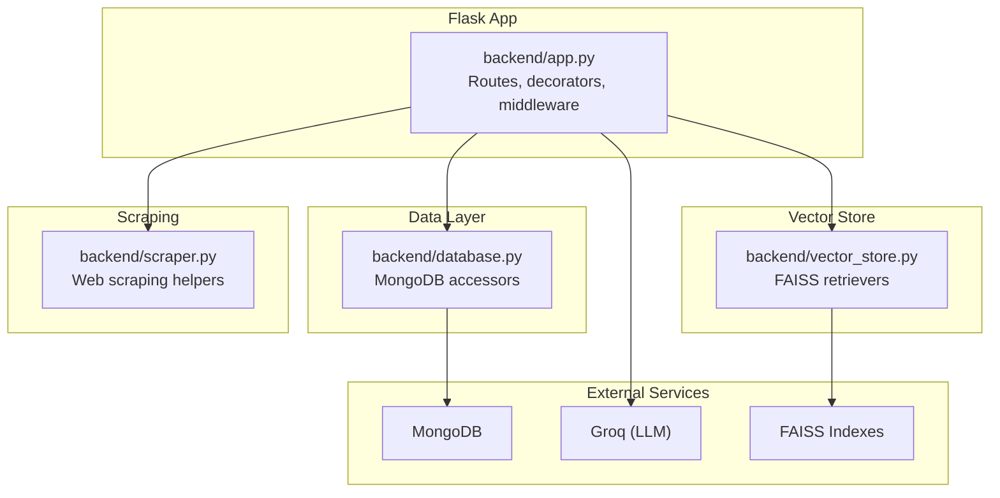
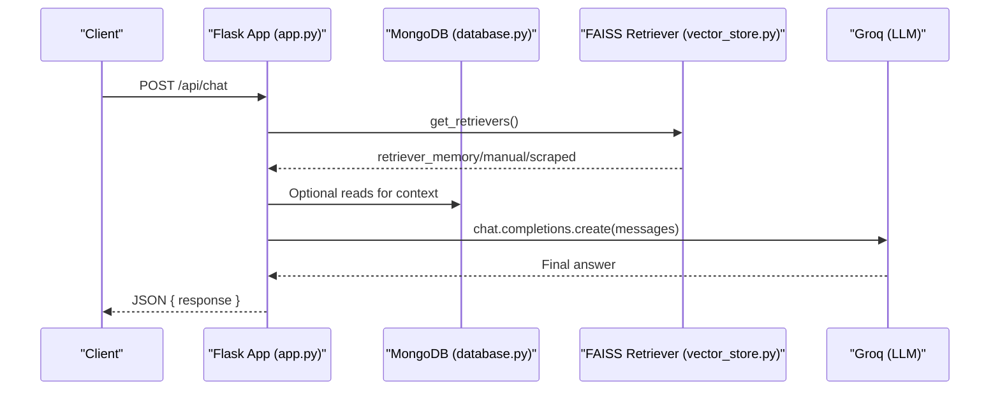
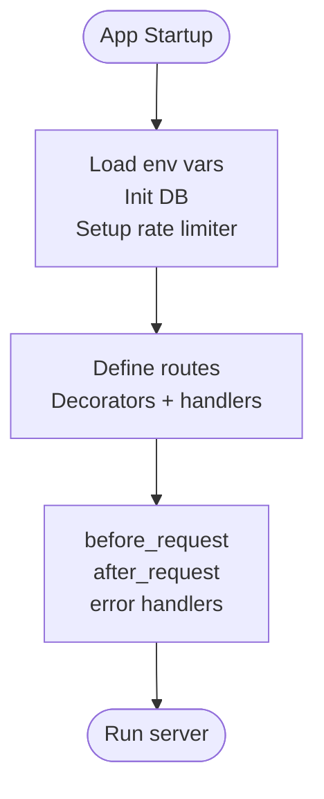
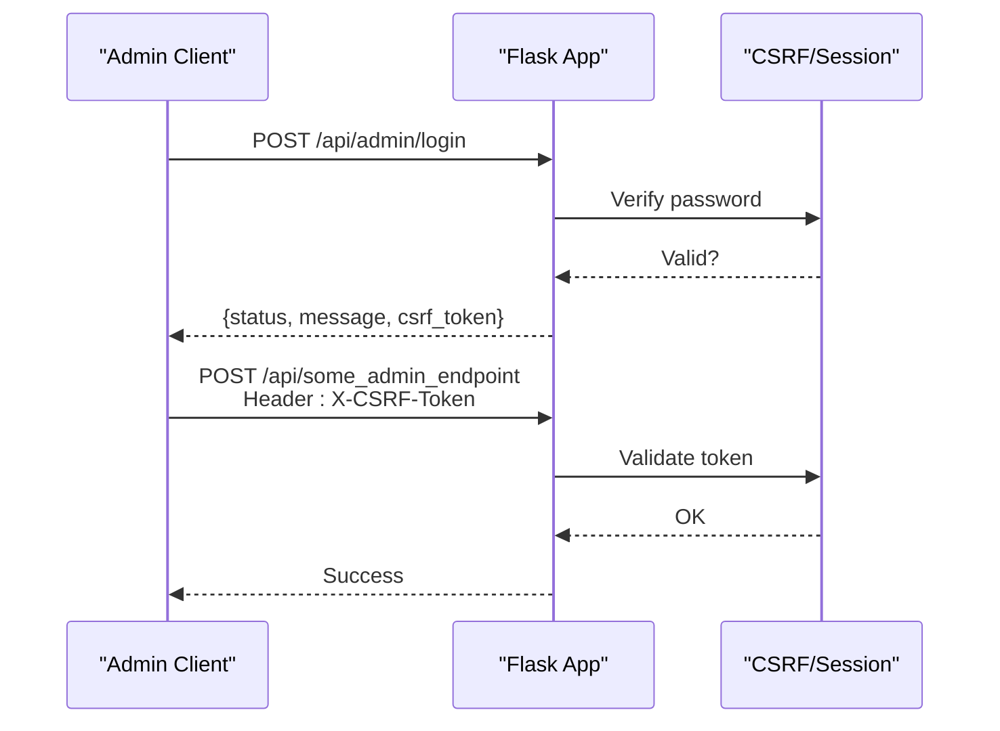
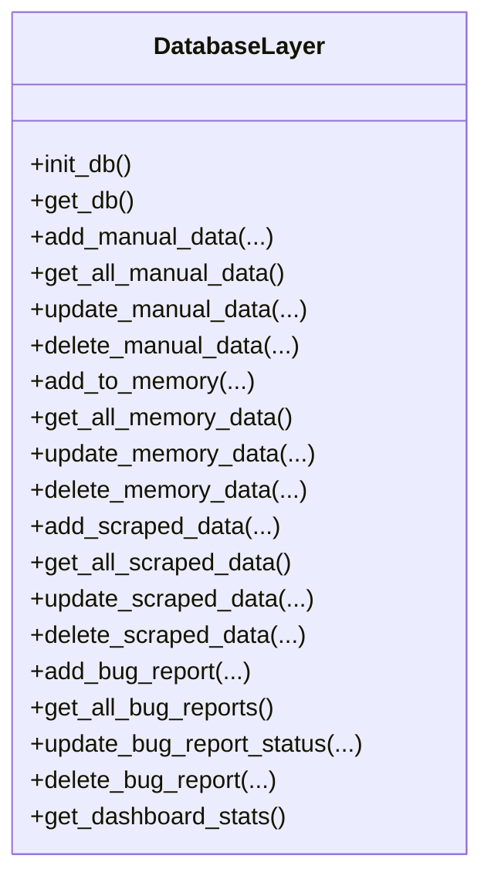
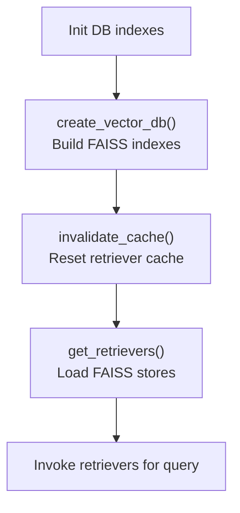
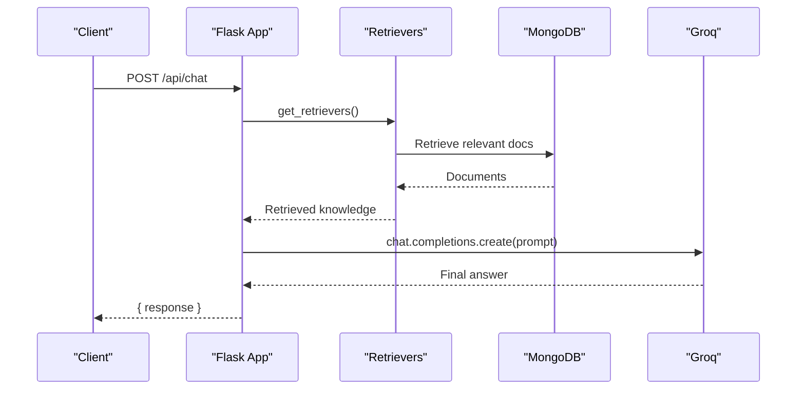
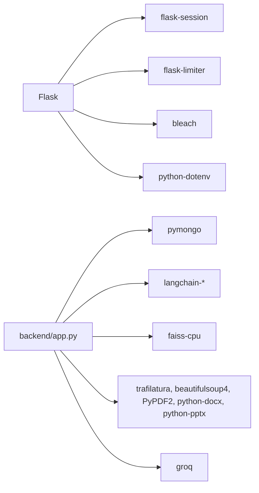

# Backend API Design

<cite>
**Referenced Files in This Document**
- [backend/app.py](file://backend/app.py)
- [backend/database.py](file://backend/database.py)
- [backend/vector_store.py](file://backend/vector_store.py)
- [backend/scraper.py](file://backend/scraper.py)
- [requirements.txt](file://requirements.txt)
- [API_DOCUMENTATION.md](file://API_DOCUMENTATION.md)
</cite>

## Table of Contents
1. [Introduction](#introduction)
2. [Project Structure](#project-structure)
3. [Core Components](#core-components)
4. [Architecture Overview](#architecture-overview)
5. [Detailed Component Analysis](#detailed-component-analysis)
6. [Dependency Analysis](#dependency-analysis)
7. [Performance Considerations](#performance-considerations)
8. [Troubleshooting Guide](#troubleshooting-guide)
9. [Conclusion](#conclusion)
10. [Appendices](#appendices)

## Introduction
This document describes the backend API architecture for the Flask-based API layer. It covers RESTful endpoint design, request/response patterns, authentication and security mechanisms, routing and middleware, error handling, the application factory pattern, blueprint organization, and route decorators. It also documents the database abstraction layer, repository-style data access patterns, vector search and retrieval, rate limiting, CORS configuration, and security headers. Finally, it outlines API versioning considerations, backward compatibility, and deprecation policies, along with practical usage examples.

## Project Structure
The backend is organized around a single Flask application with modularized concerns:
- Application entry and routing: backend/app.py
- Data access and persistence: backend/database.py
- Vector search and retrieval: backend/vector_store.py
- Web scraping and content extraction: backend/scraper.py
- Dependencies and runtime: requirements.txt
- API documentation and examples: API_DOCUMENTATION.md

**Diagram sources**
- [backend/app.py:1-1192](file://backend/app.py#L1-L1192)
- [backend/database.py:1-260](file://backend/database.py#L1-L260)
- [backend/vector_store.py:1-115](file://backend/vector_store.py#L1-L115)
- [backend/scraper.py:1-278](file://backend/scraper.py#L1-L278)

**Section sources**
- [backend/app.py:1-1192](file://backend/app.py#L1-L1192)
- [backend/database.py:1-260](file://backend/database.py#L1-L260)
- [backend/vector_store.py:1-115](file://backend/vector_store.py#L1-L115)
- [backend/scraper.py:1-278](file://backend/scraper.py#L1-L278)
- [requirements.txt:1-30](file://requirements.txt#L1-L30)

## Core Components
- Flask application and routing: Centralized in backend/app.py with route decorators and global middleware hooks.
- Authentication and session management: Admin login/logout, session lifetime, CSRF protection.
- Data access layer: MongoDB-backed CRUD functions grouped by domain (scraped, manual, memory, bugs).
- Vector search: FAISS indexes built from MongoDB documents and served via retrievers.
- Retrieval-augmented generation pipeline: Chat endpoints combine retrievers, context assembly, and Groq LLM.
- Security middleware: Rate limiting, CORS, security headers, input validation, and sanitization.
- Error handling: Global handlers for common HTTP errors and explicit validation failures.

**Section sources**
- [backend/app.py:82-327](file://backend/app.py#L82-L327)
- [backend/database.py:18-260](file://backend/database.py#L18-L260)
- [backend/vector_store.py:48-115](file://backend/vector_store.py#L48-L115)
- [backend/scraper.py:12-278](file://backend/scraper.py#L12-L278)

## Architecture Overview
The API follows a layered architecture:
- Presentation layer: Flask routes and decorators define endpoints and apply middleware.
- Domain services: Retrieval and RAG orchestration in chat handlers.
- Data access: MongoDB CRUD functions encapsulate persistence.
- Vector search: FAISS retrievers provide semantic search over indexed documents.
- External integrations: Groq for LLM inference and optional rate limiting library.

**Diagram sources**
- [backend/app.py:432-761](file://backend/app.py#L432-L761)
- [backend/vector_store.py:73-115](file://backend/vector_store.py#L73-L115)
- [backend/database.py:96-195](file://backend/database.py#L96-L195)

## Detailed Component Analysis

### Flask Application Factory Pattern and Routing
- The application is created directly in backend/app.py without a separate factory function. It configures secret key, session lifetime, and registers routes.
- Routes are defined using @app.route decorators with method-specific handlers.
- Global middleware includes:
  - before_request to make sessions permanent
  - after_request to set security headers and CORS for public paths
  - error handlers for 413, 429, 500

**Diagram sources**
- [backend/app.py:82-327](file://backend/app.py#L82-L327)

**Section sources**
- [backend/app.py:82-327](file://backend/app.py#L82-L327)

### Authentication and Authorization
- Admin authentication:
  - Login: POST /api/admin/login validates password hash or plaintext and sets session flag.
  - Logout: POST /api/admin/logout clears session and CSRF token.
  - Session lifetime: 2 hours via PERMANENT_SESSION_LIFETIME.
- CSRF protection:
  - require_admin decorator enforces admin session.
  - require_csrf decorator validates X-CSRF-Token on state-changing requests.
  - CSRF token endpoint: GET /api/csrf-token returns a fresh token.
- Audit logging:
  - audit_log records admin actions for compliance.

**Diagram sources**
- [backend/app.py:243-365](file://backend/app.py#L243-L365)

**Section sources**
- [backend/app.py:243-365](file://backend/app.py#L243-L365)

### Request/Response Schemas and Validation
- Public endpoints:
  - /api/chat: Accepts { query, history } and returns { response }.
  - /api/report_bug: Accepts multipart/form-data with description and optional file; returns { status, message }.
- Admin endpoints:
  - CRUD for scraped, manual, and memory data accept JSON bodies with validated lengths and IDs.
  - Status updates for bug reports restrict allowed statuses.
- Validation and sanitization:
  - Length limits enforced for queries, content, and descriptions.
  - Chat history truncated to last N entries and sanitized.
  - HTML input sanitized via bleach.
  - ObjectId validation for MongoDB IDs.

**Section sources**
- [backend/app.py:432-761](file://backend/app.py#L432-L761)
- [backend/app.py:188-218](file://backend/app.py#L188-L218)
- [backend/app.py:179-184](file://backend/app.py#L179-L184)
- [backend/app.py:164-175](file://backend/app.py#L164-L175)

### Data Access Patterns and Repository Abstraction
- MongoDB accessors are centralized in backend/database.py with:
  - Initialization of unique indexes for uniqueness and performance.
  - CRUD functions per collection (scraped_data, manual_data, memory_bank, bug_reports).
  - Helper to format BSON ObjectId to string and timestamps.
- Data retrieval for vector indexing:
  - get_*_documents_for_indexing functions assemble LangChain Document objects for FAISS creation.

**Diagram sources**
- [backend/database.py:18-260](file://backend/database.py#L18-L260)

**Section sources**
- [backend/database.py:18-260](file://backend/database.py#L18-L260)

### Vector Search and Retrieval
- FAISS indexes are built from MongoDB documents and cached in memory for fast retriever instantiation.
- Index creation:
  - create_vector_db streams progress logs and rebuilds three indexes (memory, manual, scraped).
- Retrieval:
  - get_retrievers loads FAISS stores and returns three retrievers; caches results to avoid repeated disk IO.
- Image metadata:
  - Scraped content includes an image URL for richer answers.

**Diagram sources**
- [backend/vector_store.py:48-115](file://backend/vector_store.py#L48-L115)
- [backend/database.py:96-195](file://backend/database.py#L96-L195)

**Section sources**
- [backend/vector_store.py:48-115](file://backend/vector_store.py#L48-L115)
- [backend/database.py:96-195](file://backend/database.py#L96-L195)

### Retrieval-Augmented Generation Pipeline
- Public chat:
  - Validates inputs, retrieves from memory/manual/scraped, constructs a structured prompt, and calls Groq.
- Admin chat:
  - Streams intermediate steps (memory/manual/scrape search, retrieved docs, final prompt, final answer) as NDJSON.

**Diagram sources**
- [backend/app.py:432-761](file://backend/app.py#L432-L761)
- [backend/vector_store.py:73-115](file://backend/vector_store.py#L73-L115)
- [backend/database.py:96-195](file://backend/database.py#L96-L195)

**Section sources**
- [backend/app.py:432-761](file://backend/app.py#L432-L761)

### Rate Limiting, CORS, and Security Headers
- Rate limiting:
  - flask-limiter is conditionally enabled; otherwise a dummy limiter is used.
  - Endpoint-specific limits: login (5/min), chat (10/min), bug report (3/min), scrape/crawl/reindex (1/min), default (200/hour).
- CORS:
  - Allowed origins configured for embedded widget usage.
  - Preflight handler for /api/<path> with OPTIONS.
- Security headers:
  - X-Content-Type-Options, X-XSS-Protection, Referrer-Policy, Permissions-Policy, X-Frame-Options (DENY except widget-preview).
  - Cache-control for /api/* to prevent caching sensitive responses.

**Section sources**
- [backend/app.py:96-116](file://backend/app.py#L96-L116)
- [backend/app.py:255-304](file://backend/app.py#L255-L304)
- [backend/app.py:267-292](file://backend/app.py#L267-L292)

### Error Handling Patterns
- Global error handlers:
  - 413 (payload too large)
  - 429 (rate limit exceeded)
  - 500 (internal server error)
- Route-level validation returns 400/401/403/404 with standardized JSON bodies.

**Section sources**
- [backend/app.py:316-327](file://backend/app.py#L316-L327)
- [backend/app.py:403-431](file://backend/app.py#L403-L431)

### API Versioning, Backward Compatibility, and Deprecation
- Current state:
  - No explicit versioned base path (e.g., /v1) is used; endpoints are under /api/.
- Recommendations:
  - Introduce /api/v1 and keep /api for legacy compatibility during migration.
  - Announce deprecations with at least 90 days notice and provide migration guides.
  - Maintain backward-compatible behavior for critical endpoints until sunset date.

[No sources needed since this section provides general guidance]

### Examples and Integration Patterns
- Health check, admin login, dashboard stats, public chat, bug report submission, and admin-only CRUD operations are documented with request/response examples.

**Section sources**
- [API_DOCUMENTATION.md:81-288](file://API_DOCUMENTATION.md#L81-L288)

## Dependency Analysis
External libraries and their roles:
- Flask and extensions: routing, sessions, rate limiting, sanitization, environment loading.
- MongoDB: persistence layer via PyMongo.
- LangChain and FAISS: vector indexing and retrieval.
- Trafilatura, BeautifulSoup, PyPDF2, python-docx, python-pptx: content extraction.
- Groq: LLM inference.

**Diagram sources**
- [requirements.txt:1-30](file://requirements.txt#L1-L30)
- [backend/app.py:1-27](file://backend/app.py#L1-L27)

**Section sources**
- [requirements.txt:1-30](file://requirements.txt#L1-L30)

## Performance Considerations
- Vector retriever caching: Module-level cache avoids reloading FAISS indexes on every request.
- Chunking and embeddings: RecursiveCharacterTextSplitter reduces embedding overhead.
- Session permanence: Reduces session regeneration overhead.
- Streaming responses: Admin chat endpoint streams NDJSON to improve perceived latency.

**Section sources**
- [backend/vector_store.py:14-21](file://backend/vector_store.py#L14-L21)
- [backend/vector_store.py:73-115](file://backend/vector_store.py#L73-L115)
- [backend/app.py:589-604](file://backend/app.py#L589-L604)

## Troubleshooting Guide
- Authentication failures:
  - Ensure ADMIN_PASSWORD or ADMIN_PASSWORD_HASH is set; verify session cookie presence for protected endpoints.
- CSRF failures:
  - Obtain a CSRF token from /api/csrf-token and include X-CSRF-Token header on state-changing requests.
- Rate limiting:
  - Reduce request frequency or upgrade rate limits; confirm flask-limiter installation.
- File upload errors:
  - Respect max size (16 MB) and allowed extensions; verify upload directory permissions.
- Vector search issues:
  - Rebuild indexes via /api/reindex and confirm FAISS directories exist.
- Database connectivity:
  - Confirm MONGO_URI and DB_NAME; check MongoDB availability.

**Section sources**
- [backend/app.py:331-365](file://backend/app.py#L331-L365)
- [backend/app.py:403-431](file://backend/app.py#L403-L431)
- [backend/app.py:763-784](file://backend/app.py#L763-L784)
- [backend/database.py:18-50](file://backend/database.py#L18-L50)

## Conclusion
The backend API leverages Flask’s simplicity with robust middleware, security, and data access patterns. It integrates MongoDB for persistence, FAISS for semantic search, and Groq for LLM-powered chat. The design balances usability with strong safeguards: authentication, CSRF, rate limiting, CORS, and input validation. Adopting versioning and deprecation policies will ensure long-term maintainability and developer experience.

## Appendices

### Endpoint Reference and Categories
- Health: /api/health
- Authentication: /api/admin/login, /api/admin/logout, /api/csrf-token
- Dashboard: /api/dashboard/stats
- Public chat: /api/chat
- Admin chat: /api/admin_chat
- Scraped data: /api/scraped-data (+ GET/PUT/DELETE by ID)
- Manual data: /api/manual-data (+ GET/PUT/DELETE by ID)
- Memory data: /api/memory-data (+ GET/PUT/DELETE by ID)
- Save memory: /api/save_memory
- Bug reports: /api/get_bug_reports, /api/bug_reports/<id>, /api/bug_reports/<id>/status
- System: /api/scrape, /api/crawl, /api/reindex, /api/delete_faiss, /api/delete_db
- Static: /
- Admin UI: /admin
- Widget preview: /widget-preview
- Uploads: /uploads/<path>

**Section sources**
- [backend/app.py:940-1192](file://backend/app.py#L940-L1192)
- [API_DOCUMENTATION.md:11-50](file://API_DOCUMENTATION.md#L11-L50)