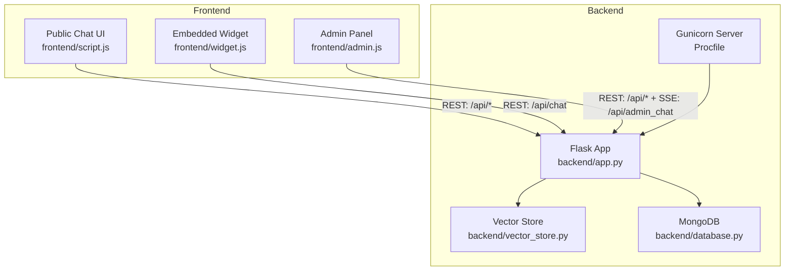
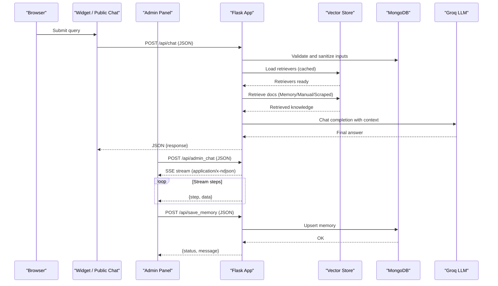
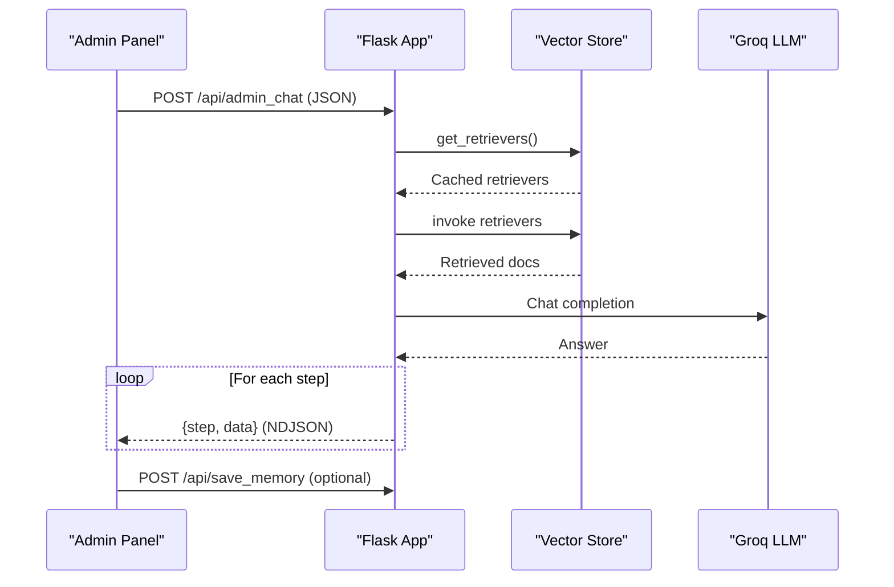
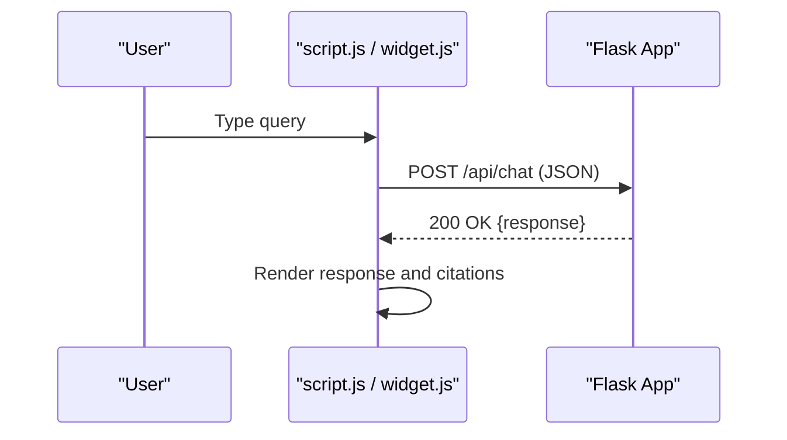
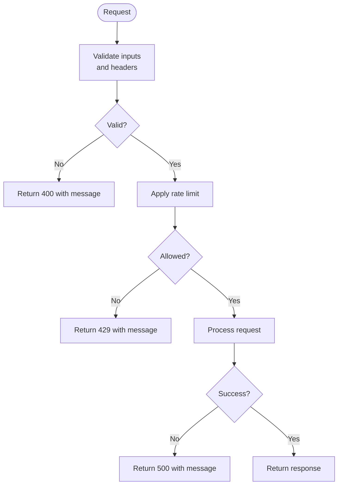
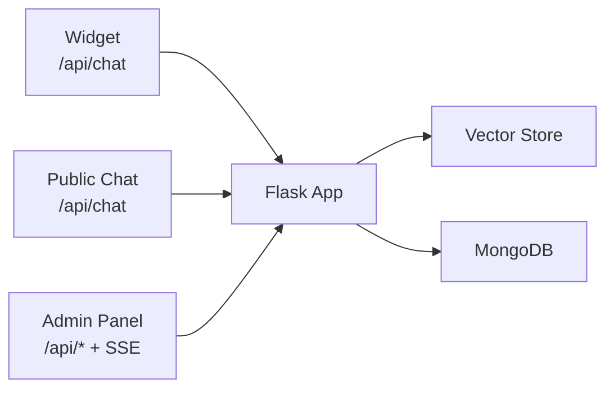
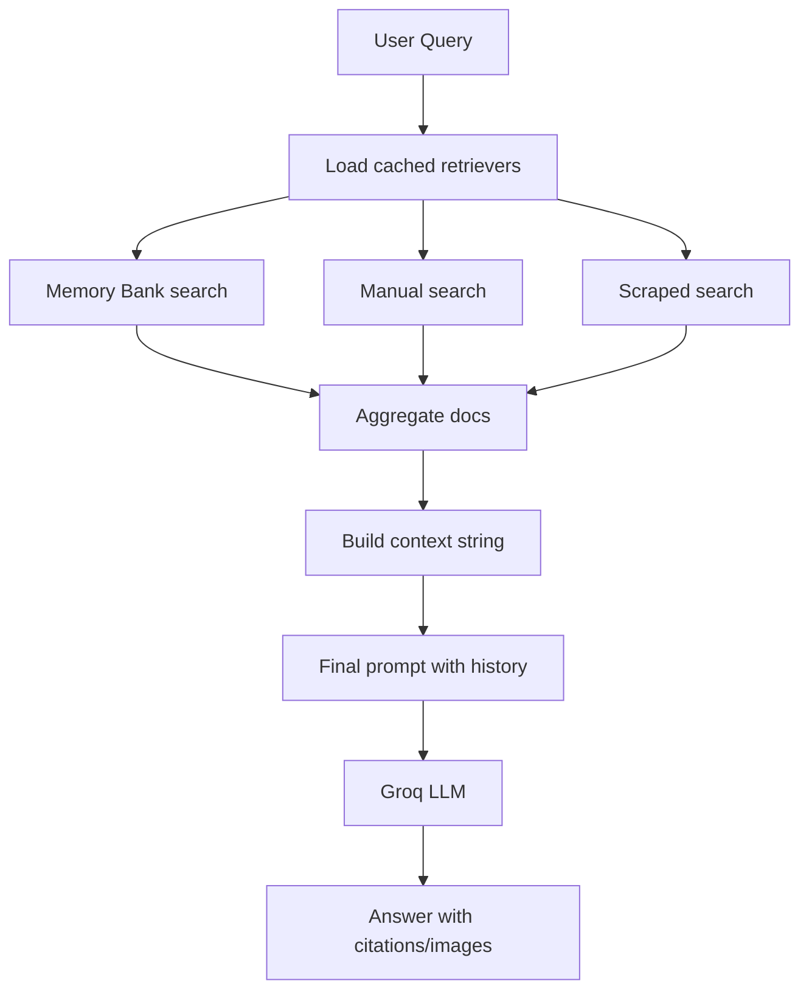
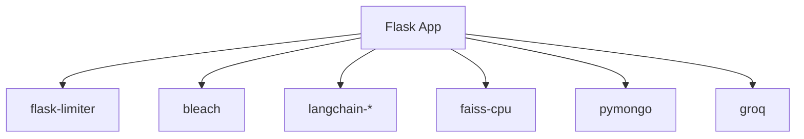

# Communication Patterns

<cite>
**Referenced Files in This Document**
- [backend/app.py](file://backend/app.py)
- [backend/vector_store.py](file://backend/vector_store.py)
- [backend/database.py](file://backend/database.py)
- [frontend/script.js](file://frontend/script.js)
- [frontend/widget.js](file://frontend/widget.js)
- [frontend/admin.js](file://frontend/admin.js)
- [API_DOCUMENTATION.md](file://API_DOCUMENTATION.md)
- [Procfile](file://Procfile)
- [requirements.txt](file://requirements.txt)
</cite>

## Table of Contents
1. [Introduction](#introduction)
2. [Project Structure](#project-structure)
3. [Core Components](#core-components)
4. [Architecture Overview](#architecture-overview)
5. [Detailed Component Analysis](#detailed-component-analysis)
6. [Dependency Analysis](#dependency-analysis)
7. [Performance Considerations](#performance-considerations)
8. [Troubleshooting Guide](#troubleshooting-guide)
9. [Conclusion](#conclusion)
10. [Appendices](#appendices)

## Introduction
This document explains the communication patterns of the DamayAI-Assistant system across frontend widgets, admin panel, and backend services. It covers real-time streaming using Server-Sent Events (SSE), asynchronous request handling, frontend-backend API protocols, request-response cycles, error propagation, inter-component messaging, vector search query processing, result aggregation, response formatting, caching strategies, load balancing, distributed computing patterns, network optimization, timeouts, graceful degradation, audit logging, monitoring integration, and observability.

## Project Structure
The system comprises:
- Backend service built with Flask and served via Gunicorn with threading workers
- Vector search powered by FAISS indices and HuggingFace embeddings
- MongoDB for persistent storage
- Frontend assets for public chat, embedded widget, and admin panel
- Admin panel with live SSE streaming for admin testing

**Diagram sources**
- [Procfile:1-1](file://Procfile#L1-L1)
- [backend/app.py:82-83](file://backend/app.py#L82-L83)
- [backend/vector_store.py:1-115](file://backend/vector_store.py#L1-L115)
- [backend/database.py:1-260](file://backend/database.py#L1-L260)
- [frontend/script.js:1-428](file://frontend/script.js#L1-L428)
- [frontend/widget.js:1-561](file://frontend/widget.js#L1-L561)
- [frontend/admin.js:1-1108](file://frontend/admin.js#L1-L1108)

**Section sources**
- [Procfile:1-1](file://Procfile#L1-L1)
- [requirements.txt:1-30](file://requirements.txt#L1-L30)

## Core Components
- Public chat and bug reporting endpoints for user-facing interactions
- Admin-only endpoints for authentication, data management, and system operations
- Streaming admin chat endpoint for real-time step-by-step reasoning
- Vector search retrieval with FAISS and HuggingFace embeddings
- MongoDB-backed persistence for scraped, manual, memory, and bug report data
- Embedded widget for third-party site integration

**Section sources**
- [backend/app.py:403-431](file://backend/app.py#L403-L431)
- [backend/app.py:456-496](file://backend/app.py#L456-L496)
- [backend/app.py:589-604](file://backend/app.py#L589-L604)
- [backend/vector_store.py:48-71](file://backend/vector_store.py#L48-L71)
- [backend/database.py:27-49](file://backend/database.py#L27-L49)
- [frontend/widget.js:441-470](file://frontend/widget.js#L441-L470)

## Architecture Overview
The system uses a REST-first API with SSE for streaming admin reasoning. Requests traverse the Flask app, which validates inputs, enforces rate limits and CSRF, queries MongoDB, retrieves vectors from FAISS, and invokes the Groq LLM to produce contextual answers. Responses are returned synchronously for public chat and asynchronously via SSE for admin chat.

**Diagram sources**
- [backend/app.py:432-452](file://backend/app.py#L432-L452)
- [backend/app.py:589-604](file://backend/app.py#L589-L604)
- [backend/app.py:605-761](file://backend/app.py#L605-L761)
- [backend/vector_store.py:73-115](file://backend/vector_store.py#L73-L115)
- [backend/database.py:108-148](file://backend/database.py#L108-L148)
- [frontend/admin.js:1019-1069](file://frontend/admin.js#L1019-L1069)

## Detailed Component Analysis

### Real-Time Streaming with SSE (Admin Chat)
- The admin chat endpoint streams reasoning steps as NDJSON events.
- The admin UI reads the stream, parses JSON lines, and renders step-by-step progress.
- The final answer is appended as a content-editable block for saving to memory.

**Diagram sources**
- [backend/app.py:589-604](file://backend/app.py#L589-L604)
- [backend/app.py:605-761](file://backend/app.py#L605-L761)
- [frontend/admin.js:1019-1069](file://frontend/admin.js#L1019-L1069)

**Section sources**
- [backend/app.py:589-604](file://backend/app.py#L589-L604)
- [frontend/admin.js:1019-1069](file://frontend/admin.js#L1019-L1069)

### Frontend-Backend API Protocols and Request-Response Cycles
- Public chat: JSON payload with query and history; JSON response with response text.
- Embedded widget: Same pattern; auto-detects base URL from script src.
- Bug reporting: multipart/form-data with description and optional file.
- Admin endpoints: Require CSRF token via header; admin panel injects token on state-changing requests.

**Diagram sources**
- [frontend/script.js:78-111](file://frontend/script.js#L78-L111)
- [frontend/widget.js:441-470](file://frontend/widget.js#L441-L470)
- [backend/app.py:432-452](file://backend/app.py#L432-L452)

**Section sources**
- [frontend/script.js:78-111](file://frontend/script.js#L78-L111)
- [frontend/widget.js:441-470](file://frontend/widget.js#L441-L470)
- [backend/app.py:403-431](file://backend/app.py#L403-L431)
- [frontend/admin.js:200-234](file://frontend/admin.js#L200-L234)

### Error Propagation and Handling
- Global error handlers for common HTTP errors (file too large, rate limited, internal server error).
- Admin panel intercepts 401/403 and refreshes CSRF token when possible.
- Frontends display user-friendly messages and disable inputs during requests.

**Diagram sources**
- [backend/app.py:316-327](file://backend/app.py#L316-L327)
- [frontend/admin.js:214-233](file://frontend/admin.js#L214-L233)

**Section sources**
- [backend/app.py:316-327](file://backend/app.py#L316-L327)
- [frontend/admin.js:214-233](file://frontend/admin.js#L214-L233)

### Inter-Component Messaging Patterns
- Chat widget and public chat share identical request/response semantics.
- Admin panel coordinates multiple flows: authentication, data management, system operations, and streaming reasoning.
- Admin panel uses a global fetch wrapper to inject CSRF tokens and handle auth failures.

**Diagram sources**
- [frontend/widget.js:441-470](file://frontend/widget.js#L441-L470)
- [frontend/script.js:78-111](file://frontend/script.js#L78-L111)
- [frontend/admin.js:200-234](file://frontend/admin.js#L200-L234)
- [backend/app.py:432-452](file://backend/app.py#L432-L452)

**Section sources**
- [frontend/widget.js:441-470](file://frontend/widget.js#L441-L470)
- [frontend/script.js:78-111](file://frontend/script.js#L78-L111)
- [frontend/admin.js:200-234](file://frontend/admin.js#L200-L234)

### Vector Search Query Processing, Aggregation, and Response Formatting
- Retrievers are cached at module level to avoid reloading FAISS indexes on each request.
- Three retrievers are used: Memory Bank, Manual Data, and Scraped Data.
- Results are aggregated into a unified context string with source attribution and optional images.
- The final prompt instructs the LLM to ground facts, cite sources, and include images when relevant.

**Diagram sources**
- [backend/vector_store.py:73-115](file://backend/vector_store.py#L73-L115)
- [backend/app.py:609-761](file://backend/app.py#L609-L761)

**Section sources**
- [backend/vector_store.py:73-115](file://backend/vector_store.py#L73-L115)
- [backend/app.py:609-761](file://backend/app.py#L609-L761)

### Caching Strategies
- FAISS retrievers are cached globally and invalidated when FAISS indexes are rebuilt or deleted.
- Sessions are persistent with a fixed lifetime.
- Frontend caches admin data lists locally to reduce repeated loads.

**Section sources**
- [backend/vector_store.py:14-21](file://backend/vector_store.py#L14-L21)
- [backend/app.py:309-312](file://backend/app.py#L309-L312)
- [frontend/admin.js:372-393](file://frontend/admin.js#L372-L393)

### Load Balancing and Distributed Computing Patterns
- Gunicorn runs with threaded workers to serve concurrent requests efficiently.
- FAISS CPU is used; embeddings are computed locally via sentence-transformers/HuggingFace.
- MongoDB is externalized via environment configuration.

**Section sources**
- [Procfile:1-1](file://Procfile#L1-L1)
- [requirements.txt:16-29](file://requirements.txt#L16-L29)
- [backend/database.py:18-25](file://backend/database.py#L18-L25)

### Network Optimization, Timeouts, and Graceful Degradation
- Rate limiting prevents abuse; CSRF protection secures state-changing requests.
- Security headers and CORS policies restrict cross-origin access to trusted domains.
- Graceful fallbacks: missing FAISS indexes trigger automatic rebuild at startup; missing FAISS triggers degraded retrieval behavior.

**Section sources**
- [backend/app.py:98-115](file://backend/app.py#L98-L115)
- [backend/app.py:252-292](file://backend/app.py#L252-L292)
- [backend/app.py:220-237](file://backend/app.py#L220-L237)

### Audit Logging, Monitoring, and Observability
- Audit logs capture admin actions with IP, action, and detail.
- SSE streaming enables real-time observability for admin reasoning.
- Health endpoint and dashboard statistics support monitoring.

**Section sources**
- [backend/app.py:32-56](file://backend/app.py#L32-L56)
- [API_DOCUMENTATION.md:15-19](file://API_DOCUMENTATION.md#L15-L19)
- [API_DOCUMENTATION.md:114-133](file://API_DOCUMENTATION.md#L114-L133)

## Dependency Analysis
The backend depends on Flask, rate limiting, sanitization, LangChain, FAISS, MongoDB, and Groq. Frontends depend on the backend’s REST/SSE endpoints.

**Diagram sources**
- [requirements.txt:1-30](file://requirements.txt#L1-L30)
- [backend/app.py:9,15-27](file://backend/app.py#L9,L15-L27)

**Section sources**
- [requirements.txt:1-30](file://requirements.txt#L1-L30)

## Performance Considerations
- Use cached retrievers to minimize FAISS load overhead.
- Keep chat history truncated to recent turns to bound prompt size.
- Apply rate limits to protect upstream LLM and vector stores.
- Consider scaling horizontally with multiple Gunicorn workers behind a reverse proxy.

## Troubleshooting Guide
- 401 Unauthorized: Re-authenticate; CSRF token may be stale—refresh via the CSRF endpoint.
- 403 Forbidden (CSRF): Ensure CSRF header is present for state-changing requests.
- 429 Too Many Requests: Reduce request frequency or adjust limits.
- 500 Internal Server Error: Check backend logs and verify vector index integrity.
- Missing FAISS indexes: Trigger reindex operation; verify filesystem permissions.

**Section sources**
- [frontend/admin.js:214-233](file://frontend/admin.js#L214-L233)
- [API_DOCUMENTATION.md:232-288](file://API_DOCUMENTATION.md#L232-L288)
- [backend/app.py:763-784](file://backend/app.py#L763-L784)

## Conclusion
The DamayAI-Assistant employs a robust REST and SSE architecture with strong security, caching, and observability. Public and embedded chat operate synchronously, while admin chat provides real-time reasoning insights. Vector search integrates seamlessly with MongoDB-backed data, and the system is designed for maintainability, scalability, and resilience.

## Appendices
- API documentation and examples are available in the project’s API documentation file.
- The admin panel demonstrates streaming, CSRF handling, and data management workflows.

**Section sources**
- [API_DOCUMENTATION.md:1-347](file://API_DOCUMENTATION.md#L1-L347)