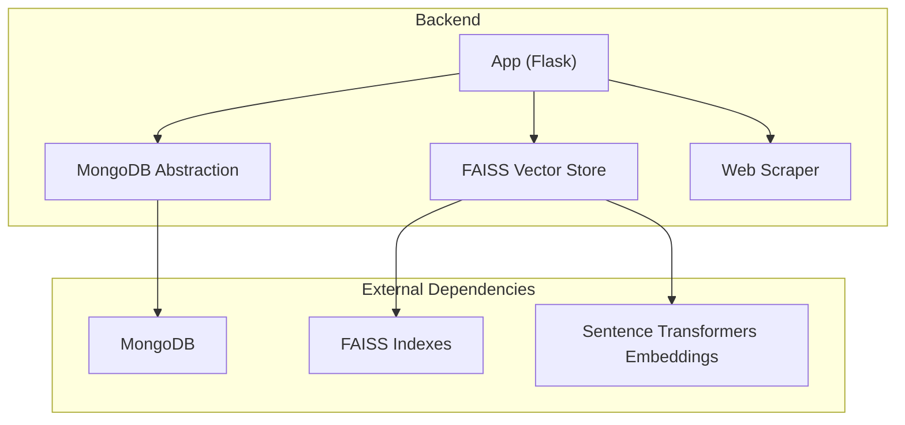
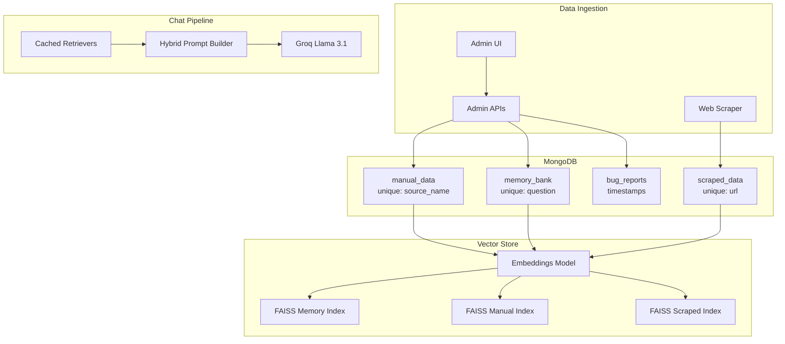
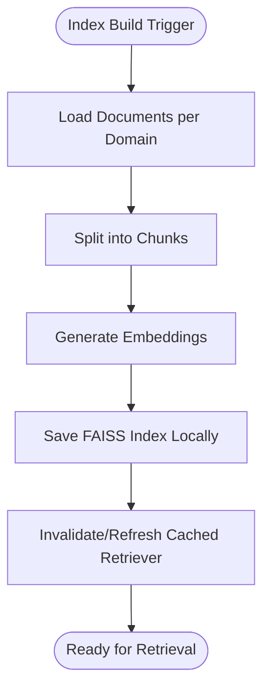
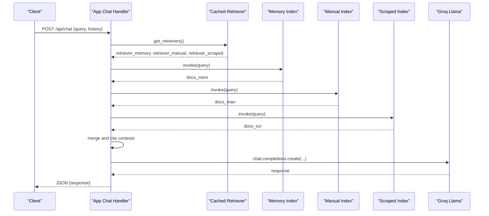
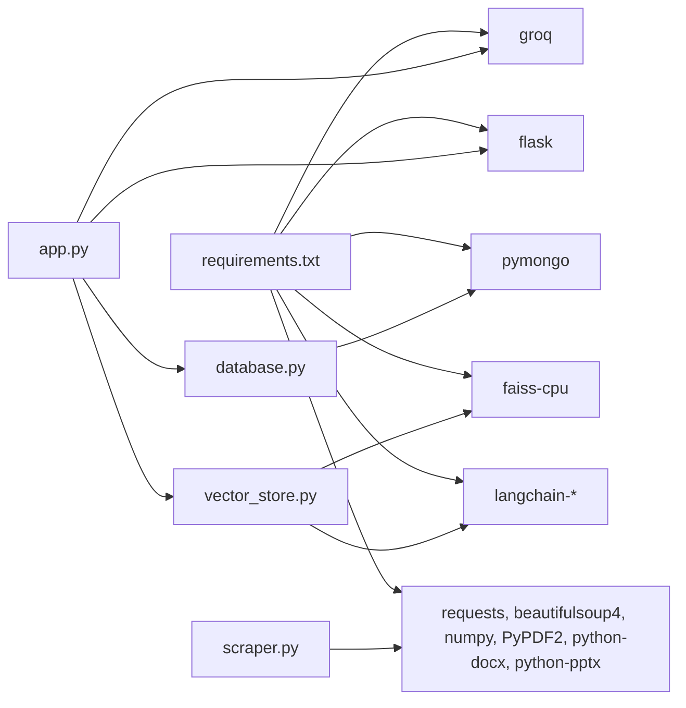
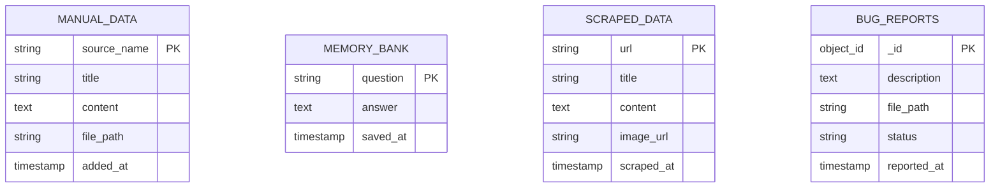

# Data Access Layer

<cite>
**Referenced Files in This Document**
- [database.py](file://backend/database.py)
- [vector_store.py](file://backend/vector_store.py)
- [app.py](file://backend/app.py)
- [scraper.py](file://backend/scraper.py)
- [requirements.txt](file://requirements.txt)
</cite>

## Table of Contents
1. [Introduction](#introduction)
2. [Project Structure](#project-structure)
3. [Core Components](#core-components)
4. [Architecture Overview](#architecture-overview)
5. [Detailed Component Analysis](#detailed-component-analysis)
6. [Dependency Analysis](#dependency-analysis)
7. [Performance Considerations](#performance-considerations)
8. [Troubleshooting Guide](#troubleshooting-guide)
9. [Conclusion](#conclusion)
10. [Appendices](#appendices)

## Introduction
This document describes the data access layer of DamayAI-Assistant’s dual-storage architecture. The system combines:
- Traditional document storage in MongoDB for structured CRUD operations, metadata, and administrative workflows
- Vector embeddings and similarity search powered by FAISS for semantic retrieval and hybrid chat responses

It covers collection design, indexing strategies, query optimization, FAISS embedding management, similarity search, persistence patterns, transaction handling, consistency guarantees, hybrid storage strategies, migration and backup procedures, performance monitoring, and security controls.

## Project Structure
The data access layer spans three primary modules:
- Backend database abstraction and MongoDB integration
- Vector store creation, caching, and retrieval
- Application orchestration integrating scraping, indexing, and chat

**Diagram sources**
- [app.py:1-120](file://backend/app.py#L1-L120)
- [database.py:1-50](file://backend/database.py#L1-L50)
- [vector_store.py:1-70](file://backend/vector_store.py#L1-L70)
- [scraper.py:1-40](file://backend/scraper.py#L1-L40)

**Section sources**
- [app.py:1-120](file://backend/app.py#L1-L120)
- [database.py:1-50](file://backend/database.py#L1-L50)
- [vector_store.py:1-70](file://backend/vector_store.py#L1-L70)
- [scraper.py:1-40](file://backend/scraper.py#L1-L40)

## Core Components
- MongoDB abstraction module initializes collections, enforces uniqueness constraints, and exposes CRUD helpers for manual data, memory bank, scraped data, and bug reports.
- FAISS vector store module builds separate indexes per data type, caches retrievers, and streams retrieval results for hybrid chat.
- Application orchestrator coordinates scraping, indexing, and chat generation, with rate limiting, input sanitization, and admin-only endpoints.

Key responsibilities:
- Data ingestion: manual text/file upload, bug report submission, web scraping pipeline
- Indexing: document splitting, embedding generation, FAISS persistence
- Retrieval: multi-source vector search with cached retrievers
- Chat: hybrid prompt assembly with citations and streaming responses

**Section sources**
- [database.py:27-49](file://backend/database.py#L27-L49)
- [vector_store.py:48-71](file://backend/vector_store.py#L48-L71)
- [app.py:432-761](file://backend/app.py#L432-L761)

## Architecture Overview
The dual-storage architecture integrates document and vector paradigms:
- MongoDB stores structured records with unique constraints and timestamps, enabling fast lookups and admin workflows.
- FAISS stores embeddings for semantic similarity search across three domains: memory bank, manual data, and scraped data.

**Diagram sources**
- [database.py:31-47](file://backend/database.py#L31-L47)
- [vector_store.py:48-71](file://backend/vector_store.py#L48-L71)
- [app.py:609-761](file://backend/app.py#L609-L761)

## Detailed Component Analysis

### MongoDB Integration and Collections
Collections and constraints:
- manual_data: unique constraint on source_name; sorted by added_at
- memory_bank: unique constraint on question; sorted by saved_at
- scraped_data: unique constraint on url; sorted by scraped_at
- bug_reports: sorted by reported_at

Indexing strategy rationale:
- Unique indexes enforce deduplication and fast upserts by identity fields
- Timestamp-based descending indexes optimize recent-first queries for dashboards and listings

Data shaping:
- Helper converts ObjectId to string and removes internal _id for JSON responses

Operational patterns:
- Upserts replace-on-duplicate for idempotent ingestion
- Sorting by descending timestamps for default ordering
- Count-based statistics aggregation for admin dashboards

**Section sources**
- [database.py:27-49](file://backend/database.py#L27-L49)
- [database.py:51-57](file://backend/database.py#L51-L57)
- [database.py:232-243](file://backend/database.py#L232-L243)

### FAISS Vector Database Implementation
Embedding model:
- Sentence transformers model “all-MiniLM-L6-v2” for dense embeddings

Indexing pipeline:
- Three separate FAISS indices: memory, manual, scraped
- Documents are split into overlapping chunks, embedded, and persisted locally
- On startup, missing indices are auto-rebuilt

Retrieval:
- Cached retrievers reduce repeated disk reads and initialization overhead
- Per-query retrievers fetch top-k matches from each index
- Hybrid retrieval aggregates results from all three sources

**Diagram sources**
- [vector_store.py:23-47](file://backend/vector_store.py#L23-L47)
- [vector_store.py:48-71](file://backend/vector_store.py#L48-L71)

**Section sources**
- [vector_store.py:1-21](file://backend/vector_store.py#L1-L21)
- [vector_store.py:23-71](file://backend/vector_store.py#L23-L71)
- [vector_store.py:73-115](file://backend/vector_store.py#L73-L115)

### Hybrid Storage and Retrieval Workflow
The chat handler performs a three-stage retrieval:
1. Memory Bank: domain-specific knowledge stored as Q&A pairs
2. Manual Data: curated content uploaded by admins
3. Scraped Data: web content extracted and indexed

Results are merged into a unified context with metadata and optional images, then passed to the LLM with strict citation formatting.

**Diagram sources**
- [app.py:609-761](file://backend/app.py#L609-L761)
- [vector_store.py:73-115](file://backend/vector_store.py#L73-L115)

**Section sources**
- [app.py:609-761](file://backend/app.py#L609-L761)
- [vector_store.py:73-115](file://backend/vector_store.py#L73-L115)

### Data Persistence Patterns and Transactions
Persistence patterns:
- MongoDB: upserts by unique keys; sorting by timestamps for default order; count aggregations for stats
- FAISS: local filesystem persistence; index deletion and rebuild supported

Consistency:
- No cross-store ACID transactions are used. Instead, the system relies on:
  - Unique constraints to prevent duplicates
  - Idempotent upserts for ingestion
  - Separate indices per domain to minimize cross-modification conflicts
  - Explicit invalidation/invalidate_cache to refresh retrievers after index updates

Recovery:
- Admin endpoint to drop all FAISS directories and rebuild
- Admin endpoint to drop all MongoDB collections and reinitialize indexes

**Section sources**
- [database.py:61-94](file://backend/database.py#L61-L94)
- [database.py:152-184](file://backend/database.py#L152-L184)
- [database.py:199-228](file://backend/database.py#L199-L228)
- [app.py:763-800](file://backend/app.py#L763-L800)

### Data Migration Strategies
Recommended migration steps:
- Export MongoDB collections to BSON or JSON for archival
- Persist FAISS index directories externally (backup tarball or cloud storage)
- Version index build parameters (chunk size, overlap, model) for reproducibility
- Validate migrated indices by loading retrievers and running a small retrieval test

Operational safeguards:
- Use invalidate_cache after reindexing to ensure fresh retrievers
- Maintain separate environments for staging migrations

**Section sources**
- [vector_store.py:17-21](file://backend/vector_store.py#L17-L21)
- [vector_store.py:23-47](file://backend/vector_store.py#L23-L47)

### Backup Procedures
Backup checklist:
- MongoDB: dump collections regularly; monitor unique constraints post-restore
- FAISS: snapshot index directories; verify retrievers load without errors
- Environment variables: preserve MONGO_URI, SECRET_KEY, GROQ_API_KEY, ADMIN credentials

Recovery:
- Restore MongoDB collections and re-run init_db to recreate indexes
- Restore FAISS directories and trigger a cache refresh

**Section sources**
- [database.py:27-49](file://backend/database.py#L27-L49)
- [app.py:763-800](file://backend/app.py#L763-L800)

### Performance Monitoring
Monitoring dimensions:
- Vector search latency: measure retriever invocation time and total retrieval duration
- Embedding throughput: track chunking and index save durations
- LLM token usage and latency: observe completion timings
- Database query metrics: count queries, sort operations, and index hit rates

Optimization levers:
- Adjust k in retrievers for precision/recall trade-offs
- Tune chunk size and overlap for embedding quality and recall
- Cache retrievers to avoid repeated disk loads
- Monitor rate limits and adjust defaults as needed

**Section sources**
- [vector_store.py:73-115](file://backend/vector_store.py#L73-L115)
- [app.py:98-115](file://backend/app.py#L98-L115)

### Security, Encryption at Rest, and Access Control
Security measures:
- Admin authentication with session-based access control
- CSRF protection via tokens for state-changing endpoints
- Input sanitization and length limits for all user-provided content
- Strict CORS policy for public endpoints and widget embedding
- Security headers (X-Content-Type-Options, X-XSS-Protection, Referrer-Policy, Permissions-Policy, X-Frame-Options)
- Audit logging for admin actions and sensitive operations

Encryption at rest:
- MongoDB: rely on provider-side encryption or network encryption; ensure MONGO_URI uses TLS
- FAISS: store indexes on encrypted filesystems or volumes
- Environment variables: keep SECRET_KEY, ADMIN_PASSWORD_HASH, GROQ_API_KEY secret

Access control:
- Admin-only routes guarded by decorators
- ObjectId validation for safe lookups
- Rate limiting to mitigate abuse

**Section sources**
- [app.py:243-250](file://backend/app.py#L243-L250)
- [app.py:151-159](file://backend/app.py#L151-L159)
- [app.py:179-184](file://backend/app.py#L179-L184)
- [app.py:267-292](file://backend/app.py#L267-L292)
- [app.py:331-365](file://backend/app.py#L331-L365)
- [app.py:403-431](file://backend/app.py#L403-L431)

## Dependency Analysis
External libraries and their roles:
- MongoDB driver for Python: connect, index creation, CRUD operations
- FAISS: vector similarity search and local persistence
- LangChain ecosystem: embeddings, text splitters, FAISS integration
- Requests and BeautifulSoup: web scraping and content extraction
- Groq client: LLM inference for chat responses

**Diagram sources**
- [requirements.txt:1-30](file://requirements.txt#L1-L30)
- [database.py:1-10](file://backend/database.py#L1-L10)
- [vector_store.py:1-6](file://backend/vector_store.py#L1-L6)
- [app.py:1-30](file://backend/app.py#L1-L30)
- [scraper.py:1-11](file://backend/scraper.py#L1-L11)

**Section sources**
- [requirements.txt:1-30](file://requirements.txt#L1-L30)

## Performance Considerations
- Retrieval scaling: cache retrievers to avoid repeated load_local calls
- Index size tuning: balance chunk size and overlap for embedding quality and recall
- LLM cost control: limit max tokens and prompt length
- Network stability: configure timeouts and retries for scraping and LLM calls
- Rate limiting: tune defaults to match expected traffic patterns

[No sources needed since this section provides general guidance]

## Troubleshooting Guide
Common issues and resolutions:
- Missing FAISS indexes: auto-rebuild on startup; use admin endpoint to delete and rebuild
- Retrieval failures: invalidate cache and confirm retrievers load successfully
- Admin authentication errors: verify SECRET_KEY and ADMIN credentials
- Large payload errors: ensure file sizes and text lengths adhere to configured limits
- CORS problems: confirm allowed origins and public paths

**Section sources**
- [app.py:220-237](file://backend/app.py#L220-L237)
- [app.py:763-784](file://backend/app.py#L763-L784)
- [app.py:331-365](file://backend/app.py#L331-L365)
- [app.py:316-326](file://backend/app.py#L316-L326)
- [app.py:255-304](file://backend/app.py#L255-L304)

## Conclusion
The data access layer leverages MongoDB for reliable document storage and FAISS for efficient semantic search. Together, they enable a hybrid retrieval pipeline that powers accurate, citable answers. Robust indexing, caching, and admin controls ensure scalability and maintainability, while security measures protect sensitive data and operations.

[No sources needed since this section summarizes without analyzing specific files]

## Appendices

### Data Model Overview

**Diagram sources**
- [database.py:61-94](file://backend/database.py#L61-L94)
- [database.py:108-138](file://backend/database.py#L108-L138)
- [database.py:152-184](file://backend/database.py#L152-L184)
- [database.py:199-228](file://backend/database.py#L199-L228)