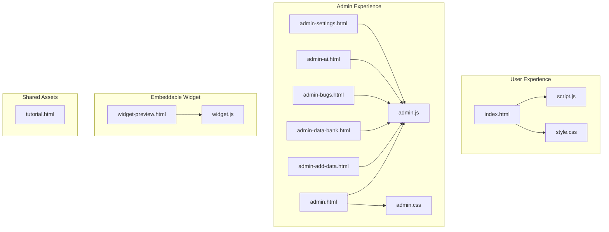
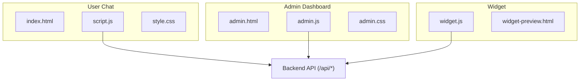
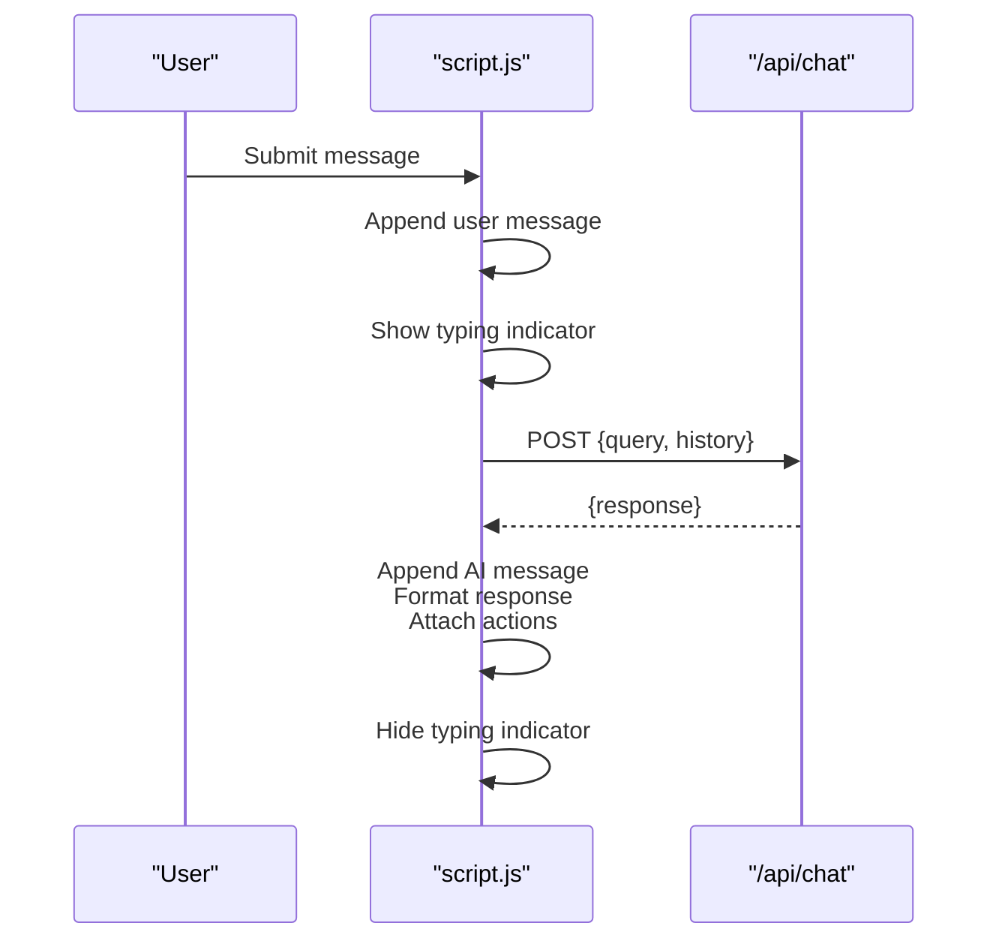
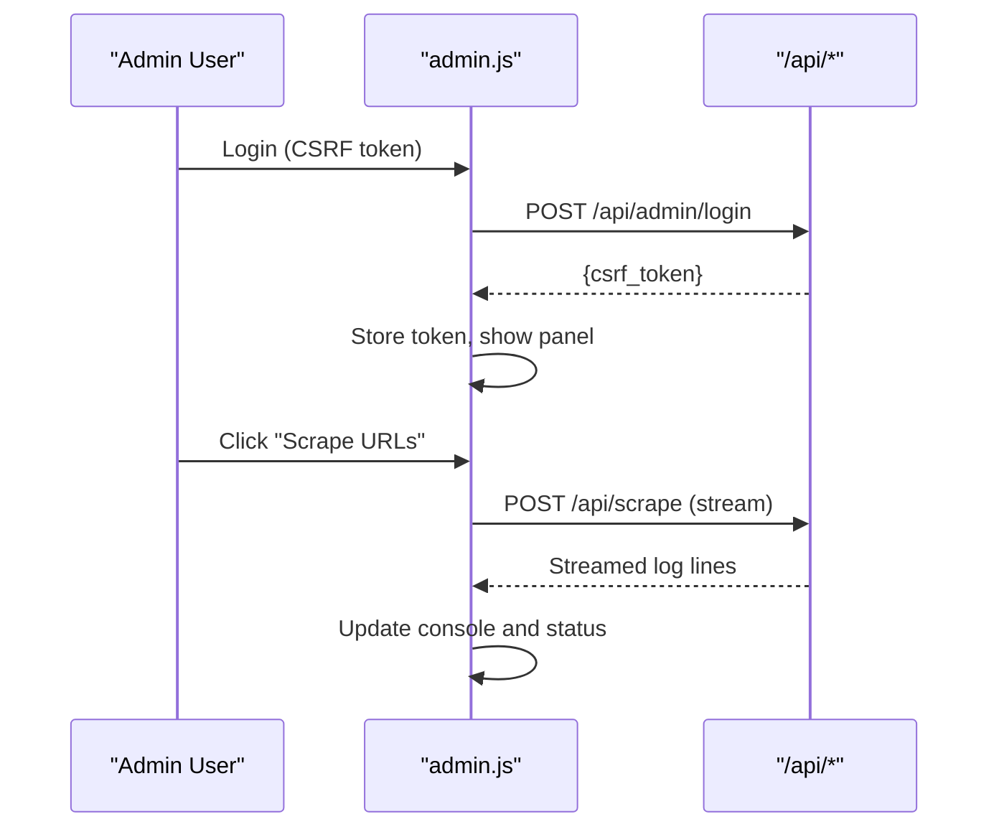
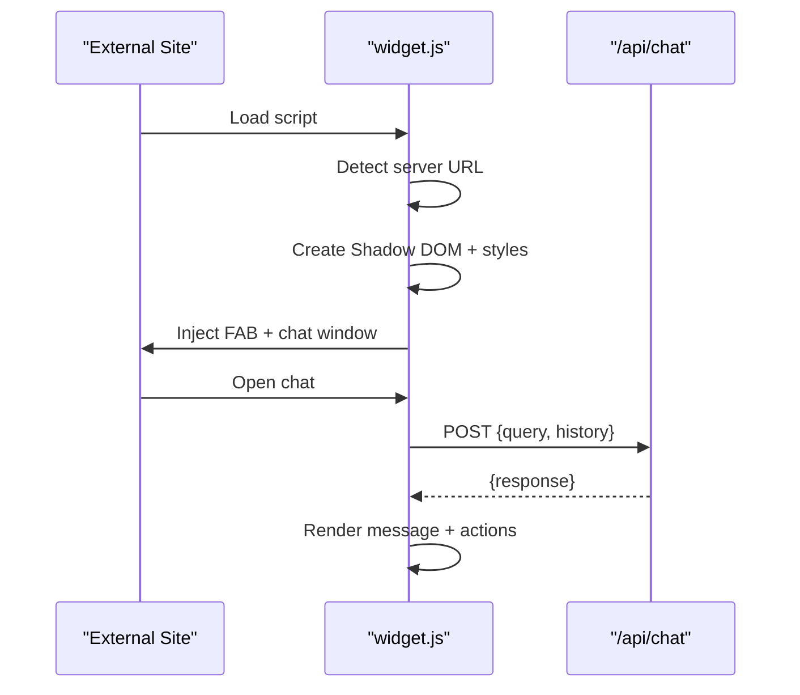
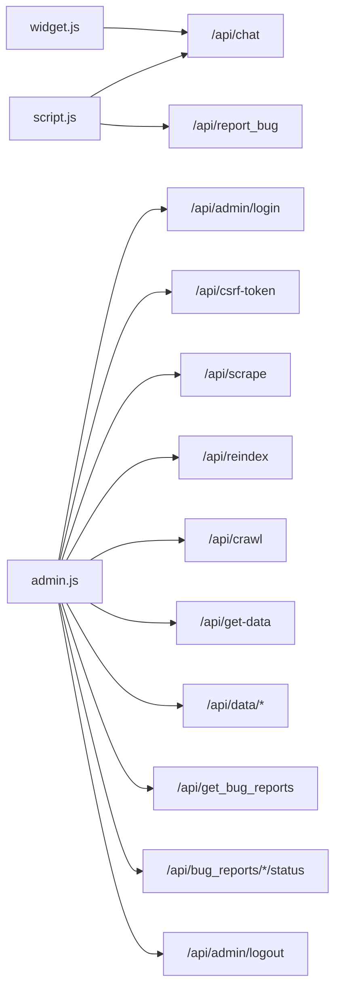

# Frontend Architecture

<cite>
**Referenced Files in This Document**
- [index.html](file://frontend/index.html)
- [script.js](file://frontend/script.js)
- [style.css](file://frontend/style.css)
- [widget.js](file://frontend/widget.js)
- [widget-preview.html](file://frontend/widget-preview.html)
- [admin.html](file://frontend/admin.html)
- [admin.js](file://frontend/admin.js)
- [admin.css](file://frontend/admin.css)
- [admin-add-data.html](file://frontend/admin-add-data.html)
- [admin-data-bank.html](file://frontend/admin-data-bank.html)
- [admin-bugs.html](file://frontend/admin-bugs.html)
- [admin-ai.html](file://frontend/admin-ai.html)
- [admin-settings.html](file://frontend/admin-settings.html)
- [tutorial.html](file://frontend/tutorial.html)
</cite>

## Table of Contents
1. [Introduction](#introduction)
2. [Project Structure](#project-structure)
3. [Core Components](#core-components)
4. [Architecture Overview](#architecture-overview)
5. [Detailed Component Analysis](#detailed-component-analysis)
6. [Dependency Analysis](#dependency-analysis)
7. [Performance Considerations](#performance-considerations)
8. [Troubleshooting Guide](#troubleshooting-guide)
9. [Conclusion](#conclusion)
10. [Appendices](#appendices)

## Introduction
This document describes the frontend architecture of DamayAI-Assistant, focusing on the user-facing chat interface, the admin management dashboard, and the embeddable chat widget. It explains the JavaScript modules responsible for chat functionality, real-time-like message handling, DOM manipulation, and the styling system. It also covers the separation between user and admin experiences, the widget embedding architecture, responsive design, frontend-backend communication patterns, error handling strategies, browser compatibility, performance optimizations, and security considerations.

## Project Structure
The frontend is organized into two primary application surfaces:
- User chat application: a single-page chat experience with theme support, message formatting, and bug reporting.
- Admin dashboard: a multi-page SPA with glassmorphism UI, navigation, and administrative actions.

Key files:
- User chat: index.html + script.js + style.css
- Admin: admin.html + admin.js + admin.css (and supporting pages)
- Widget: widget.js + widget-preview.html
- Shared assets: tutorial.html

**Diagram sources**
- [index.html:1-99](file://frontend/index.html#L1-L99)
- [script.js:1-428](file://frontend/script.js#L1-L428)
- [style.css:1-492](file://frontend/style.css#L1-L492)
- [admin.html:1-164](file://frontend/admin.html#L1-L164)
- [admin.js:1-1108](file://frontend/admin.js#L1-L1108)
- [admin.css:1-618](file://frontend/admin.css#L1-L618)
- [admin-add-data.html:1-113](file://frontend/admin-add-data.html#L1-L113)
- [admin-data-bank.html:1-98](file://frontend/admin-data-bank.html#L1-L98)
- [admin-bugs.html:1-94](file://frontend/admin-bugs.html#L1-L94)
- [admin-ai.html:1-86](file://frontend/admin-ai.html#L1-L86)
- [admin-settings.html:1-102](file://frontend/admin-settings.html#L1-L102)
- [widget.js:1-561](file://frontend/widget.js#L1-L561)
- [widget-preview.html:1-207](file://frontend/widget-preview.html#L1-L207)
- [tutorial.html:1-123](file://frontend/tutorial.html#L1-L123)

**Section sources**
- [index.html:1-99](file://frontend/index.html#L1-L99)
- [admin.html:1-164](file://frontend/admin.html#L1-L164)

## Core Components
- User chat module (script.js): Handles form submission, chat history, message rendering, typing indicators, TTS, copy, regenerate, and bug report submission.
- Admin SPA (admin.js): Implements authentication, CSRF protection, process runners for scraping/reindexing, data bank CRUD, bug report management, AI playground, and dangerous actions.
- Widget (widget.js): Self-contained embeddable chat with Shadow DOM styling, auto-detection of server URL, and minimal DOM footprint.
- Styling system: CSS variables for themes, glassmorphism effects, and responsive breakpoints.

**Section sources**
- [script.js:1-428](file://frontend/script.js#L1-L428)
- [admin.js:1-1108](file://frontend/admin.js#L1-L1108)
- [widget.js:1-561](file://frontend/widget.js#L1-L561)
- [style.css:1-492](file://frontend/style.css#L1-L492)
- [admin.css:1-618](file://frontend/admin.css#L1-L618)

## Architecture Overview
The frontend communicates with the backend via fetch APIs. The user chat and admin dashboards share a common theme system and authentication model. The widget is designed to be embedded independently on external websites.

**Diagram sources**
- [script.js:91-111](file://frontend/script.js#L91-L111)
- [admin.js:200-234](file://frontend/admin.js#L200-L234)
- [widget.js:451-470](file://frontend/widget.js#L451-L470)
- [admin.html:1-164](file://frontend/admin.html#L1-L164)
- [index.html:1-99](file://frontend/index.html#L1-L99)
- [widget-preview.html:1-207](file://frontend/widget-preview.html#L1-L207)

## Detailed Component Analysis

### User Chat Application
The user chat is a single-page application built around a lightweight DOM manipulation library and a cohesive theme system.

- DOM structure and lifecycle:
  - Initializes theme from localStorage and applies immediately to prevent FOUC.
  - Creates chat area, message bubbles, and footer input.
  - Provides new chat, bug report modal, and theme toggle.

- Chat logic:
  - Submits messages via fetch to /api/chat with recent history.
  - Renders user and AI messages with dynamic HTML and inline styles.
  - Formats AI responses with bold, italic, lists, tables, code blocks, and citations.
  - Processes citations and generates clickable chips.
  - Supports TTS, copy to clipboard, and regenerate last response.

- Message rendering pipeline:
  - Sanitizes and formats text.
  - Converts code blocks, headings, lists, images, and tables.
  - Removes citation markers for display and extracts unique citations.
  - Attaches action buttons on hover/touch.

- Utilities:
  - Typing indicator with animated dots.
  - Smooth scrolling to bottom.
  - Input disabling during network operations.

**Diagram sources**
- [script.js:78-111](file://frontend/script.js#L78-L111)
- [script.js:257-339](file://frontend/script.js#L257-L339)
- [script.js:344-363](file://frontend/script.js#L344-L363)

**Section sources**
- [index.html:22-99](file://frontend/index.html#L22-L99)
- [script.js:1-428](file://frontend/script.js#L1-L428)
- [style.css:1-492](file://frontend/style.css#L1-L492)

### Admin Dashboard SPA
The admin dashboard is a multi-page SPA with shared layout and navigation. It enforces authentication and CSRF protection, runs long-running tasks, and manages data and bug reports.

- Authentication and CSRF:
  - Checks CSRF token on load and stores it in memory/session.
  - Injects X-CSRF-Token header for state-changing requests.
  - Handles 401/403 globally by prompting re-authentication.

- Process runner:
  - Streams server-sent logs for scraping/reindexing/crawling.
  - Updates status badges and console output in real time.
  - Disables controls during execution.

- Data Bank:
  - Loads cached data, filters by type and search term, and renders cards.
  - Supports edit, detail, and delete actions with modals.
  - Markdown-to-HTML conversion for content previews.

- Bug Reports:
  - Filters by status, updates status via select, and deletes reports.
  - Displays previews with attachments and file types.

- AI Playground:
  - Sends prompts to backend and streams thinking process logs.
  - Allows saving corrected answers to Memory Bank.

- Dangerous Actions:
  - Confirms destructive operations (flush FAISS, reset DB).

**Diagram sources**
- [admin.js:120-144](file://frontend/admin.js#L120-L144)
- [admin.js:200-234](file://frontend/admin.js#L200-L234)
- [admin.js:255-318](file://frontend/admin.js#L255-L318)

**Section sources**
- [admin.html:1-164](file://frontend/admin.html#L1-L164)
- [admin.js:1-1108](file://frontend/admin.js#L1-L1108)
- [admin.css:1-618](file://frontend/admin.css#L1-L618)

### Embeddable Chat Widget
The widget is a self-contained script that injects a floating action button and a chat window into any webpage using Shadow DOM to avoid CSS conflicts.

- Initialization:
  - Detects server URL from script tag and constructs API endpoints.
  - Creates Shadow DOM root and injects inline CSS.
  - Builds FAB and chat window with header, messages area, input, and powered-by footer.

- Styling:
  - Uses CSS variables for theming and responsive breakpoints.
  - Defines animations and interactive states for messages and inputs.

- Interaction:
  - Toggles visibility and focus on open/close.
  - Sends messages to /api/chat with recent history.
  - Displays typing indicator and appends formatted AI responses.

- Responsiveness:
  - Adapts layout and sizes for mobile screens.

**Diagram sources**
- [widget.js:9-20](file://frontend/widget.js#L9-L20)
- [widget.js:349-424](file://frontend/widget.js#L349-L424)
- [widget.js:441-470](file://frontend/widget.js#L441-L470)

**Section sources**
- [widget.js:1-561](file://frontend/widget.js#L1-L561)
- [widget-preview.html:1-207](file://frontend/widget-preview.html#L1-L207)

### Widget Preview System
The preview page demonstrates how the widget appears on a live website and provides an embed code generator.

- Features:
  - Displays a simulated school website frame or fallback content.
  - Generates embed code based on detected origin.
  - Copies embed code to clipboard.
  - Handles iframe loading failures gracefully.

**Section sources**
- [widget-preview.html:1-207](file://frontend/widget-preview.html#L1-L207)

### Styling System and Themes
Both user and admin interfaces rely on CSS variables for theming and glassmorphism effects.

- User theme:
  - Light/dark modes with CSS variables for backgrounds, borders, text, and accents.
  - Glass blur effects and transitions for smooth theme switching.

- Admin theme:
  - Dark/light variants with gradient backgrounds and glass panels.
  - Consistent typography and spacing across cards and modals.

- Responsive design:
  - Media queries adjust layout for tablets and phones.
  - Sidebar transforms into a mobile drawer with overlay.

**Section sources**
- [style.css:1-492](file://frontend/style.css#L1-L492)
- [admin.css:1-618](file://frontend/admin.css#L1-L618)

## Dependency Analysis
- User chat depends on:
  - script.js for DOM manipulation, message formatting, and API calls.
  - style.css for theme and layout.
  - Backend API endpoints: /api/chat, /api/report_bug.

- Admin dashboard depends on:
  - admin.js for routing, authentication, CSRF, process streaming, and CRUD.
  - admin.css for layout and glassmorphism.
  - Backend API endpoints: /api/admin/login, /api/csrf-token, /api/scrape, /api/reindex, /api/crawl, /api/get-data, /api/data/*, /api/get_bug_reports, /api/bug_reports/*/status, /api/admin/logout.

- Widget depends on:
  - widget.js for Shadow DOM, styling, and chat logic.
  - widget-preview.html for demonstration and embed code generation.
  - Backend API endpoint: /api/chat.

**Diagram sources**
- [script.js:91-111](file://frontend/script.js#L91-L111)
- [script.js:118-147](file://frontend/script.js#L118-L147)
- [admin.js:168-191](file://frontend/admin.js#L168-L191)
- [admin.js:200-234](file://frontend/admin.js#L200-L234)
- [admin.js:332-350](file://frontend/admin.js#L332-L350)
- [admin.js:379-393](file://frontend/admin.js#L379-L393)
- [admin.js:444-498](file://frontend/admin.js#L444-L498)
- [admin.js:682-703](file://frontend/admin.js#L682-L703)
- [admin.js:788-800](file://frontend/admin.js#L788-L800)
- [widget.js:451-470](file://frontend/widget.js#L451-L470)

**Section sources**
- [script.js:1-428](file://frontend/script.js#L1-L428)
- [admin.js:1-1108](file://frontend/admin.js#L1-L1108)
- [widget.js:1-561](file://frontend/widget.js#L1-L561)

## Performance Considerations
- DOM manipulation:
  - Minimal DOM creation per message; reuse templates and attach event listeners efficiently.
  - Avoid unnecessary reflows by batching updates and using requestAnimationFrame where applicable.

- Network:
  - Debounce or throttle input events for smoother UX.
  - Use streaming responses for long-running tasks to keep UI responsive.

- Rendering:
  - Limit chat history depth to reduce DOM size.
  - Lazy-load heavy previews (images, documents) only when needed.

- Theming:
  - CSS variables minimize repaints; avoid frequent style recalculations.

- Widget:
  - Shadow DOM reduces style conflicts and improves encapsulation.
  - Inline SVG icons eliminate extra network requests.

[No sources needed since this section provides general guidance]

## Troubleshooting Guide
- Authentication errors:
  - 401/403 responses trigger re-authentication and CSRF refresh attempts. Verify token presence and validity.

- Network failures:
  - Chat and admin actions wrap fetch calls with try/catch and display user-friendly messages. Inspect network tab for failed endpoints.

- Widget not appearing:
  - Ensure the script loads from the correct origin and that the server responds to /api/chat.
  - Check browser console for CSP or CORS errors.

- Styling conflicts:
  - Widget uses Shadow DOM; admin/user styles are scoped via CSS variables and media queries.

- Accessibility:
  - Provide keyboard navigation and screen-reader-friendly labels for buttons and inputs.

**Section sources**
- [admin.js:200-234](file://frontend/admin.js#L200-L234)
- [script.js:91-111](file://frontend/script.js#L91-L111)
- [widget.js:451-470](file://frontend/widget.js#L451-L470)

## Conclusion
The frontend architecture cleanly separates user and admin experiences while sharing a unified theming and authentication model. The user chat provides a polished conversational interface with rich formatting and accessibility features. The admin dashboard offers robust operational capabilities with streaming feedback and safety measures. The embeddable widget enables seamless integration into external sites with encapsulated styling and responsive behavior.

[No sources needed since this section summarizes without analyzing specific files]

## Appendices

### API Integration Points
- User chat:
  - POST /api/chat: Send query and recent history; receive response.
  - POST /api/report_bug: Submit bug report with optional file.

- Admin:
  - POST /api/admin/login: Authenticate and receive CSRF token.
  - GET /api/csrf-token: Refresh CSRF token.
  - POST /api/scrape: Scrape URLs from file.
  - POST /api/reindex: Rebuild FAISS index.
  - POST /api/crawl: Deep crawl a URL.
  - GET /api/get-data: Retrieve data bank entries.
  - PUT /api/data/:type/:id: Update data entry.
  - DELETE /api/data/:type/:id: Delete data entry.
  - GET /api/get_bug_reports: Retrieve bug reports.
  - PUT /api/bug_reports/:id/status: Update bug status.
  - POST /api/admin/logout: Logout.

**Section sources**
- [script.js:91-111](file://frontend/script.js#L91-L111)
- [script.js:118-147](file://frontend/script.js#L118-L147)
- [admin.js:168-191](file://frontend/admin.js#L168-L191)
- [admin.js:200-234](file://frontend/admin.js#L200-L234)
- [admin.js:332-350](file://frontend/admin.js#L332-L350)
- [admin.js:379-393](file://frontend/admin.js#L379-L393)
- [admin.js:444-498](file://frontend/admin.js#L444-L498)
- [admin.js:682-703](file://frontend/admin.js#L682-L703)
- [admin.js:788-800](file://frontend/admin.js#L788-L800)

### Browser Compatibility and Security Notes
- Compatibility:
  - Uses modern ES5-compatible features; ensure legacy environments support fetch, Promise, and Shadow DOM.
  - Polyfills may be needed for older browsers.

- Security:
  - CSRF protection via X-CSRF-Token header for state-changing requests.
  - Input sanitization for user-generated content.
  - HTTPS recommended for production deployment.

**Section sources**
- [admin.js:200-234](file://frontend/admin.js#L200-L234)
- [script.js:159-227](file://frontend/script.js#L159-L227)