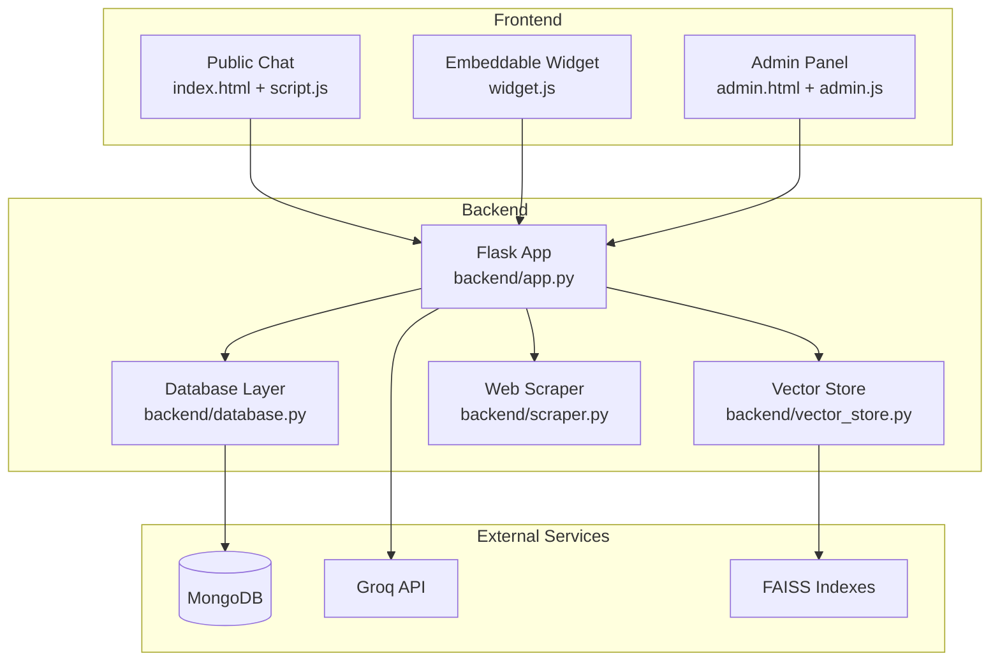
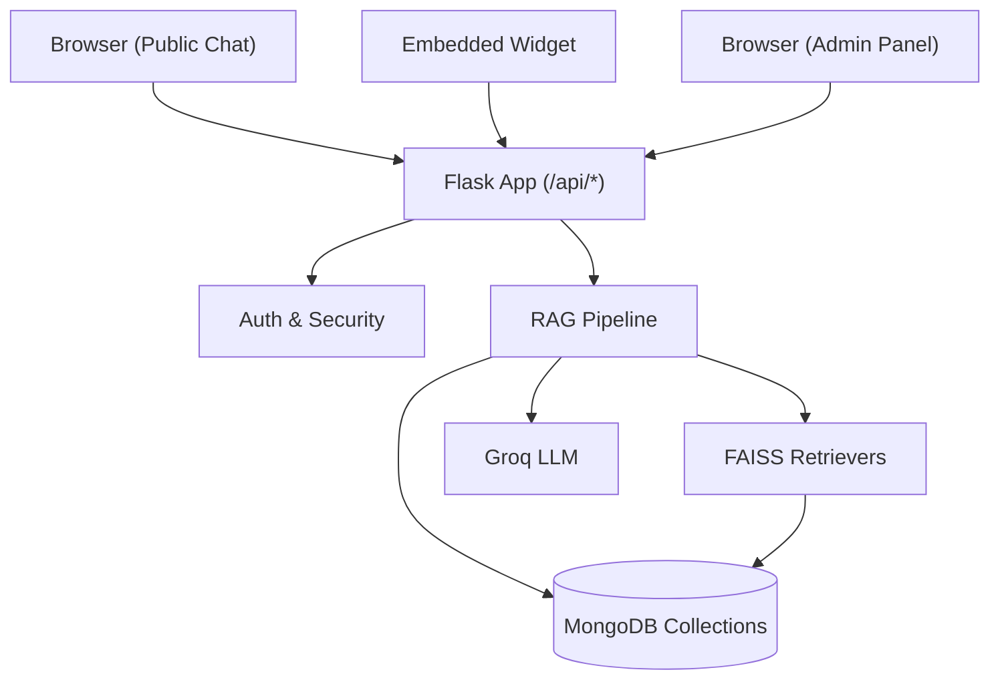
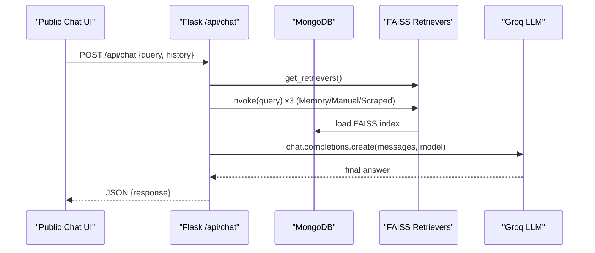
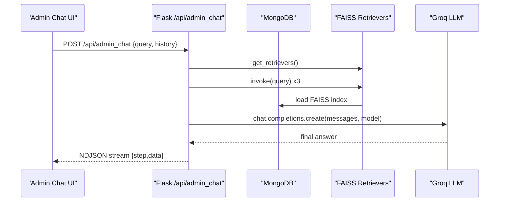
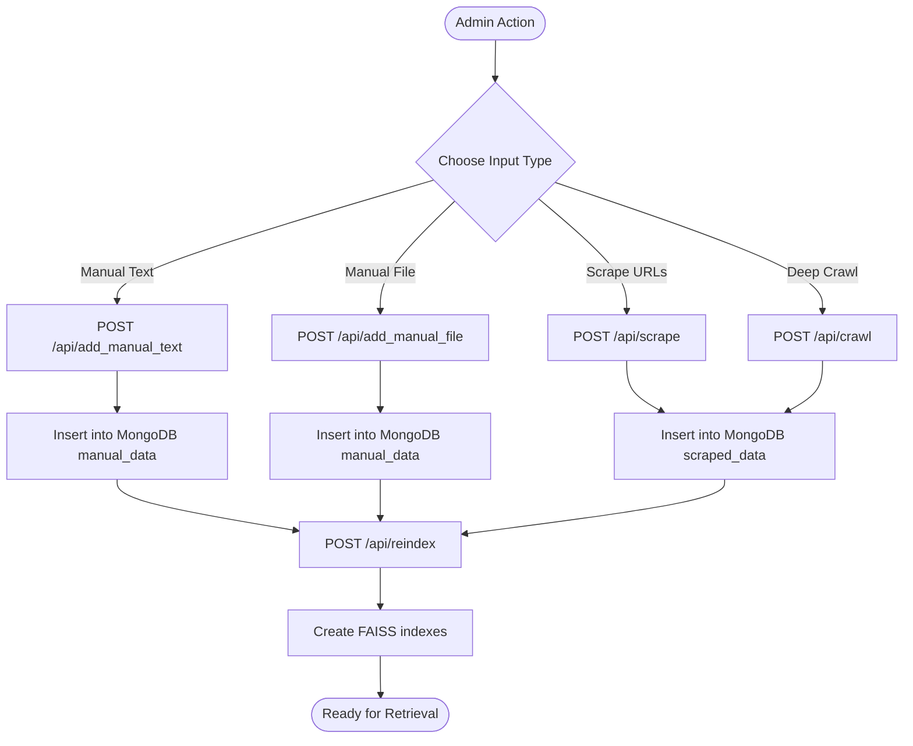
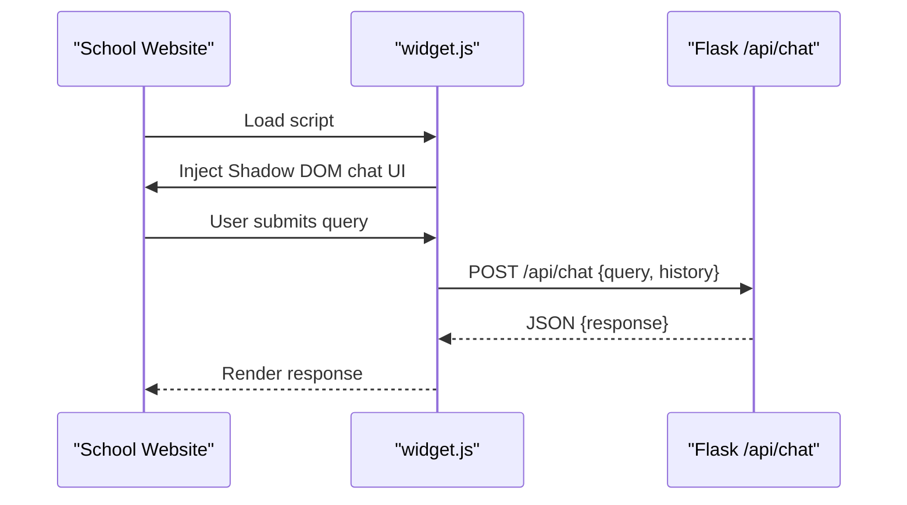
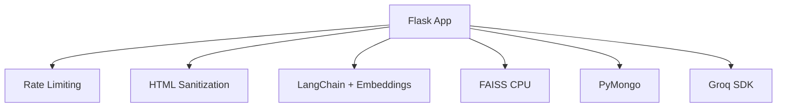
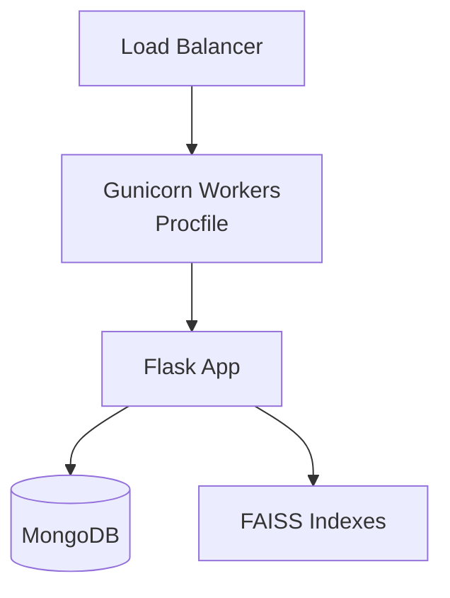
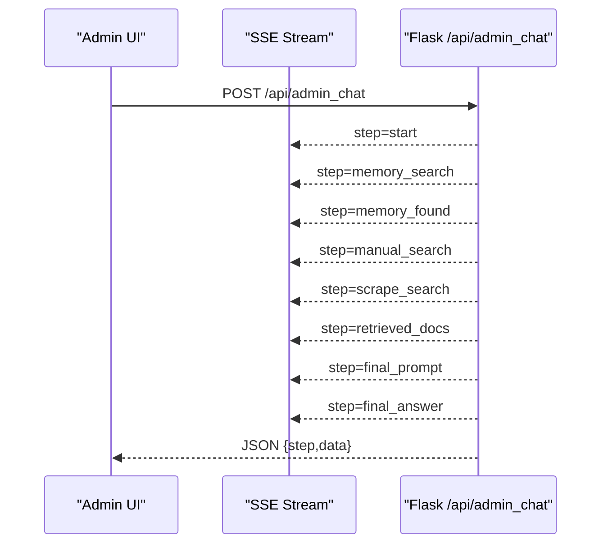

# System Architecture

<cite>
**Referenced Files in This Document**
- [backend/app.py](file://backend/app.py)
- [backend/database.py](file://backend/database.py)
- [backend/vector_store.py](file://backend/vector_store.py)
- [backend/scraper.py](file://backend/scraper.py)
- [backend/urls_to_scrape.txt](file://backend/urls_to_scrape.txt)
- [frontend/index.html](file://frontend/index.html)
- [frontend/script.js](file://frontend/script.js)
- [frontend/widget.js](file://frontend/widget.js)
- [frontend/admin.html](file://frontend/admin.html)
- [frontend/admin.js](file://frontend/admin.js)
- [frontend/admin-add-data.html](file://frontend/admin-add-data.html)
- [frontend/admin-data-bank.html](file://frontend/admin-data-bank.html)
- [frontend/admin-bugs.html](file://frontend/admin-bugs.html)
- [frontend/admin-settings.html](file://frontend/admin-settings.html)
- [API_DOCUMENTATION.md](file://API_DOCUMENTATION.md)
- [requirements.txt](file://requirements.txt)
- [Procfile](file://Procfile)
</cite>

## Table of Contents
1. [Introduction](#introduction)
2. [Project Structure](#project-structure)
3. [Core Components](#core-components)
4. [Architecture Overview](#architecture-overview)
5. [Detailed Component Analysis](#detailed-component-analysis)
6. [Dependency Analysis](#dependency-analysis)
7. [Performance Considerations](#performance-considerations)
8. [Security Architecture](#security-architecture)
9. [Deployment Topology](#deployment-topology)
10. [Real-time Streaming Architecture](#real-time-streaming-architecture)
11. [Troubleshooting Guide](#troubleshooting-guide)
12. [Conclusion](#conclusion)

## Introduction
DamayAI-Assistant is a Flask-based conversational AI system designed to serve as a digital receptionist for SMKN 2 Indramayu. The system integrates web scraping, vector search, and a large language model to provide contextual, real-time assistance through both a public chat interface and an embeddable widget. Administrators manage content through an admin panel that supports data ingestion, vector index rebuilding, and bug report tracking.

## Project Structure
The repository follows a clear separation of concerns:
- Frontend: Static HTML/CSS/JS for public chat, admin dashboards, and embeddable widget
- Backend: Flask application exposing REST APIs, managing MongoDB, FAISS vector indices, and AI orchestration
- Data pipeline: Scraping utilities, vector store management, and database abstraction

**Diagram sources**
- [backend/app.py](file://backend/app.py)
- [backend/database.py](file://backend/database.py)
- [backend/vector_store.py](file://backend/vector_store.py)
- [backend/scraper.py](file://backend/scraper.py)
- [frontend/index.html](file://frontend/index.html)
- [frontend/script.js](file://frontend/script.js)
- [frontend/widget.js](file://frontend/widget.js)
- [frontend/admin.html](file://frontend/admin.html)
- [frontend/admin.js](file://frontend/admin.js)

**Section sources**
- [backend/app.py](file://backend/app.py)
- [frontend/index.html](file://frontend/index.html)
- [frontend/admin.html](file://frontend/admin.html)

## Core Components
- Presentation Layer (Frontend)
  - Public chat interface: [frontend/index.html](file://frontend/index.html), [frontend/script.js](file://frontend/script.js)
  - Admin panel: [frontend/admin.html](file://frontend/admin.html), [frontend/admin.js](file://frontend/admin.js)
  - Embeddable widget: [frontend/widget.js](file://frontend/widget.js)
- Application Layer (Flask API)
  - Central orchestration and routing: [backend/app.py](file://backend/app.py)
  - API documentation and rate limits: [API_DOCUMENTATION.md](file://API_DOCUMENTATION.md)
- Data Access Layer
  - MongoDB abstraction: [backend/database.py](file://backend/database.py)
  - FAISS vector store management: [backend/vector_store.py](file://backend/vector_store.py)
  - Web scraping utilities: [backend/scraper.py](file://backend/scraper.py), [backend/urls_to_scrape.txt](file://backend/urls_to_scrape.txt)
- Service Layer (AI Integration)
  - Groq API integration for LLM inference: [backend/app.py](file://backend/app.py)
  - LangChain components for embeddings and retrieval: [backend/vector_store.py](file://backend/vector_store.py), [backend/database.py](file://backend/database.py)

**Section sources**
- [backend/app.py](file://backend/app.py)
- [backend/database.py](file://backend/database.py)
- [backend/vector_store.py](file://backend/vector_store.py)
- [backend/scraper.py](file://backend/scraper.py)
- [API_DOCUMENTATION.md](file://API_DOCUMENTATION.md)

## Architecture Overview
The system employs a layered architecture:
- Presentation layer handles user interactions via three channels: public chat, admin panel, and embeddable widget
- Application layer validates inputs, orchestrates retrieval-augmented generation (RAG), and enforces security policies
- Data access layer persists structured content and manages unstructured vector indices
- AI service layer integrates with Groq for LLM inference and LangChain for embeddings

**Diagram sources**
- [backend/app.py](file://backend/app.py)
- [backend/vector_store.py](file://backend/vector_store.py)
- [backend/database.py](file://backend/database.py)

## Detailed Component Analysis

### Public Chat Flow (Non-streaming)
The public chat endpoint accepts a query and chat history, performs retrieval from three FAISS indexes, constructs a grounded prompt, and returns a JSON response containing the final answer.

**Diagram sources**
- [backend/app.py](file://backend/app.py)
- [backend/vector_store.py](file://backend/vector_store.py)
- [backend/database.py](file://backend/database.py)

**Section sources**
- [backend/app.py](file://backend/app.py)
- [frontend/script.js](file://frontend/script.js)

### Admin Chat Flow (Streaming)
The admin chat endpoint streams intermediate steps (memory search, manual search, scrape search, retrieved docs, final prompt) using Server-Sent Events (SSE) with NDJSON format.

**Diagram sources**
- [backend/app.py](file://backend/app.py)
- [frontend/admin.js](file://frontend/admin.js)

**Section sources**
- [backend/app.py](file://backend/app.py)
- [frontend/admin.js](file://frontend/admin.js)

### Data Ingestion Pipeline
Administrators can add data manually (text or files) or scrape websites. Scraped content is stored in MongoDB and later indexed into FAISS for retrieval.

**Diagram sources**
- [backend/app.py](file://backend/app.py)
- [backend/database.py](file://backend/database.py)
- [backend/vector_store.py](file://backend/vector_store.py)
- [backend/scraper.py](file://backend/scraper.py)
- [backend/urls_to_scrape.txt](file://backend/urls_to_scrape.txt)

**Section sources**
- [backend/app.py](file://backend/app.py)
- [backend/database.py](file://backend/database.py)
- [backend/vector_store.py](file://backend/vector_store.py)
- [backend/scraper.py](file://backend/scraper.py)
- [API_DOCUMENTATION.md](file://API_DOCUMENTATION.md)

### Embeddable Widget Architecture
The widget is a self-contained script that injects a floating chat interface into any webpage. It communicates with the backend using the public chat endpoint and respects CORS policies for allowed origins.

**Diagram sources**
- [frontend/widget.js](file://frontend/widget.js)
- [backend/app.py](file://backend/app.py)

**Section sources**
- [frontend/widget.js](file://frontend/widget.js)
- [backend/app.py](file://backend/app.py)

## Dependency Analysis
The backend relies on several Python libraries for AI, vector search, scraping, and persistence. The Flask app coordinates these dependencies and exposes a unified API surface.

**Diagram sources**
- [requirements.txt](file://requirements.txt)
- [backend/app.py](file://backend/app.py)

**Section sources**
- [requirements.txt](file://requirements.txt)
- [backend/app.py](file://backend/app.py)

## Performance Considerations
- Vector retrieval caching: FAISS retrievers are cached at module level to avoid repeated disk loads during chat requests. See [backend/vector_store.py](file://backend/vector_store.py).
- Chunking and embeddings: Documents are split into manageable chunks and embedded using sentence-transformers model for efficient similarity search. See [backend/vector_store.py](file://backend/vector_store.py).
- Rate limiting: Built-in rate limiting protects endpoints from abuse. See [backend/app.py](file://backend/app.py) and [API_DOCUMENTATION.md](file://API_DOCUMENTATION.md).
- Streaming responses: Admin chat uses SSE to progressively render intermediate steps, improving perceived latency. See [backend/app.py](file://backend/app.py).
- Scalability: Current deployment uses Gunicorn with threading workers. Consider horizontal scaling behind a load balancer and sharding MongoDB collections for large datasets.

[No sources needed since this section provides general guidance]

## Security Architecture
- Authentication and Authorization
  - Admin endpoints require session-based authentication and CSRF protection. See [backend/app.py](file://backend/app.py).
  - CSRF tokens are generated per session and validated on state-changing requests. See [backend/app.py](file://backend/app.py).
- Input Validation and Sanitization
  - Strict input length limits and sanitization prevent abuse. See [backend/app.py](file://backend/app.py).
- Transport Security
  - Security headers are applied globally, including XSS protections and frame restrictions. See [backend/app.py](file://backend/app.py).
- CORS Policy
  - Widget embedding is permitted only from predefined origins. See [backend/app.py](file://backend/app.py).
- Audit Logging
  - Administrative actions are logged for compliance and monitoring. See [backend/app.py](file://backend/app.py).

**Section sources**
- [backend/app.py](file://backend/app.py)
- [API_DOCUMENTATION.md](file://API_DOCUMENTATION.md)

## Deployment Topology
The system is containerized and deployed using Gunicorn with threaded workers. The Procfile defines the web process.

**Diagram sources**
- [Procfile](file://Procfile)
- [backend/app.py](file://backend/app.py)

**Section sources**
- [Procfile](file://Procfile)
- [backend/app.py](file://backend/app.py)

## Real-time Streaming Architecture
The admin chat endpoint uses Server-Sent Events (SSE) with newline-delimited JSON (NDJSON) to stream intermediate steps:
- start
- memory_search/memory_found/memory_not_found
- manual_search/manual_found/manual_not_found
- scrape_search/scrape_found/scrape_not_found
- retrieved_docs
- final_prompt
- final_answer

The admin UI reads the stream and renders a "thinking" console reflecting each stage.

**Diagram sources**
- [backend/app.py](file://backend/app.py)
- [frontend/admin.js](file://frontend/admin.js)

**Section sources**
- [backend/app.py](file://backend/app.py)
- [frontend/admin.js](file://frontend/admin.js)

## Troubleshooting Guide
Common issues and resolutions:
- Rate limit errors: Reduce request frequency or upgrade rate limits. See [API_DOCUMENTATION.md](file://API_DOCUMENTATION.md).
- Missing FAISS indexes: Trigger reindexing via admin panel or API. See [backend/app.py](file://backend/app.py).
- Authentication failures: Ensure CSRF token is included for admin state-changing requests. See [backend/app.py](file://backend/app.py).
- File upload errors: Verify file size and allowed extensions. See [API_DOCUMENTATION.md](file://API_DOCUMENTATION.md).
- Vector search not returning results: Confirm FAISS indexes were built after data ingestion. See [backend/vector_store.py](file://backend/vector_store.py).

**Section sources**
- [API_DOCUMENTATION.md](file://API_DOCUMENTATION.md)
- [backend/app.py](file://backend/app.py)
- [backend/vector_store.py](file://backend/vector_store.py)

## Conclusion
DamayAI-Assistant demonstrates a robust, layered architecture integrating Flask, MongoDB, FAISS, and Groq to deliver a secure, scalable, and maintainable conversational AI platform. The system’s admin panel, public chat, and embeddable widget provide flexible deployment options, while streaming responses and caching mechanisms enhance user experience and performance.