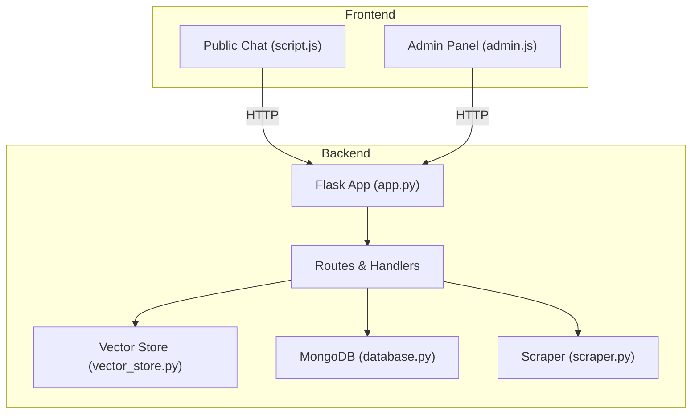
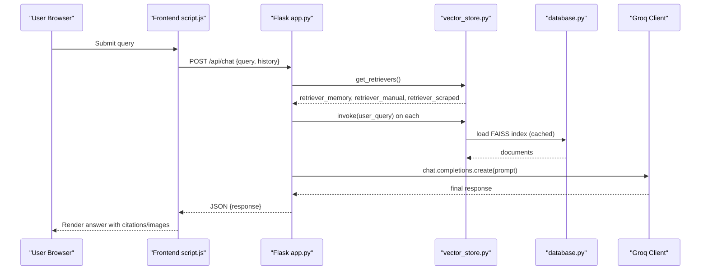
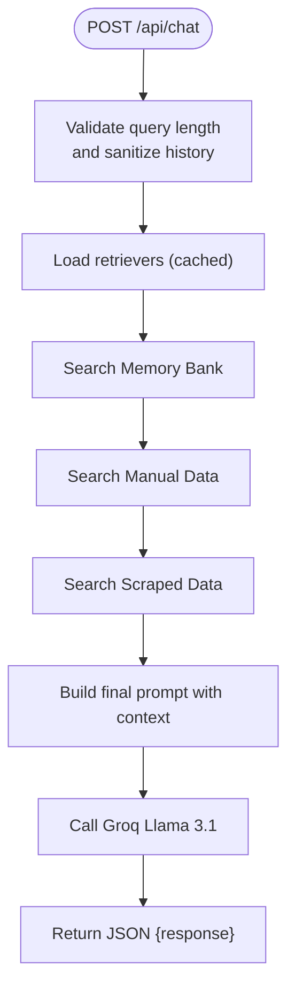
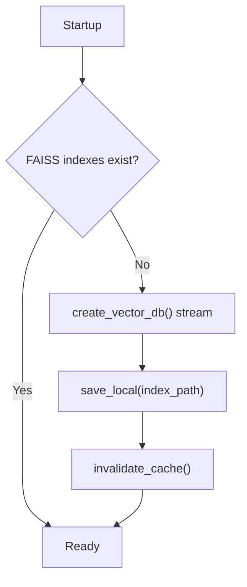
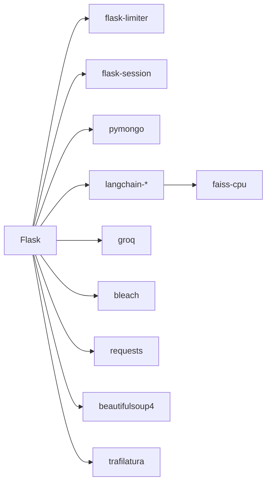

# Troubleshooting and FAQ

<cite>
**Referenced Files in This Document**
- [backend/app.py](file://backend/app.py)
- [backend/database.py](file://backend/database.py)
- [backend/vector_store.py](file://backend/vector_store.py)
- [backend/scraper.py](file://backend/scraper.py)
- [frontend/script.js](file://frontend/script.js)
- [frontend/admin.js](file://frontend/admin.js)
- [API_DOCUMENTATION.md](file://API_DOCUMENTATION.md)
- [requirements.txt](file://requirements.txt)
- [Procfile](file://Procfile)
- [.gitignore](file://.gitignore)
</cite>

## Table of Contents
1. [Introduction](#introduction)
2. [Project Structure](#project-structure)
3. [Core Components](#core-components)
4. [Architecture Overview](#architecture-overview)
5. [Detailed Component Analysis](#detailed-component-analysis)
6. [Dependency Analysis](#dependency-analysis)
7. [Performance Considerations](#performance-considerations)
8. [Troubleshooting Guide](#troubleshooting-guide)
9. [FAQ](#faq)
10. [Conclusion](#conclusion)
11. [Appendices](#appendices)

## Introduction
This document provides comprehensive troubleshooting guidance and FAQs for DamayAI-Assistant. It covers installation and environment setup, database connectivity, vector search and indexing issues, API integration problems, frontend and backend debugging, performance tuning, error interpretation, log analysis, configuration pitfalls, deployment challenges, escalation procedures, and preventive maintenance.

## Project Structure
The system comprises:
- Backend (Flask): API routes, admin controls, chat orchestration, vector retrieval, scraping, and persistence.
- Vector store: FAISS indexes for memory, manual, and scraped data.
- Database: MongoDB collections for scraped data, manual data, memory bank, and bug reports.
- Frontend: Public chat widget and admin panel with CSRF protection and streaming UI updates.
- Deployment: Gunicorn worker configuration.

**Diagram sources**
- [backend/app.py:82-83](file://backend/app.py#L82-L83)
- [backend/vector_store.py:1-115](file://backend/vector_store.py#L1-L115)
- [backend/database.py:1-260](file://backend/database.py#L1-L260)
- [backend/scraper.py:1-278](file://backend/scraper.py#L1-L278)
- [frontend/script.js:78-111](file://frontend/script.js#L78-L111)
- [frontend/admin.js:163-198](file://frontend/admin.js#L163-L198)

**Section sources**
- [backend/app.py:1-1192](file://backend/app.py#L1-L1192)
- [backend/vector_store.py:1-115](file://backend/vector_store.py#L1-L115)
- [backend/database.py:1-260](file://backend/database.py#L1-L260)
- [backend/scraper.py:1-278](file://backend/scraper.py#L1-L278)
- [frontend/script.js:1-428](file://frontend/script.js#L1-L428)
- [frontend/admin.js:1-1108](file://frontend/admin.js#L1-L1108)
- [API_DOCUMENTATION.md:1-347](file://API_DOCUMENTATION.md#L1-L347)
- [requirements.txt:1-30](file://requirements.txt#L1-L30)
- [Procfile:1-1](file://Procfile#L1-L1)

## Core Components
- Flask application with rate limiting, CSRF protection, session management, and security headers.
- MongoDB integration with unique indexes and robust CRUD helpers.
- FAISS vector store with cached retrievers and streaming reindexing.
- Web scraping pipeline with SSRF protections and content extraction.
- Public chat and admin chat endpoints with streamed responses and strict input limits.
- Admin panel with CSRF-aware API calls, live console logs, and destructive actions.

**Section sources**
- [backend/app.py:58-116](file://backend/app.py#L58-L116)
- [backend/database.py:18-49](file://backend/database.py#L18-L49)
- [backend/vector_store.py:14-115](file://backend/vector_store.py#L14-L115)
- [backend/scraper.py:12-278](file://backend/scraper.py#L12-L278)
- [API_DOCUMENTATION.md:53-78](file://API_DOCUMENTATION.md#L53-L78)

## Architecture Overview
The chat flow integrates frontend, backend, vector retrieval, and AI model:

**Diagram sources**
- [frontend/script.js:78-111](file://frontend/script.js#L78-L111)
- [backend/app.py:609-761](file://backend/app.py#L609-L761)
- [backend/vector_store.py:73-115](file://backend/vector_store.py#L73-L115)
- [backend/database.py:96-195](file://backend/database.py#L96-L195)

## Detailed Component Analysis

### Chat Flow and Streaming
- Public chat endpoint validates input, truncates history, and streams steps to the UI.
- Admin chat endpoint supports streaming NDJSON for real-time feedback.
- Retrieval order: Memory Bank → Manual Data → Scraped Data; errors are surfaced as steps.

**Diagram sources**
- [backend/app.py:432-452](file://backend/app.py#L432-L452)
- [backend/app.py:609-761](file://backend/app.py#L609-L761)
- [backend/vector_store.py:73-115](file://backend/vector_store.py#L73-L115)

**Section sources**
- [backend/app.py:432-452](file://backend/app.py#L432-L452)
- [backend/app.py:589-604](file://backend/app.py#L589-L604)
- [backend/app.py:609-761](file://backend/app.py#L609-L761)
- [frontend/script.js:78-111](file://frontend/script.js#L78-L111)

### Vector Store and Indexing
- Three FAISS indexes are maintained separately for memory, manual, and scraped data.
- Index creation is streamed and cached; retrievers are cached module-wide.
- Missing indexes trigger automatic rebuild at startup.

**Diagram sources**
- [backend/app.py:220-237](file://backend/app.py#L220-L237)
- [backend/vector_store.py:48-71](file://backend/vector_store.py#L48-L71)
- [backend/vector_store.py:17-21](file://backend/vector_store.py#L17-L21)

**Section sources**
- [backend/vector_store.py:14-115](file://backend/vector_store.py#L14-L115)
- [backend/app.py:220-237](file://backend/app.py#L220-L237)

### Database Layer and Indexes
- Unique indexes on identifiers (URL, source_name, question) improve lookup and deduplication.
- CRUD helpers return formatted documents with stringified ObjectId.

**Section sources**
- [backend/database.py:27-49](file://backend/database.py#L27-L49)
- [backend/database.py:51-57](file://backend/database.py#L51-L57)

### Admin Panel and CSRF
- Admin panel authenticates via login, stores CSRF token, and injects it on state-changing requests.
- Dangerous actions (delete FAISS, drop DB) require confirmation and refresh the UI.

**Section sources**
- [frontend/admin.js:163-198](file://frontend/admin.js#L163-L198)
- [frontend/admin.js:200-234](file://frontend/admin.js#L200-L234)
- [frontend/admin.js:352-365](file://frontend/admin.js#L352-L365)
- [backend/app.py:151-159](file://backend/app.py#L151-L159)

## Dependency Analysis
External dependencies include Flask, Flask-Limiter, Bleach, python-dotenv, LangChain ecosystem, FAISS, PyMongo, Groq SDK, and others.

**Diagram sources**
- [requirements.txt:1-30](file://requirements.txt#L1-L30)

**Section sources**
- [requirements.txt:1-30](file://requirements.txt#L1-L30)

## Performance Considerations
- Vector retrieval caching: retrievers are cached module-wide to avoid repeated FAISS loads.
- Chunk size and overlap: 1000 characters with 100 overlap for embeddings.
- Streaming responses: reduces perceived latency for long operations.
- Rate limiting: protects backend under load.
- Worker model: Gunicorn threads configured for concurrency.

Recommendations:
- Monitor FAISS index sizes; consider increasing chunk size if recall degrades.
- Ensure sufficient RAM for FAISS indices and embeddings model.
- Use SSD storage for FAISS directories to reduce IO latency.
- Scale workers based on CPU cores and traffic patterns.

**Section sources**
- [backend/vector_store.py:14-21](file://backend/vector_store.py#L14-L21)
- [backend/vector_store.py:36-38](file://backend/vector_store.py#L36-L38)
- [Procfile:1-1](file://Procfile#L1-L1)
- [API_DOCUMENTATION.md:65-71](file://API_DOCUMENTATION.md#L65-L71)

## Troubleshooting Guide

### Installation and Environment Setup
Common issues:
- Missing environment variables cause fatal failures at startup.
- Missing optional rate limiting library disables rate limiting with a warning.
- Missing FAISS indexes trigger auto-reindex at startup.

Checklist:
- Verify .env presence and required keys (MONGO_URI, GROQ_API_KEY, ADMIN_PASSWORD_HASH or ADMIN_PASSWORD, SECRET_KEY).
- Confirm Python dependencies installed via requirements.txt.
- Ensure uploads and db directories exist.

**Section sources**
- [backend/app.py:58-81](file://backend/app.py#L58-L81)
- [backend/app.py:98-115](file://backend/app.py#L98-L115)
- [backend/app.py:220-237](file://backend/app.py#L220-L237)
- [.gitignore:1-2](file://.gitignore#L1-L2)

### Database Connection Failures
Symptoms:
- Initialization failure prints error and aborts startup.
- CRUD operations fail with exceptions.

Diagnosis:
- Validate MONGO_URI correctness and network accessibility.
- Check MongoDB service status and firewall rules.
- Review unique index conflicts (duplicate keys).

Actions:
- Fix URI and credentials.
- Restart backend after DB fix.
- Inspect logs for “Failed to initialize database” and pymongo errors.

**Section sources**
- [backend/app.py:76-81](file://backend/app.py#L76-L81)
- [backend/database.py:18-25](file://backend/database.py#L18-L25)
- [backend/database.py:31-47](file://backend/database.py#L31-L47)

### Vector Search and Index Errors
Symptoms:
- Empty results despite populated data.
- Errors loading FAISS indexes.
- Slow chat responses.

Diagnosis:
- Confirm FAISS index directories exist and are readable.
- Check that create_vector_db completed successfully.
- Verify retrievers are cached and not stale.

Actions:
- Trigger reindex via admin panel or endpoint.
- Delete FAISS indexes and rebuild.
- Clear module cache if manually edited indexes.

**Section sources**
- [backend/vector_store.py:73-115](file://backend/vector_store.py#L73-L115)
- [backend/app.py:220-237](file://backend/app.py#L220-L237)
- [frontend/admin.js:337-341](file://frontend/admin.js#L337-L341)

### API Integration Issues
Symptoms:
- 401/403 unauthorized or CSRF failures.
- 429 rate limit exceeded.
- 413 payload too large.
- 500 internal server error.

Diagnosis:
- Verify admin session and CSRF token header.
- Check rate limit quotas and reset windows.
- Validate file sizes and allowed extensions.
- Inspect global error handlers.

Actions:
- Re-login to refresh CSRF token.
- Reduce request frequency.
- Compress or split uploads.
- Review audit logs and server logs.

**Section sources**
- [backend/app.py:331-352](file://backend/app.py#L331-L352)
- [backend/app.py:316-326](file://backend/app.py#L316-L326)
- [API_DOCUMENTATION.md:232-288](file://API_DOCUMENTATION.md#L232-L288)

### Frontend Debugging
Common issues:
- Chat does not render responses.
- Bug report upload fails.
- Admin panel shows unauthorized prompts.

Diagnosis:
- Network tab: inspect /api/chat and /api/report_bug responses.
- Console: check for thrown errors and 4xx/5xx statuses.
- Admin panel: confirm CSRF token injection and session storage.

Actions:
- Ensure backend is reachable and CORS allows public paths.
- Validate FormData and headers for multipart uploads.
- Clear session storage and re-authenticate.

**Section sources**
- [frontend/script.js:78-111](file://frontend/script.js#L78-L111)
- [frontend/script.js:118-147](file://frontend/script.js#L118-L147)
- [frontend/admin.js:200-234](file://frontend/admin.js#L200-L234)

### Backend Debugging
Systematic checks:
- Health endpoint confirms database connectivity.
- Audit logs record admin actions.
- Global error handlers return localized messages.

Actions:
- Call /api/health to verify readiness.
- Tail server logs and audit.log for errors.
- Temporarily disable rate limiting for testing.

**Section sources**
- [API_DOCUMENTATION.md:15-15](file://API_DOCUMENTATION.md#L15-L15)
- [backend/app.py:324-326](file://backend/app.py#L324-L326)
- [backend/app.py:35-51](file://backend/app.py#L35-L51)

### Performance Troubleshooting
Slow responses:
- Large chat histories increase prompt size and latency.
- Missing or corrupted FAISS indexes force rebuild on demand.
- Rate limiting throttles requests.

Memory issues:
- FAISS indices consume RAM proportional to document count and embedding dimension.
- Long text content increases memory pressure.

Database queries:
- Unique indexes improve performance; ensure they are present.
- Excessive writes can cause lock contention.

Actions:
- Reduce chat history length.
- Rebuild FAISS with optimized chunk sizes.
- Monitor resource usage and scale horizontally.

**Section sources**
- [backend/app.py:188-218](file://backend/app.py#L188-L218)
- [backend/vector_store.py:36-38](file://backend/vector_store.py#L36-L38)
- [backend/database.py:31-47](file://backend/database.py#L31-L47)
- [API_DOCUMENTATION.md:65-71](file://API_DOCUMENTATION.md#L65-L71)

### Error Message Interpretation and Log Analysis
- 400: Validation failures (IDs, lengths, content).
- 401: Missing or expired admin session.
- 403: CSRF validation failed; refresh token.
- 413: File exceeds 16 MB limit.
- 429: Rate limit exceeded; wait for reset.
- 500: Internal server error; check server logs.

Logs:
- Server stdout/stderr for runtime exceptions.
- audit.log for admin actions and failures.
- Frontend browser console for network errors.

**Section sources**
- [API_DOCUMENTATION.md:232-288](file://API_DOCUMENTATION.md#L232-L288)
- [backend/app.py:35-51](file://backend/app.py#L35-L51)
- [frontend/admin.js:294-300](file://frontend/admin.js#L294-L300)

### Configuration and Environment Setup Problems
- Missing SECRET_KEY causes immediate exit.
- Missing GROQ_API_KEY produces warnings; chat may fail if model calls are attempted.
- Admin credentials not configured returns 500 on login.

Fixes:
- Generate and set SECRET_KEY and ADMIN credentials.
- Set GROQ_API_KEY for model access.
- Ensure uploads and db directories exist.

**Section sources**
- [backend/app.py:58-70](file://backend/app.py#L58-L70)
- [backend/app.py:331-343](file://backend/app.py#L331-L343)

### Deployment Challenges
- Gunicorn configuration uses threaded workers; ensure adequate CPU and memory.
- Static assets served from frontend directory; verify build artifacts.
- CORS policy restricts cross-origin access to public endpoints.

Checks:
- Confirm port binding and external exposure.
- Validate Procfile and runtime environment.
- Test CORS origins for embedded widgets.

**Section sources**
- [Procfile:1-1](file://Procfile#L1-L1)
- [backend/app.py:255-292](file://backend/app.py#L255-L292)

### Escalation Procedures, Support, and Community
Escalation:
- Capture frontend console logs and backend server logs.
- Provide exact error messages, timestamps, and request payloads where possible.
- Include environment details (Python version, dependencies, OS).

Support resources:
- API documentation for endpoint behavior and limits.
- GitHub issues for reproducible bugs.

Community:
- Engage via repository issue tracker with clear reproduction steps.

**Section sources**
- [API_DOCUMENTATION.md:1-347](file://API_DOCUMENTATION.md#L1-L347)

### Preventive Maintenance and System Health Monitoring
- Periodically rebuild FAISS indexes after bulk data updates.
- Monitor database collection sizes and index utilization.
- Watch for rate limit spikes and adjust thresholds if needed.
- Back up MongoDB collections regularly.
- Rotate admin credentials and CSRF secret periodically.

**Section sources**
- [backend/vector_store.py:48-71](file://backend/vector_store.py#L48-L71)
- [backend/database.py:232-243](file://backend/database.py#L232-L243)
- [API_DOCUMENTATION.md:65-71](file://API_DOCUMENTATION.md#L65-L71)

## FAQ

### Chat Functionality
- Why does my chat response say “error”?
  - Check network tab for 4xx/5xx responses; review server logs and audit.log.
- Why is the chat slow?
  - Large histories, missing FAISS indexes, or rate limiting can delay responses.
- How do I regenerate the last response?
  - Use the regenerate button in the chat UI.

**Section sources**
- [frontend/script.js:391-421](file://frontend/script.js#L391-L421)
- [backend/app.py:432-452](file://backend/app.py#L432-L452)

### Admin Operations
- I keep getting “CSRF validation failed.”
  - Re-login to refresh CSRF token; ensure header X-CSRF-Token is set for state-changing requests.
- How do I rebuild indexes?
  - Use the admin panel’s “Rebuild Index” action or call the reindex endpoint.
- How do I delete FAISS indexes?
  - Use the admin panel’s “Delete FAISS Index” action; remember to reindex afterward.

**Section sources**
- [frontend/admin.js:200-234](file://frontend/admin.js#L200-L234)
- [frontend/admin.js:337-341](file://frontend/admin.js#L337-L341)
- [frontend/admin.js:352-365](file://frontend/admin.js#L352-L365)
- [backend/app.py:763-784](file://backend/app.py#L763-L784)

### System Limitations
- What are the input limits?
  - Max text content: 100K characters; max query: 2K; max bug description: 5K; chat history truncated to 20 messages.
- What file types are supported?
  - Documents: txt, pdf, docx, pptx; Bug reports: png, jpg, jpeg, gif, mp4, mov, avi, webm.
- What rate limits apply?
  - Login: 5/min; Chat: 10/min; Bug Report: 3/min; Scrape/Crawl/Reindex: 1/min; General: 200/hour.

**Section sources**
- [API_DOCUMENTATION.md:300-306](file://API_DOCUMENTATION.md#L300-L306)
- [API_DOCUMENTATION.md:292-297](file://API_DOCUMENTATION.md#L292-L297)
- [API_DOCUMENTATION.md:65-71](file://API_DOCUMENTATION.md#L65-L71)

### Security and Permissions
- Why am I redirected to login?
  - Session expired or unauthorized access; re-authenticate.
- Can I embed the widget on other domains?
  - Only configured origins are allowed; verify CORS settings.

**Section sources**
- [backend/app.py:255-292](file://backend/app.py#L255-L292)
- [frontend/admin.js:214-234](file://frontend/admin.js#L214-L234)

## Conclusion
This guide consolidates practical troubleshooting steps, diagnostics, and operational best practices for DamayAI-Assistant. By validating environment configuration, monitoring logs, understanding rate limits and input constraints, and following the recommended maintenance routines, most issues can be resolved quickly and efficiently.

## Appendices

### Quick Reference: Common Commands and Checks
- Health check: GET /api/health
- Rebuild indexes: POST /api/reindex
- Delete FAISS: POST /api/delete_faiss
- Drop DB: POST /api/delete_db
- Login admin: POST /api/admin/login
- Get CSRF token: GET /api/csrf-token

**Section sources**
- [API_DOCUMENTATION.md:15-15](file://API_DOCUMENTATION.md#L15-L15)
- [API_DOCUMENTATION.md:45-49](file://API_DOCUMENTATION.md#L45-L49)
- [API_DOCUMENTATION.md:16-18](file://API_DOCUMENTATION.md#L16-L18)
- [API_DOCUMENTATION.md:18-18](file://API_DOCUMENTATION.md#L18-L18)