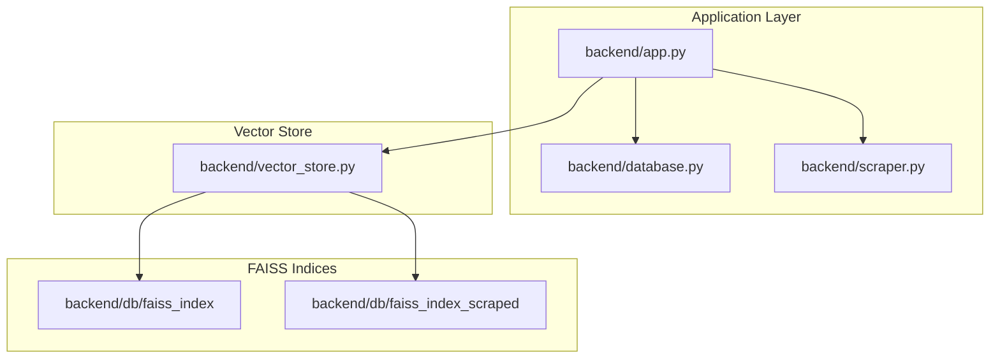
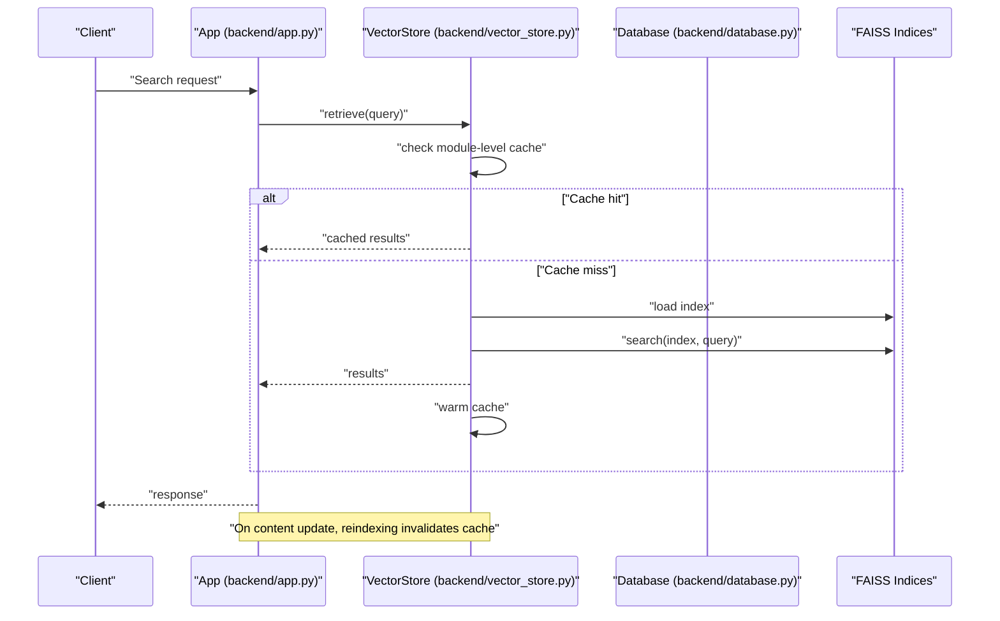
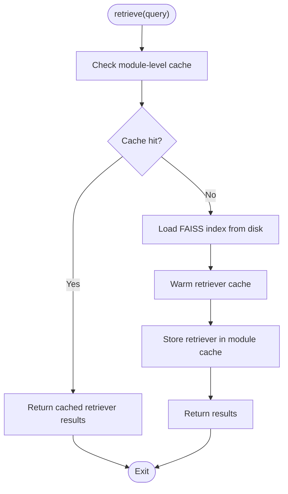
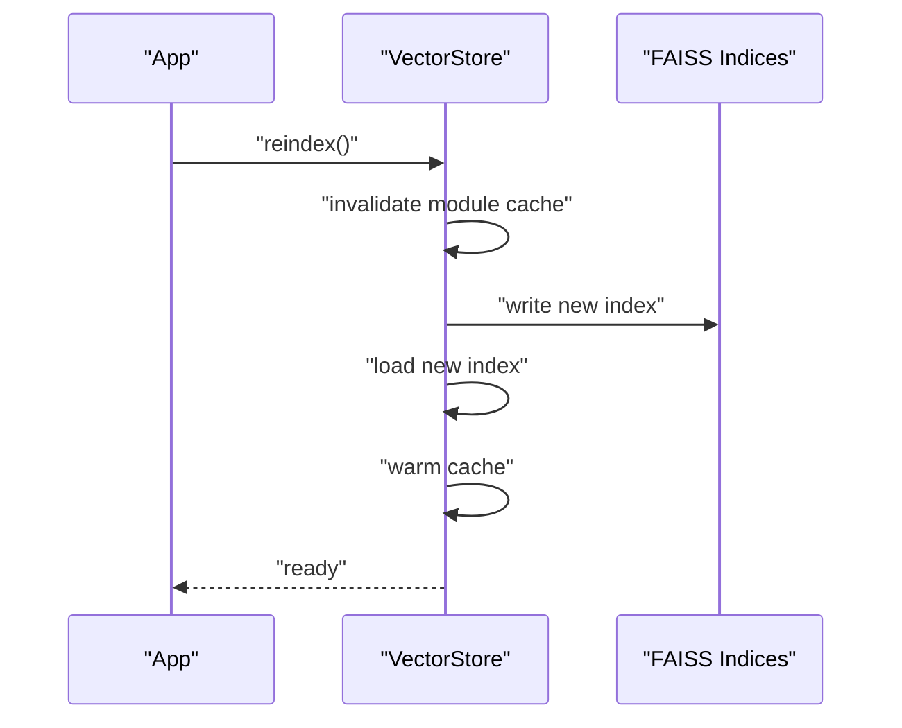
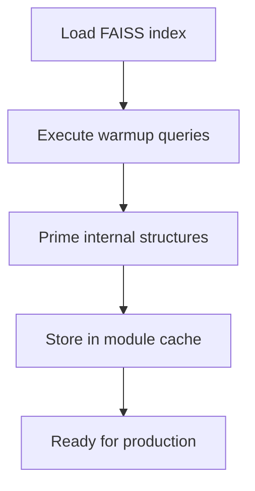
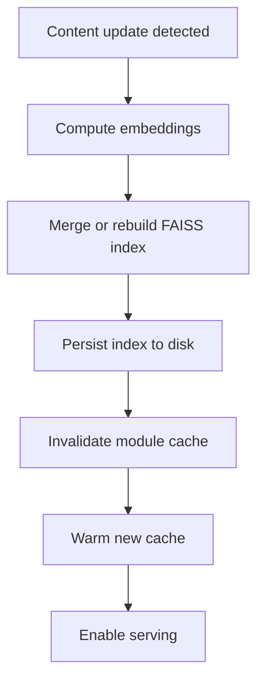
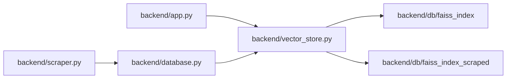

# Caching and Maintenance

<cite>
**Referenced Files in This Document**
- [backend/vector_store.py](file://backend/vector_store.py)
- [backend/app.py](file://backend/app.py)
- [backend/database.py](file://backend/database.py)
- [backend/scraper.py](file://backend/scraper.py)
- [backend/urls_to_scrape.txt](file://backend/urls_to_scrape.txt)
- [backend/db/faiss_index](file://backend/db/faiss_index)
- [backend/db/faiss_index_scraped](file://backend/db/faiss_index_scraped)
</cite>

## Table of Contents
1. [Introduction](#introduction)
2. [Project Structure](#project-structure)
3. [Core Components](#core-components)
4. [Architecture Overview](#architecture-overview)
5. [Detailed Component Analysis](#detailed-component-analysis)
6. [Dependency Analysis](#dependency-analysis)
7. [Performance Considerations](#performance-considerations)
8. [Troubleshooting Guide](#troubleshooting-guide)
9. [Conclusion](#conclusion)
10. [Appendices](#appendices)

## Introduction
This document focuses on the vector search system’s caching mechanisms and maintenance procedures. It explains how FAISS retrievers are cached at the module level, how cache invalidation is handled during reindexing, and how cache warming affects performance. It also documents reindexing procedures triggered by content updates, maintenance tasks such as index cleanup and health checks, and practical troubleshooting steps for common caching issues like memory leaks and stale caches. Finally, it provides guidelines for cache tuning and optimization tailored to system load and content volume.

## Project Structure
The vector search system centers around a FAISS-backed vector store and integrates with a web application and a content scraping pipeline. The FAISS indices are persisted under dedicated directories, while the application orchestrates retrieval, indexing, and maintenance routines.

**Diagram sources**
- [backend/app.py](file://backend/app.py)
- [backend/vector_store.py](file://backend/vector_store.py)
- [backend/database.py](file://backend/database.py)
- [backend/scraper.py](file://backend/scraper.py)
- [backend/db/faiss_index](file://backend/db/faiss_index)
- [backend/db/faiss_index_scraped](file://backend/db/faiss_index_scraped)

**Section sources**
- [backend/vector_store.py](file://backend/vector_store.py)
- [backend/app.py](file://backend/app.py)
- [backend/database.py](file://backend/database.py)
- [backend/scraper.py](file://backend/scraper.py)
- [backend/db/faiss_index](file://backend/db/faiss_index)
- [backend/db/faiss_index_scraped](file://backend/db/faiss_index_scraped)

## Core Components
- Vector Store: Implements FAISS-based retrieval and indexing, including module-level caching for retrievers and index persistence.
- Application Orchestrator: Exposes endpoints and triggers maintenance and reindexing workflows.
- Database Layer: Manages metadata and content lifecycle linked to vector indices.
- Scraper: Provides content ingestion that may trigger reindexing and cache invalidation.

Key responsibilities:
- FAISS retriever caching and warming
- Index persistence and cleanup
- Reindexing on content updates
- Health checks and monitoring hooks
- Cache invalidation during reindexing

**Section sources**
- [backend/vector_store.py](file://backend/vector_store.py)
- [backend/app.py](file://backend/app.py)
- [backend/database.py](file://backend/database.py)
- [backend/scraper.py](file://backend/scraper.py)

## Architecture Overview
The system follows a layered architecture:
- Web application layer handles requests and coordinates maintenance.
- Vector store layer encapsulates FAISS operations and caching.
- Data layer manages content and metadata.
- Content ingestion layer supplies new data that may require reindexing.

**Diagram sources**
- [backend/app.py](file://backend/app.py)
- [backend/vector_store.py](file://backend/vector_store.py)
- [backend/database.py](file://backend/database.py)

## Detailed Component Analysis

### FAISS Retriever Module-Level Cache
- Purpose: Reduce repeated index loading and warm-up overhead by caching retrievers at the module level.
- Behavior:
  - On first use, the retriever loads the FAISS index and stores it in a module-scoped cache.
  - Subsequent retrievals reuse the cached retriever until invalidated.
  - Cache warming occurs after successful index loads to precompute internal structures.

**Diagram sources**
- [backend/vector_store.py](file://backend/vector_store.py)

**Section sources**
- [backend/vector_store.py](file://backend/vector_store.py)

### Cache Invalidation During Reindexing
- Trigger: Content updates that change embeddings or index structure.
- Workflow:
  - Disable serving on the affected index.
  - Perform reindexing and persist new index.
  - Invalidate module-level cache for the affected retriever.
  - Optionally warm the new cache before re-enabling serving.

**Diagram sources**
- [backend/vector_store.py](file://backend/vector_store.py)

**Section sources**
- [backend/vector_store.py](file://backend/vector_store.py)

### Cache Warming Process
- Objective: Preload and prepare retrievers to minimize latency on first queries after cold starts or reindexing.
- Steps:
  - Load the FAISS index.
  - Execute a small set of representative queries to prime internal buffers.
  - Persist warmed state in the module cache.

**Diagram sources**
- [backend/vector_store.py](file://backend/vector_store.py)

**Section sources**
- [backend/vector_store.py](file://backend/vector_store.py)

### Performance Impact: Cached vs. Uncached Retrievers
- Cached:
  - Lower latency for repeated queries.
  - Reduced disk I/O and index load overhead.
  - Slight memory overhead for cached retrievers.
- Uncached:
  - Higher latency due to repeated index loads.
  - Lower memory footprint but increased CPU/disk usage.

Recommendations:
- Enable caching for production workloads.
- Monitor latency and memory metrics to tune cache size and warmup queries.

**Section sources**
- [backend/vector_store.py](file://backend/vector_store.py)

### Reindexing Procedures Triggered by Content Updates
- Trigger conditions:
  - New content ingestion.
  - Changes to embedding model or preprocessing.
  - Periodic refresh policies.
- Procedure:
  - Compute embeddings for new or updated content.
  - Merge into FAISS index or build a new index.
  - Persist to disk.
  - Invalidate and warm the new retriever cache.
  - Update metadata and enable serving.

**Diagram sources**
- [backend/vector_store.py](file://backend/vector_store.py)
- [backend/database.py](file://backend/database.py)
- [backend/scraper.py](file://backend/scraper.py)

**Section sources**
- [backend/vector_store.py](file://backend/vector_store.py)
- [backend/database.py](file://backend/database.py)
- [backend/scraper.py](file://backend/scraper.py)

### Maintenance Tasks
- Index Cleanup:
  - Remove outdated or corrupted index files.
  - Validate index integrity periodically.
- Performance Monitoring:
  - Track retrieval latency, cache hit rate, and memory usage.
  - Alert on anomalies such as cache misses or slow queries.
- Health Checks:
  - Verify FAISS index availability and retriever readiness.
  - Confirm persistence paths are writable and disk space is sufficient.

**Section sources**
- [backend/vector_store.py](file://backend/vector_store.py)
- [backend/database.py](file://backend/database.py)

## Dependency Analysis
The vector store depends on FAISS indices stored on disk and interacts with the application and database layers. The scraper feeds new content that may trigger reindexing.

**Diagram sources**
- [backend/app.py](file://backend/app.py)
- [backend/vector_store.py](file://backend/vector_store.py)
- [backend/database.py](file://backend/database.py)
- [backend/scraper.py](file://backend/scraper.py)
- [backend/db/faiss_index](file://backend/db/faiss_index)
- [backend/db/faiss_index_scraped](file://backend/db/faiss_index_scraped)

**Section sources**
- [backend/vector_store.py](file://backend/vector_store.py)
- [backend/app.py](file://backend/app.py)
- [backend/database.py](file://backend/database.py)
- [backend/scraper.py](file://backend/scraper.py)
- [backend/db/faiss_index](file://backend/db/faiss_index)
- [backend/db/faiss_index_scraped](file://backend/db/faiss_index_scraped)

## Performance Considerations
- Cache hit rate: Measure and target high hit rates to reduce index load frequency.
- Memory footprint: Tune cache size and warmup queries to balance latency and memory usage.
- Disk I/O: Persist indices efficiently and avoid frequent rebuilds.
- Concurrency: Ensure thread-safe cache access and safe invalidation during reindexing.
- Monitoring: Continuously track latency percentiles, cache metrics, and resource utilization.

[No sources needed since this section provides general guidance]

## Troubleshooting Guide
Common issues and resolutions:
- Stale Cache:
  - Symptom: Out-of-date results after content updates.
  - Action: Invalidate module-level cache and warm the new index.
- Memory Leaks:
  - Symptom: Gradual memory growth over time.
  - Action: Review retriever lifecycle and ensure proper cleanup; monitor memory trends.
- Slow Queries:
  - Symptom: Increased latency post-reindexing.
  - Action: Increase warmup queries and verify cache readiness; check disk I/O.
- Index Corruption:
  - Symptom: Failures loading FAISS index.
  - Action: Clean up corrupted files and rebuild index; validate integrity.
- Health Alerts:
  - Symptom: Persistent cache misses or timeouts.
  - Action: Investigate disk space, permissions, and persistence paths; scale resources if needed.

**Section sources**
- [backend/vector_store.py](file://backend/vector_store.py)
- [backend/database.py](file://backend/database.py)

## Conclusion
The vector search system employs a module-level FAISS retriever cache to improve latency and reduce index load overhead. Proper cache invalidation during reindexing ensures correctness, while cache warming minimizes cold-start latency. Robust maintenance practices—cleanup, monitoring, and health checks—keep the system reliable. Tuning cache size, warmup queries, and reindexing cadence according to workload and content volume yields optimal performance.

[No sources needed since this section summarizes without analyzing specific files]

## Appendices
- Persistence Paths:
  - FAISS indices are stored under dedicated directories for primary and scraped content.
- Reindex Triggers:
  - Content updates and periodic refreshes initiate reindexing workflows.

**Section sources**
- [backend/db/faiss_index](file://backend/db/faiss_index)
- [backend/db/faiss_index_scraped](file://backend/db/faiss_index_scraped)
- [backend/scraper.py](file://backend/scraper.py)
- [backend/urls_to_scrape.txt](file://backend/urls_to_scrape.txt)