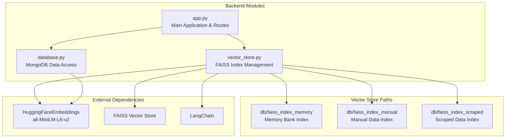
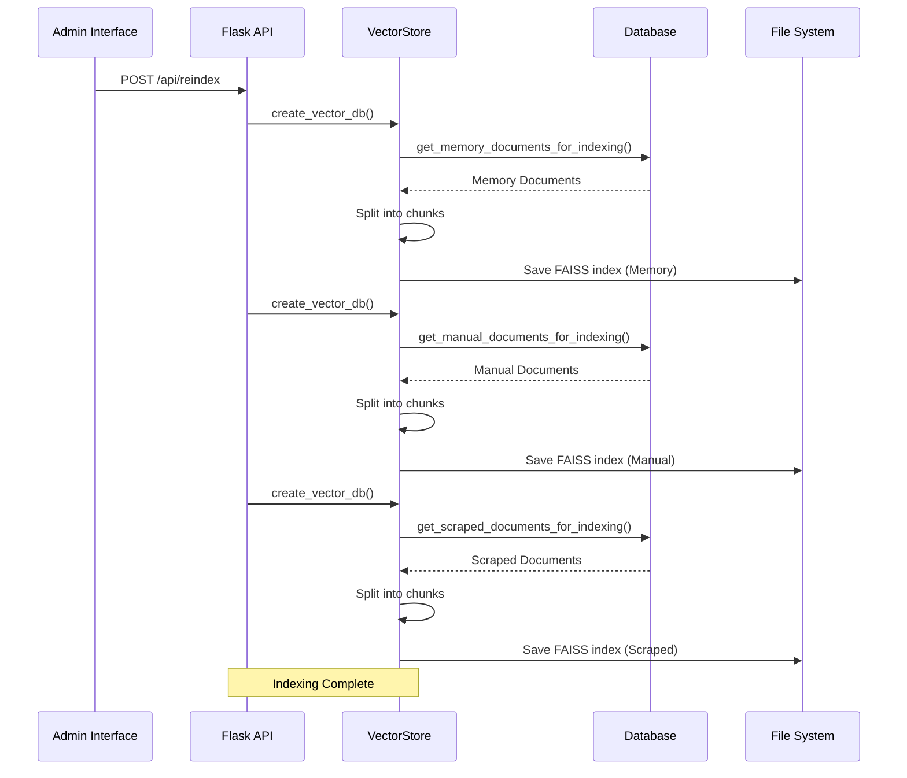
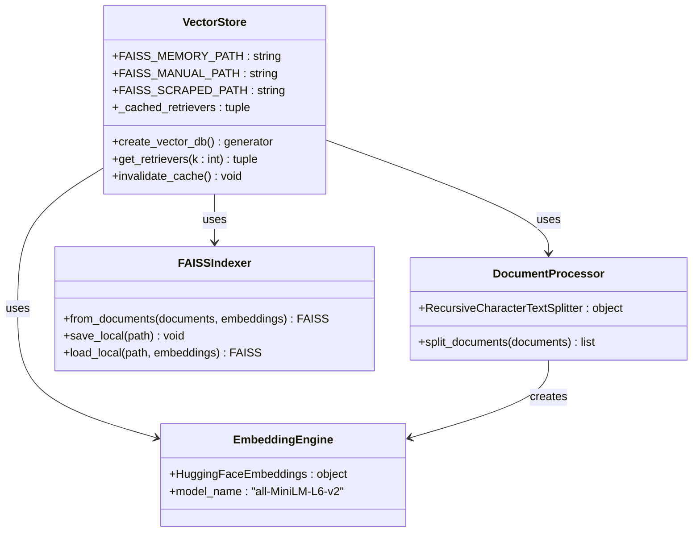
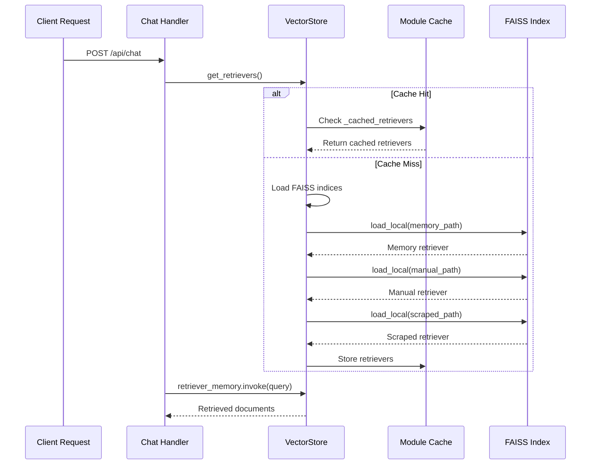
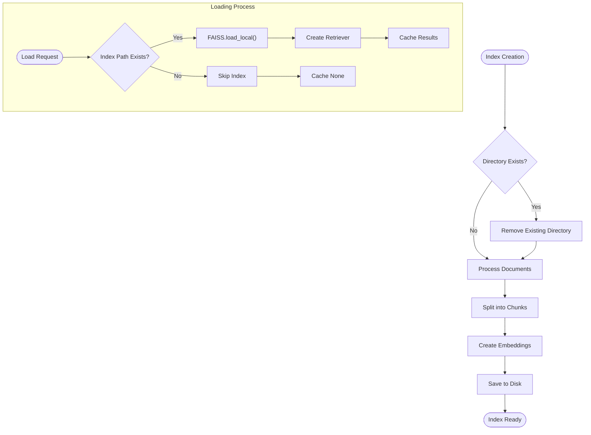
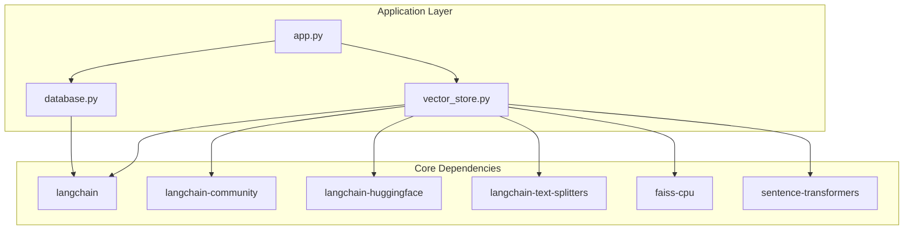

# FAISS Implementation

<cite>
**Referenced Files in This Document**
- [vector_store.py](file://backend/vector_store.py)
- [app.py](file://backend/app.py)
- [database.py](file://backend/database.py)
- [API_DOCUMENTATION.md](file://API_DOCUMENTATION.md)
- [requirements.txt](file://requirements.txt)
</cite>

## Table of Contents
1. [Introduction](#introduction)
2. [Project Structure](#project-structure)
3. [Core Components](#core-components)
4. [Architecture Overview](#architecture-overview)
5. [Detailed Component Analysis](#detailed-component-analysis)
6. [Dependency Analysis](#dependency-analysis)
7. [Performance Considerations](#performance-considerations)
8. [Troubleshooting Guide](#troubleshooting-guide)
9. [Conclusion](#conclusion)

## Introduction

The DamayAI-Assistant project implements a sophisticated FAISS (Facebook AI Similarity Search) vector database system that enables intelligent document retrieval and semantic search capabilities. This implementation provides three distinct vector stores for different data sources: Memory Bank, Manual Data, and Scraped Data, each optimized for specific use cases within the educational institution digital receptionist application.

The system leverages HuggingFaceEmbeddings with the 'all-MiniLM-L6-v2' model to create dense vector representations of documents, enabling semantic similarity search without requiring external APIs. The implementation includes robust caching mechanisms, error handling, and performance optimizations designed for production deployment.

## Project Structure

The FAISS implementation is organized across several key modules within the backend directory:

**Diagram sources**
- [vector_store.py:1-115](file://backend/vector_store.py#L1-L115)
- [app.py:120-122](file://backend/app.py#L120-L122)

**Section sources**
- [vector_store.py:8-12](file://backend/vector_store.py#L8-L12)
- [app.py:120-122](file://backend/app.py#L120-L122)

## Core Components

### FAISS Index Configuration

The system maintains three separate FAISS indices, each serving a specific data domain:

| Index Type | Path | Purpose | Documents |
|------------|------|---------|-----------|
| Memory Bank | `db/faiss_index_memory` | Persistent conversation memory | Question-answer pairs from user interactions |
| Manual Data | `db/faiss_index_manual` | Admin-uploaded content | Text files, PDFs, DOCX, PPTX documents |
| Scraped Data | `db/faiss_index_scraped` | Web content extraction | Website content from scraping operations |

Each index follows the same creation pattern but processes different document types with appropriate metadata preservation.

### Embedding Model Configuration

The implementation uses HuggingFaceEmbeddings with the 'all-MiniLM-L6-v2' model, which provides efficient sentence embeddings suitable for semantic similarity search. This choice offers a balance between embedding quality and computational efficiency, making it ideal for real-time applications.

**Section sources**
- [vector_store.py:9-12](file://backend/vector_store.py#L9-L12)
- [vector_store.py:51](file://backend/vector_store.py#L51)
- [vector_store.py:85](file://backend/vector_store.py#L85)

## Architecture Overview

The FAISS implementation follows a modular architecture with clear separation of concerns:

**Diagram sources**
- [vector_store.py:48-70](file://backend/vector_store.py#L48-L70)
- [database.py:96-104](file://backend/database.py#L96-L104)
- [database.py:140-148](file://backend/database.py#L140-L148)
- [database.py:186-195](file://backend/database.py#L186-L195)

## Detailed Component Analysis

### Vector Store Management

The `vector_store.py` module serves as the central orchestrator for FAISS index operations:

**Diagram sources**
- [vector_store.py:1-115](file://backend/vector_store.py#L1-L115)

#### Index Creation Process

The index creation process follows a systematic three-stage pipeline:

1. **Document Retrieval**: Fetches documents from MongoDB collections using specialized getters
2. **Text Chunking**: Splits documents into manageable chunks using RecursiveCharacterTextSplitter
3. **Vector Embedding**: Generates embeddings and saves FAISS indices to disk

**Section sources**
- [vector_store.py:23-47](file://backend/vector_store.py#L23-L47)
- [vector_store.py:48-70](file://backend/vector_store.py#L48-L70)

### Retriever Pattern Implementation

The retriever pattern provides efficient query processing with built-in caching:

**Diagram sources**
- [vector_store.py:73-115](file://backend/vector_store.py#L73-L115)
- [app.py:616](file://backend/app.py#L616)

**Section sources**
- [vector_store.py:73-115](file://backend/vector_store.py#L73-L115)
- [app.py:616](file://backend/app.py#L616)

### Search Parameter Configuration

The retriever configuration includes configurable search parameters:

| Parameter | Value | Purpose |
|-----------|-------|---------|
| `k` | 2 | Number of top-k results to retrieve |
| `chunk_size` | 1000 | Characters per document chunk |
| `chunk_overlap` | 100 | Overlap between consecutive chunks |

These parameters balance search accuracy with performance, ensuring relevant results while maintaining responsive query times.

**Section sources**
- [vector_store.py:36](file://backend/vector_store.py#L36)
- [vector_store.py:93](file://backend/vector_store.py#L93)

### Index Persistence and Serialization

FAISS indices are persisted locally using the `save_local()` and `load_local()` methods:

**Diagram sources**
- [vector_store.py:25-46](file://backend/vector_store.py#L25-L46)
- [vector_store.py:90-114](file://backend/vector_store.py#L90-L114)

**Section sources**
- [vector_store.py:42-44](file://backend/vector_store.py#L42-L44)
- [vector_store.py:92](file://backend/vector_store.py#L92)

## Dependency Analysis

The FAISS implementation relies on several key dependencies:

**Diagram sources**
- [requirements.txt:1-30](file://requirements.txt#L1-L30)
- [vector_store.py:1-6](file://backend/vector_store.py#L1-L6)

The dependency graph reveals a clean separation between vector store operations and application logic, with LangChain providing the abstraction layer for embedding generation and FAISS handling.

**Section sources**
- [requirements.txt:1-30](file://requirements.txt#L1-L30)
- [vector_store.py:1-6](file://backend/vector_store.py#L1-L6)

## Performance Considerations

### Caching Strategy

The implementation employs a module-level caching mechanism to optimize performance:

- **Cache Scope**: Global module-level cache prevents repeated FAISS loading
- **Cache Invalidation**: `invalidate_cache()` function clears cache after reindexing
- **Lazy Loading**: FAISS indices are loaded only when first accessed
- **Memory Efficiency**: Cached retrievers remain in memory for subsequent requests

### Memory Management

Several optimizations address memory consumption:

- **Chunk-based Processing**: Documents are split into 1000-character chunks with 100-character overlap
- **Selective Loading**: Only existing indices are loaded during startup
- **Graceful Degradation**: Missing indices are handled without application failure
- **Resource Cleanup**: Proper cleanup of temporary files and directories

### Error Handling and Recovery

The system implements comprehensive error handling:

- **Index Recovery**: Automatic reindexing on startup if indices are missing
- **Partial Failures**: Individual index failures don't prevent system operation
- **Deserialization Safety**: Controlled deserialization with explicit warnings
- **Logging**: Comprehensive logging for debugging and monitoring

**Section sources**
- [vector_store.py:14-20](file://backend/vector_store.py#L14-L20)
- [vector_store.py:22-47](file://backend/vector_store.py#L22-L47)
- [app.py:220-237](file://backend/app.py#L220-L237)

## Troubleshooting Guide

### Common Issues and Solutions

| Issue | Symptoms | Solution |
|-------|----------|----------|
| Missing Indices | Startup logs show reindexing | Run `/api/reindex` endpoint |
| Slow Query Performance | High latency in chat responses | Check chunk size and k parameter |
| Memory Exhaustion | Out of memory errors | Reduce batch size or increase chunk overlap |
| Deserialization Errors | Warning about dangerous deserialization | Verify index file integrity |
| Permission Denied | Cannot write to db directory | Check file permissions for db folder |

### Debugging Procedures

1. **Verify Index Existence**: Check if `db/faiss_index_*` directories exist
2. **Monitor Logs**: Review application logs for FAISS loading warnings
3. **Test Connectivity**: Verify MongoDB connection for document retrieval
4. **Validate Embeddings**: Test embedding model availability
5. **Check File Permissions**: Ensure write access to database directory

### Recovery Mechanisms

The system provides multiple recovery pathways:

- **Automatic Reindex**: Startup detection of missing indices triggers rebuild
- **Manual Rebuild**: Admin endpoint `/api/reindex` allows controlled rebuilding
- **Cache Clear**: `invalidate_cache()` forces fresh retriever loading
- **Index Deletion**: `/api/delete_faiss` removes corrupted indices

**Section sources**
- [app.py:763-784](file://backend/app.py#L763-L784)
- [vector_store.py:17-20](file://backend/vector_store.py#L17-L20)

## Conclusion

The FAISS implementation in DamayAI-Assistant demonstrates a production-ready approach to vector database management with several key strengths:

**Architectural Excellence**: Clean separation of concerns with dedicated modules for indexing, retrieval, and caching ensures maintainability and scalability.

**Performance Optimization**: Strategic caching, chunk-based processing, and selective loading provide efficient resource utilization while maintaining responsiveness.

**Robust Error Handling**: Comprehensive error handling with graceful degradation ensures system stability even under adverse conditions.

**Administrative Control**: Full administrative interface for index management, including reindexing, deletion, and monitoring capabilities.

The implementation successfully balances performance, reliability, and ease of maintenance, making it suitable for production deployment in educational and enterprise environments. The modular design facilitates future enhancements such as distributed indexing, advanced filtering, and integration with other vector databases.