# Knowledge Base Management

<cite>
**Referenced Files in This Document**
- [app.py](file://backend/app.py)
- [database.py](file://backend/database.py)
- [vector_store.py](file://backend/vector_store.py)
- [scraper.py](file://backend/scraper.py)
- [urls_to_scrape.txt](file://backend/urls_to_scrape.txt)
- [admin.html](file://frontend/admin.html)
- [admin.js](file://frontend/admin.js)
- [requirements.txt](file://requirements.txt)
</cite>

## Table of Contents
1. [Introduction](#introduction)
2. [Project Structure](#project-structure)
3. [Core Components](#core-components)
4. [Architecture Overview](#architecture-overview)
5. [Detailed Component Analysis](#detailed-component-analysis)
6. [Dependency Analysis](#dependency-analysis)
7. [Performance Considerations](#performance-considerations)
8. [Troubleshooting Guide](#troubleshooting-guide)
9. [Conclusion](#conclusion)
10. [Appendices](#appendices)

## Introduction
This document describes the three-tier knowledge base management system designed to support a conversational assistant for SMKN 2 Indramayu. The system integrates three data sources:
- Memory Bank: Predefined Q&A curated by administrators
- Manual Data: User-generated content uploaded as text or documents
- Scraped Data: Automatically collected content from official school websites

It covers the document collection process, data ingestion workflows, content validation mechanisms, MongoDB integration, document chunking strategies, FAISS indexing pipeline, content lifecycle management, update procedures, and data quality assurance processes.

## Project Structure
The system is organized into a backend API (Flask), a vector store and indexing layer, a web scraper, and a minimal admin frontend.

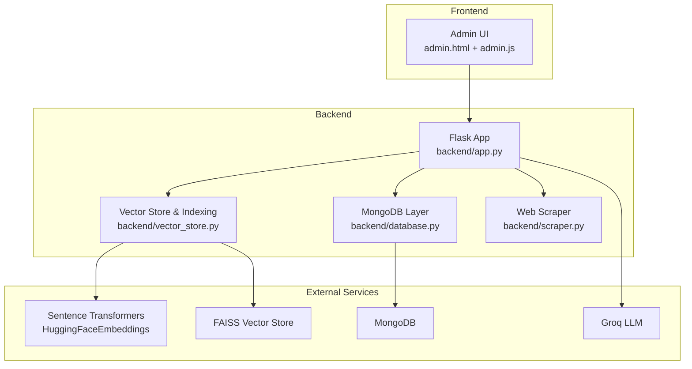

**Diagram sources**
- [app.py:1-120](file://backend/app.py#L1-L120)
- [database.py:1-50](file://backend/database.py#L1-L50)
- [vector_store.py:1-115](file://backend/vector_store.py#L1-L115)
- [scraper.py:1-60](file://backend/scraper.py#L1-L60)

**Section sources**
- [app.py:1-120](file://backend/app.py#L1-L120)
- [admin.html:1-164](file://frontend/admin.html#L1-L164)
- [admin.js:1-120](file://frontend/admin.js#L1-L120)

## Core Components
- Flask API: Provides admin endpoints for ingestion, retrieval, and lifecycle actions; orchestrates chat generation and FAISS index management.
- MongoDB: Stores raw content and metadata for Memory Bank, Manual Data, and Scraped Data.
- Vector Store: Implements FAISS indices per data tier with chunking and embeddings.
- Web Scraper: Extracts content and representative images from official school URLs with safety checks.
- Admin UI: Enables administrators to trigger scraping, rebuild indexes, manage content, and monitor status.

**Section sources**
- [app.py:432-761](file://backend/app.py#L432-L761)
- [database.py:59-195](file://backend/database.py#L59-L195)
- [vector_store.py:23-115](file://backend/vector_store.py#L23-L115)
- [scraper.py:12-147](file://backend/scraper.py#L12-L147)
- [admin.html:99-145](file://frontend/admin.html#L99-L145)

## Architecture Overview
The system follows a three-tier ingestion and retrieval architecture:

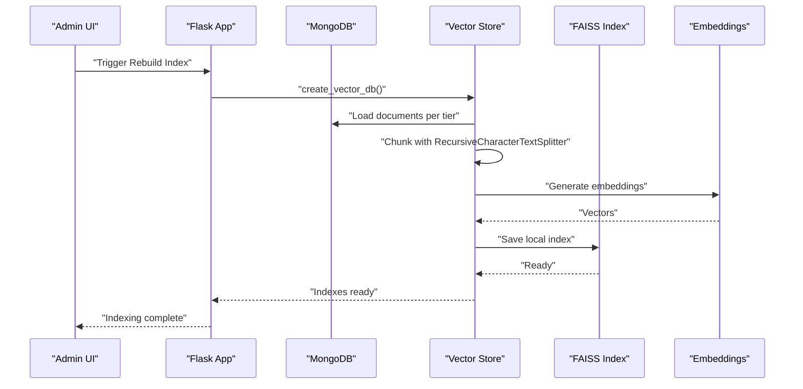

**Diagram sources**
- [app.py:220-237](file://backend/app.py#L220-L237)
- [vector_store.py:48-71](file://backend/vector_store.py#L48-L71)
- [database.py:96-195](file://backend/database.py#L96-L195)

## Detailed Component Analysis

### Memory Bank (Predefined Q&A)
- Purpose: Curated knowledge stored as question-answer pairs.
- Storage: MongoDB collection with unique constraint on question.
- Ingestion: Admin endpoint accepts question-answer pairs and upserts into the collection.
- Retrieval: During chat, the Memory Bank retriever is invoked to find relevant Q&A pairs.

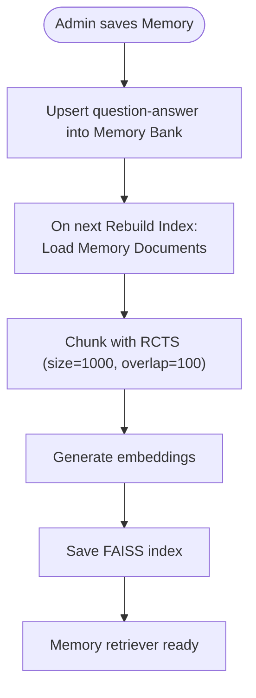

**Diagram sources**
- [app.py:568-587](file://backend/app.py#L568-L587)
- [database.py:108-148](file://backend/database.py#L108-L148)
- [vector_store.py:23-47](file://backend/vector_store.py#L23-L47)

**Section sources**
- [app.py:568-587](file://backend/app.py#L568-L587)
- [database.py:106-148](file://backend/database.py#L106-L148)
- [vector_store.py:23-47](file://backend/vector_store.py#L23-L47)

### Manual Data (User-Generated Content)
- Purpose: Structured text or file uploads ingested by administrators.
- Storage: MongoDB collection with unique constraint on source_name; optional file_path.
- Ingestion: Admin endpoints accept either raw text or file uploads (txt, pdf, docx, pptx). Extracted text is validated and upserted.
- Retrieval: Loaded into FAISS index during Rebuild Index.

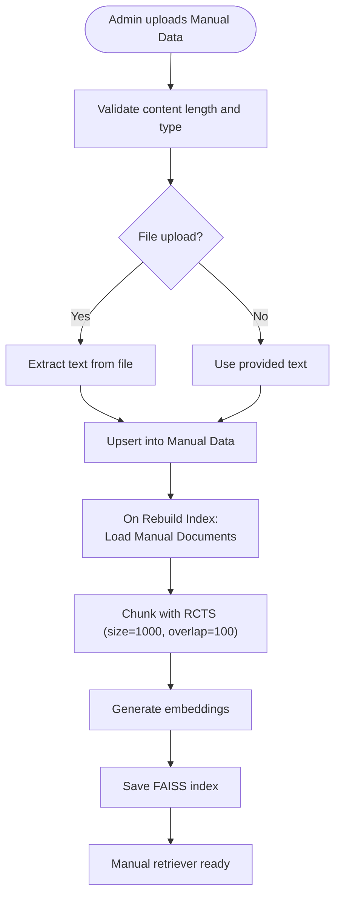

**Diagram sources**
- [app.py:498-566](file://backend/app.py#L498-L566)
- [database.py:61-104](file://backend/database.py#L61-L104)
- [vector_store.py:23-47](file://backend/vector_store.py#L23-L47)

**Section sources**
- [app.py:498-566](file://backend/app.py#L498-L566)
- [database.py:59-104](file://backend/database.py#L59-L104)
- [vector_store.py:23-47](file://backend/vector_store.py#L23-L47)

### Scraped Data (Automatically Collected Content)
- Purpose: Official school website content automatically collected and indexed.
- Ingestion: Two modes:
  - Batch from a text file of URLs
  - Deep crawling from a base URL with internal link discovery
- Validation: Safety checks for domain/IP, minimum content length, and image selection.
- Storage: Upsert into MongoDB with unique constraint on URL; stores title, content, and a single representative image URL.
- Retrieval: Loaded into FAISS index during Rebuild Index.

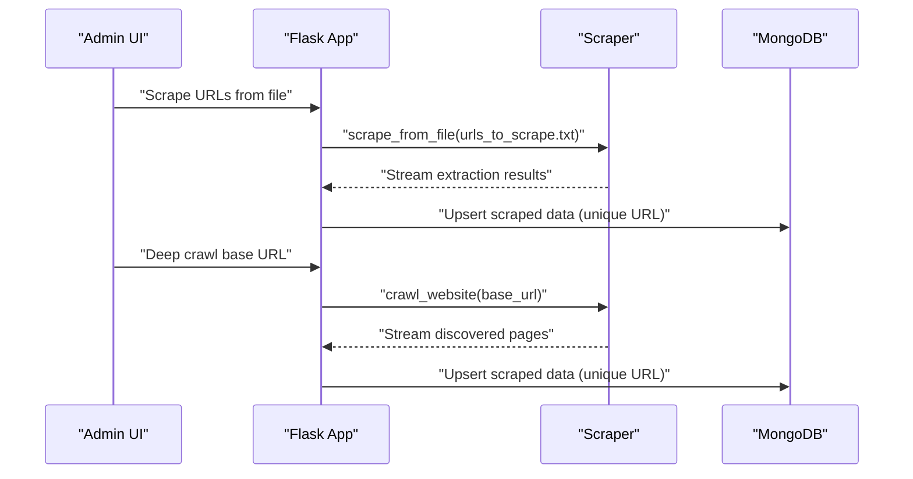

**Diagram sources**
- [app.py:1-30](file://backend/app.py#L1-L30)
- [scraper.py:152-167](file://backend/scraper.py#L152-L167)
- [scraper.py:168-277](file://backend/scraper.py#L168-L277)
- [database.py:152-195](file://backend/database.py#L152-L195)

**Section sources**
- [app.py:1-30](file://backend/app.py#L1-L30)
- [scraper.py:12-147](file://backend/scraper.py#L12-L147)
- [scraper.py:152-167](file://backend/scraper.py#L152-L167)
- [scraper.py:168-277](file://backend/scraper.py#L168-L277)
- [database.py:150-195](file://backend/database.py#L150-L195)
- [urls_to_scrape.txt:1-76](file://backend/urls_to_scrape.txt#L1-L76)

### Document Collection and Ingestion Workflows
- Admin initiates scraping or deep crawling via the admin UI.
- The Flask app streams progress and persists results to MongoDB.
- After ingestion, administrators trigger Rebuild Index to create FAISS indices.

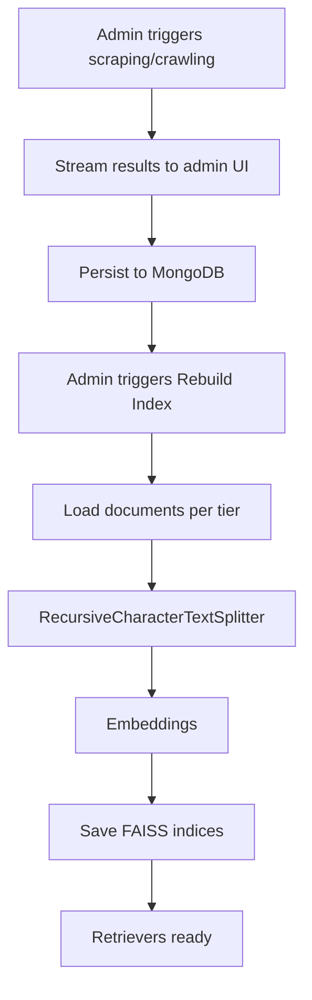

**Diagram sources**
- [admin.js:247-318](file://frontend/admin.js#L247-L318)
- [app.py:331-366](file://backend/app.py#L331-L366)
- [vector_store.py:48-71](file://backend/vector_store.py#L48-L71)

**Section sources**
- [admin.js:247-318](file://frontend/admin.js#L247-L318)
- [app.py:331-366](file://backend/app.py#L331-L366)
- [vector_store.py:48-71](file://backend/vector_store.py#L48-L71)

### Content Validation Mechanisms
- Input sanitization: Removes HTML tags from user inputs.
- Length limits: Enforces maximum lengths for queries, text content, and descriptions.
- Chat history validation: Ensures structured and bounded chat histories.
- File type validation: Restricts allowed file extensions for uploads.
- ObjectId validation: Verifies MongoDB ObjectId format for record operations.
- SSRF and safety checks: URL validation and IP safety checks for scraping.

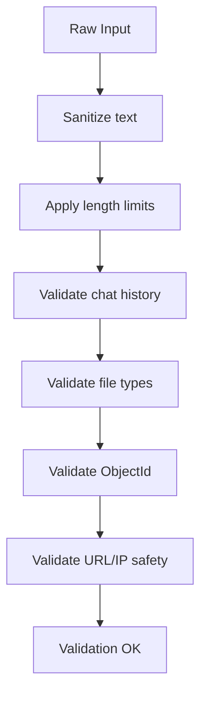

**Diagram sources**
- [app.py:179-218](file://backend/app.py#L179-L218)
- [app.py:129-133](file://backend/app.py#L129-L133)
- [app.py:369-374](file://backend/app.py#L369-L374)
- [app.py:164-175](file://backend/app.py#L164-L175)

**Section sources**
- [app.py:179-218](file://backend/app.py#L179-L218)
- [app.py:129-133](file://backend/app.py#L129-L133)
- [app.py:369-374](file://backend/app.py#L369-L374)
- [app.py:164-175](file://backend/app.py#L164-L175)

### Database Integration with MongoDB
- Collections:
  - memory_bank: unique question, timestamps
  - manual_data: unique source_name, timestamps
  - scraped_data: unique url, timestamps
  - bug_reports: timestamps
- Indexes: Unique constraints and sort indexes for efficient retrieval.
- CRUD APIs: Upsert/update/delete operations for each collection.

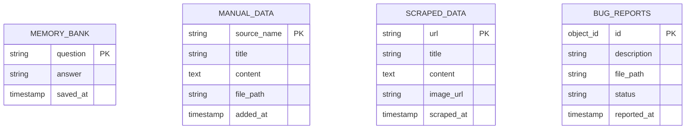

**Diagram sources**
- [database.py:27-47](file://backend/database.py#L27-L47)
- [database.py:61-195](file://backend/database.py#L61-L195)

**Section sources**
- [database.py:18-49](file://backend/database.py#L18-L49)
- [database.py:61-195](file://backend/database.py#L61-L195)

### Document Chunking Strategies
- Chunking: RecursiveCharacterTextSplitter with chunk_size=1000 and chunk_overlap=100.
- Purpose: Balances semantic coherence with retrieval granularity.
- Execution: Applied during Rebuild Index for each tier.

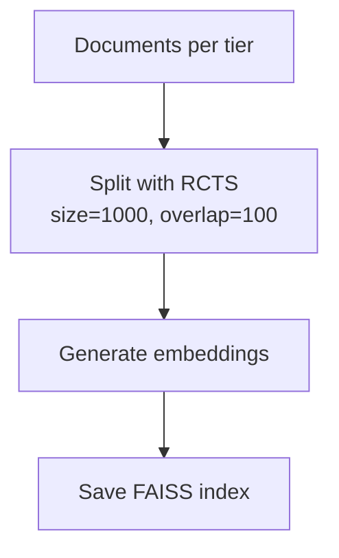

**Diagram sources**
- [vector_store.py:36-38](file://backend/vector_store.py#L36-L38)
- [vector_store.py:23-47](file://backend/vector_store.py#L23-L47)

**Section sources**
- [vector_store.py:36-38](file://backend/vector_store.py#L36-L38)
- [vector_store.py:23-47](file://backend/vector_store.py#L23-L47)

### Indexing Pipeline from Ingestion to FAISS
- Load: Retrieve documents from MongoDB per tier.
- Chunk: Apply RecursiveCharacterTextSplitter.
- Embed: Use HuggingFaceEmbeddings (all-MiniLM-L6-v2).
- Save: Persist FAISS indices locally under dedicated paths.

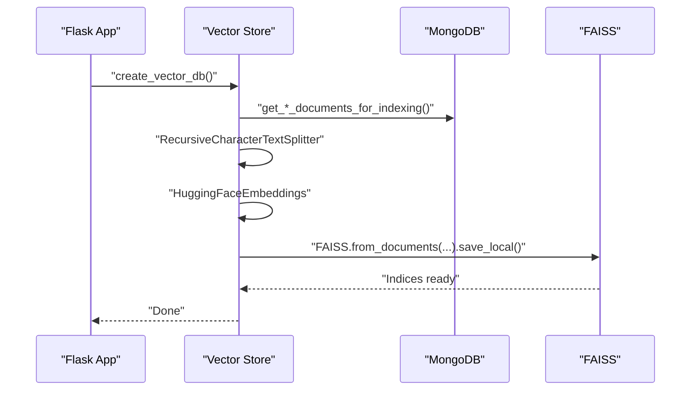

**Diagram sources**
- [vector_store.py:48-71](file://backend/vector_store.py#L48-L71)
- [database.py:96-195](file://backend/database.py#L96-L195)

**Section sources**
- [vector_store.py:48-71](file://backend/vector_store.py#L48-L71)
- [database.py:96-195](file://backend/database.py#L96-L195)

### Content Lifecycle Management, Updates, and Deletions
- Add: Admin endpoints for Memory Bank, Manual Data, and Scraped Data.
- Update: Edit title/content per record; requires valid ObjectId.
- Delete: Remove records by ID; also supports bulk deletion of FAISS indices and MongoDB collections.
- Rebuild Index: Recreate FAISS indices after ingestion or updates.
- Audit: Admin actions are logged for audit trails.

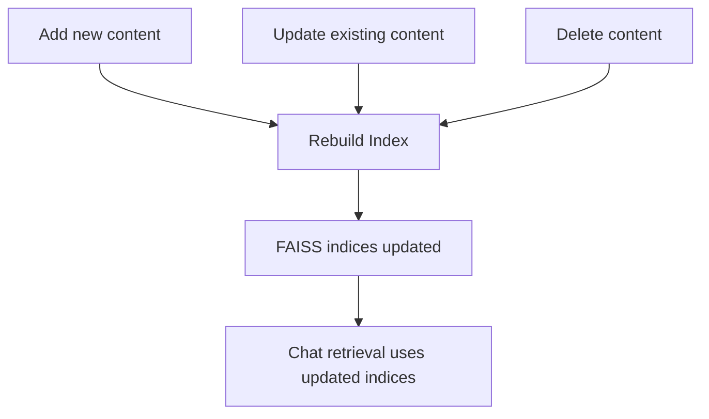

**Diagram sources**
- [app.py:498-587](file://backend/app.py#L498-L587)
- [app.py:763-800](file://backend/app.py#L763-L800)
- [database.py:85-139](file://backend/database.py#L85-L139)

**Section sources**
- [app.py:498-587](file://backend/app.py#L498-L587)
- [app.py:763-800](file://backend/app.py#L763-L800)
- [database.py:85-139](file://backend/database.py#L85-L139)

### Data Quality Assurance Processes
- Minimum content threshold: Pages with insufficient content are skipped.
- Representative image selection: Prefers og:image, otherwise first suitable in-content image.
- Domain/IP safety: Prevents SSRF by validating hostnames and IP ranges.
- Unique constraints: Upserts maintain data integrity across tiers.
- Admin review: Manual verification of content before ingestion.

**Section sources**
- [scraper.py:12-27](file://backend/scraper.py#L12-L27)
- [scraper.py:141-147](file://backend/scraper.py#L141-L147)
- [scraper.py:242-264](file://backend/scraper.py#L242-L264)
- [database.py:32-43](file://backend/database.py#L32-L43)

## Dependency Analysis
External libraries and integrations:
- Flask: Web framework and routing
- LangChain ecosystem: Text splitters, embeddings, FAISS
- MongoDB: Persistent storage
- Groq: LLM inference for chat completion
- Requests/Trafilatura/BeautifulSoup: Web scraping
- PyPDF2/docx/pptx: Document parsing

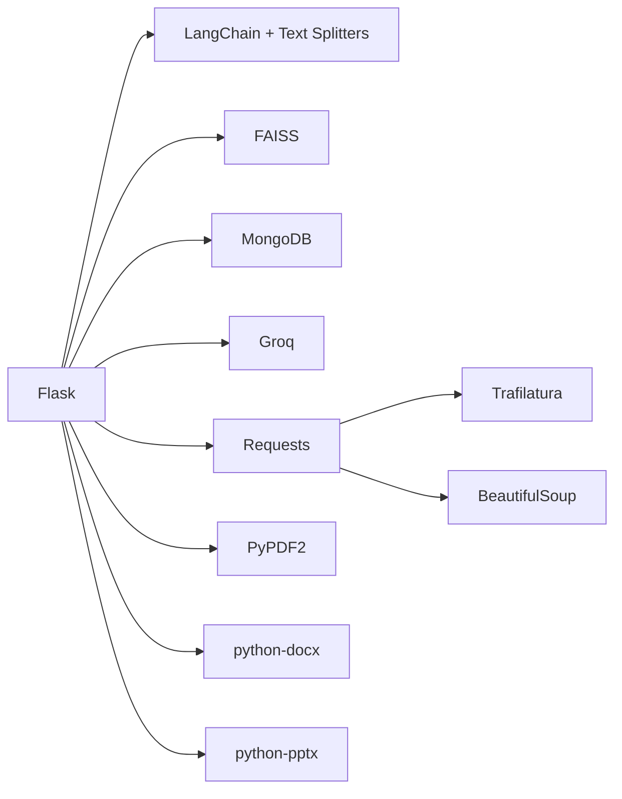

**Diagram sources**
- [requirements.txt:1-30](file://requirements.txt#L1-L30)
- [app.py:1-27](file://backend/app.py#L1-L27)

**Section sources**
- [requirements.txt:1-30](file://requirements.txt#L1-L30)
- [app.py:1-27](file://backend/app.py#L1-L27)

## Performance Considerations
- Embedding model: all-MiniLM-L6-v2 provides fast CPU embeddings suitable for local deployment.
- Chunk size and overlap: Balanced for retrieval precision and context coverage.
- FAISS caching: Retriever instances are cached to avoid repeated loading.
- Rate limiting: Applied to admin and public endpoints to prevent abuse.
- Session management: Secure, expiring sessions with CSRF protection.

[No sources needed since this section provides general guidance]

## Troubleshooting Guide
Common issues and resolutions:
- Missing FAISS indices: The system auto-reindexes at startup if any index folder is missing.
- Index corruption or outdated data: Use the admin action to delete FAISS indices and rebuild.
- Database reset: Supports dropping all collections and reinitializing indexes.
- Scraping failures: Verify URL safety, network connectivity, and content thresholds.
- Chat errors: Ensure embeddings and FAISS indices are present; confirm Rebuild Index was executed after recent changes.

**Section sources**
- [app.py:220-237](file://backend/app.py#L220-L237)
- [app.py:763-800](file://backend/app.py#L763-L800)
- [database.py:27-49](file://backend/database.py#L27-L49)

## Conclusion
The three-tier knowledge base management system provides a robust pipeline for collecting, validating, indexing, and retrieving knowledge across Memory Bank, Manual Data, and Scraped Data. MongoDB ensures reliable persistence with unique constraints and indexes, while FAISS enables efficient similarity search. The admin interface simplifies ingestion and maintenance, and built-in validations and safeguards improve data quality and system reliability.

[No sources needed since this section summarizes without analyzing specific files]

## Appendices

### Admin Operations Overview
- Login and CSRF protection
- Trigger scraping and deep crawling
- Rebuild FAISS indices
- Manage content (add/edit/delete)
- Monitor status and logs

**Section sources**
- [admin.html:1-164](file://frontend/admin.html#L1-L164)
- [admin.js:163-244](file://frontend/admin.js#L163-L244)
- [app.py:331-366](file://backend/app.py#L331-L366)