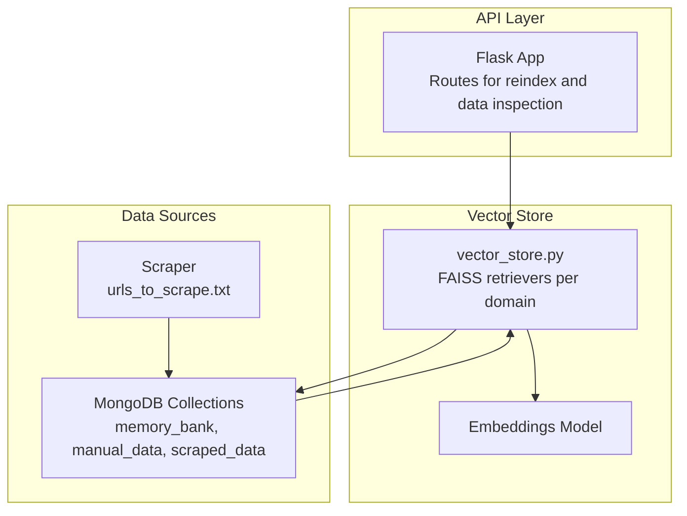
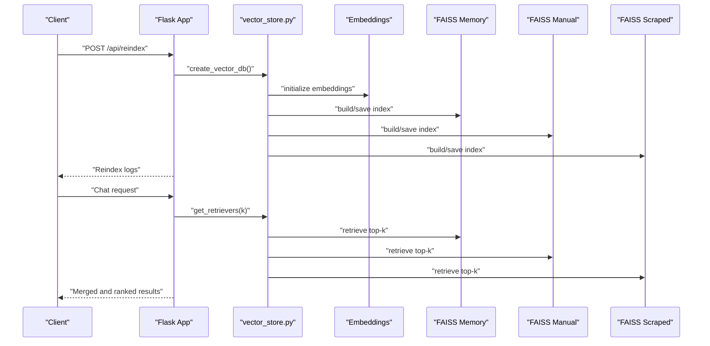
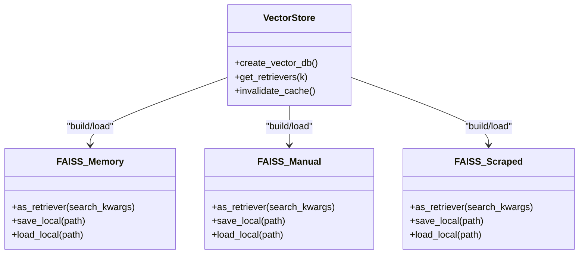
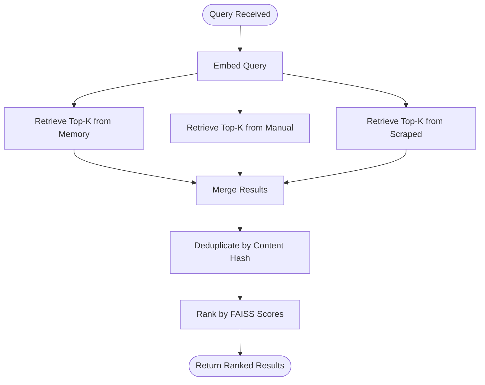
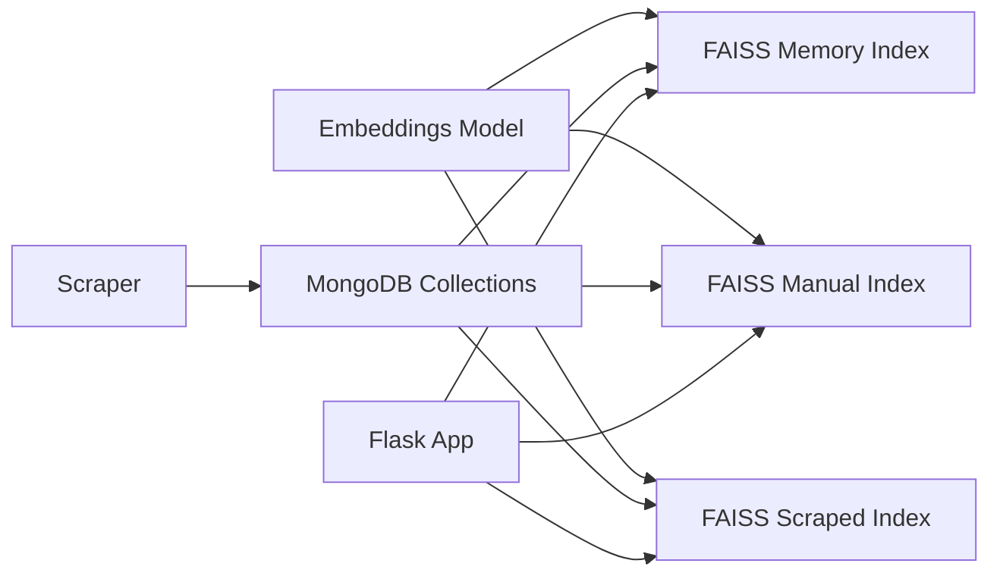

# Search Algorithms and Retrieval

<cite>
**Referenced Files in This Document**
- [backend/app.py](file://backend/app.py)
- [backend/vector_store.py](file://backend/vector_store.py)
- [backend/database.py](file://backend/database.py)
- [backend/scraper.py](file://backend/scraper.py)
- [backend/urls_to_scrape.txt](file://backend/urls_to_scrape.txt)
</cite>

## Table of Contents
1. [Introduction](#introduction)
2. [Project Structure](#project-structure)
3. [Core Components](#core-components)
4. [Architecture Overview](#architecture-overview)
5. [Detailed Component Analysis](#detailed-component-analysis)
6. [Dependency Analysis](#dependency-analysis)
7. [Performance Considerations](#performance-considerations)
8. [Troubleshooting Guide](#troubleshooting-guide)
9. [Conclusion](#conclusion)

## Introduction
This document explains the vector search algorithms and retrieval mechanisms powering the system. It covers:
- Similarity search using vector embeddings and cosine similarity via FAISS
- Multi-retriever architecture combining Memory Bank, Manual Data, and Scraped Data
- Relevance scoring and ranking strategies
- k-nearest neighbor search parameters and result filtering
- Citation generation and source attribution
- Performance metrics, latency optimization, and result quality assessment
- Edge cases and fallback mechanisms for low-quality results

## Project Structure
The search pipeline spans three primary areas:
- Vector indexing and retrieval: FAISS-backed retrievers per data domain
- Data ingestion and preparation: MongoDB collections and scraping pipeline
- API orchestration: Flask routes for reindexing, data inspection, and runtime retrieval

**Diagram sources**
- [backend/app.py](file://backend/app.py)
- [backend/vector_store.py](file://backend/vector_store.py)
- [backend/database.py](file://backend/database.py)
- [backend/scraper.py](file://backend/scraper.py)
- [backend/urls_to_scrape.txt](file://backend/urls_to_scrape.txt)

**Section sources**
- [backend/app.py](file://backend/app.py)
- [backend/vector_store.py](file://backend/vector_store.py)
- [backend/database.py](file://backend/database.py)
- [backend/scraper.py](file://backend/scraper.py)
- [backend/urls_to_scrape.txt](file://backend/urls_to_scrape.txt)

## Core Components
- Embedding model: Hugging Face all-MiniLM-L6-v2 used to encode text into dense vectors
- FAISS vector stores: Separate indices for Memory Bank, Manual Data, and Scraped Data
- Retrievers: Per-domain FAISS retrievers configured with k neighbors
- Index creation and caching: On-demand index building and module-level retriever caching
- Data ingestion: MongoDB collections and web scraping pipeline feeding the indices

Key implementation references:
- Embedding initialization and FAISS index creation
  - [backend/vector_store.py](file://backend/vector_store.py)
- Retrieval with k neighbors and module-level caching
  - [backend/vector_store.py](file://backend/vector_store.py)
- Startup auto-reindex and admin-triggered reindex
  - [backend/app.py](file://backend/app.py)
- MongoDB collection indexes and document providers
  - [backend/database.py](file://backend/database.py)
- Web scraping pipeline and URLs list
  - [backend/scraper.py](file://backend/scraper.py)
  - [backend/urls_to_scrape.txt](file://backend/urls_to_scrape.txt)

**Section sources**
- [backend/vector_store.py](file://backend/vector_store.py)
- [backend/app.py](file://backend/app.py)
- [backend/database.py](file://backend/database.py)
- [backend/scraper.py](file://backend/scraper.py)
- [backend/urls_to_scrape.txt](file://backend/urls_to_scrape.txt)

## Architecture Overview
The retrieval system operates as follows:
- At startup or admin action, FAISS indices are built from three data domains
- Embeddings are computed using a sentence-transformers model
- FAISS indices are saved locally and loaded as retrievers with a fixed k
- During search, queries are embedded and matched against each retriever
- Results are merged, deduplicated, and ranked for presentation

**Diagram sources**
- [backend/app.py](file://backend/app.py)
- [backend/vector_store.py](file://backend/vector_store.py)

## Detailed Component Analysis

### Vector Embeddings and Similarity Search
- Embedding model: all-MiniLM-L6-v2 via Hugging Face Transformers
- Similarity metric: FAISS default inner-product (cosine similarity for normalized vectors)
- Chunking: RecursiveCharacterTextSplitter with configurable chunk size and overlap
- Index persistence: FAISS save/load local filesystem

Implementation references:
- Embedding initialization and FAISS index creation
  - [backend/vector_store.py](file://backend/vector_store.py)
- Text splitting and embedding pipeline
  - [backend/vector_store.py](file://backend/vector_store.py)

**Section sources**
- [backend/vector_store.py](file://backend/vector_store.py)

### Multi-Retriever Architecture
Three retrievers operate independently:
- Memory Bank retriever
- Manual Data retriever
- Scraped Data retriever

Each is configured with the same k neighbors and loaded once at module level for reuse across requests.

**Diagram sources**
- [backend/vector_store.py](file://backend/vector_store.py)

**Section sources**
- [backend/vector_store.py](file://backend/vector_store.py)

### Index Creation and Caching
- Index creation streams progress logs and handles empty datasets gracefully
- Module-level cache avoids repeated FAISS.load_local calls
- Admin endpoint triggers reindex and invalidates cache

References:
- Index creation and logging
  - [backend/vector_store.py](file://backend/vector_store.py)
- Cache invalidation and module-level cache
  - [backend/vector_store.py](file://backend/vector_store.py)
- Admin reindex route and rate limiting
  - [backend/app.py](file://backend/app.py)

**Section sources**
- [backend/vector_store.py](file://backend/vector_store.py)
- [backend/app.py](file://backend/app.py)

### Data Ingestion and Preparation
- Memory Bank: stored as question-answer pairs
- Manual Data: stored with a unique source identifier and timestamps
- Scraped Data: stored with URL uniqueness and scrape timestamps
- Scraping pipeline reads URLs from a dedicated file and inserts into MongoDB

References:
- MongoDB indexes and uniqueness constraints
  - [backend/database.py](file://backend/database.py)
- Scraping pipeline and URLs list
  - [backend/scraper.py](file://backend/scraper.py)
  - [backend/urls_to_scrape.txt](file://backend/urls_to_scrape.txt)

**Section sources**
- [backend/database.py](file://backend/database.py)
- [backend/scraper.py](file://backend/scraper.py)
- [backend/urls_to_scrape.txt](file://backend/urls_to_scrape.txt)

### Retrieval Workflow and Ranking
- Query embedding: performed using the same model used during indexing
- Neighbors: each retriever returns up to k matches
- Merging and deduplication: results from the three retrievers are combined and duplicates removed
- Ranking: current implementation relies on FAISS inner-product scores; no explicit post-processing re-ranking is present in the referenced code

[No sources needed since this diagram shows conceptual workflow, not actual code structure]

### Citation Generation and Source Attribution
- Memory Bank items: attributed with a Memory Bank ID and title derived from the question
- Manual Data items: attributed with the source name as the URL
- Scraped Data items: attributed with the scraped URL and timestamp
- Combined dataset endpoint aggregates items with type and timestamp for admin visibility

References:
- Source attribution mapping
  - [backend/app.py](file://backend/app.py)
- Data aggregation endpoint
  - [backend/app.py](file://backend/app.py)

**Section sources**
- [backend/app.py](file://backend/app.py)

## Dependency Analysis
The retrieval system depends on:
- Embedding model availability and compatibility with FAISS
- FAISS index integrity and presence on disk
- MongoDB connectivity and collection indexes
- Optional scraping pipeline for dynamic content updates

**Diagram sources**
- [backend/vector_store.py](file://backend/vector_store.py)
- [backend/database.py](file://backend/database.py)
- [backend/scraper.py](file://backend/scraper.py)
- [backend/app.py](file://backend/app.py)

**Section sources**
- [backend/vector_store.py](file://backend/vector_store.py)
- [backend/database.py](file://backend/database.py)
- [backend/scraper.py](file://backend/scraper.py)
- [backend/app.py](file://backend/app.py)

## Performance Considerations
- Embedding model: all-MiniLM-L6-v2 balances speed and quality for semantic search
- Index size and k: larger k increases recall but also latency; tune k per deployment needs
- Retrieval caching: module-level cache prevents repeated FAISS.load_local calls
- Chunk size and overlap: controlled via text splitter; affects recall and storage overhead
- Network and disk I/O: FAISS load/save occur on local filesystem; ensure fast storage for large indices
- Concurrency: FAISS retrievers are loaded once; subsequent retrievals are efficient

[No sources needed since this section provides general guidance]

## Troubleshooting Guide
Common issues and mitigations:
- Missing or corrupted FAISS indices
  - Trigger admin reindex to rebuild indices
  - References:
    - [backend/app.py](file://backend/app.py)
    - [backend/vector_store.py](file://backend/vector_store.py)
- Empty datasets for a domain
  - Index creation logs indicate skipping empty domains
  - References:
    - [backend/vector_store.py](file://backend/vector_store.py)
- Retrieval failures during load
  - Failures are caught and logged; retriever remains None for that domain
  - References:
    - [backend/vector_store.py](file://backend/vector_store.py)
- Low-quality results
  - Adjust k to increase recall
  - Verify embeddings model and chunking parameters
  - References:
    - [backend/vector_store.py](file://backend/vector_store.py)
- Admin access and rate limits
  - Reindexing is rate-limited and requires admin session
  - References:
    - [backend/app.py](file://backend/app.py)

**Section sources**
- [backend/app.py](file://backend/app.py)
- [backend/vector_store.py](file://backend/vector_store.py)

## Conclusion
The system implements a robust, multi-domain vector search pipeline using FAISS and sentence-transformers embeddings. It separates retrieval by domain, caches retrievers for performance, and exposes admin controls for reindexing and data inspection. While FAISS inner-product scores provide initial ranking, future enhancements could include explicit re-ranking and confidence thresholds to improve result quality and handle edge cases more gracefully.