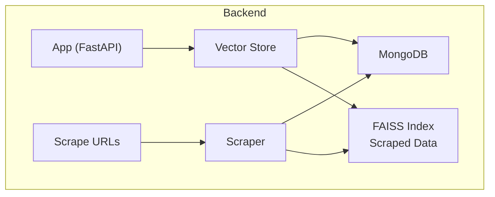
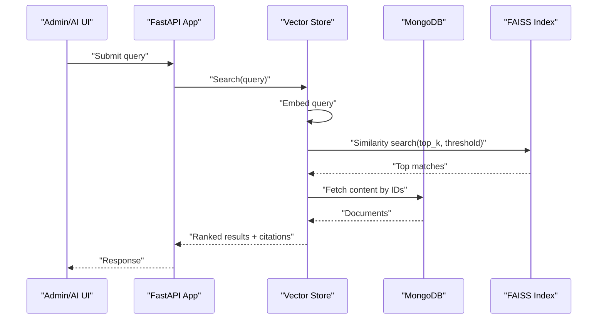
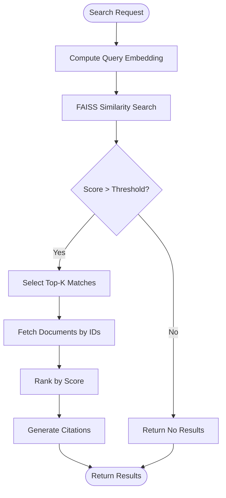
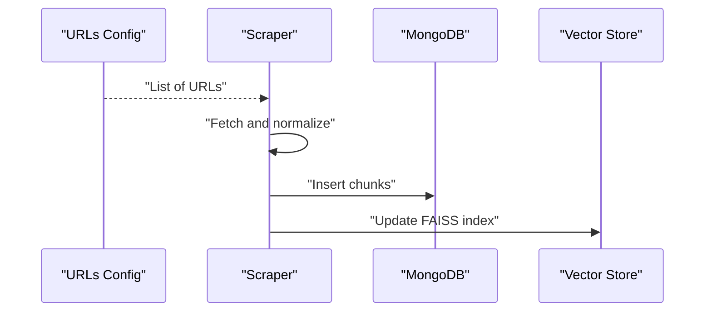
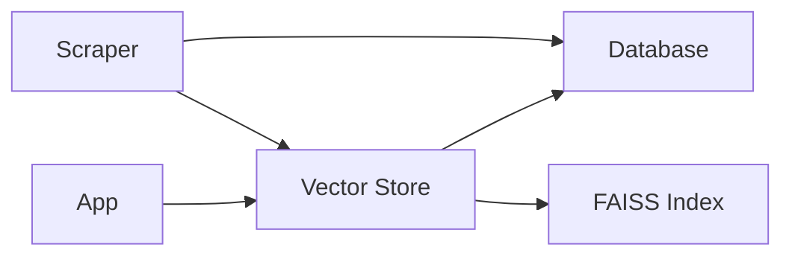

# Vector Search System

<cite>
**Referenced Files in This Document**
- [app.py](file://backend/app.py)
- [vector_store.py](file://backend/vector_store.py)
- [database.py](file://backend/database.py)
- [scraper.py](file://backend/scraper.py)
- [urls_to_scrape.txt](file://backend/urls_to_scrape.txt)
- [index.faiss](file://backend/db/faiss_index_scraped/index.faiss)
</cite>

## Table of Contents
1. [Introduction](#introduction)
2. [Project Structure](#project-structure)
3. [Core Components](#core-components)
4. [Architecture Overview](#architecture-overview)
5. [Detailed Component Analysis](#detailed-component-analysis)
6. [Dependency Analysis](#dependency-analysis)
7. [Performance Considerations](#performance-considerations)
8. [Troubleshooting Guide](#troubleshooting-guide)
9. [Conclusion](#conclusion)

## Introduction
This document describes a FAISS-based vector search system designed to support a three-tier knowledge base architecture:
- Memory Bank: Predefined Q&A content
- Manual Data: User-generated content
- Scraped Data: Automatically collected content

The system integrates FAISS for vector indexing and similarity search, MongoDB for persistent storage, and a web application interface for administration and AI chat experiences. It covers vector embedding processes, chunking strategies, similarity search, relevance scoring, FAISS index lifecycle management, and operational maintenance.

## Project Structure
The backend is organized around:
- Application entry and routing
- Vector store abstraction and FAISS integration
- Database connectivity and content persistence
- Web scraping pipeline for automated content ingestion
- FAISS index storage under dedicated directories

**Diagram sources**
- [app.py](file://backend/app.py)
- [vector_store.py](file://backend/vector_store.py)
- [database.py](file://backend/database.py)
- [scraper.py](file://backend/scraper.py)
- [urls_to_scrape.txt](file://backend/urls_to_scrape.txt)
- [index.faiss](file://backend/db/faiss_index_scraped/index.faiss)

**Section sources**
- [app.py](file://backend/app.py)
- [vector_store.py](file://backend/vector_store.py)
- [database.py](file://backend/database.py)
- [scraper.py](file://backend/scraper.py)
- [urls_to_scrape.txt](file://backend/urls_to_scrape.txt)
- [index.faiss](file://backend/db/faiss_index_scraped/index.faiss)

## Core Components
- Vector Store: Manages FAISS index creation, updates, queries, and persistence. Implements chunking, embeddings, and similarity search.
- Database Layer: Provides CRUD operations for content across the three knowledge tiers and manages metadata for citations.
- Scraper: Fetches and normalizes external content, then persists to MongoDB and updates FAISS indices.
- FAISS Indices: Persisted binary indexes optimized for similarity search on vector embeddings.
- Web App: Exposes admin pages and AI chat UI; routes to vector store and database services.

Key responsibilities:
- Embedding model selection and batch processing
- Chunking strategies for optimal recall and precision
- Similarity search with configurable thresholds and top-k
- Relevance scoring and ranking
- Citation generation from stored documents
- Maintenance: reindexing, optimization, and troubleshooting

**Section sources**
- [vector_store.py](file://backend/vector_store.py)
- [database.py](file://backend/database.py)
- [scraper.py](file://backend/scraper.py)
- [index.faiss](file://backend/db/faiss_index_scraped/index.faiss)

## Architecture Overview
The system follows a modular design:
- Data ingestion occurs via manual upload and automated scraping
- Content is normalized and chunked
- Embeddings are computed and indexed in FAISS
- Queries compute embeddings and perform similarity search against FAISS
- Results are ranked, enriched with citations, and returned to the client

**Diagram sources**
- [app.py](file://backend/app.py)
- [vector_store.py](file://backend/vector_store.py)
- [database.py](file://backend/database.py)
- [index.faiss](file://backend/db/faiss_index_scraped/index.faiss)

## Detailed Component Analysis

### Vector Store Implementation
Responsibilities:
- Load and manage FAISS index for scraped data
- Compute embeddings for new chunks and queries
- Insert/update vectors and document metadata
- Perform similarity search with configurable parameters
- Rank results and prepare citations

Processing logic:
- Embedding computation: Batch vectors are computed and appended to the FAISS index
- Index update: New vectors are added with corresponding metadata IDs
- Query processing: Query text is embedded and searched against the index
- Ranking: Scores are derived from FAISS distances; optional threshold filtering and top-k selection
- Citations: Retrieved document IDs are resolved to full content for citation rendering

**Diagram sources**
- [vector_store.py](file://backend/vector_store.py)
- [index.faiss](file://backend/db/faiss_index_scraped/index.faiss)

**Section sources**
- [vector_store.py](file://backend/vector_store.py)
- [index.faiss](file://backend/db/faiss_index_scraped/index.faiss)

### Database Layer
Responsibilities:
- Manage content across three knowledge tiers: Memory Bank, Manual Data, Scraped Data
- Provide CRUD operations for document insertion, updates, and deletions
- Store metadata required for citations and provenance
- Support bulk operations for efficient ingestion pipelines

Integration points:
- Vector store depends on database for retrieving full documents after FAISS retrieval
- Scraper writes normalized content to database prior to index updates

**Section sources**
- [database.py](file://backend/database.py)

### Scraper Pipeline
Responsibilities:
- Read target URLs from configuration
- Fetch and normalize content
- Persist to database
- Trigger FAISS index updates for newly ingested content

Operational flow:
- Load URLs to scrape
- For each URL, fetch and clean content
- Split into chunks and embed
- Insert into database and FAISS index

**Diagram sources**
- [scraper.py](file://backend/scraper.py)
- [urls_to_scrape.txt](file://backend/urls_to_scrape.txt)
- [database.py](file://backend/database.py)
- [vector_store.py](file://backend/vector_store.py)

**Section sources**
- [scraper.py](file://backend/scraper.py)
- [urls_to_scrape.txt](file://backend/urls_to_scrape.txt)
- [database.py](file://backend/database.py)
- [vector_store.py](file://backend/vector_store.py)

### FAISS Index Management
Index location:
- Scraped Data FAISS index is persisted at a dedicated path

Lifecycle:
- Creation: Initialize FAISS index with appropriate dimensionality and metric
- Updating: Add new vectors and IDs; maintain metadata alignment
- Optimization: Periodic reindexing and pruning of stale entries
- Persistence: Save/load FAISS index to/from disk

Maintenance procedures:
- Rebuild index from scratch using current database content
- Compact and optimize index after large-scale updates
- Monitor memory footprint and adjust batch sizes accordingly

**Section sources**
- [index.faiss](file://backend/db/faiss_index_scraped/index.faiss)
- [vector_store.py](file://backend/vector_store.py)

### Three-Tier Knowledge Base
- Memory Bank: Predefined Q&A content; static or slowly changing
- Manual Data: User-generated content; editable and curated
- Scraped Data: Automatically collected content; dynamic and continuously updated

Each tier contributes to the overall vector corpus and influences search coverage and relevance.

**Section sources**
- [database.py](file://backend/database.py)

### Embedding Model Selection and Chunking Strategies
- Embedding model: Choose a model capable of generating dense vector representations suitable for semantic similarity
- Chunking: Split long documents into overlapping or non-overlapping segments; balance recall and performance
- Batch processing: Process embeddings in batches to improve throughput

[No sources needed since this section provides general guidance]

### Similarity Search and Relevance Scoring
- Distance metric: FAISS supports configurable metrics; cosine distance commonly used for normalized embeddings
- Threshold filtering: Discard low-relevance matches below a configurable score
- Top-k selection: Limit results to most relevant candidates
- Ranking: Order by similarity scores; optionally combine with metadata boosts

**Section sources**
- [vector_store.py](file://backend/vector_store.py)

### Citation Generation
- Retrieve document IDs from FAISS search results
- Fetch full documents from database
- Render citations with metadata (title, source, date, etc.)

**Section sources**
- [vector_store.py](file://backend/vector_store.py)
- [database.py](file://backend/database.py)

## Dependency Analysis
High-level dependencies:
- App depends on Vector Store for search operations
- Vector Store depends on FAISS index and Database
- Scraper depends on Database and triggers Vector Store updates
- FAISS index is a standalone persisted artifact managed by Vector Store

**Diagram sources**
- [app.py](file://backend/app.py)
- [vector_store.py](file://backend/vector_store.py)
- [database.py](file://backend/database.py)
- [scraper.py](file://backend/scraper.py)
- [index.faiss](file://backend/db/faiss_index_scraped/index.faiss)

**Section sources**
- [app.py](file://backend/app.py)
- [vector_store.py](file://backend/vector_store.py)
- [database.py](file://backend/database.py)
- [scraper.py](file://backend/scraper.py)
- [index.faiss](file://backend/db/faiss_index_scraped/index.faiss)

## Performance Considerations
- Index dimensionality and metric selection impact speed and accuracy
- Batch embedding sizes should balance throughput and memory usage
- Top-k and threshold tuning affects latency and quality
- Regular maintenance (reindexing, pruning) prevents fragmentation and improves recall
- Caching frequently accessed documents reduces repeated database queries

[No sources needed since this section provides general guidance]

## Troubleshooting Guide
Common issues and resolutions:
- FAISS index load failures: Verify index file integrity and dimension compatibility
- Low recall or irrelevant results: Adjust similarity threshold, increase top-k, or retrain/rebuild index
- Slow search performance: Optimize batch sizes, reduce top-k, or reindex with improved parameters
- Missing citations: Confirm document IDs exist in database and metadata is complete
- Scraping errors: Validate URLs, network connectivity, and content normalization logic

**Section sources**
- [vector_store.py](file://backend/vector_store.py)
- [database.py](file://backend/database.py)
- [scraper.py](file://backend/scraper.py)
- [index.faiss](file://backend/db/faiss_index_scraped/index.faiss)

## Conclusion
The FAISS-based vector search system provides a scalable foundation for semantic search across three knowledge tiers. By combining robust chunking, efficient embedding pipelines, and FAISS similarity search, it delivers responsive and relevant results. Proper maintenance, tuning, and integration with MongoDB ensures reliable operation and continuous improvement.