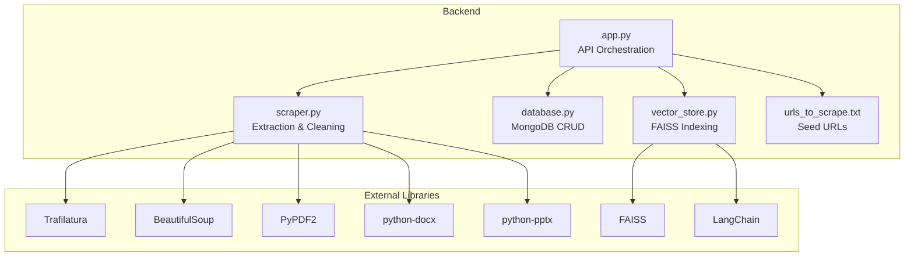
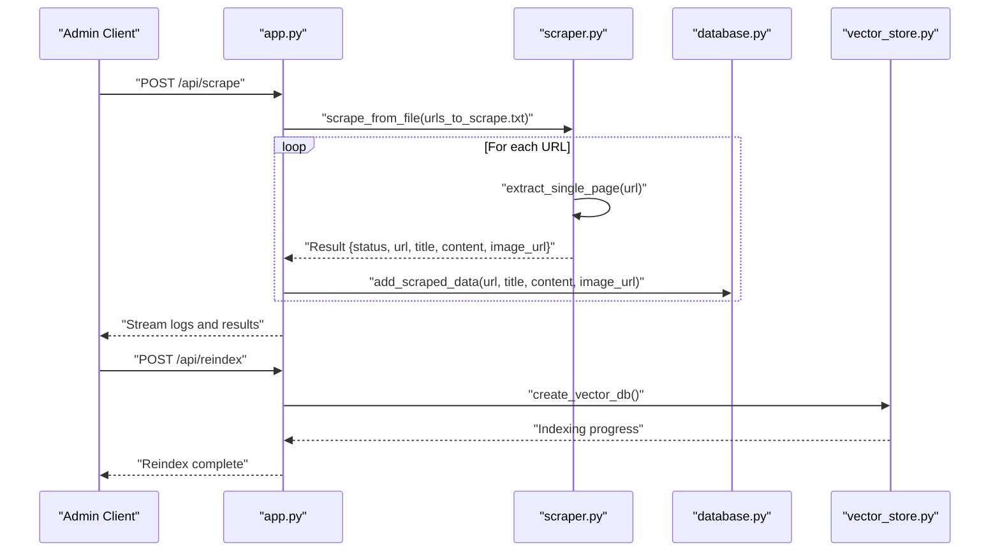
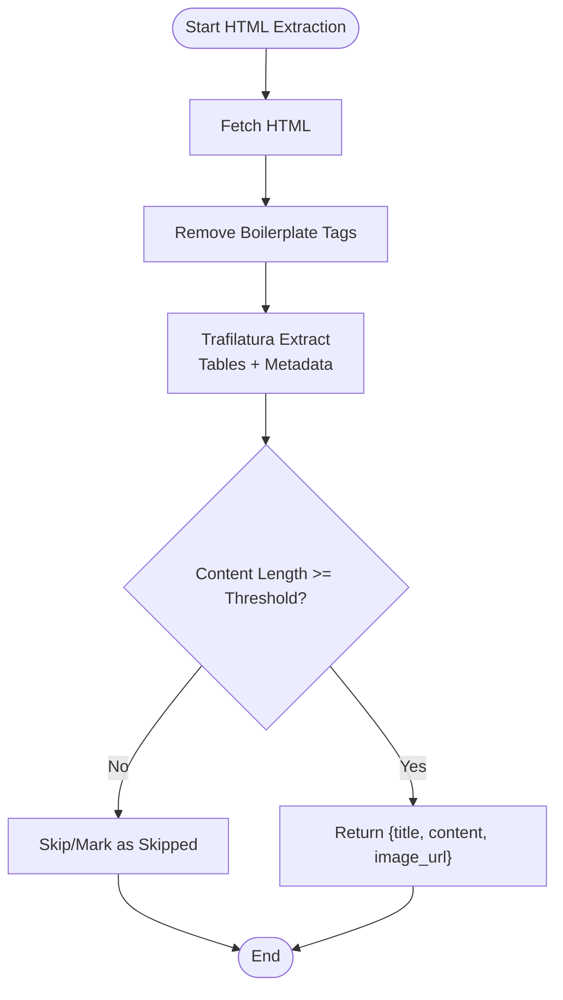
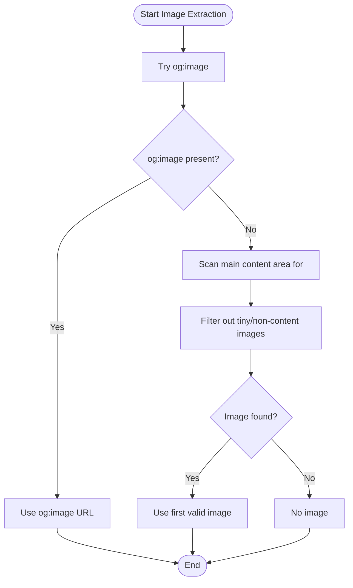
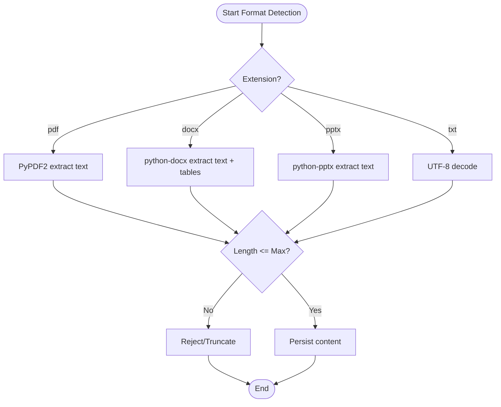
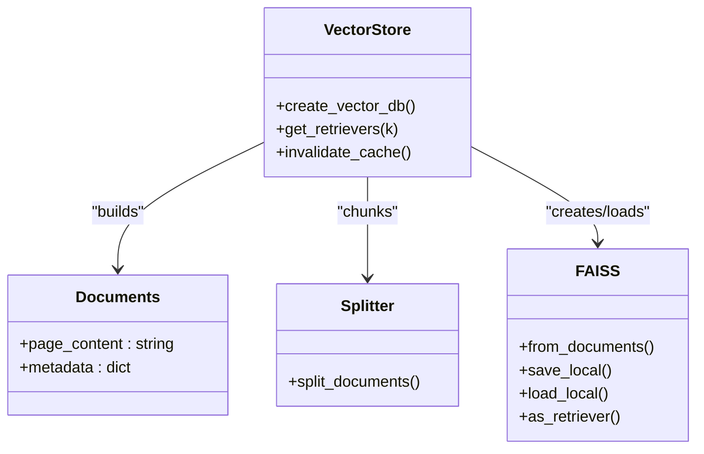
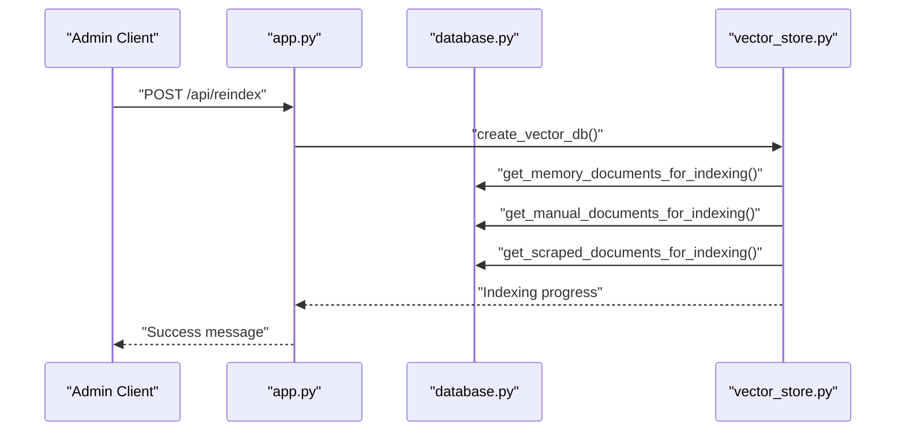
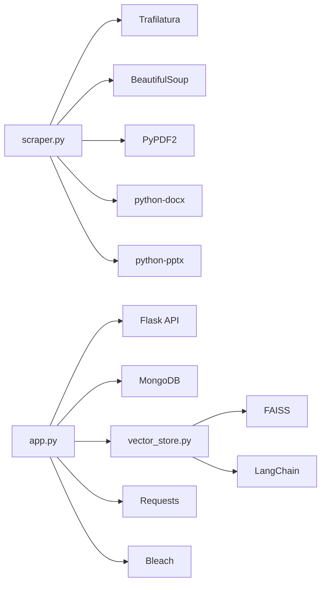

# Content Extraction and Processing

<cite>
**Referenced Files in This Document**
- [scraper.py](file://backend/scraper.py)
- [app.py](file://backend/app.py)
- [database.py](file://backend/database.py)
- [vector_store.py](file://backend/vector_store.py)
- [urls_to_scrape.txt](file://backend/urls_to_scrape.txt)
- [requirements.txt](file://requirements.txt)
- [API_DOCUMENTATION.md](file://API_DOCUMENTATION.md)
</cite>

## Table of Contents
1. [Introduction](#introduction)
2. [Project Structure](#project-structure)
3. [Core Components](#core-components)
4. [Architecture Overview](#architecture-overview)
5. [Detailed Component Analysis](#detailed-component-analysis)
6. [Dependency Analysis](#dependency-analysis)
7. [Performance Considerations](#performance-considerations)
8. [Troubleshooting Guide](#troubleshooting-guide)
9. [Conclusion](#conclusion)
10. [Appendices](#appendices)

## Introduction
This document explains the content extraction and processing system powering the DamayAI Assistant. It covers multi-format content extraction (PDF, DOCX, PPTX, HTML), Trafilatura integration for HTML content extraction and metadata handling, custom HTML boilerplate removal and sanitization, image extraction with priority ranking, and the integration with the vector search system and content chunking strategies. It also outlines quality assessment criteria, content length validation, and duplicate detection mechanisms.

## Project Structure
The content extraction pipeline spans several backend modules:
- Web scraping and content extraction: [scraper.py](file://backend/scraper.py)
- API orchestration and ingestion: [app.py](file://backend/app.py)
- Data persistence and retrieval: [database.py](file://backend/database.py)
- Vector index creation and retrieval: [vector_store.py](file://backend/vector_store.py)
- Initial URL list for scraping: [urls_to_scrape.txt](file://backend/urls_to_scrape.txt)
- Dependencies: [requirements.txt](file://requirements.txt)

**Diagram sources**
- [scraper.py:1-278](file://backend/scraper.py#L1-L278)
- [app.py:1-1192](file://backend/app.py#L1-L1192)
- [database.py:1-260](file://backend/database.py#L1-L260)
- [vector_store.py:1-115](file://backend/vector_store.py#L1-L115)
- [urls_to_scrape.txt:1-76](file://backend/urls_to_scrape.txt#L1-L76)
- [requirements.txt:1-30](file://requirements.txt#L1-L30)

**Section sources**
- [scraper.py:1-278](file://backend/scraper.py#L1-L278)
- [app.py:1-1192](file://backend/app.py#L1-L1192)
- [database.py:1-260](file://backend/database.py#L1-L260)
- [vector_store.py:1-115](file://backend/vector_store.py#L1-L115)
- [urls_to_scrape.txt:1-76](file://backend/urls_to_scrape.txt#L1-L76)
- [requirements.txt:1-30](file://requirements.txt#L1-L30)

## Core Components
- Multi-format extraction:
  - PDF: [extract_text_from_pdf:33-44](file://backend/scraper.py#L33-L44)
  - DOCX: [extract_text_from_docx:45-52](file://backend/scraper.py#L45-L52) and [app.py:375-400](file://backend/app.py#L375-L400)
  - PPTX: [extract_text_from_pptx:54-66](file://backend/scraper.py#L54-L66) and [app.py:542-552](file://backend/app.py#L542-L552)
- HTML extraction and cleaning:
  - Boilerplate removal: [clean_html_boilerplate:69-81](file://backend/scraper.py#L69-L81)
  - Trafilatura extraction and metadata: [extract_single_page:83-148](file://backend/scraper.py#L83-L148), [crawl_website:168-277](file://backend/scraper.py#L168-L277)
- Image extraction with priority:
  - og:image first, then first in-content image: [extract_single_page:108-140](file://backend/scraper.py#L108-L140), [crawl_website:242-264](file://backend/scraper.py#L242-L264)
- Content quality checks:
  - Minimum content length threshold: [extract_single_page:142-144](file://backend/scraper.py#L142-L144), [crawl_website:266-269](file://backend/scraper.py#L266-L269)
- Vector search integration:
  - Chunking and indexing: [vector_store.py:23-47](file://backend/vector_store.py#L23-L47), [vector_store.py:48-70](file://backend/vector_store.py#L48-L70)
  - Retrieval: [vector_store.py:73-115](file://backend/vector_store.py#L73-L115)
- Persistence:
  - Scraped data storage: [add_scraped_data:152-168](file://backend/database.py#L152-L168)
  - Manual and memory data: [add_manual_data:61-79](file://backend/database.py#L61-L79), [add_to_memory:108-122](file://backend/database.py#L108-L122)
- API endpoints:
  - Scrape from file: [scrape_handler:801-820](file://backend/app.py#L801-L820)
  - Crawl website: [crawl_handler:822-846](file://backend/app.py#L822-L846)
  - Reindex vector store: [reindex_handler:848-858](file://backend/app.py#L848-L858)

**Section sources**
- [scraper.py:33-148](file://backend/scraper.py#L33-L148)
- [scraper.py:168-277](file://backend/scraper.py#L168-L277)
- [app.py:375-400](file://backend/app.py#L375-L400)
- [app.py:542-566](file://backend/app.py#L542-L566)
- [database.py:61-168](file://backend/database.py#L61-L168)
- [vector_store.py:23-115](file://backend/vector_store.py#L23-L115)
- [app.py:801-858](file://backend/app.py#L801-L858)

## Architecture Overview
The system extracts content from diverse sources, cleans and validates it, persists it, and builds vector indices for retrieval. The chat flow retrieves relevant knowledge from multiple sources and synthesizes a final answer.

**Diagram sources**
- [app.py:801-858](file://backend/app.py#L801-L858)
- [scraper.py:152-167](file://backend/scraper.py#L152-L167)
- [scraper.py:83-148](file://backend/scraper.py#L83-L148)
- [database.py:152-168](file://backend/database.py#L152-L168)
- [vector_store.py:48-70](file://backend/vector_store.py#L48-L70)

## Detailed Component Analysis

### HTML Content Extraction with Trafilatura
- Uses Trafilatura to extract readable content and preserve tables.
- Extracts metadata (e.g., title) from raw HTML.
- Cleans HTML boilerplate before extraction to improve accuracy.

Key functions:
- [extract_single_page:83-148](file://backend/scraper.py#L83-L148)
- [crawl_website:168-277](file://backend/scraper.py#L168-L277)
- [clean_html_boilerplate:69-81](file://backend/scraper.py#L69-L81)

Quality assessment:
- Minimum content length threshold ensures meaningful content is retained.

**Diagram sources**
- [scraper.py:69-148](file://backend/scraper.py#L69-L148)
- [scraper.py:168-277](file://backend/scraper.py#L168-L277)

**Section sources**
- [scraper.py:69-148](file://backend/scraper.py#L69-L148)
- [scraper.py:168-277](file://backend/scraper.py#L168-L277)

### Image Extraction and Ranking
- Priority 1: og:image meta tag.
- Priority 2: First suitable image found inside the main content area of the original HTML (before Trafilatura strips images).
- Filters out tiny icons and non-content images.

Key logic:
- [extract_single_page:108-140](file://backend/scraper.py#L108-L140)
- [crawl_website:242-264](file://backend/scraper.py#L242-L264)

**Diagram sources**
- [scraper.py:108-140](file://backend/scraper.py#L108-L140)
- [scraper.py:242-264](file://backend/scraper.py#L242-L264)

**Section sources**
- [scraper.py:108-140](file://backend/scraper.py#L108-L140)
- [scraper.py:242-264](file://backend/scraper.py#L242-L264)

### Multi-format Content Extraction
- PDF: [extract_text_from_pdf:33-44](file://backend/scraper.py#L33-L44)
- DOCX: [extract_text_from_docx:45-52](file://backend/scraper.py#L45-L52) and [app.py:375-400](file://backend/app.py#L375-L400)
- PPTX: [extract_text_from_pptx:54-66](file://backend/scraper.py#L54-L66) and [app.py:542-552](file://backend/app.py#L542-L552)
- TXT: [app.py:551-552](file://backend/app.py#L551-L552)

Validation and limits:
- Maximum text content length enforced before ingestion: [app.py:509-511](file://backend/app.py#L509-L511), [app.py:557-559](file://backend/app.py#L557-L559), [app.py:579-581](file://backend/app.py#L579-L581)

**Diagram sources**
- [scraper.py:33-66](file://backend/scraper.py#L33-L66)
- [app.py:375-400](file://backend/app.py#L375-L400)
- [app.py:542-566](file://backend/app.py#L542-L566)

**Section sources**
- [scraper.py:33-66](file://backend/scraper.py#L33-L66)
- [app.py:375-400](file://backend/app.py#L375-L400)
- [app.py:542-566](file://backend/app.py#L542-L566)

### Content Sanitization and Cleaning
- HTML boilerplate removal: [clean_html_boilerplate:69-81](file://backend/scraper.py#L69-L81)
- Input sanitization helpers: [sanitize_text:179-183](file://backend/app.py#L179-L183)
- XSS-safe response handling and rate limiting via Flask-Limiter.

**Section sources**
- [scraper.py:69-81](file://backend/scraper.py#L69-L81)
- [app.py:179-183](file://backend/app.py#L179-L183)

### Vector Search Integration and Chunking
- Three separate FAISS indexes: Memory Bank, Manual Data, Scraped Data.
- Chunking strategy: RecursiveCharacterTextSplitter with configurable size and overlap.
- Retrievers cached at module level to avoid repeated loading.

Key functions:
- Index creation: [create_vector_db:48-70](file://backend/vector_store.py#L48-L70)
- Chunking: [RecursiveCharacterTextSplitter:36-37](file://backend/vector_store.py#L36-L37)
- Retrievers: [get_retrievers:73-115](file://backend/vector_store.py#L73-L115)

**Diagram sources**
- [vector_store.py:23-115](file://backend/vector_store.py#L23-L115)

**Section sources**
- [vector_store.py:23-115](file://backend/vector_store.py#L23-L115)

### API Workflows for Extraction and Indexing
- Scrape URLs from file: [scrape_handler:801-820](file://backend/app.py#L801-L820)
- Crawl website: [crawl_handler:822-846](file://backend/app.py#L822-L846)
- Rebuild FAISS indexes: [reindex_handler:848-858](file://backend/app.py#L848-L858)

**Diagram sources**
- [app.py:848-858](file://backend/app.py#L848-L858)
- [vector_store.py:48-70](file://backend/vector_store.py#L48-L70)
- [database.py:96-195](file://backend/database.py#L96-L195)

**Section sources**
- [app.py:801-858](file://backend/app.py#L801-L858)
- [vector_store.py:48-70](file://backend/vector_store.py#L48-L70)
- [database.py:96-195](file://backend/database.py#L96-L195)

## Dependency Analysis
External libraries and their roles:
- Trafilatura: HTML content extraction and metadata.
- BeautifulSoup: HTML cleaning and image selection.
- PyPDF2, python-docx, python-pptx: Multi-format extraction.
- FAISS and LangChain: Vector indexing and retrieval.
- Bleach: Input sanitization.
- Requests: HTTP fetching for HTML and binary content.

**Diagram sources**
- [requirements.txt:1-30](file://requirements.txt#L1-L30)
- [scraper.py:1-11](file://backend/scraper.py#L1-L11)
- [app.py:1-27](file://backend/app.py#L1-L27)

**Section sources**
- [requirements.txt:1-30](file://requirements.txt#L1-L30)
- [scraper.py:1-11](file://backend/scraper.py#L1-L11)
- [app.py:1-27](file://backend/app.py#L1-L27)

## Performance Considerations
- Rate limiting: Applied to scraping, crawling, and reindexing endpoints to prevent abuse.
- Module-level caching of retrievers: Reduces repeated FAISS loads.
- Chunk size and overlap tuned for balance between recall and context size.
- Timeout and encoding handling for HTTP requests.
- Input length limits to cap resource usage.

[No sources needed since this section provides general guidance]

## Troubleshooting Guide
Common issues and resolutions:
- URL safety checks failing:
  - Ensure URLs belong to the allowed domain and are not private/loopback.
  - See [is_safe_url:12-27](file://backend/scraper.py#L12-L27).
- Content too short or mostly boilerplate:
  - Minimum length threshold triggers skip; adjust content or improve cleaning.
  - See [extract_single_page:142-144](file://backend/scraper.py#L142-L144), [crawl_website:266-269](file://backend/scraper.py#L266-L269).
- No main content found:
  - Trafilatura could not extract; verify HTML structure and boilerplate removal.
  - See [extract_single_page:146-147](file://backend/scraper.py#L146-L147), [crawl_website:272-273](file://backend/scraper.py#L272-L273).
- Index rebuild failures:
  - Check FAISS path permissions and embeddings model availability.
  - See [create_vector_db:48-70](file://backend/vector_store.py#L48-L70).
- API errors:
  - Review error handlers and rate limits in [app.py:316-326](file://backend/app.py#L316-L326).
  - Confirm CSRF token usage for admin endpoints as documented in [API_DOCUMENTATION.md:60-63](file://API_DOCUMENTATION.md#L60-L63).

**Section sources**
- [scraper.py:12-27](file://backend/scraper.py#L12-L27)
- [scraper.py:142-147](file://backend/scraper.py#L142-L147)
- [scraper.py:266-273](file://backend/scraper.py#L266-L273)
- [vector_store.py:48-70](file://backend/vector_store.py#L48-L70)
- [app.py:316-326](file://backend/app.py#L316-L326)
- [API_DOCUMENTATION.md:60-63](file://API_DOCUMENTATION.md#L60-L63)

## Conclusion
The content extraction and processing system integrates robust multi-format extraction, HTML cleaning with Trafilatura, prioritized image selection, and a scalable vector search pipeline. Quality gates (length thresholds, boilerplate removal, and safe URL checks) ensure reliable ingestion. The modular design allows administrators to scrape, crawl, and reindex content efficiently while maintaining strong security and performance characteristics.

[No sources needed since this section summarizes without analyzing specific files]

## Appendices

### Example Extraction Workflows
- From file:
  - Seed URLs in [urls_to_scrape.txt:1-76](file://backend/urls_to_scrape.txt#L1-L76)
  - Trigger via [scrape_handler:801-820](file://backend/app.py#L801-L820)
- From crawling:
  - Configure base URL and max pages in [crawl_handler:822-846](file://backend/app.py#L822-L846)
- Vector indexing:
  - Rebuild via [reindex_handler:848-858](file://backend/app.py#L848-L858)

**Section sources**
- [urls_to_scrape.txt:1-76](file://backend/urls_to_scrape.txt#L1-L76)
- [app.py:801-858](file://backend/app.py#L801-L858)

### Quality Assessment Criteria
- Minimum content length threshold for HTML extraction.
- Safe URL policy to prevent SSRF risks.
- Input length limits for text and queries.
- Duplicate prevention via unique indexes in MongoDB.

**Section sources**
- [scraper.py:142-144](file://backend/scraper.py#L142-L144)
- [scraper.py:198-200](file://backend/scraper.py#L198-L200)
- [app.py:128-132](file://backend/app.py#L128-L132)
- [database.py:31-47](file://backend/database.py#L31-L47)