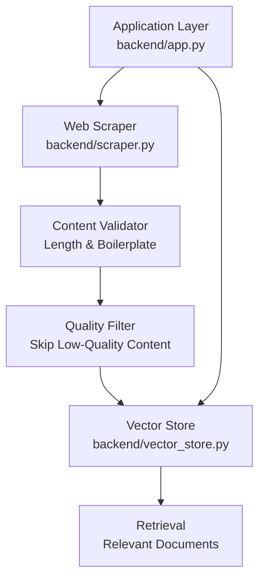
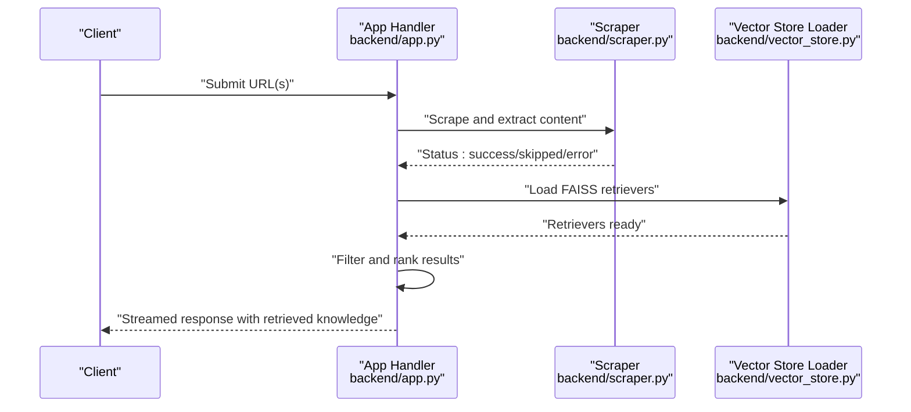
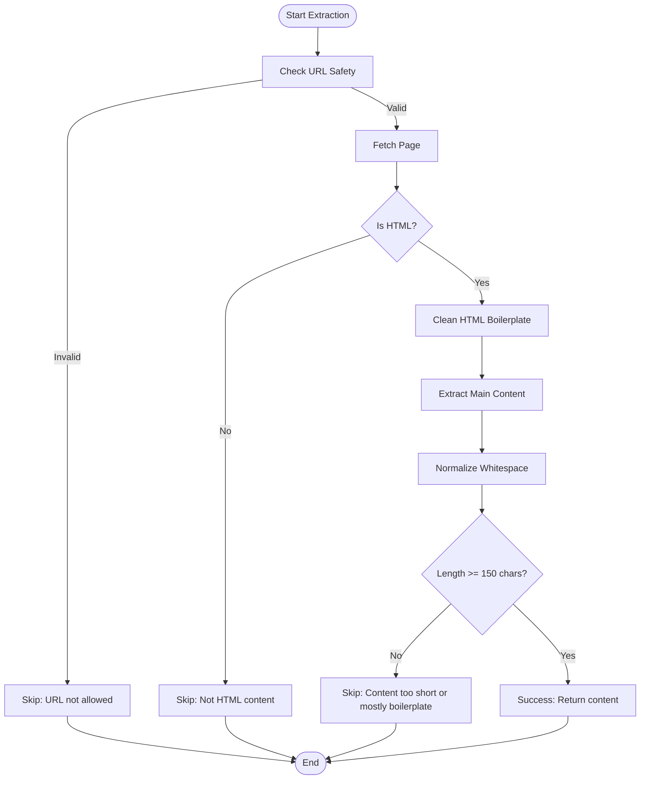
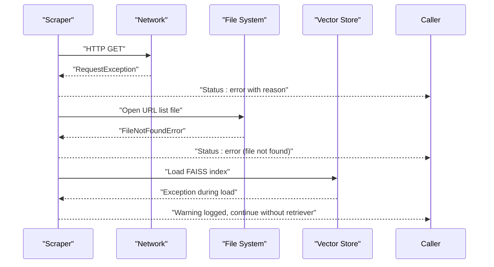
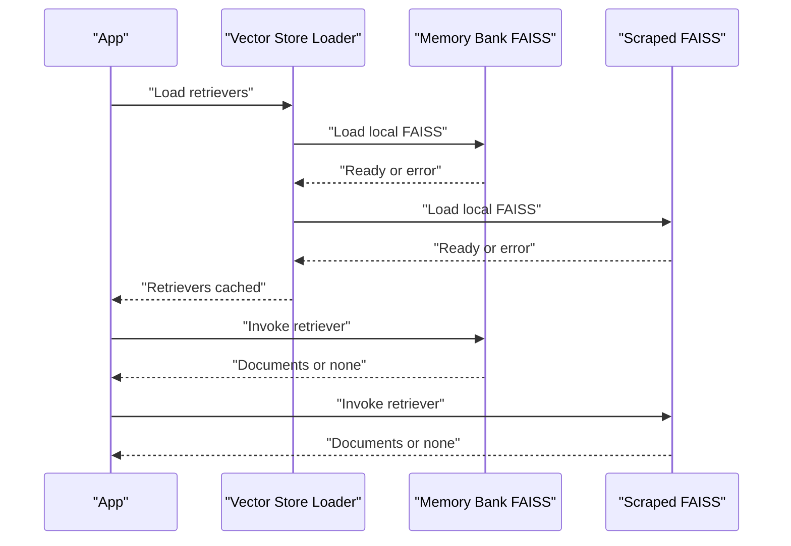
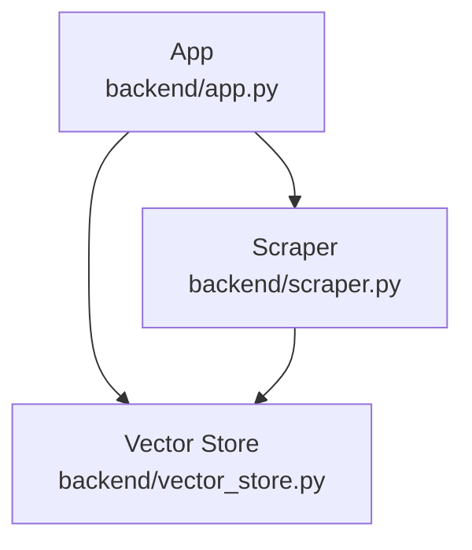

# Content Validation and Quality Assessment

<cite>
**Referenced Files in This Document**
- [API_DOCUMENTATION.md](file://API_DOCUMENTATION.md)
- [backend/app.py](file://backend/app.py)
- [backend/scraper.py](file://backend/scraper.py)
- [backend/vector_store.py](file://backend/vector_store.py)
</cite>

## Table of Contents
1. [Introduction](#introduction)
2. [Project Structure](#project-structure)
3. [Core Components](#core-components)
4. [Architecture Overview](#architecture-overview)
5. [Detailed Component Analysis](#detailed-component-analysis)
6. [Dependency Analysis](#dependency-analysis)
7. [Performance Considerations](#performance-considerations)
8. [Troubleshooting Guide](#troubleshooting-guide)
9. [Conclusion](#conclusion)

## Introduction
This document explains the content validation and quality assessment system used to filter and score web-scraped content before indexing into the vector store. It focuses on:
- Minimum content length requirement (150 characters) and its impact on filtering
- Quality scoring criteria including boilerplate removal, content density analysis, and relevance assessment
- Automatic skipping mechanism for low-quality content
- Error handling for various failure scenarios
- Examples of validation thresholds and quality metrics
- Rationale for the content length requirement in relation to vector search integration

## Project Structure
The validation and quality assessment logic spans several modules:
- Web scraping and content extraction: responsible for fetching pages, removing boilerplate, extracting main content, and applying length-based filtering
- Application-level validation: enforces query and content limits and orchestrates retrieval from vector stores
- Vector store integration: loads FAISS indices and retrieves relevant documents for downstream processing

**Diagram sources**
- [backend/scraper.py:83-162](file://backend/scraper.py#L83-L162)
- [backend/vector_store.py:97-115](file://backend/vector_store.py#L97-L115)
- [backend/app.py:589-656](file://backend/app.py#L589-L656)

**Section sources**
- [backend/scraper.py:83-162](file://backend/scraper.py#L83-L162)
- [backend/vector_store.py:97-115](file://backend/vector_store.py#L97-L115)
- [backend/app.py:589-656](file://backend/app.py#L589-L656)

## Core Components
- Content extraction and cleaning pipeline: removes boilerplate, extracts main content, normalizes whitespace, and determines content quality
- Minimum length threshold: rejects content shorter than 150 characters to avoid noise and improve vector search effectiveness
- Automatic skipping: skips pages with insufficient content or missing main content
- Error handling: captures network errors, invalid URLs, and extraction failures with structured status responses
- Vector store integration: loads FAISS indices and retrieves relevant documents for downstream processing

**Section sources**
- [backend/scraper.py:83-162](file://backend/scraper.py#L83-L162)
- [backend/vector_store.py:97-115](file://backend/vector_store.py#L97-L115)
- [backend/app.py:589-656](file://backend/app.py#L589-L656)

## Architecture Overview
The system integrates scraping, validation, and retrieval into a cohesive pipeline. The application routes requests to the scraper, applies quality checks, and then queries vector stores for relevant knowledge.

**Diagram sources**
- [backend/app.py:589-656](file://backend/app.py#L589-L656)
- [backend/scraper.py:83-162](file://backend/scraper.py#L83-L162)
- [backend/vector_store.py:97-115](file://backend/vector_store.py#L97-L115)

## Detailed Component Analysis

### Web Scraper and Content Validation
The scraper performs the following steps:
- Validates URL safety and content type
- Cleans HTML to remove boilerplate
- Extracts main content and metadata
- Normalizes content and computes length
- Applies minimum length threshold (150 characters)
- Skips pages with insufficient content or missing main content
- Handles network and parsing errors gracefully

Key behaviors:
- Boilerplate removal: cleans HTML before extraction to reduce noise
- Content extraction: uses extraction libraries to isolate main article-like content
- Length-based filtering: rejects content shorter than 150 characters
- Automatic skipping: returns structured status indicating skip and reason
- Error handling: returns structured error status with reason

**Diagram sources**
- [backend/scraper.py:83-162](file://backend/scraper.py#L83-L162)

**Section sources**
- [backend/scraper.py:83-162](file://backend/scraper.py#L83-L162)

### Quality Scoring Criteria
While explicit numeric scoring is not implemented, the system applies implicit quality signals:
- Boilerplate detection: removal of navigation, ads, footers, and other non-content elements improves signal-to-noise ratio
- Content density analysis: normalization and length threshold implicitly penalize sparse or boilerplate-heavy pages
- Relevance assessment: vector store retrieval aligns extracted content with user queries post-filtering

Validation thresholds:
- Minimum content length: 150 characters
- Maximum individual chat part length: 10,000 characters (applied during chat history validation)
- Maximum query length: 2,000 characters (enforced by application handlers)

**Section sources**
- [backend/scraper.py:142-144](file://backend/scraper.py#L142-L144)
- [backend/app.py:188-217](file://backend/app.py#L188-L217)
- [API_DOCUMENTATION.md:300-306](file://API_DOCUMENTATION.md#L300-L306)

### Automatic Skipping Mechanism
Pages are automatically skipped under the following conditions:
- URL is not allowed (security protection)
- Content type is not HTML
- Extracted content length is below 150 characters
- No main content was found after extraction

Skipping returns structured status with reason for transparency.

**Section sources**
- [backend/scraper.py:198-206](file://backend/scraper.py#L198-L206)
- [backend/scraper.py:142-147](file://backend/scraper.py#L142-L147)
- [backend/scraper.py:267-272](file://backend/scraper.py#L267-L272)

### Error Handling for Failure Scenarios
The system handles errors consistently:
- Network exceptions during fetch: returns error status with reason
- File read errors for batch scraping: returns error status indicating file not found
- Vector store load failures: logs warnings and continues without retrievers
- Chat history validation errors: truncates and sanitizes input to safe limits

**Diagram sources**
- [backend/scraper.py:149-150](file://backend/scraper.py#L149-L150)
- [backend/scraper.py:159-161](file://backend/scraper.py#L159-L161)
- [backend/vector_store.py:100-111](file://backend/vector_store.py#L100-L111)

**Section sources**
- [backend/scraper.py:149-150](file://backend/scraper.py#L149-L150)
- [backend/scraper.py:159-161](file://backend/scraper.py#L159-L161)
- [backend/vector_store.py:100-111](file://backend/vector_store.py#L100-L111)

### Vector Store Integration and Retrieval
The application loads FAISS indices for memory bank and scraped data, then retrieves relevant documents for each query. Retrieval is performed safely with error handling to avoid blocking the user experience.

**Diagram sources**
- [backend/vector_store.py:97-115](file://backend/vector_store.py#L97-L115)
- [backend/app.py:616-656](file://backend/app.py#L616-L656)

**Section sources**
- [backend/vector_store.py:97-115](file://backend/vector_store.py#L97-L115)
- [backend/app.py:616-656](file://backend/app.py#L616-L656)

## Dependency Analysis
The validation and retrieval pipeline depends on:
- Scraper module for content extraction and quality filtering
- Vector store module for FAISS index loading and retrieval
- Application module for orchestration, validation, and streaming responses

**Diagram sources**
- [backend/app.py:589-656](file://backend/app.py#L589-L656)
- [backend/scraper.py:83-162](file://backend/scraper.py#L83-L162)
- [backend/vector_store.py:97-115](file://backend/vector_store.py#L97-L115)

**Section sources**
- [backend/app.py:589-656](file://backend/app.py#L589-L656)
- [backend/scraper.py:83-162](file://backend/scraper.py#L83-L162)
- [backend/vector_store.py:97-115](file://backend/vector_store.py#L97-L115)

## Performance Considerations
- Minimum length threshold (150 characters) reduces noise and improves vector search quality by ensuring indexed content is substantial and meaningful
- Boilerplate removal and content normalization decrease embedding dimensionality overhead and improve retrieval precision
- Batch scraping and caching of retrievers minimize repeated I/O and computation costs
- Streaming responses enable responsive user experiences while processing large knowledge sets

[No sources needed since this section provides general guidance]

## Troubleshooting Guide
Common issues and resolutions:
- Content too short or mostly boilerplate: adjust extraction parameters or review page structure; ensure sufficient textual content exists
- No main content found: verify page structure and extraction logic; confirm that content areas are not hidden or dynamically loaded
- URL not allowed: check URL safety policies and SSRF protections; whitelist trusted domains
- Not HTML content: ensure content type is HTML; handle redirects properly
- File not found for batch scraping: verify file path and permissions; ensure file contains valid URLs
- Vector store load failures: check index file integrity and embedding compatibility; retry loading or rebuild indices

**Section sources**
- [backend/scraper.py:142-147](file://backend/scraper.py#L142-L147)
- [backend/scraper.py:198-206](file://backend/scraper.py#L198-L206)
- [backend/scraper.py:159-161](file://backend/scraper.py#L159-L161)
- [backend/vector_store.py:100-111](file://backend/vector_store.py#L100-L111)

## Conclusion
The content validation and quality assessment system ensures that only high-quality, substantial content is indexed and retrieved. The 150-character minimum length threshold, combined with boilerplate removal and robust error handling, creates a reliable foundation for vector search integration. By filtering out low-signal content and streamlining retrieval, the system improves both relevance and performance.

[No sources needed since this section summarizes without analyzing specific files]