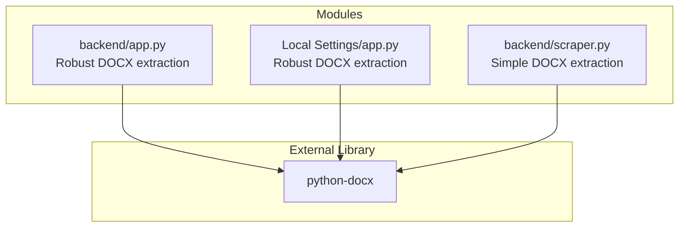
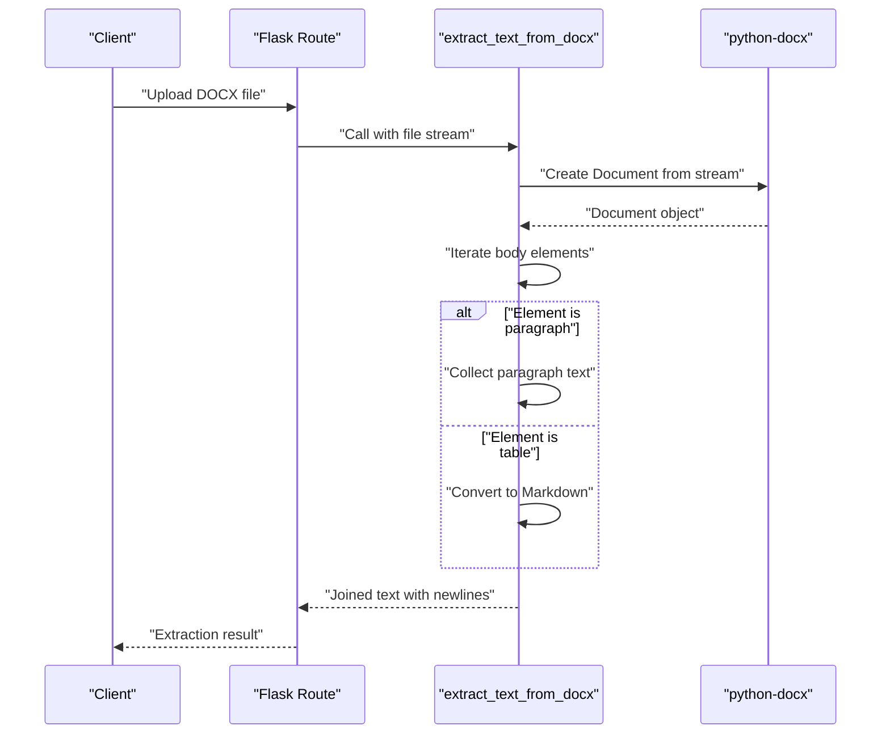
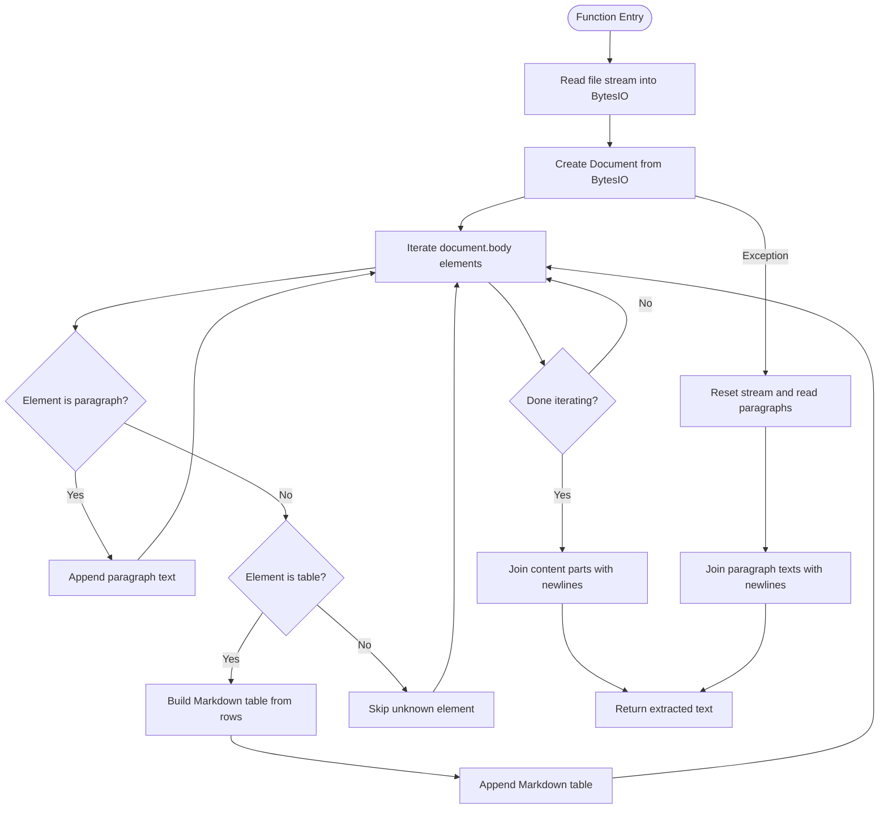
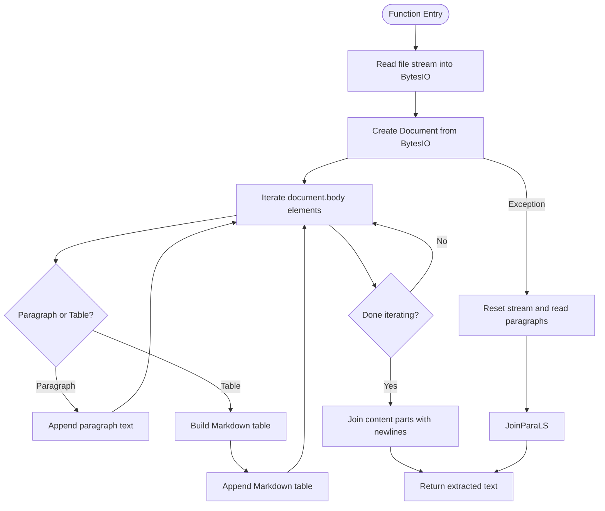
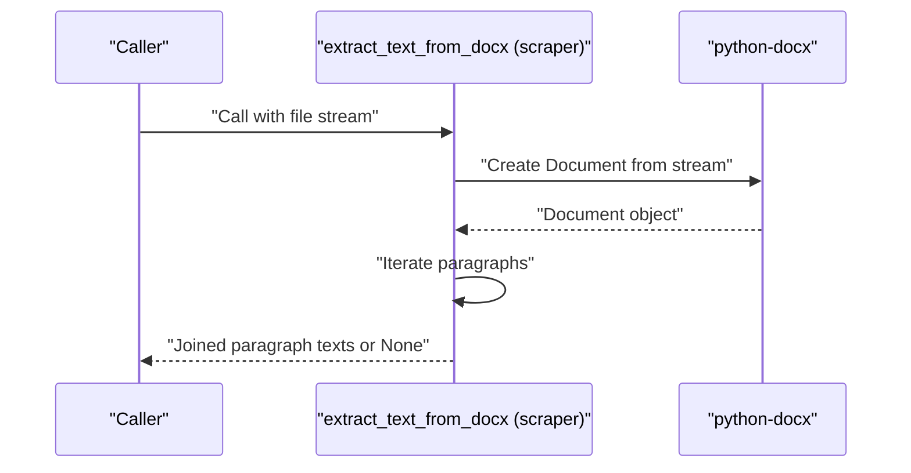
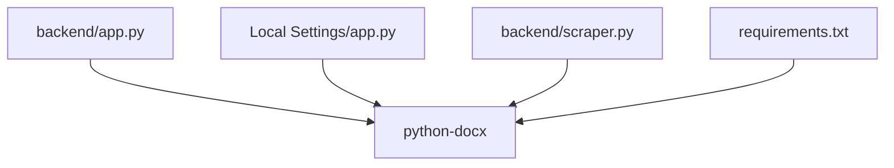

# DOCX Document Processing

<cite>
**Referenced Files in This Document**
- [backend/app.py](file://backend/app.py)
- [Local Settings/app.py](file://Local Settings/app.py)
- [backend/scraper.py](file://backend/scraper.py)
- [requirements.txt](file://requirements.txt)
</cite>

## Table of Contents
1. [Introduction](#introduction)
2. [Project Structure](#project-structure)
3. [Core Components](#core-components)
4. [Architecture Overview](#architecture-overview)
5. [Detailed Component Analysis](#detailed-component-analysis)
6. [Dependency Analysis](#dependency-analysis)
7. [Performance Considerations](#performance-considerations)
8. [Troubleshooting Guide](#troubleshooting-guide)
9. [Conclusion](#conclusion)

## Introduction
This document explains how DOCX documents are processed for text extraction in the project using the python-docx library. It focuses on the extract_text_from_docx function implementation, including document object creation, paragraph iteration, table detection and conversion to Markdown, and text collection with newline separators. It also covers file stream handling, error management, return value structures, supported DOCX features, formatting preservation expectations, and limitations for complex document layouts.

## Project Structure
The DOCX text extraction logic appears in two modules:
- A robust implementation in the backend application module that extracts paragraphs and converts tables to Markdown.
- A simpler implementation in the scraper module that extracts paragraphs only.
- A local settings module with a similar robust implementation.

**Diagram sources**
- [backend/app.py:25](file://backend/app.py#L25)
- [Local Settings/app.py:17](file://Local Settings/app.py#L17)
- [backend/scraper.py:5](file://backend/scraper.py#L5)

**Section sources**
- [backend/app.py:25](file://backend/app.py#L25)
- [Local Settings/app.py:17](file://Local Settings/app.py#L17)
- [backend/scraper.py:5](file://backend/scraper.py#L5)

## Core Components
- extract_text_from_docx in backend/app.py: Full-featured extraction supporting paragraphs and tables. Tables are converted to Markdown with a header row and separator, followed by subsequent rows. On failure, it falls back to reading paragraphs directly from the file stream.
- extract_text_from_docx in Local Settings/app.py: Similar robust implementation as backend/app.py.
- extract_text_from_docx in backend/scraper.py: Simplified extraction that reads only paragraphs and joins them with newline separators.

Key characteristics:
- Accepts a file stream (BytesIO or werkzeug FileStorage stream).
- Iterates document body elements to distinguish paragraphs and tables.
- Converts tables to Markdown with proper separators.
- Returns a single string with newline-separated content parts.

**Section sources**
- [backend/app.py:375-400](file://backend/app.py#L375-L400)
- [Local Settings/app.py:51-76](file://Local Settings/app.py#L51-L76)
- [backend/scraper.py:45-52](file://backend/scraper.py#L45-L52)

## Architecture Overview
The extraction pipeline integrates with Flask routes that handle file uploads and trigger text extraction. The flow varies slightly depending on the module, but both share the same python-docx-based extraction logic.

**Diagram sources**
- [backend/app.py:542-559](file://backend/app.py#L542-L559)
- [backend/app.py:375-400](file://backend/app.py#L375-L400)
- [Local Settings/app.py:136-166](file://Local Settings/app.py#L136-L166)
- [Local Settings/app.py:51-76](file://Local Settings/app.py#L51-L76)

## Detailed Component Analysis

### Backend Application Module Implementation
This implementation provides comprehensive extraction:
- Reads the entire file stream into memory using BytesIO to support re-reading on error.
- Iterates document.body elements to detect paragraphs and tables.
- For paragraphs, collects text directly.
- For tables, constructs a Markdown table with header row and separator, then appends remaining rows.
- Joins collected parts with newline separators.
- Includes a fallback: if the initial attempt fails, it resets the stream and reads paragraphs directly.

**Diagram sources**
- [backend/app.py:375-400](file://backend/app.py#L375-L400)

**Section sources**
- [backend/app.py:375-400](file://backend/app.py#L375-L400)

### Local Settings Module Implementation
This implementation mirrors the backend’s robust approach:
- Reads the stream into BytesIO.
- Iterates document.body elements to collect paragraphs and convert tables to Markdown.
- Falls back to paragraph extraction on exceptions.

**Diagram sources**
- [Local Settings/app.py:51-76](file://Local Settings/app.py#L51-L76)

**Section sources**
- [Local Settings/app.py:51-76](file://Local Settings/app.py#L51-L76)

### Scraper Module Implementation
This implementation is simpler:
- Reads the file stream directly with python-docx.
- Collects paragraph texts and joins them with newline separators.
- Returns None on exception.

**Diagram sources**
- [backend/scraper.py:45-52](file://backend/scraper.py#L45-L52)

**Section sources**
- [backend/scraper.py:45-52](file://backend/scraper.py#L45-L52)

### File Stream Handling and Error Management
- Robust implementations:
  - Read entire stream into BytesIO to enable re-reading after seeking.
  - Reset stream pointer to the beginning on exception to retry reading paragraphs.
  - Return a single string with newline separators for content parts.
- Simpler implementation:
  - Directly pass the stream to python-docx.
  - Return None on exception.

**Section sources**
- [backend/app.py:375-400](file://backend/app.py#L375-L400)
- [Local Settings/app.py:51-76](file://Local Settings/app.py#L51-L76)
- [backend/scraper.py:45-52](file://backend/scraper.py#L45-L52)

### Supported DOCX Features and Formatting Expectations
- Paragraphs: Extracted as-is, preserving newline boundaries between paragraphs.
- Tables: Converted to Markdown with:
  - Header row followed by a separator row.
  - Subsequent rows appended as table rows.
  - Newline separators between content parts.
- Formatting: Basic text formatting (bold, italic, underline) is not preserved; only plain text content is returned.

**Section sources**
- [backend/app.py:375-400](file://backend/app.py#L375-L400)
- [Local Settings/app.py:51-76](file://Local Settings/app.py#L51-L76)

### Limitations for Complex Document Layouts
- Images and embedded objects: Not extracted; only textual content is captured.
- Advanced layout features (columns, nested tables, complex headers): May not render as intended in Markdown; the implementation focuses on basic table structure.
- Headers and footers: Not included in the extracted text.
- Hyperlinks: Extracted as plain text; hyperlink targets are not preserved.

**Section sources**
- [backend/app.py:375-400](file://backend/app.py#L375-L400)
- [Local Settings/app.py:51-76](file://Local Settings/app.py#L51-L76)

## Dependency Analysis
The DOCX extraction relies on the python-docx library. Both backend modules import and use it to parse DOCX streams.

**Diagram sources**
- [backend/app.py:25](file://backend/app.py#L25)
- [Local Settings/app.py:17](file://Local Settings/app.py#L17)
- [backend/scraper.py:5](file://backend/scraper.py#L5)
- [requirements.txt](file://requirements.txt)

**Section sources**
- [backend/app.py:25](file://backend/app.py#L25)
- [Local Settings/app.py:17](file://Local Settings/app.py#L17)
- [backend/scraper.py:5](file://backend/scraper.py#L5)
- [requirements.txt](file://requirements.txt)

## Performance Considerations
- Stream-to-memory behavior: The robust implementations read the entire stream into memory using BytesIO. For very large DOCX files, this increases memory usage. Consider streaming alternatives if memory constraints arise.
- Re-reading on error: Seeking back to the beginning of the stream allows a fallback to paragraph extraction, ensuring reliability at the cost of an extra read operation.
- Table processing: Converting tables to Markdown adds overhead proportional to the number of cells and rows. For documents with many tables, expect increased processing time.

[No sources needed since this section provides general guidance]

## Troubleshooting Guide
Common issues and resolutions:
- Empty or unreadable DOCX:
  - The robust implementations reset the stream and fall back to paragraph extraction. If both attempts fail, return an empty string or None depending on the module.
- Unsupported or corrupted content:
  - python-docx may raise exceptions when encountering unsupported elements. The fallback ensures paragraphs are still extracted when possible.
- Large files:
  - Memory usage increases due to loading the entire stream into memory. Monitor memory consumption and consider optimizing for very large files.

**Section sources**
- [backend/app.py:375-400](file://backend/app.py#L375-L400)
- [Local Settings/app.py:51-76](file://Local Settings/app.py#L51-L76)
- [backend/scraper.py:45-52](file://backend/scraper.py#L45-L52)

## Conclusion
The project implements reliable DOCX text extraction using python-docx. The backend module offers a robust solution that captures paragraphs and converts tables to Markdown, with a fallback to paragraph extraction on errors. The local settings module mirrors this approach. The scraper module provides a simpler, paragraph-only extractor. Together, these implementations balance accuracy, reliability, and simplicity for typical DOCX processing needs.