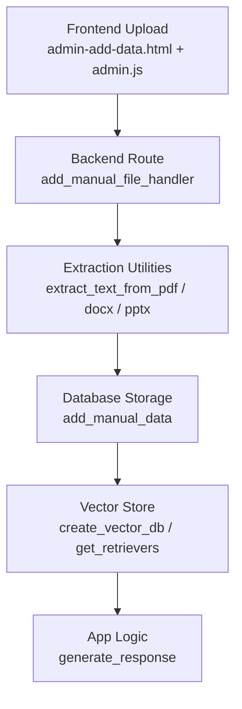
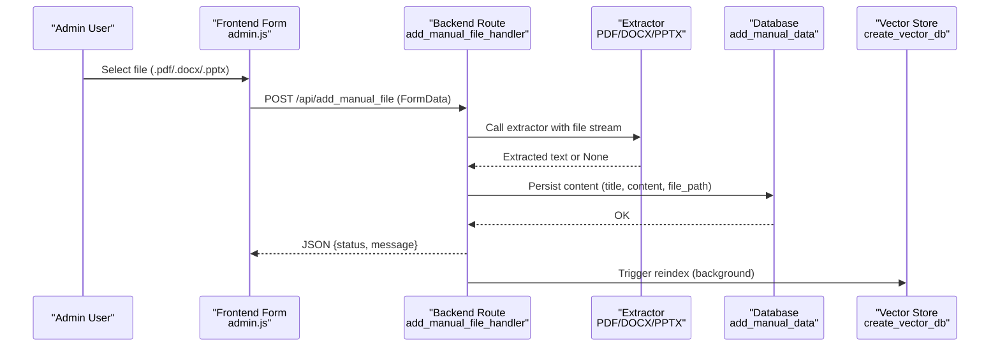
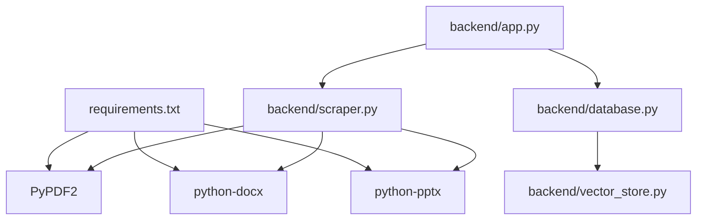

# Format-Specific Extraction

<cite>
**Referenced Files in This Document**
- [backend/app.py](file://backend/app.py)
- [backend/scraper.py](file://backend/scraper.py)
- [backend/database.py](file://backend/database.py)
- [backend/vector_store.py](file://backend/vector_store.py)
- [requirements.txt](file://requirements.txt)
- [frontend/admin-add-data.html](file://frontend/admin-add-data.html)
- [frontend/admin.js](file://frontend/admin.js)
</cite>

## Table of Contents
1. [Introduction](#introduction)
2. [Project Structure](#project-structure)
3. [Core Components](#core-components)
4. [Architecture Overview](#architecture-overview)
5. [Detailed Component Analysis](#detailed-component-analysis)
6. [Dependency Analysis](#dependency-analysis)
7. [Performance Considerations](#performance-considerations)
8. [Troubleshooting Guide](#troubleshooting-guide)
9. [Conclusion](#conclusion)

## Introduction
This document explains the format-specific content extraction capabilities implemented in the backend. It focuses on:
- PDF extraction using PyPDF2 with page-by-page text extraction and robust error handling
- DOCX document processing with paragraph-based text collection and basic table conversion to Markdown
- PPTX presentation extraction focusing on slide-based content gathering and text shape processing
It also covers supported file formats, minimum requirements, processing limitations, and how file streams are handled, exceptions are managed, and return value structures are designed.

## Project Structure
The extraction pipeline spans the frontend upload interface, backend route handlers, and extraction utilities. The key files are:
- Backend routes and file handling: [backend/app.py](file://backend/app.py)
- Extraction utilities: [backend/scraper.py](file://backend/scraper.py)
- Vector store and indexing: [backend/vector_store.py](file://backend/vector_store.py)
- Database persistence: [backend/database.py](file://backend/database.py)
- Frontend upload form and JS: [frontend/admin-add-data.html](file://frontend/admin-add-data.html), [frontend/admin.js](file://frontend/admin.js)
- Dependencies: [requirements.txt](file://requirements.txt)

**Diagram sources**
- [frontend/admin-add-data.html:86-106](file://frontend/admin-add-data.html#L86-L106)
- [frontend/admin.js:939-968](file://frontend/admin.js#L939-L968)
- [backend/app.py:520-566](file://backend/app.py#L520-L566)
- [backend/scraper.py:33-66](file://backend/scraper.py#L33-L66)
- [backend/database.py:61-104](file://backend/database.py#L61-L104)
- [backend/vector_store.py:48-70](file://backend/vector_store.py#L48-L70)

**Section sources**
- [backend/app.py:124-126](file://backend/app.py#L124-L126)
- [requirements.txt:17-21](file://requirements.txt#L17-L21)

## Core Components
- Supported formats: PDF, DOCX, PPTX, TXT
- Allowed file extensions: pdf, docx, pptx, txt
- Maximum upload size: 16 MB
- Maximum text content length: 100 KB
- Maximum query length: 2 KB
- Maximum bug report description length: 5 KB

Extraction functions:
- PDF: [extract_text_from_pdf:33-43](file://backend/scraper.py#L33-L43)
- DOCX: [extract_text_from_docx:45-52](file://backend/scraper.py#L45-L52)
- PPTX: [extract_text_from_pptx:54-66](file://backend/scraper.py#L54-L66)

Return value structures:
- Functions return extracted text or None on failure
- The backend route converts None to an error response

**Section sources**
- [backend/app.py:124-133](file://backend/app.py#L124-L133)
- [backend/scraper.py:33-66](file://backend/scraper.py#L33-L66)

## Architecture Overview
End-to-end flow for manual file upload and extraction:

**Diagram sources**
- [frontend/admin.js:939-968](file://frontend/admin.js#L939-L968)
- [backend/app.py:520-566](file://backend/app.py#L520-L566)
- [backend/scraper.py:33-66](file://backend/scraper.py#L33-L66)
- [backend/database.py:61-104](file://backend/database.py#L61-L104)
- [backend/vector_store.py:48-70](file://backend/vector_store.py#L48-L70)

## Detailed Component Analysis

### PDF Extraction (PyPDF2)
Purpose:
- Extract text from PDFs page by page and concatenate results.

Implementation highlights:
- Uses a PdfReader on the file stream
- Iterates over pages and extracts text
- Returns concatenated text or None on exception

Error handling:
- Exceptions are caught and None is returned
- The caller checks for None and returns an error response

Return value:
- String (concatenated text) or None

Processing limitations:
- Relies on text-extractable PDFs; scanned images or encrypted PDFs may produce empty or partial results
- Large PDFs increase processing time and memory usage

Example snippet path:
- [extract_text_from_pdf:33-43](file://backend/scraper.py#L33-L43)

**Section sources**
- [backend/scraper.py:33-43](file://backend/scraper.py#L33-L43)

### DOCX Extraction (python-docx)
Purpose:
- Collect paragraphs and convert tables to Markdown.

Implementation highlights:
- Reads the DOCX file stream
- Iterates over document elements
- Paragraphs are appended as-is
- Tables are converted to Markdown with header separator and rows

Fallback behavior:
- On exception, attempts to read paragraphs directly from the file stream

Return value:
- String (paragraphs + Markdown tables) or None

Processing limitations:
- Images, footnotes, and complex styles are not extracted
- Formatting (bold, italic) is not preserved; only raw text is collected

Example snippet path:
- [extract_text_from_docx:45-52](file://backend/scraper.py#L45-L52)
- [extract_text_from_docx in app:375-400](file://backend/app.py#L375-L400)

**Section sources**
- [backend/scraper.py:45-52](file://backend/scraper.py#L45-L52)
- [backend/app.py:375-400](file://backend/app.py#L375-L400)

### PPTX Extraction (python-pptx)
Purpose:
- Gather text from slides by iterating shapes.

Implementation highlights:
- Loads the presentation from the file stream
- Iterates over slides and shapes
- Concatenates text from shapes that expose a text attribute

Error handling:
- Exceptions are caught and None is returned

Return value:
- String (concatenated text) or None

Processing limitations:
- Non-text shapes (e.g., charts, SmartArt) are skipped
- Slide master and layout text may not be captured consistently

Example snippet path:
- [extract_text_from_pptx:54-66](file://backend/scraper.py#L54-L66)

**Section sources**
- [backend/scraper.py:54-66](file://backend/scraper.py#L54-L66)

### File Stream Handling and Route Integration
- Frontend sends multipart/form-data with a file field
- Backend validates extension and saves file to disk
- Backend opens the saved file in binary mode and passes the file handle to extractors
- Extractor functions receive a file stream and return text or None
- The route checks for None and returns an error; otherwise persists content and triggers reindex

Example snippet paths:
- [Frontend form and JS:86-106](file://frontend/admin-add-data.html#L86-L106)
- [Frontend JS upload:939-968](file://frontend/admin.js#L939-L968)
- [Backend route:520-566](file://backend/app.py#L520-L566)

**Section sources**
- [frontend/admin-add-data.html:86-106](file://frontend/admin-add-data.html#L86-L106)
- [frontend/admin.js:939-968](file://frontend/admin.js#L939-L968)
- [backend/app.py:520-566](file://backend/app.py#L520-L566)

### Return Value Structures and Error Handling
- Extractor functions return either a string or None
- The route checks the return value and returns an error response if None
- The route also enforces:
  - File size limits (16 MB)
  - Content length limits (100 KB)
  - Extension whitelist

Example snippet paths:
- [Route error handling:542-566](file://backend/app.py#L542-L566)
- [Limits:124-133](file://backend/app.py#L124-L133)

**Section sources**
- [backend/app.py:124-133](file://backend/app.py#L124-L133)
- [backend/app.py:542-566](file://backend/app.py#L542-L566)

## Dependency Analysis
External libraries used for extraction:
- PyPDF2: [requirements.txt](file://requirements.txt#L17)
- python-docx: [requirements.txt](file://requirements.txt#L18)
- python-pptx: [requirements.txt](file://requirements.txt#L21)

Internal dependencies:
- Backend route depends on extraction utilities
- Database stores extracted content
- Vector store indexes content for retrieval

**Diagram sources**
- [requirements.txt:17-21](file://requirements.txt#L17-L21)
- [backend/app.py:13-13](file://backend/app.py#L13-L13)
- [backend/scraper.py:5-7](file://backend/scraper.py#L5-L7)

**Section sources**
- [requirements.txt:17-21](file://requirements.txt#L17-L21)
- [backend/app.py:13-13](file://backend/app.py#L13-L13)
- [backend/scraper.py:5-7](file://backend/scraper.py#L5-L7)

## Performance Considerations
- PDF extraction iterates over all pages; very large PDFs can be slow and memory-intensive
- DOCX extraction reads all paragraphs and tables; complex documents with many tables incur overhead
- PPTX extraction iterates over all slides and shapes; presentations with many shapes can be heavy
- Consider chunking or streaming for extremely large files if needed
- Vector store creation splits documents into chunks; adjust chunk size and overlap for balance between recall and speed

[No sources needed since this section provides general guidance]

## Troubleshooting Guide
Common issues and resolutions:
- Empty or minimal text extraction
  - PDFs without selectable text (scanned images) or protected content
  - DOCX with only images or unsupported elements
  - PPTX with only non-text shapes
  - Resolution: Convert to text-searchable PDFs or export to supported formats
- Extraction returns None
  - Occurs when extractor raises an exception
  - Resolution: Verify file integrity and format; try opening in a viewer
- File upload errors
  - Exceeds 16 MB limit
  - Unsupported extension
  - Resolution: Reduce file size or convert to supported formats
- Content too long
  - Exceeds 100 KB limit
  - Resolution: Trim content or split into smaller files
- Reindexing needed
  - After adding new files, trigger reindex to enable retrieval

**Section sources**
- [backend/app.py:124-133](file://backend/app.py#L124-L133)
- [backend/scraper.py:33-66](file://backend/scraper.py#L33-L66)

## Conclusion
The system provides robust, format-specific extraction for PDF, DOCX, and PPTX with clear error handling and enforced limits. PDF extraction uses page-by-page iteration, DOCX extraction collects paragraphs and converts tables to Markdown, and PPTX extraction gathers text from shapes across slides. The backend integrates extraction with database persistence and vector store indexing, enabling downstream retrieval and chat responses. For best results, ensure files are text-searchable and within size and content limits.