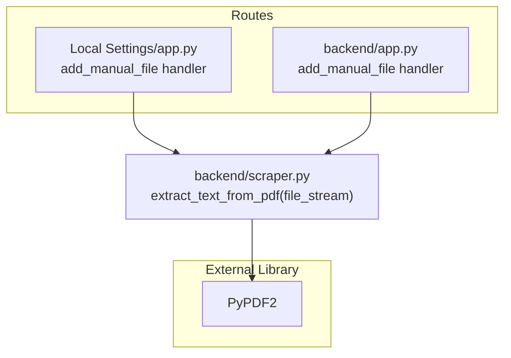
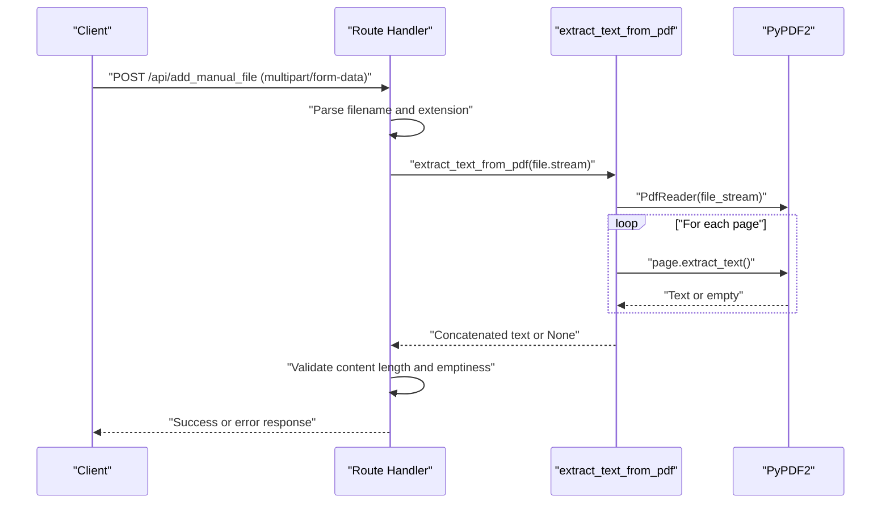
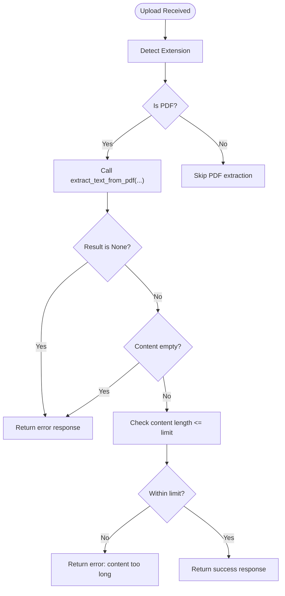
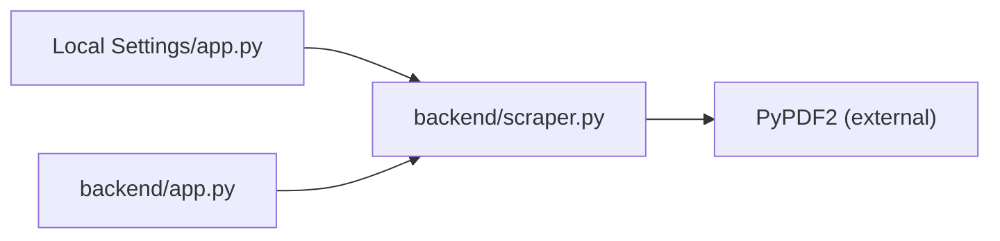

# PDF Text Extraction

<cite>
**Referenced Files in This Document**
- [backend/scraper.py](file://backend/scraper.py)
- [backend/app.py](file://backend/app.py)
- [Local Settings/app.py](file://Local Settings/app.py)
- [requirements.txt](file://requirements.txt)
</cite>

## Table of Contents
1. [Introduction](#introduction)
2. [Project Structure](#project-structure)
3. [Core Components](#core-components)
4. [Architecture Overview](#architecture-overview)
5. [Detailed Component Analysis](#detailed-component-analysis)
6. [Dependency Analysis](#dependency-analysis)
7. [Performance Considerations](#performance-considerations)
8. [Troubleshooting Guide](#troubleshooting-guide)
9. [Conclusion](#conclusion)

## Introduction
This document explains the PDF text extraction functionality powered by the PyPDF2 library within the project. It focuses on the implementation of the extract_text_from_pdf function, covering file stream handling, page iteration, text concatenation, error handling, return value semantics, and practical usage patterns. It also documents supported PDF features, accuracy expectations, and troubleshooting steps for common parsing issues.

## Project Structure
The PDF text extraction capability is implemented in a dedicated module and consumed by two Flask route handlers:
- A reusable function in the scraper module
- Two routes that accept uploaded files and delegate extraction to the function

**Diagram sources**
- [Local Settings/app.py:136-166](file://Local Settings/app.py#L136-L166)
- [backend/app.py:531-566](file://backend/app.py#L531-L566)
- [backend/scraper.py:33-43](file://backend/scraper.py#L33-L43)

**Section sources**
- [Local Settings/app.py:136-166](file://Local Settings/app.py#L136-L166)
- [backend/app.py:531-566](file://backend/app.py#L531-L566)
- [backend/scraper.py:33-43](file://backend/scraper.py#L33-L43)

## Core Components
- extract_text_from_pdf(file_stream): Extracts text from a PDF file stream using PyPDF2. It reads pages sequentially, extracts text per page, concatenates them, and returns the combined text. On failure, it logs an error and returns None.
- Route handlers: Two endpoints accept uploaded files and call extract_text_from_pdf depending on the file extension. They enforce content length limits and handle empty or invalid content.

Key characteristics:
- Input: A file-like object supporting read operations (BytesIO or file handle)
- Output: A string containing concatenated text from all pages, or None on error
- Error handling: Exceptions are caught and logged; the function returns None to signal failure

**Section sources**
- [backend/scraper.py:33-43](file://backend/scraper.py#L33-L43)
- [Local Settings/app.py:148-160](file://Local Settings/app.py#L148-L160)
- [backend/app.py:542-559](file://backend/app.py#L542-L559)

## Architecture Overview
The PDF extraction pipeline is straightforward: a route handler receives a file upload, determines the file type, and invokes the extractor function. The extractor uses PyPDF2 to iterate pages and concatenate extracted text.

**Diagram sources**
- [Local Settings/app.py:136-166](file://Local Settings/app.py#L136-L166)
- [backend/scraper.py:33-43](file://backend/scraper.py#L33-L43)
- [requirements.txt:17](file://requirements.txt#L17)

## Detailed Component Analysis

### Function: extract_text_from_pdf(file_stream)
Purpose:
- Read a PDF from a file-like stream and return its text content.

Implementation highlights:
- Uses PyPDF2.PdfReader to parse the PDF
- Iterates over all pages and extracts text from each page
- Concatenates page texts into a single string
- Returns None on any exception

Behavioral notes:
- The function does not enforce content length limits; upstream callers should validate output length
- On error, it prints a message and returns None; callers should treat None as extraction failure

Return value semantics:
- Success: string containing concatenated text
- Failure: None

Memory and stream considerations:
- The function expects a readable file-like object; it does not close the stream
- Upstream handlers manage file streams and ensure proper cleanup

Processing limitations:
- The function does not apply OCR; it relies on embedded text in the PDF
- It does not handle encrypted or password-protected PDFs without decryption support in the provided stream

**Section sources**
- [backend/scraper.py:33-43](file://backend/scraper.py#L33-L43)

### Route Handlers: PDF Extraction Endpoints
Two endpoints demonstrate different ways to pass a PDF stream to the extractor:
- Local Settings/app.py: Uses file.stream directly
- backend/app.py: Opens a saved file in binary mode and passes the file handle

Both:
- Detect the file extension
- Call extract_text_from_pdf for PDFs
- Validate that content is not empty
- Enforce a maximum text length threshold

**Diagram sources**
- [Local Settings/app.py:148-160](file://Local Settings/app.py#L148-L160)
- [backend/app.py:542-559](file://backend/app.py#L542-L559)

**Section sources**
- [Local Settings/app.py:136-166](file://Local Settings/app.py#L136-L166)
- [backend/app.py:531-566](file://backend/app.py#L531-L566)

### Supported PDF Features and Accuracy Expectations
- Embedded text extraction: The function extracts text from pages that contain embedded text.
- Page iteration: It processes all pages in the PDF.
- Concatenation: Text from all pages is joined into a single string.
- Accuracy expectations:
  - Text order and spacing depend on the PDF’s internal structure
  - Non-embedded text (images) will not be extracted
  - Complex layouts, rotated text, or unusual encodings may lead to imperfect results
- Limitations:
  - No OCR is performed; scanned PDFs without embedded text will produce minimal or empty output
  - Encrypted or password-protected PDFs are not supported unless decrypted beforehand

[No sources needed since this section provides general guidance]

## Dependency Analysis
- External library: PyPDF2 is imported and used for PDF parsing
- Internal dependencies:
  - Local Settings/app.py imports the extractor function from scraper.py
  - backend/app.py imports the extractor function from scraper.py
- Version: PyPDF2 appears in requirements.txt

**Diagram sources**
- [Local Settings/app.py:6](file://Local Settings/app.py#L6)
- [backend/app.py:12](file://backend/app.py#L12)
- [backend/scraper.py:6](file://backend/scraper.py#L6)
- [requirements.txt:17](file://requirements.txt#L17)

**Section sources**
- [Local Settings/app.py:6](file://Local Settings/app.py#L6)
- [backend/app.py:12](file://backend/app.py#L12)
- [backend/scraper.py:6](file://backend/scraper.py#L6)
- [requirements.txt:17](file://requirements.txt#L17)

## Performance Considerations
- Page traversal cost: The function iterates over all pages; very large PDFs will increase processing time linearly with page count
- Memory usage: The function accumulates text in memory; extremely large outputs may strain memory
- Recommendations:
  - Validate content length early (as done by route handlers)
  - Consider streaming or chunked processing if future requirements demand handling very large PDFs
  - Ensure the underlying file stream is efficient (avoid unnecessary buffering)

[No sources needed since this section provides general guidance]

## Troubleshooting Guide
Common issues and resolutions:
- Empty or minimal text:
  - Cause: PDF contains only images or lacks embedded text
  - Resolution: Convert the PDF to a searchable format or use OCR tools before extraction
- Extraction returns None:
  - Cause: An exception occurred during PDF parsing
  - Resolution: Verify the file is a valid PDF; check upstream error logs; ensure the stream is readable
- Content too long:
  - Cause: Extracted text exceeds configured maximum
  - Resolution: Split the PDF into smaller parts or reduce content length before processing
- Encrypted PDFs:
  - Cause: Password-protected PDFs cannot be parsed without decryption
  - Resolution: Decrypt the PDF prior to passing it to the extractor

Operational tips:
- Use the route handlers’ validation to catch empty content and oversized content early
- Monitor logs for exceptions raised by the extractor

**Section sources**
- [backend/scraper.py:41-43](file://backend/scraper.py#L41-L43)
- [Local Settings/app.py:159-160](file://Local Settings/app.py#L159-L160)
- [backend/app.py:557-559](file://backend/app.py#L557-L559)

## Conclusion
The PDF text extraction feature is a focused, robust component that leverages PyPDF2 to extract embedded text from PDFs. It integrates cleanly into two route handlers, which enforce content validation and length limits. While it does not perform OCR or handle encrypted PDFs, it provides reliable extraction for PDFs with embedded text. For improved resilience, consider upstream validation and downstream processing safeguards as demonstrated by the route handlers.