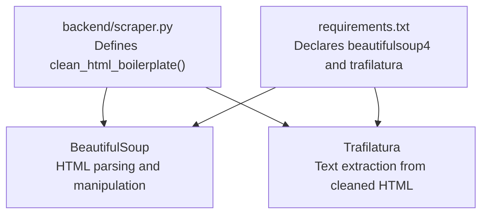
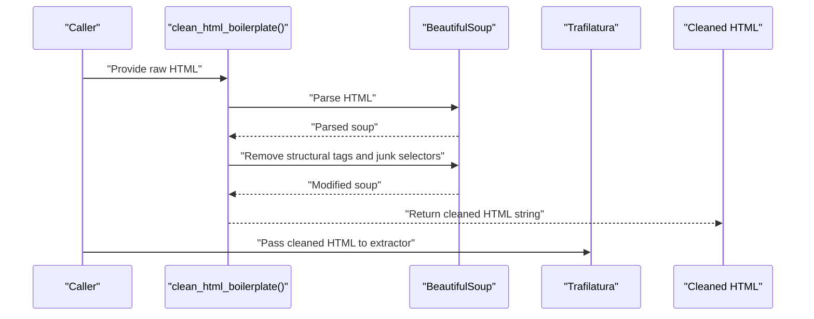
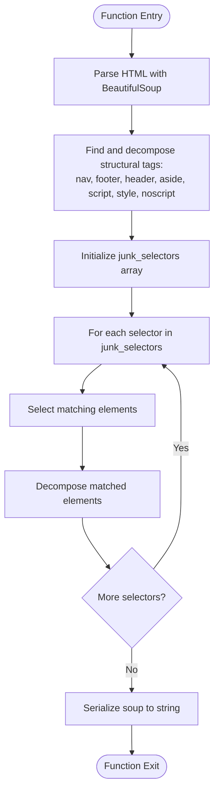
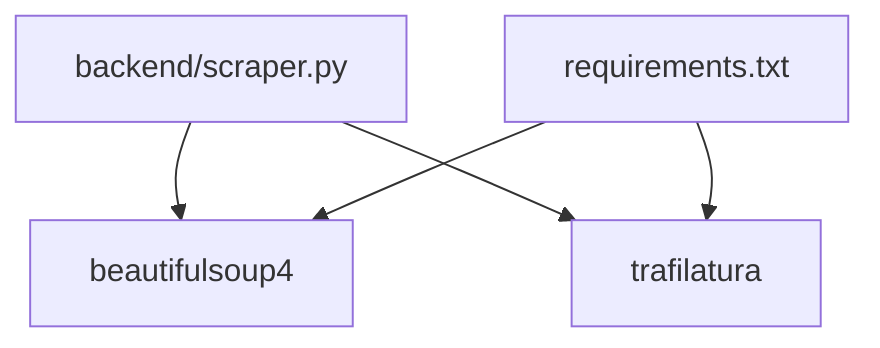

# Boilerplate Removal

<cite>
**Referenced Files in This Document**
- [scraper.py](file://backend/scraper.py)
- [requirements.txt](file://requirements.txt)
</cite>

## Table of Contents
1. [Introduction](#introduction)
2. [Project Structure](#project-structure)
3. [Core Components](#core-components)
4. [Architecture Overview](#architecture-overview)
5. [Detailed Component Analysis](#detailed-component-analysis)
6. [Dependency Analysis](#dependency-analysis)
7. [Performance Considerations](#performance-considerations)
8. [Troubleshooting Guide](#troubleshooting-guide)
9. [Conclusion](#conclusion)

## Introduction
This document explains the HTML boilerplate removal mechanism implemented in the project’s backend. It focuses on the clean_html_boilerplate function that uses BeautifulSoup to remove non-content elements such as navigation, footers, headers, sidebars, and embedded scripts/styles. It also documents the selector-based approach using a predefined junk_selectors array targeting common boilerplate classes and IDs. The rationale for removing these elements and their impact on downstream content extraction quality are covered, along with practical examples of before/after transformations and the role of the decompose() method.

## Project Structure
The boilerplate removal logic resides in the backend module responsible for scraping and content extraction. The relevant implementation is encapsulated in a single Python file and leverages external libraries declared in the project’s dependency list.

**Diagram sources**
- [scraper.py:69-81](file://backend/scraper.py#L69-L81)
- [requirements.txt:14-20](file://requirements.txt#L14-L20)

**Section sources**
- [scraper.py:69-81](file://backend/scraper.py#L69-L81)
- [requirements.txt:14-20](file://requirements.txt#L14-L20)

## Core Components
- clean_html_boilerplate(html_text): A function that:
  - Parses raw HTML into a BeautifulSoup object.
  - Removes structural tags known to carry boilerplate: nav, footer, header, aside, script, style, noscript.
  - Applies CSS selectors from junk_selectors to remove common boilerplate containers and widgets.
  - Returns the cleaned HTML as a string.

Key selector patterns used:
- Class-based selectors: .sidebar, .menu, .navbar, .widget, .footer, .comments, .ad, .advertisement, .cookie-banner, .popup
- ID-based selectors: #sidebar, #menu, #navbar
These patterns target common layout and auxiliary elements that typically surround or accompany the main article content.

Impact on content extraction:
- Reduces noise and irrelevant text that could mislead text extraction tools.
- Improves precision by focusing extraction on the primary textual content.
- Prevents duplication and cross-contamination from repeated navigation or footer blocks.

**Section sources**
- [scraper.py:69-81](file://backend/scraper.py#L69-L81)

## Architecture Overview
The boilerplate removal sits within a larger content extraction pipeline. It is invoked before text extraction to improve signal-to-noise ratio.

**Diagram sources**
- [scraper.py:69-81](file://backend/scraper.py#L69-L81)
- [scraper.py:97-105](file://backend/scraper.py#L97-L105)
- [scraper.py:232-239](file://backend/scraper.py#L232-L239)

## Detailed Component Analysis

### clean_html_boilerplate Function
The function performs two passes:
1) Tag-level removal: Structural tags commonly associated with boilerplate are removed.
2) Selector-based removal: A curated list of CSS selectors targets common boilerplate containers and widgets.

Implementation highlights:
- Uses BeautifulSoup to parse and mutate the DOM.
- Iterates through junk_selectors and removes matching elements via decompose().
- Returns a string representation of the modified soup.

**Diagram sources**
- [scraper.py:69-81](file://backend/scraper.py#L69-L81)

**Section sources**
- [scraper.py:69-81](file://backend/scraper.py#L69-L81)

### Selector Patterns and Target Elements
The junk_selectors array targets common boilerplate containers and widgets. Representative patterns include:
- Classes: .sidebar, .menu, .navbar, .widget, .footer, .comments, .ad, .advertisement, .cookie-banner, .popup
- IDs: #sidebar, #menu, #navbar

These patterns are chosen because they frequently appear in layouts as navigation aids, promotional banners, cookie consent prompts, popups, and auxiliary content blocks that are irrelevant to the main article text.

**Section sources**
- [scraper.py:73-77](file://backend/scraper.py#L73-L77)

### Element Removal Mechanism
The decompose() method is used to remove matched elements from the parsed tree. This ensures:
- The element and all its descendants are removed.
- The DOM remains consistent and free of orphaned nodes.
- Subsequent text extraction tools operate on a cleaner structure.

**Section sources**
- [scraper.py:71-80](file://backend/scraper.py#L71-L80)

### Practical Transformation Examples
Below are typical before/after scenarios illustrating the effect of clean_html_boilerplate on HTML structure.

- Before:
  - A page with a top navigation bar, left sidebar, footer, and embedded ad markup.
- After:
  - The same page with navigation, footer, sidebar, ads, and embedded scripts/styles stripped out.
  - Only the main content area remains, improving readability and extraction accuracy.

These transformations reduce noise and help downstream extraction tools focus on the primary textual content.

[No sources needed since this section describes conceptual transformations without quoting specific code]

### Integration with Content Extraction
The cleaned HTML is passed to Trafilatura for text extraction. This improves extraction quality by:
- Removing repetitive navigation and footer text.
- Eliminating promotional or policy-related content.
- Ensuring extracted text reflects the core article content.

**Section sources**
- [scraper.py:97-105](file://backend/scraper.py#L97-L105)
- [scraper.py:232-239](file://backend/scraper.py#L232-L239)

## Dependency Analysis
The function relies on external libraries declared in the project’s requirements.

**Diagram sources**
- [scraper.py](file://backend/scraper.py#L3)
- [requirements.txt:14-20](file://requirements.txt#L14-L20)

**Section sources**
- [scraper.py](file://backend/scraper.py#L3)
- [requirements.txt:14-20](file://requirements.txt#L14-L20)

## Performance Considerations
- Parsing and mutation overhead: BeautifulSoup parsing and selector matching are linear in the size of the DOM. For large pages, this cost is acceptable given the benefits to extraction quality.
- Selector coverage: The junk_selectors array is curated to cover common boilerplate patterns. Extending it may improve coverage but can slightly increase processing time.
- Early filtering: The function is applied before text extraction, avoiding redundant work later in the pipeline.

[No sources needed since this section provides general guidance]

## Troubleshooting Guide
Common issues and resolutions:
- Over-aggressive removal: If legitimate content is inadvertently removed, review and refine the junk_selectors array to be more specific or add exceptions.
- Missing selectors: If certain boilerplate persists, add targeted selectors for site-specific classes or IDs.
- Mixed content and scripts: Ensure that script and style tags are removed before extraction to prevent interference with text extraction tools.
- Validation: After cleaning, verify that the resulting HTML still contains the intended main content and that no critical structural elements were removed unintentionally.

**Section sources**
- [scraper.py:69-81](file://backend/scraper.py#L69-L81)

## Conclusion
The clean_html_boilerplate function provides a robust, selector-driven approach to removing common HTML boilerplate elements. By combining structural tag removal with targeted CSS selectors and the decompose() method, it significantly improves the quality of downstream text extraction. The approach is simple, maintainable, and adaptable to evolving site layouts through incremental selector updates.