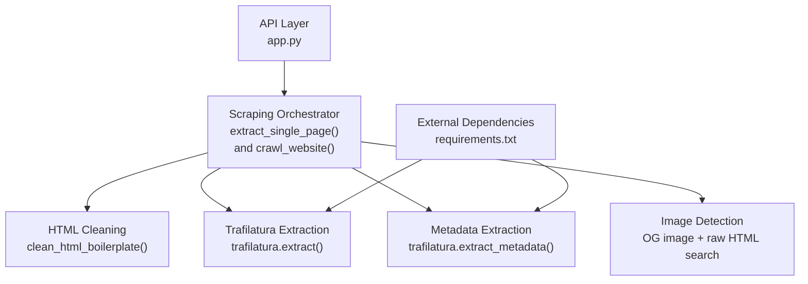
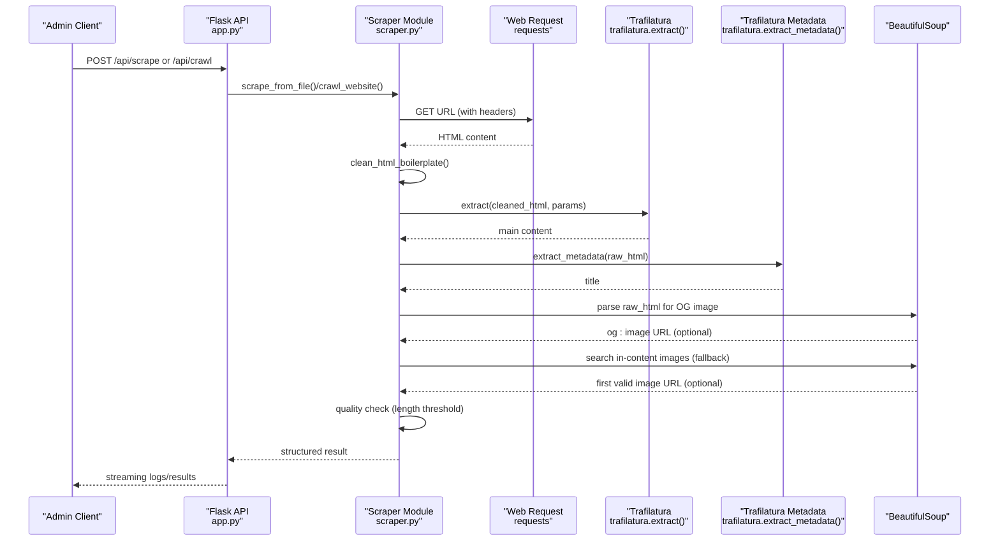
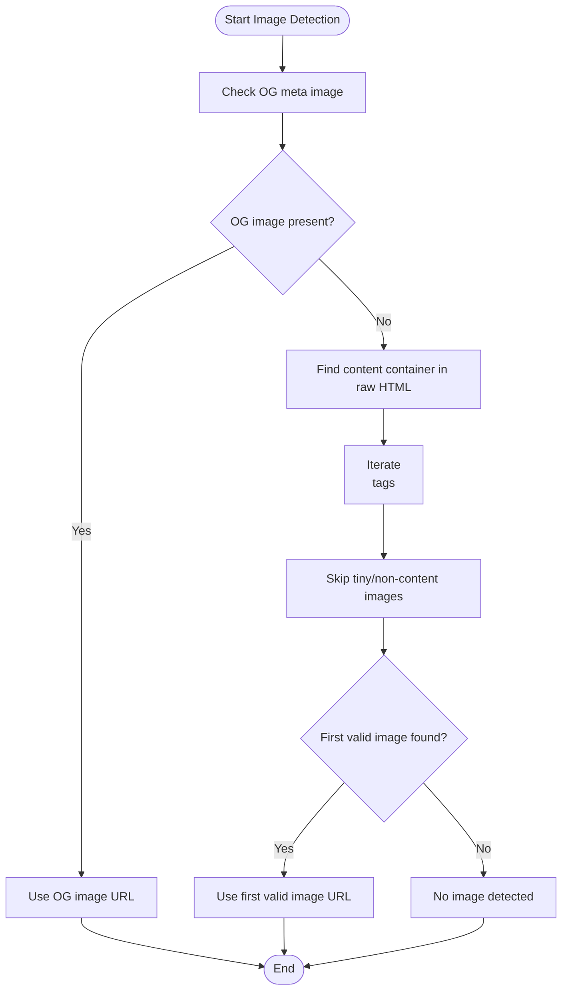
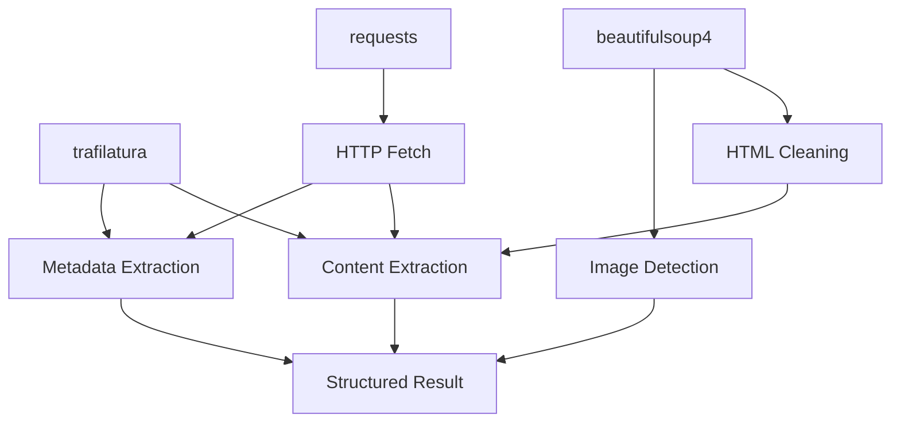

# Content Extraction

<cite>
**Referenced Files in This Document**
- [scraper.py](file://backend/scraper.py)
- [app.py](file://backend/app.py)
- [API_DOCUMENTATION.md](file://API_DOCUMENTATION.md)
- [requirements.txt](file://requirements.txt)
- [urls_to_scrape.txt](file://backend/urls_to_scrape.txt)
</cite>

## Table of Contents
1. [Introduction](#introduction)
2. [Project Structure](#project-structure)
3. [Core Components](#core-components)
4. [Architecture Overview](#architecture-overview)
5. [Detailed Component Analysis](#detailed-component-analysis)
6. [Dependency Analysis](#dependency-analysis)
7. [Performance Considerations](#performance-considerations)
8. [Troubleshooting Guide](#troubleshooting-guide)
9. [Conclusion](#conclusion)
10. [Appendices](#appendices)

## Introduction
This document explains the content extraction pipeline powered by the Trafilatura library. It focuses on the extract_single_page function and its integration with Trafilatura, including parameter configuration for Indonesian language processing, metadata extraction for title capture, and a two-stage extraction approach for robust image detection. It also documents quality assessment via content length thresholds, common failure modes, and optimization strategies tailored for Indonesian websites.

## Project Structure
The content extraction logic resides primarily in the backend module responsible for scraping and crawling. The API integrates these capabilities behind administrative endpoints.

**Diagram sources**
- [app.py:801-846](file://backend/app.py#L801-L846)
- [scraper.py:69-150](file://backend/scraper.py#L69-L150)
- [requirements.txt:20](file://requirements.txt#L20)

**Section sources**
- [app.py:801-846](file://backend/app.py#L801-L846)
- [scraper.py:69-150](file://backend/scraper.py#L69-L150)
- [requirements.txt:1-30](file://requirements.txt#L1-L30)

## Core Components
- Trafilatura integration for extracting readable content and metadata from cleaned HTML.
- A two-stage image detection strategy: OG meta image first, then in-content images from the original HTML.
- Quality gating using a minimum content length threshold.
- Support for batch scraping from a URL list and deep crawling with link discovery.

Key implementation references:
- Single-page extraction with Trafilatura parameters and metadata extraction: [scraper.py:83-150](file://backend/scraper.py#L83-L150)
- Two-stage image detection from OG image and raw HTML: [scraper.py:111-139](file://backend/scraper.py#L111-L139)
- Batch scraping from file: [scraper.py:152-166](file://backend/scraper.py#L152-L166)
- Deep crawling with extraction reuse: [scraper.py:168-278](file://backend/scraper.py#L168-L278)

**Section sources**
- [scraper.py:83-150](file://backend/scraper.py#L83-L150)
- [scraper.py:152-166](file://backend/scraper.py#L152-L166)
- [scraper.py:168-278](file://backend/scraper.py#L168-L278)

## Architecture Overview
The extraction pipeline follows a predictable flow: fetch HTML, remove boilerplate, extract content and metadata, detect a representative image, and apply quality checks.

**Diagram sources**
- [app.py:801-846](file://backend/app.py#L801-L846)
- [scraper.py:83-150](file://backend/scraper.py#L83-L150)
- [scraper.py:168-278](file://backend/scraper.py#L168-L278)

## Detailed Component Analysis

### Trafilatura Integration and Parameter Configuration
The extract_single_page function configures Trafilatura for Indonesian content with:
- include_comments=False: excludes comments to reduce noise.
- include_tables=True: preserves tabular data for richer content.
- favor_precision=True: prioritizes precision over recall, reducing false positives.
- target_language="id": optimizes extraction heuristics for Indonesian text.

These parameters are applied during both single-page extraction and during deep crawling reuse of the same logic.

Implementation references:
- Single-page extraction parameters: [scraper.py:99-105](file://backend/scraper.py#L99-L105)
- Crawling reuse of extraction parameters: [scraper.py:233-239](file://backend/scraper.py#L233-L239)

Quality metadata extraction:
- Title retrieval from raw HTML metadata: [scraper.py:106](file://backend/scraper.py#L106)
- Crawling reuse of title extraction: [scraper.py:240](file://backend/scraper.py#L240)

**Section sources**
- [scraper.py:99-105](file://backend/scraper.py#L99-L105)
- [scraper.py:106](file://backend/scraper.py#L106)
- [scraper.py:233-239](file://backend/scraper.py#L233-L239)
- [scraper.py:240](file://backend/scraper.py#L240)

### Two-Stage Image Detection Strategy
To reliably capture a representative image:
1. Prefer og:image from Open Graph meta tags.
2. Fallback to the first suitable in-content image found in the original HTML (since Trafilatura strips images).

Implementation references:
- OG image priority: [scraper.py:111-114](file://backend/scraper.py#L111-L114)
- Fallback to in-content images: [scraper.py:118-139](file://backend/scraper.py#L118-L139)
- Crawling reuse of image detection: [scraper.py:242-264](file://backend/scraper.py#L242-L264)

**Diagram sources**
- [scraper.py:111-139](file://backend/scraper.py#L111-L139)
- [scraper.py:242-264](file://backend/scraper.py#L242-L264)

**Section sources**
- [scraper.py:111-139](file://backend/scraper.py#L111-L139)
- [scraper.py:242-264](file://backend/scraper.py#L242-L264)

### Quality Assessment and Thresholds
After extraction, content undergoes a quality gate:
- Normalize whitespace and strip content.
- If the resulting content length is below a threshold, the result is skipped with a reason indicating insufficient content or likely boilerplate.

Implementation references:
- Content normalization and threshold check (single-page): [scraper.py:141-145](file://backend/scraper.py#L141-L145)
- Threshold check in crawling: [scraper.py:266-271](file://backend/scraper.py#L266-L271)

Example quality metrics:
- Character count: measured as the length of the normalized content string.
- Typical acceptable minimum: greater than or equal to 150 characters.

Common outcomes:
- success: content meets quality threshold and includes title and optional image.
- skipped: content too short or no main content found.
- error: network or processing errors.

**Section sources**
- [scraper.py:141-145](file://backend/scraper.py#L141-L145)
- [scraper.py:266-271](file://backend/scraper.py#L266-L271)

### Batch Scraping and Deep Crawling
Batch scraping reads URLs from a file and streams results:
- Reads urls_to_scrape.txt, skipping comments and empty lines.
- Yields structured results for each URL.

Deep crawling:
- Starts from a base URL, discovers internal links respecting domain and filters.
- Applies the same extraction logic to each discovered page.

Integration points:
- Batch scraping endpoint: [app.py:801-821](file://backend/app.py#L801-L821)
- Deep crawling endpoint: [app.py:822-846](file://backend/app.py#L822-L846)
- Batch orchestration: [scraper.py:152-166](file://backend/scraper.py#L152-L166)
- Crawling loop and extraction reuse: [scraper.py:168-278](file://backend/scraper.py#L168-L278)

**Section sources**
- [app.py:801-821](file://backend/app.py#L801-L821)
- [app.py:822-846](file://backend/app.py#L822-L846)
- [scraper.py:152-166](file://backend/scraper.py#L152-L166)
- [scraper.py:168-278](file://backend/scraper.py#L168-L278)
- [urls_to_scrape.txt:1-76](file://backend/urls_to_scrape.txt#L1-L76)

## Dependency Analysis
The extraction stack relies on Trafilatura and BeautifulSoup for content and metadata extraction, respectively, along with requests for fetching pages.

**Diagram sources**
- [requirements.txt:20](file://requirements.txt#L20)
- [requirements.txt:14](file://requirements.txt#L14)
- [requirements.txt:1](file://requirements.txt#L1)
- [scraper.py:1-11](file://backend/scraper.py#L1-L11)

**Section sources**
- [requirements.txt:1-30](file://requirements.txt#L1-L30)
- [scraper.py:1-11](file://backend/scraper.py#L1-L11)

## Performance Considerations
- Network timeouts: requests are bounded by a timeout to prevent hanging on slow pages.
- Boilerplate removal: cleaning reduces noise and improves extraction accuracy and speed.
- Precision-focused extraction: favor_precision=True reduces false positives and speeds up content selection.
- Target language tuning: setting target_language="id" leverages language-specific heuristics for Indonesian content.
- Minimal post-processing: content normalization uses a simple regex substitution to merge excessive whitespace.

Recommendations:
- Increase timeout only if necessary and monitor latency.
- Consider caching repeated extractions for identical URLs.
- Monitor content length distribution to tune the 150-character threshold based on corpus characteristics.

[No sources needed since this section provides general guidance]

## Troubleshooting Guide
Common extraction failures and mitigations:
- No main content found: Occurs when Trafilatura cannot identify the main body. Mitigation: verify page structure and ensure include_tables=True is appropriate for the site’s layout.
- Content too short or mostly boilerplate: Triggered by the 150-character threshold. Mitigation: adjust threshold or improve HTML cleaning to remove more boilerplate.
- OG image missing: The OG image fallback searches common content containers. Mitigation: ensure the page includes an OG meta tag or improve selectors for in-content images.
- Network errors: Requests exceptions are caught and reported. Mitigation: retry logic or inspect URL accessibility and headers.
- Non-HTML content: Pages with binary or non-HTML content are skipped. Mitigation: filter out such URLs upstream or handle MIME types explicitly.

Operational integration points:
- Error handling in single-page extraction: [scraper.py:149-150](file://backend/scraper.py#L149-L150)
- Error handling in crawling: [scraper.py:275-277](file://backend/scraper.py#L275-L277)
- API-level rate limits and streaming: [app.py:801-846](file://backend/app.py#L801-L846)

**Section sources**
- [scraper.py:149-150](file://backend/scraper.py#L149-L150)
- [scraper.py:275-277](file://backend/scraper.py#L275-L277)
- [app.py:801-846](file://backend/app.py#L801-L846)

## Conclusion
The content extraction pipeline integrates Trafilatura with a robust two-stage image detection strategy and quality gating. By configuring Trafilatura for Indonesian content and applying targeted HTML cleaning, the system achieves reliable extraction of textual content and representative images. The API exposes batch and crawling capabilities, enabling scalable ingestion of educational and informational content from Indonesian school websites.

[No sources needed since this section summarizes without analyzing specific files]

## Appendices

### API Integration for Scraping and Crawling
- POST /api/scrape: Streams scraping results from urls_to_scrape.txt and persists successful items.
- POST /api/crawl: Performs deep crawling with configurable max_pages and streams progress.

References:
- [API_DOCUMENTATION.md:31-48](file://API_DOCUMENTATION.md#L31-L48)
- [app.py:801-846](file://backend/app.py#L801-L846)
- [urls_to_scrape.txt:1-76](file://backend/urls_to_scrape.txt#L1-L76)

**Section sources**
- [API_DOCUMENTATION.md:31-48](file://API_DOCUMENTATION.md#L31-L48)
- [app.py:801-846](file://backend/app.py#L801-L846)
- [urls_to_scrape.txt:1-76](file://backend/urls_to_scrape.txt#L1-L76)