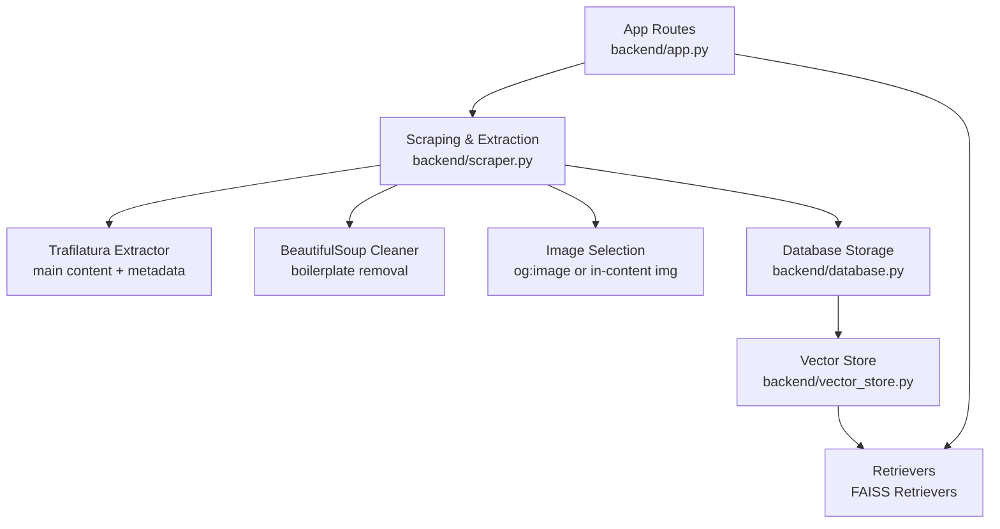
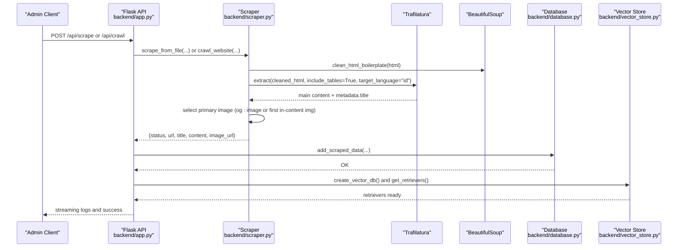
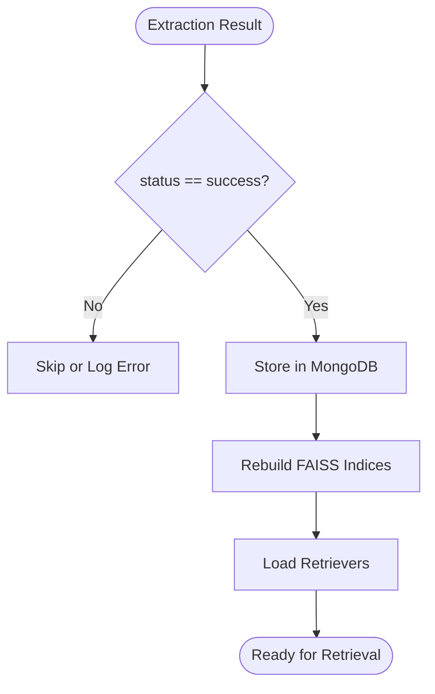
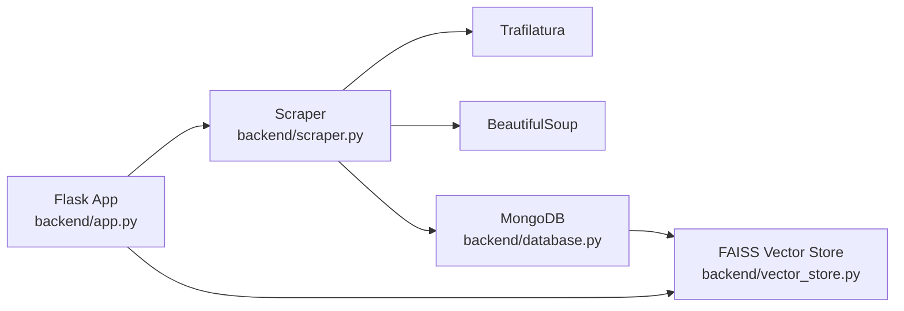

# HTML Content Processing

<cite>
**Referenced Files in This Document**
- [app.py](file://backend/app.py)
- [scraper.py](file://backend/scraper.py)
- [database.py](file://backend/database.py)
- [vector_store.py](file://backend/vector_store.py)
</cite>

## Table of Contents
1. [Introduction](#introduction)
2. [Project Structure](#project-structure)
3. [Core Components](#core-components)
4. [Architecture Overview](#architecture-overview)
5. [Detailed Component Analysis](#detailed-component-analysis)
6. [Dependency Analysis](#dependency-analysis)
7. [Performance Considerations](#performance-considerations)
8. [Troubleshooting Guide](#troubleshooting-guide)
9. [Conclusion](#conclusion)

## Introduction
This document explains the HTML content processing and cleaning pipeline used by the backend. It covers:
- Trafilatura integration for main content extraction, including metadata extraction and table preservation
- HTML boilerplate removal using BeautifulSoup, including selectors for navigation, sidebars, scripts, and advertisements
- Content sanitization and language targeting for Indonesian text processing
- Examples of before/after transformations, selector patterns, and quality assessment criteria

## Project Structure
The HTML processing logic resides primarily in the backend module:
- Web scraping and content extraction: [scraper.py](file://backend/scraper.py)
- Vector indexing and retrieval: [vector_store.py](file://backend/vector_store.py)
- Persistence of extracted content: [database.py](file://backend/database.py)
- API orchestration and rate-limiting: [app.py](file://backend/app.py)

**Diagram sources**
- [app.py](file://backend/app.py)
- [scraper.py](file://backend/scraper.py)
- [database.py](file://backend/database.py)
- [vector_store.py](file://backend/vector_store.py)

**Section sources**
- [app.py](file://backend/app.py)
- [scraper.py](file://backend/scraper.py)
- [database.py](file://backend/database.py)
- [vector_store.py](file://backend/vector_store.py)

## Core Components
- HTML boilerplate removal with BeautifulSoup
  - Removes structural tags and common junk selectors
  - Returns cleaned HTML suitable for content extraction
- Trafilatura-based extraction
  - Extracts main article content
  - Preserves tables
  - Targets Indonesian language
  - Extracts page title via metadata
- Image selection
  - Prefers Open Graph image
  - Falls back to the first meaningful in-content image
- Quality checks
  - Minimum content length threshold
  - Skips empty or boilerplate-heavy pages
- Persistence and retrieval
  - Stores extracted title, content, and image URL
  - Builds separate FAISS indices for Memory, Manual, and Scraped data

**Section sources**
- [scraper.py:69-147](file://backend/scraper.py#L69-L147)
- [scraper.py:168-277](file://backend/scraper.py#L168-L277)
- [database.py:152-195](file://backend/database.py#L152-L195)
- [vector_store.py:48-115](file://backend/vector_store.py#L48-L115)

## Architecture Overview
End-to-end flow for scraping, cleaning, extracting, and storing content:

**Diagram sources**
- [app.py:801-846](file://backend/app.py#L801-L846)
- [scraper.py:69-147](file://backend/scraper.py#L69-L147)
- [scraper.py:168-277](file://backend/scraper.py#L168-L277)
- [database.py:152-167](file://backend/database.py#L152-L167)
- [vector_store.py:48-115](file://backend/vector_store.py#L48-L115)

## Detailed Component Analysis

### HTML Boilerplate Removal with BeautifulSoup
Purpose:
- Strip navigation, footers, headers, sidebars, scripts, styles, and ads
- Preserve main content area for accurate extraction

Implementation highlights:
- Structural tags removed globally: nav, footer, header, aside, script, style, noscript
- Additional junk selectors targeting common ad/placeholders/widgets
- Uses CSS selectors to remove classes/IDs like .sidebar, .ad, .advertisement, .cookie-banner, .popup

Selector patterns used:
- Global structural tags: nav, footer, header, aside, script, style, noscript
- Common junk selectors: .sidebar, #sidebar, .menu, #menu, .navbar, #navbar, .widget, .footer, .comments, .ad, .advertisement, .cookie-banner, .popup

Quality impact:
- Reduces noise and improves Trafilatura’s precision
- Keeps tables intact for tabular data fidelity

Example transformation (conceptual):
- Before: HTML with <nav>, <aside>, <script>, <style>, and ad divs
- After: Cleaned HTML containing only the main content area

**Section sources**
- [scraper.py:69-82](file://backend/scraper.py#L69-L82)

### Trafilatura Integration for Main Content Extraction
Purpose:
- Extract the primary readable content from cleaned HTML
- Preserve tables and comments as configured
- Target Indonesian language for better accuracy

Key parameters and behavior:
- include_tables=True to preserve tabular data
- include_comments=False to exclude comment blocks
- favor_precision=True to prioritize correctness over recall
- target_language="id" to bias extraction toward Indonesian text

Metadata extraction:
- Page title is extracted from original HTML metadata

Quality thresholds:
- Content shorter than a minimum length is skipped
- Pages with no main content are skipped

**Section sources**
- [scraper.py:99-106](file://backend/scraper.py#L99-L106)
- [scraper.py:233-240](file://backend/scraper.py#L233-L240)

### Image Selection Workflow
Purpose:
- Select a representative image for the page to enrich downstream answers

Selection logic:
- Priority 1: og:image meta tag
- Priority 2: First meaningful  found inside common content containers (article, main, or body), skipping tiny/non-content images

Heuristics:
- Skip images smaller than a threshold width/height
- Skip common non-content image markers (logo, icon, favicon, avatar, banner, pixel, tracking, spacer)

**Section sources**
- [scraper.py:108-140](file://backend/scraper.py#L108-L140)
- [scraper.py:242-264](file://backend/scraper.py#L242-L264)

### Content Sanitization and Language Targeting
Content sanitization:
- Not applied to extracted text; extraction is performed on cleaned HTML
- The extracted text is post-processed to normalize whitespace

Language targeting:
- Trafilatura is configured with target_language="id" to improve extraction quality for Indonesian content

Note: General-purpose input sanitization exists elsewhere in the application (e.g., for user-provided text), but it does not apply to scraped HTML content.

**Section sources**
- [scraper.py:142-144](file://backend/scraper.py#L142-L144)
- [scraper.py:104](file://backend/scraper.py#L104)
- [scraper.py:238](file://backend/scraper.py#L238)

### Quality Assessment Criteria
Extraction quality gates:
- Minimum content length threshold: pages with extracted content below the threshold are skipped
- No main content found: pages where Trafilatura returns no content are skipped
- Non-HTML responses: crawler skips non-HTML content types
- SSRF protection: only allowed domains/IP ranges are processed

**Section sources**
- [scraper.py:143-147](file://backend/scraper.py#L143-L147)
- [scraper.py:204-206](file://backend/scraper.py#L204-L206)
- [scraper.py:90-91](file://backend/scraper.py#L90-L91)

### Persistence and Indexing Pipeline
After successful extraction:
- Store title, content, and image URL in MongoDB
- Rebuild FAISS indices for Memory, Manual, and Scraped data
- Load retrievers for downstream chat/search

**Diagram sources**
- [app.py:801-846](file://backend/app.py#L801-L846)
- [database.py:152-167](file://backend/database.py#L152-L167)
- [vector_store.py:48-115](file://backend/vector_store.py#L48-L115)

**Section sources**
- [app.py:801-846](file://backend/app.py#L801-L846)
- [database.py:152-195](file://backend/database.py#L152-L195)
- [vector_store.py:48-115](file://backend/vector_store.py#L48-L115)

## Dependency Analysis
High-level dependencies among components:

**Diagram sources**
- [app.py](file://backend/app.py)
- [scraper.py](file://backend/scraper.py)
- [database.py](file://backend/database.py)
- [vector_store.py](file://backend/vector_store.py)

**Section sources**
- [app.py](file://backend/app.py)
- [scraper.py](file://backend/scraper.py)
- [database.py](file://backend/database.py)
- [vector_store.py](file://backend/vector_store.py)

## Performance Considerations
- Timeout and encoding handling: requests are fetched with timeouts and encoding derived from apparent encoding to reduce stalls
- Minimal parsing overhead: BeautifulSoup operates on cleaned HTML to reduce DOM traversal cost
- Targeted extraction: Trafilatura configured for precision and Indonesian language reduces misclassification
- Index caching: retrievers are cached at module level to avoid repeated FAISS loads
- Rate limiting: scraping and crawling endpoints are rate-limited to protect resources

[No sources needed since this section provides general guidance]

## Troubleshooting Guide
Common issues and resolutions:
- No main content found
  - Cause: Trafilatura could not identify readable content
  - Action: Verify that the page is HTML and not a redirect/login; ensure the page renders visible text
  - Reference: [scraper.py:146-147](file://backend/scraper.py#L146-L147), [scraper.py:272-273](file://backend/scraper.py#L272-L273)
- Content too short or mostly boilerplate
  - Cause: Low signal-to-noise ratio after cleaning
  - Action: Adjust selectors or review page structure; consider manual curation
  - Reference: [scraper.py:144](file://backend/scraper.py#L144), [scraper.py:269](file://backend/scraper.py#L269)
- Non-HTML content type
  - Cause: Response was not text/html
  - Action: Skip or handle separately
  - Reference: [scraper.py:204-206](file://backend/scraper.py#L204-L206)
- SSRF protection triggered
  - Cause: Disallowed domain/IP range
  - Action: Whitelist allowed domains or adjust URL validation
  - Reference: [scraper.py:12-27](file://backend/scraper.py#L12-L27)
- Missing or invalid image
  - Cause: og:image missing and no in-content image found
  - Action: Inspect page markup for images and container classes
  - Reference: [scraper.py:118-140](file://backend/scraper.py#L118-L140), [scraper.py:246-264](file://backend/scraper.py#L246-L264)
- Index loading failures
  - Cause: Corrupted or missing FAISS index
  - Action: Trigger reindex endpoint and invalidate cache
  - Reference: [vector_store.py:89-111](file://backend/vector_store.py#L89-L111), [vector_store.py:17-20](file://backend/vector_store.py#L17-L20)

**Section sources**
- [scraper.py:12-27](file://backend/scraper.py#L12-L27)
- [scraper.py:90-91](file://backend/scraper.py#L90-L91)
- [scraper.py:144-147](file://backend/scraper.py#L144-L147)
- [scraper.py:204-206](file://backend/scraper.py#L204-L206)
- [scraper.py:118-140](file://backend/scraper.py#L118-L140)
- [scraper.py:246-264](file://backend/scraper.py#L246-L264)
- [vector_store.py:89-111](file://backend/vector_store.py#L89-L111)
- [vector_store.py:17-20](file://backend/vector_store.py#L17-L20)

## Conclusion
The HTML processing pipeline combines robust boilerplate removal with targeted content extraction and careful quality gating. Trafilatura ensures precise main content extraction with Indonesian language support and table preservation, while BeautifulSoup cleans the DOM to minimize noise. The system enforces quality thresholds and selects representative images to enrich downstream experiences. Together, these components deliver reliable, high-quality content suitable for retrieval and chat applications.