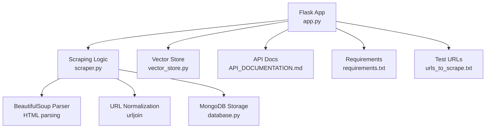
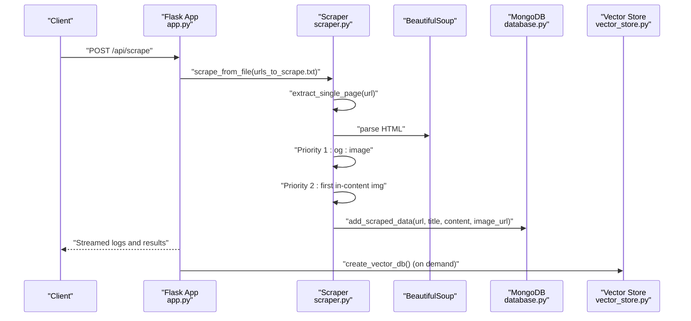
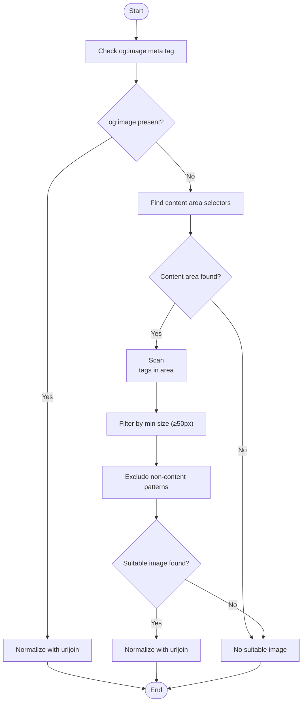
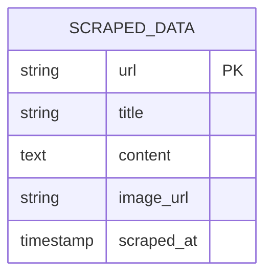
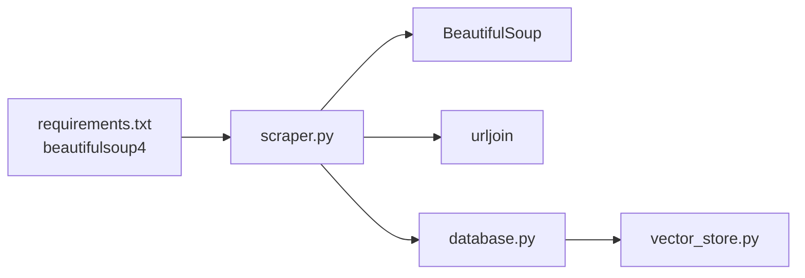

# Image Detection and Selection

<cite>
**Referenced Files in This Document**
- [scraper.py](file://backend/scraper.py)
- [app.py](file://backend/app.py)
- [database.py](file://backend/database.py)
- [vector_store.py](file://backend/vector_store.py)
- [API_DOCUMENTATION.md](file://API_DOCUMENTATION.md)
- [requirements.txt](file://requirements.txt)
- [urls_to_scrape.txt](file://backend/urls_to_scrape.txt)
</cite>

## Table of Contents
1. [Introduction](#introduction)
2. [Project Structure](#project-structure)
3. [Core Components](#core-components)
4. [Architecture Overview](#architecture-overview)
5. [Detailed Component Analysis](#detailed-component-analysis)
6. [Dependency Analysis](#dependency-analysis)
7. [Performance Considerations](#performance-considerations)
8. [Troubleshooting Guide](#troubleshooting-guide)
9. [Conclusion](#conclusion)

## Introduction
This document explains the image detection and selection logic used by the backend scraping pipeline. The system follows a two-tier priority approach:
- Priority 1: Use the Open Graph image (og:image) meta tag when present.
- Priority 2: Select the first suitable in-content image found within the main content area of the original HTML.

It also details the content area detection heuristics, image filtering criteria, and URL normalization. The document includes examples, edge cases, and fallback strategies when no suitable images are found.

## Project Structure
The image detection logic is implemented in the backend scraping module and integrated into the Flask application routes that trigger scraping and crawling.

**Diagram sources**
- [app.py:801-846](file://backend/app.py#L801-L846)
- [scraper.py:83-148](file://backend/scraper.py#L83-L148)
- [database.py:152-195](file://backend/database.py#L152-L195)
- [vector_store.py:48-70](file://backend/vector_store.py#L48-L70)
- [API_DOCUMENTATION.md:11-50](file://API_DOCUMENTATION.md#L11-L50)
- [requirements.txt:14](file://requirements.txt#L14)
- [urls_to_scrape.txt:1-76](file://backend/urls_to_scrape.txt#L1-L76)

**Section sources**
- [app.py:801-846](file://backend/app.py#L801-L846)
- [scraper.py:83-148](file://backend/scraper.py#L83-L148)
- [database.py:152-195](file://backend/database.py#L152-L195)
- [vector_store.py:48-70](file://backend/vector_store.py#L48-L70)
- [API_DOCUMENTATION.md:11-50](file://API_DOCUMENTATION.md#L11-L50)
- [requirements.txt:14](file://requirements.txt#L14)
- [urls_to_scrape.txt:1-76](file://backend/urls_to_scrape.txt#L1-L76)

## Core Components
- Two-priority image selection:
  - og:image meta tag extraction.
  - First in-content image from original HTML within a content area.
- Content area detection heuristics using BeautifulSoup selectors targeting article, div.content, div.post, div.entry, div.berita, div.detail, main, and body elements.
- Image filtering criteria:
  - Minimum size validation (width and height ≥ 50 pixels).
  - Exclusion of non-content images (logo, icon, favicon, avatar, banner, pixel, tracking, spacer).
- URL normalization using urljoin to resolve relative URLs.
- Storage and retrieval of image_url in MongoDB and vector store metadata.

**Section sources**
- [scraper.py:111-140](file://backend/scraper.py#L111-L140)
- [scraper.py:242-264](file://backend/scraper.py#L242-L264)
- [database.py:152-195](file://backend/database.py#L152-L195)
- [vector_store.py:17-21](file://backend/vector_store.py#L17-L21)

## Architecture Overview
The image selection pipeline integrates with the scraping and crawling flows. It prioritizes og:image, falls back to in-content images, and stores the selected image URL alongside page content.

**Diagram sources**
- [app.py:801-846](file://backend/app.py#L801-L846)
- [scraper.py:83-148](file://backend/scraper.py#L83-L148)
- [database.py:152-195](file://backend/database.py#L152-L195)
- [vector_store.py:48-70](file://backend/vector_store.py#L48-L70)

## Detailed Component Analysis

### Two-Priority Image Selection Logic
- Priority 1: og:image meta tag
  - Extracted from the original HTML using BeautifulSoup.
  - Normalized with urljoin to handle relative URLs.
- Priority 2: First suitable in-content image
  - Searches within common content containers identified by selectors targeting article, div.content, div.post, div.entry, div.berita, div.detail, main, and body.
  - Filters out tiny images (< 50px width or height) and non-content images (logo, icon, favicon, avatar, banner, pixel, tracking, spacer).
  - Normalizes the image URL using urljoin.

**Diagram sources**
- [scraper.py:111-140](file://backend/scraper.py#L111-L140)
- [scraper.py:242-264](file://backend/scraper.py#L242-L264)

**Section sources**
- [scraper.py:111-140](file://backend/scraper.py#L111-L140)
- [scraper.py:242-264](file://backend/scraper.py#L242-L264)

### Content Area Detection Heuristics
The system detects the main content area using a prioritized selector chain:
- article
- div with class/id containing content, post, entry, berita, detail (case-insensitive)
- main
- body

This ensures the crawler focuses on the primary textual content rather than navigation, sidebars, or boilerplate.

**Section sources**
- [scraper.py:118-126](file://backend/scraper.py#L118-L126)
- [scraper.py:247-253](file://backend/scraper.py#L247-L253)

### Image Filtering Criteria
- Minimum size validation:
  - Both width and height must be ≥ 50 pixels (numeric checks).
- Non-content exclusions:
  - Skip images whose URLs contain any of: logo, icon, favicon, avatar, banner, pixel, tracking, spacer (case-insensitive substring match).
- URL normalization:
  - All candidate URLs are normalized using urljoin to ensure absolute URLs.

**Section sources**
- [scraper.py:133-139](file://backend/scraper.py#L133-L139)
- [scraper.py:259-264](file://backend/scraper.py#L259-L264)

### URL Normalization
- urljoin is used to convert relative image URLs into absolute URLs based on the page URL.
- This ensures consistent storage and retrieval of image URLs.

**Section sources**
- [scraper.py:114](file://backend/scraper.py#L114)
- [scraper.py:138](file://backend/scraper.py#L138)
- [scraper.py:245](file://backend/scraper.py#L245)
- [scraper.py:263](file://backend/scraper.py#L263)

### Storage and Retrieval
- The selected image URL is stored alongside the extracted title and content in MongoDB.
- Vector store indexing includes the image_url in metadata for downstream retrieval.
- The Flask route for scraping streams results and persists successful entries.

**Diagram sources**
- [database.py:152-160](file://backend/database.py#L152-L160)

**Section sources**
- [database.py:152-195](file://backend/database.py#L152-L195)
- [app.py:801-820](file://backend/app.py#L801-L820)

### API Integration and Usage
- The scraping endpoint triggers the image selection logic and persists results.
- The crawling endpoint applies the same logic during deep crawling.
- Vector store creation and retrieval leverage the stored image_url metadata.

**Section sources**
- [app.py:801-846](file://backend/app.py#L801-L846)
- [vector_store.py:48-70](file://backend/vector_store.py#L48-L70)
- [API_DOCUMENTATION.md:45-49](file://API_DOCUMENTATION.md#L45-L49)

## Dependency Analysis
- BeautifulSoup is used for HTML parsing and selector-based content area detection.
- urljoin ensures robust URL handling.
- MongoDB stores the image_url alongside content.
- Vector store indexing includes image_url in metadata for retrieval.

**Diagram sources**
- [requirements.txt:14](file://requirements.txt#L14)
- [scraper.py:3](file://backend/scraper.py#L3)
- [database.py:152-195](file://backend/database.py#L152-L195)
- [vector_store.py:48-70](file://backend/vector_store.py#L48-L70)

**Section sources**
- [requirements.txt:14](file://requirements.txt#L14)
- [scraper.py:3](file://backend/scraper.py#L3)
- [database.py:152-195](file://backend/database.py#L152-L195)
- [vector_store.py:48-70](file://backend/vector_store.py#L48-L70)

## Performance Considerations
- Selector-based content area detection avoids expensive DOM traversal by focusing on common, high-confidence containers.
- Early exit after selecting the first suitable image reduces scanning overhead.
- URL normalization occurs only once per candidate image.
- Vector store caching minimizes repeated index loading.

[No sources needed since this section provides general guidance]

## Troubleshooting Guide
Common scenarios and resolutions:
- No og:image and no in-content images:
  - The system returns a skipped status with a reason indicating no main content or insufficient content.
- Tiny images filtered out:
  - Increase the minimum size threshold or adjust selectors to target larger images.
- Non-content images excluded:
  - Rename or relocate images to avoid false positives (e.g., move logos outside the main content area).
- Relative URLs:
  - Ensure urljoin resolves correctly by passing the page URL as the base.
- Short content:
  - Pages with content shorter than the minimum threshold are skipped; improve content extraction or adjust thresholds.

**Section sources**
- [scraper.py:141-147](file://backend/scraper.py#L141-L147)
- [scraper.py:266-273](file://backend/scraper.py#L266-L273)

## Conclusion
The image detection and selection logic employs a robust two-tier approach: prioritize og:image when available, otherwise select the first suitable in-content image within a carefully chosen content area. The system’s filtering criteria and URL normalization ensure reliable, high-quality image selection, while the storage and retrieval pipeline integrates seamlessly with the broader scraping and vector search infrastructure.