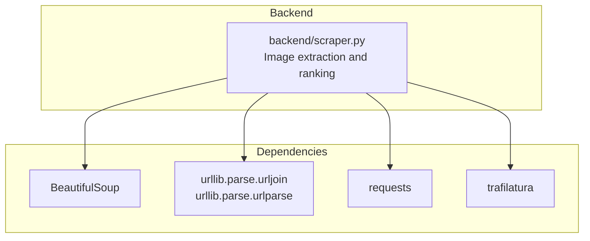
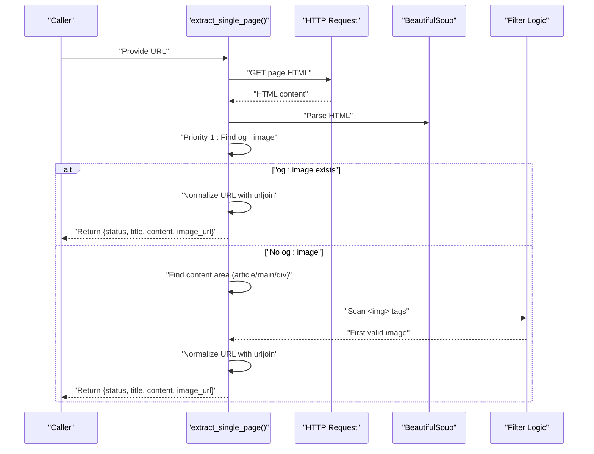
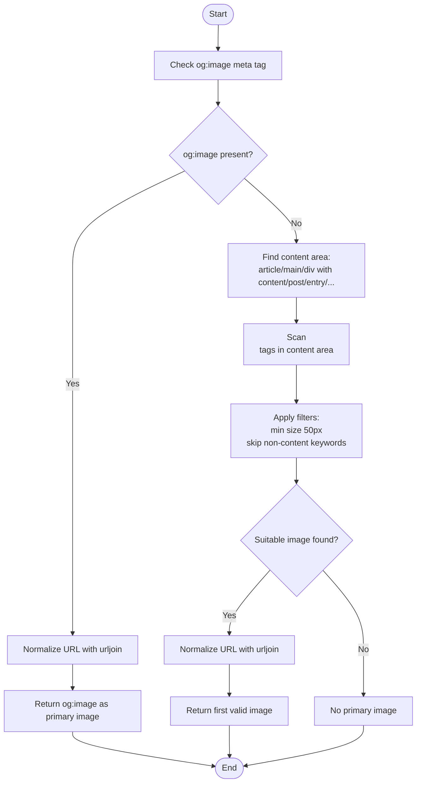
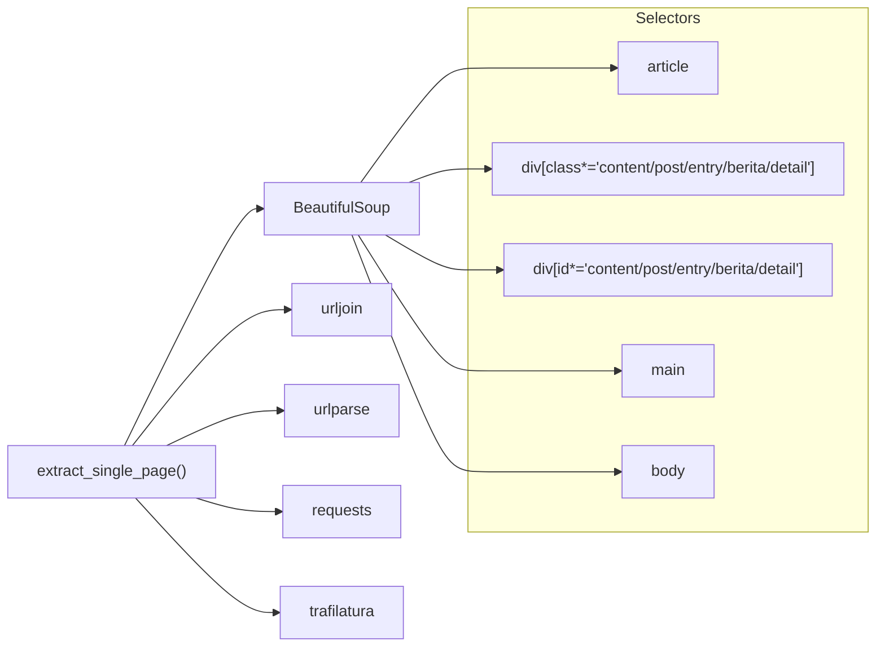

# Image Extraction and Ranking

<cite>
**Referenced Files in This Document**
- [scraper.py](file://backend/scraper.py)
- [requirements.txt](file://requirements.txt)
</cite>

## Table of Contents
1. [Introduction](#introduction)
2. [Project Structure](#project-structure)
3. [Core Components](#core-components)
4. [Architecture Overview](#architecture-overview)
5. [Detailed Component Analysis](#detailed-component-analysis)
6. [Dependency Analysis](#dependency-analysis)
7. [Performance Considerations](#performance-considerations)
8. [Troubleshooting Guide](#troubleshooting-guide)
9. [Conclusion](#conclusion)

## Introduction
This document explains the two-tier image extraction and prioritization system implemented in the backend. The system selects a single representative image per page with strict prioritization:
- Highest priority: Open Graph image (og:image) metadata
- Fallback: First valid in-content image detected within the main content area

The system includes robust filtering to avoid tiny icons, logos, tracking pixels, and other non-content images. It normalizes relative image URLs to absolute ones and integrates seamlessly with the main content extraction workflow.

## Project Structure
The image extraction logic resides in the backend module responsible for scraping and content extraction. The relevant implementation is contained in a single Python file with supporting dependencies declared in requirements.

**Diagram sources**
- [scraper.py](file://backend/scraper.py)
- [requirements.txt](file://requirements.txt)

**Section sources**
- [scraper.py](file://backend/scraper.py)
- [requirements.txt](file://requirements.txt)

## Core Components
- Two-tier selection:
  - og:image meta tag extraction as the top priority
  - First in-content image detection as the fallback
- Content area identification:
  - Targets article, main, and div elements with content/post/entry/berita/detail classes or ids
- Filtering logic:
  - Minimum dimension check (less than 50px is skipped)
  - Non-content image suppression (logo, icon, favicon, avatar, banner, pixel, tracking, spacer)
- URL normalization:
  - Relative URLs resolved against the base URL using urljoin
- Integration:
  - Reused in both single-page extraction and crawl workflows

**Section sources**
- [scraper.py](file://backend/scraper.py)

## Architecture Overview
The image extraction pipeline runs after fetching and cleaning HTML. It builds a BeautifulSoup object from raw HTML (not the cleaned content used for text extraction) to preserve image tags. It then applies the two-tier selection strategy and returns a unified result alongside the extracted text content.

**Diagram sources**
- [scraper.py](file://backend/scraper.py)

## Detailed Component Analysis

### Two-Tier Selection Strategy
- Priority 1: og:image
  - Extracted from meta tags and normalized to an absolute URL
- Priority 2: First in-content image
  - Scanned within the main content area identified via selectors
  - First suitable image encountered is selected

**Diagram sources**
- [scraper.py](file://backend/scraper.py)

**Section sources**
- [scraper.py](file://backend/scraper.py)

### Content Area Identification
Selectors target common content containers:
- article element
- div with class/id containing content, post, entry, berita, or detail (case-insensitive)
- main element
- body as a fallback

These heuristics maximize the chance of finding the primary textual content area where images are most likely to be meaningful.

**Section sources**
- [scraper.py](file://backend/scraper.py)

### Image Filtering Logic
Filters applied to each candidate image:
- Size validation:
  - Skip images with width or height less than 50px
- Non-content detection:
  - Skip images whose URLs contain logo, icon, favicon, avatar, banner, pixel, tracking, or spacer
- URL normalization:
  - Resolve relative URLs to absolute using urljoin with the page URL as the base

These rules reduce noise and ensure the chosen image is representative of the article’s visual content.

**Section sources**
- [scraper.py](file://backend/scraper.py)

### Integration with Main Content Extraction Workflow
- The image extraction occurs alongside text extraction:
  - Raw HTML is parsed to find images
  - Cleaned HTML is processed by the text extractor
  - Both results are returned together
- This dual extraction ensures:
  - Representative image selection independent of text extraction
  - Consistent URL normalization across both steps

**Section sources**
- [scraper.py](file://backend/scraper.py)

## Dependency Analysis
The image extraction logic depends on:
- BeautifulSoup for HTML parsing and selector-based content area discovery
- urllib.parse for URL normalization (urljoin, urlparse)
- requests for HTTP retrieval
- trafilatura for text content extraction (used independently of image logic)

**Diagram sources**
- [scraper.py](file://backend/scraper.py)
- [requirements.txt](file://requirements.txt)

**Section sources**
- [scraper.py](file://backend/scraper.py)
- [requirements.txt](file://requirements.txt)

## Performance Considerations
- Parsing raw HTML for images avoids reliance on cleaned content that removes images
- Early exit after finding the first valid image reduces scanning overhead
- Minimal filtering conditions keep runtime low while maintaining quality
- Using selectors to constrain the search space improves speed

## Troubleshooting Guide
Common issues and resolutions:
- No og:image found:
  - Verify the page includes a proper og:image meta tag
  - Confirm the URL is absolute; otherwise, urljoin resolves it against the base URL
- No in-content image selected:
  - Ensure the page contains images within the targeted content areas
  - Check that images meet minimum size thresholds and do not match non-content keywords
- URL appears incorrect:
  - Confirm the base URL is correct and that urljoin is used consistently
- SSRF protection:
  - Requests with unsafe URLs are rejected; verify URL safety before scraping

**Section sources**
- [scraper.py](file://backend/scraper.py)

## Conclusion
The image extraction and ranking system implements a practical, efficient two-tier approach: prioritize og:image for representativeness, and fall back to the first valid in-content image when unavailable. Robust filtering and URL normalization produce reliable results integrated with the main content extraction workflow.