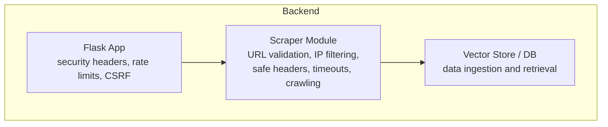
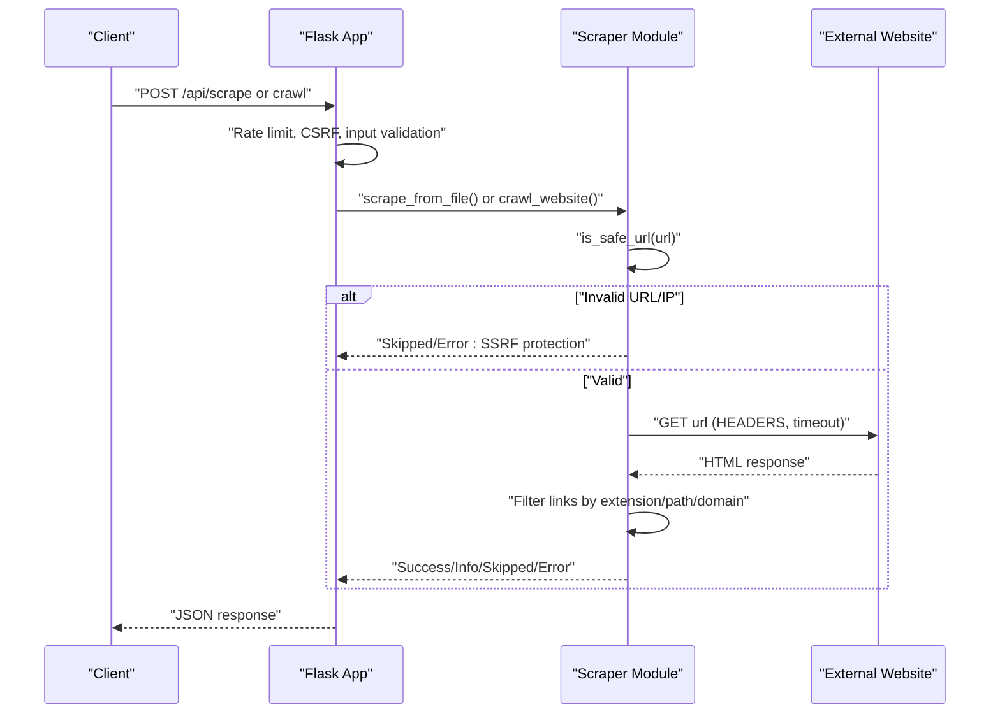
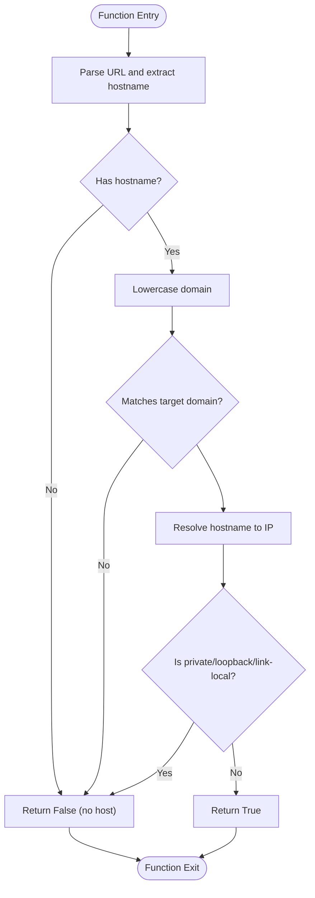
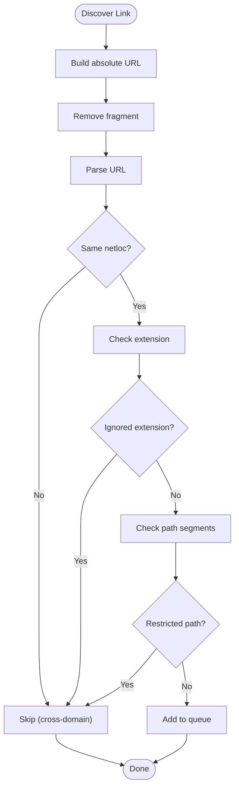
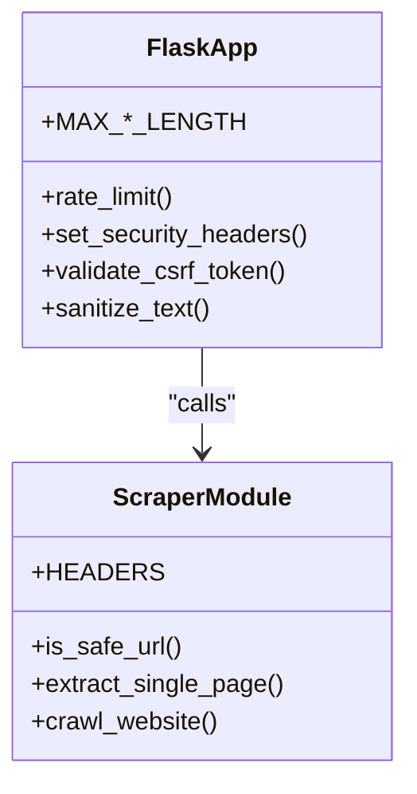
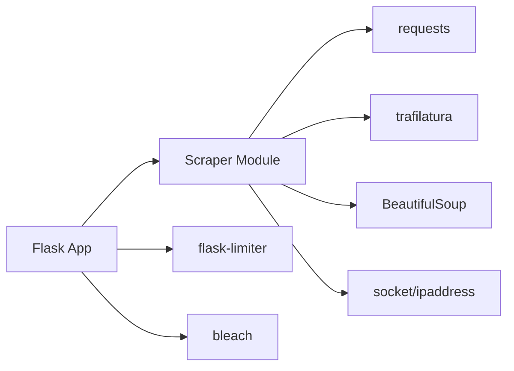

# Security and Safety Protection

<cite>
**Referenced Files in This Document**
- [scraper.py](file://backend/scraper.py)
- [app.py](file://backend/app.py)
- [urls_to_scrape.txt](file://backend/urls_to_scrape.txt)
- [requirements.txt](file://requirements.txt)
</cite>

## Table of Contents
1. [Introduction](#introduction)
2. [Project Structure](#project-structure)
3. [Core Components](#core-components)
4. [Architecture Overview](#architecture-overview)
5. [Detailed Component Analysis](#detailed-component-analysis)
6. [Dependency Analysis](#dependency-analysis)
7. [Performance Considerations](#performance-considerations)
8. [Troubleshooting Guide](#troubleshooting-guide)
9. [Conclusion](#conclusion)

## Introduction
This document explains the security measures and safety protections implemented in the content extraction subsystem. It focuses on preventing Server-Side Request Forgery (SSRF), enforcing domain boundaries, filtering private/loopback IP addresses, configuring safe HTTP headers, applying timeouts, and restricting crawling to safe paths and file types. It also outlines best practices for secure web scraping and highlights examples of blocked URLs and security violation scenarios.

## Project Structure
The security-critical logic resides primarily in the backend scraping module and the Flask application controller. The scraping module enforces URL validation, IP filtering, and safe HTTP headers/timeouts. The Flask app applies global security headers, rate limiting, CSRF protection, and input validation.

**Diagram sources**
- [app.py:267-292](file://backend/app.py#L267-L292)
- [scraper.py:12-27](file://backend/scraper.py#L12-L27)
- [scraper.py:83-151](file://backend/scraper.py#L83-L151)
- [scraper.py:168-277](file://backend/scraper.py#L168-L277)

**Section sources**
- [app.py:1-120](file://backend/app.py#L1-L120)
- [scraper.py:1-120](file://backend/scraper.py#L1-L120)

## Core Components
- Safe URL validation and SSRF protection
- Domain restriction to the school domain
- Private/loopback IP address filtering
- Legitimate browser header configuration
- Timeout enforcement for outbound requests
- Crawling restrictions (ignored file extensions, restricted paths, domain boundary enforcement)
- Rate limiting and CSRF protection at the API layer

**Section sources**
- [scraper.py:12-27](file://backend/scraper.py#L12-L27)
- [scraper.py:29-31](file://backend/scraper.py#L29-L31)
- [scraper.py:83-151](file://backend/scraper.py#L83-L151)
- [scraper.py:168-277](file://backend/scraper.py#L168-L277)
- [app.py:98-115](file://backend/app.py#L98-L115)
- [app.py:137-159](file://backend/app.py#L137-L159)

## Architecture Overview
The system enforces security at two layers:
- Content extraction layer: validates URLs, filters IPs, sets safe headers, and applies timeouts
- API layer: applies rate limiting, CSRF protection, and security headers

**Diagram sources**
- [app.py:368-379](file://backend/app.py#L368-L379)
- [scraper.py:12-27](file://backend/scraper.py#L12-L27)
- [scraper.py:83-151](file://backend/scraper.py#L83-L151)
- [scraper.py:168-277](file://backend/scraper.py#L168-L277)

## Detailed Component Analysis

### Safe URL Validation and SSRF Protection
The URL validation function ensures:
- Presence of a hostname
- Domain equality or subdomain match for the school domain
- Resolving the hostname to an IP address and rejecting private/loopback/link-local addresses

**Diagram sources**
- [scraper.py:12-27](file://backend/scraper.py#L12-L27)

Key behaviors:
- Rejects URLs without a hostname
- Enforces exact or subdomain match for the target domain
- Blocks private/loopback/link-local IPs to prevent SSRF to internal networks

Examples of blocked URLs:
- Non-FQDN URLs or URLs with no hostname
- Subdomains not ending with the target domain
- Internal/private IPs (e.g., 127.0.0.1, 10.x.x.x, 192.168.x.x, 172.16–31.x.x)

**Section sources**
- [scraper.py:12-27](file://backend/scraper.py#L12-L27)

### Header Configuration for Legitimate Browser Requests
The scraper sets a realistic browser User-Agent header to reduce blocking and improve compatibility with typical websites.

- Header: a modern desktop Chrome User-Agent string
- Applied consistently for single-page extraction and crawling

Best practice:
- Use a realistic, recent browser User-Agent to mimic real traffic
- Avoid overly aggressive or suspicious headers

**Section sources**
- [scraper.py:29-31](file://backend/scraper.py#L29-L31)

### Timeout Mechanisms
Outbound HTTP requests enforce a fixed timeout to prevent hanging connections and resource exhaustion.

- Single-page extraction: timeout applied to GET requests
- Crawling: timeout applied to GET requests
- Timeout value is set to a reasonable duration suitable for typical school websites

Best practice:
- Always set timeouts for external HTTP requests
- Combine with retries only when necessary and safe

**Section sources**
- [scraper.py:92-93](file://backend/scraper.py#L92-L93)
- [scraper.py:202](file://backend/scraper.py#L202)

### Crawling Restrictions
The crawler enforces several safety checks to avoid scanning unsafe or resource-heavy targets:

- Ignored file extensions: binary/media documents and media assets
- Restricted path segments: administrative and dynamic paths
- Domain boundary enforcement: only links within the same netloc are followed
- Content-type filtering: only HTML pages are processed for links and content extraction

**Diagram sources**
- [scraper.py:183-185](file://backend/scraper.py#L183-L185)
- [scraper.py:212-229](file://backend/scraper.py#L212-L229)

Examples of restricted paths:
- Login/logout endpoints
- Administrative panels
- Tag/category/author archives
- Pagination/page paths

Examples of ignored extensions:
- Documents and presentations
- Images and videos
- Compressed archives

**Section sources**
- [scraper.py:183-185](file://backend/scraper.py#L183-L185)
- [scraper.py:212-229](file://backend/scraper.py#L212-L229)

### Domain Boundary Enforcement
During crawling, only links whose netloc equals the base URL’s netloc are considered. This prevents accidental traversal to other domains and reduces risk of SSRF.

- Base URL domain is extracted and compared
- Cross-domain links are ignored

**Section sources**
- [scraper.py:175-178](file://backend/scraper.py#L175-L178)
- [scraper.py:222](file://backend/scraper.py#L222)

### API-Level Security Protections
The Flask application adds additional safeguards around the scraping endpoints:

- Rate limiting: protects against abuse and excessive scraping
- CSRF protection: requires a valid CSRF token for state-changing requests
- Security headers: sets anti-XSS, anti-sniffing, referrer policy, permissions policy, and frame options
- Input validation and sanitization: limits lengths and sanitizes user inputs

**Diagram sources**
- [app.py:98-115](file://backend/app.py#L98-L115)
- [app.py:137-159](file://backend/app.py#L137-L159)
- [app.py:267-292](file://backend/app.py#L267-L292)
- [scraper.py:12-27](file://backend/scraper.py#L12-L27)
- [scraper.py:83-151](file://backend/scraper.py#L83-L151)
- [scraper.py:168-277](file://backend/scraper.py#L168-L277)

**Section sources**
- [app.py:98-115](file://backend/app.py#L98-L115)
- [app.py:137-159](file://backend/app.py#L137-L159)
- [app.py:267-292](file://backend/app.py#L267-L292)

## Dependency Analysis
The scraping module depends on standard libraries for URL parsing, DNS resolution, and IP address validation. The Flask app integrates rate limiting and CSRF protection via external packages.

**Diagram sources**
- [requirements.txt:1-30](file://requirements.txt#L1-L30)
- [scraper.py:1-11](file://backend/scraper.py#L1-L11)
- [app.py:98-115](file://backend/app.py#L98-L115)

**Section sources**
- [requirements.txt:1-30](file://requirements.txt#L1-L30)
- [scraper.py:1-11](file://backend/scraper.py#L1-L11)
- [app.py:98-115](file://backend/app.py#L98-L115)

## Performance Considerations
- Timeout configuration prevents long-running requests from blocking workers
- Ignoring large binary/media extensions reduces bandwidth and CPU usage during link discovery
- Rate limiting at the API layer prevents overload and improves fairness
- Using a realistic User-Agent helps avoid extra redirects or blocks that could slow requests

[No sources needed since this section provides general guidance]

## Troubleshooting Guide
Common issues and resolutions:
- Blocked by SSRF protection
  - Symptom: Extraction/crawl returns “URL is not allowed (SSRF protection)” or skips the URL
  - Cause: Hostname missing, domain mismatch, or resolving to private/loopback IP
  - Resolution: Ensure the URL resolves to a public IP under the allowed domain

- Too many requests or rate limit errors
  - Symptom: API returns rate limit exceeded
  - Cause: Exceeding configured rate limits
  - Resolution: Reduce frequency or adjust limits

- Unexpectedly skipped URLs during crawling
  - Symptom: URLs ignored due to extension or path
  - Cause: Matching ignored extensions or restricted path segments
  - Resolution: Adjust the ignored lists or whitelist specific URLs

- No content extracted
  - Symptom: “No main content found” or “Content too short”
  - Cause: Non-HTML content or minimal text
  - Resolution: Verify the URL serves HTML content and has sufficient textual content

**Section sources**
- [scraper.py:89-91](file://backend/scraper.py#L89-L91)
- [scraper.py:198-200](file://backend/scraper.py#L198-L200)
- [scraper.py:204-206](file://backend/scraper.py#L204-L206)
- [scraper.py:146-147](file://backend/scraper.py#L146-L147)

## Conclusion
The content extraction subsystem implements robust SSRF protection by validating domains, filtering private/loopback IPs, setting safe HTTP headers, and enforcing timeouts. The crawler further restricts scanning to safe paths and file types while maintaining strict domain boundaries. The Flask application complements these protections with rate limiting, CSRF safeguards, and security headers. Together, these controls minimize risks associated with web scraping while enabling reliable content extraction from the intended domain.