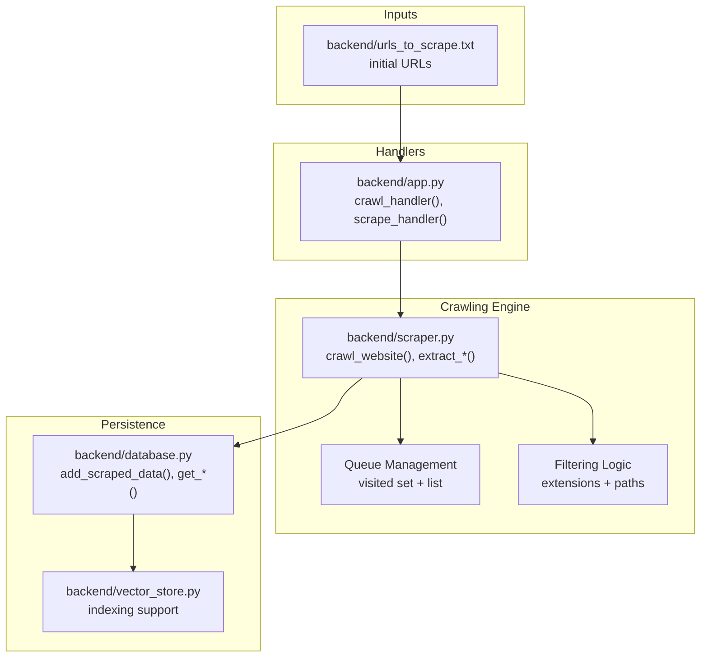
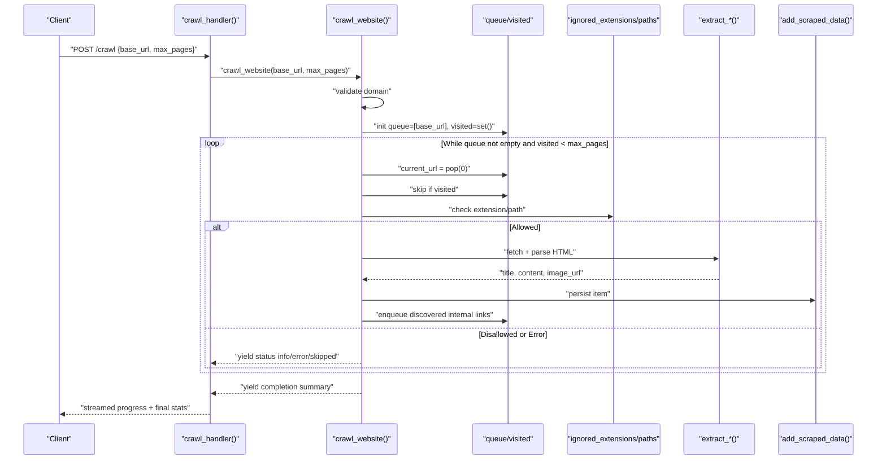
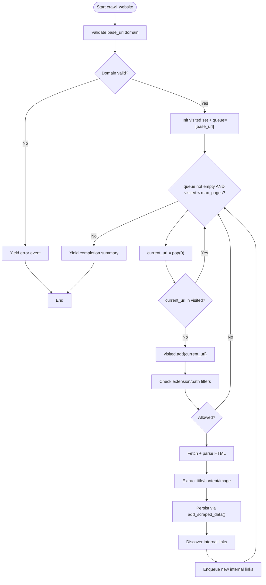
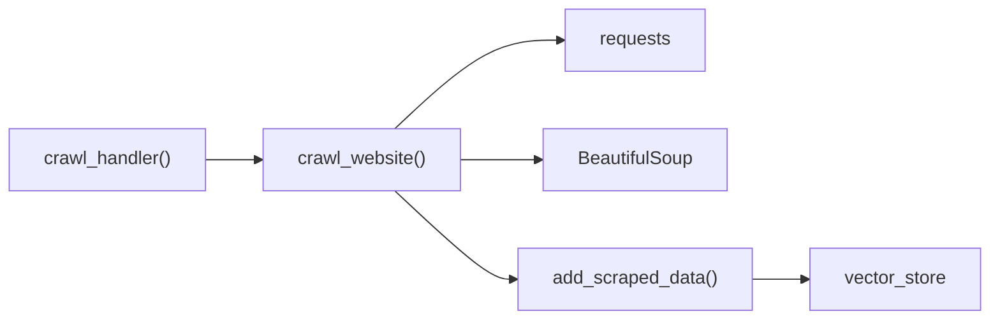

# Link Discovery and Crawling

<cite>
**Referenced Files in This Document**
- [backend/app.py](file://backend/app.py)
- [backend/scraper.py](file://backend/scraper.py)
- [backend/database.py](file://backend/database.py)
- [backend/vector_store.py](file://backend/vector_store.py)
- [backend/urls_to_scrape.txt](file://backend/urls_to_scrape.txt)
</cite>

## Table of Contents
1. [Introduction](#introduction)
2. [Project Structure](#project-structure)
3. [Core Components](#core-components)
4. [Architecture Overview](#architecture-overview)
5. [Detailed Component Analysis](#detailed-component-analysis)
6. [Dependency Analysis](#dependency-analysis)
7. [Performance Considerations](#performance-considerations)
8. [Troubleshooting Guide](#troubleshooting-guide)
9. [Conclusion](#conclusion)

## Introduction
This document describes the link discovery and crawling system used to explore websites, discover internal links, filter out non-content resources, and persist scraped content. The crawler begins at a base URL, enforces domain boundaries, avoids external domains, respects administrative and media-heavy paths, and stops after reaching a configurable page limit. It yields structured progress updates and handles errors gracefully, enabling recovery from partial failures.

## Project Structure
The crawling system spans several backend modules:
- Handler endpoints orchestrate crawling and scraping tasks
- The scraper module implements the deep-crawling algorithm and link filtering
- The database module persists scraped content
- The vector store module supports downstream indexing
- A URL list file provides batch targets for initial discovery

**Diagram sources**
- [backend/app.py](file://backend/app.py)
- [backend/scraper.py](file://backend/scraper.py)
- [backend/database.py](file://backend/database.py)
- [backend/vector_store.py](file://backend/vector_store.py)
- [backend/urls_to_scrape.txt](file://backend/urls_to_scrape.txt)

**Section sources**
- [backend/app.py](file://backend/app.py)
- [backend/scraper.py](file://backend/scraper.py)
- [backend/database.py](file://backend/database.py)
- [backend/vector_store.py](file://backend/vector_store.py)
- [backend/urls_to_scrape.txt](file://backend/urls_to_scrape.txt)

## Core Components
- Crawl handler: Exposes an endpoint to initiate crawling with a base URL and optional max pages
- Website crawler: Implements deep crawling, queue management, visited tracking, filtering, and content extraction
- Content extractor: Parses HTML, extracts title and main content, and identifies images
- Persistence layer: Stores scraped items with metadata for downstream use
- Vector store: Prepares content for semantic indexing

Key implementation references:
- Crawl handler definition and invocation
- Deep crawling algorithm and filtering logic
- Content extraction and persistence

**Section sources**
- [backend/app.py](file://backend/app.py)
- [backend/scraper.py](file://backend/scraper.py)
- [backend/database.py](file://backend/database.py)

## Architecture Overview
The crawler runs as part of the backend service. Handlers receive requests, delegate to the crawler, and stream progress updates. The crawler maintains an internal queue and visited set, filters discovered links, fetches pages, extracts content, and writes results to the database.

**Diagram sources**
- [backend/app.py](file://backend/app.py)
- [backend/scraper.py](file://backend/scraper.py)
- [backend/database.py](file://backend/database.py)

## Detailed Component Analysis

### Crawl Handler
The handler exposes an endpoint to start crawling. It reads the base URL and optional max pages from the request, invokes the crawler, and streams progress updates back to the client.

- Endpoint: crawl_handler()
- Inputs: base_url, max_pages (optional)
- Outputs: streaming JSON events for each processed URL and final summary

Operational notes:
- Validates presence of base_url
- Delegates to crawl_website() with provided max_pages
- Streams structured events for UI or logging consumption

**Section sources**
- [backend/app.py](file://backend/app.py)

### Deep Crawling Algorithm
The crawler performs a breadth-like traversal from a base URL with the following stages:
- Domain validation: Ensures the base URL has a valid netloc
- Initialization: Sets up visited set and queue with the base URL
- Loop: Pops the next URL, skips if already visited, otherwise processes
- Filtering: Ignores disallowed extensions and administrative paths
- Fetch and parse: Retrieves HTML, extracts title and main content, identifies primary image
- Persistence: Writes successful items to the database
- Queue expansion: Adds newly discovered internal links to the queue
- Limits: Stops when visited count reaches max_pages

**Diagram sources**
- [backend/scraper.py](file://backend/scraper.py)
- [backend/database.py](file://backend/database.py)

**Section sources**
- [backend/scraper.py](file://backend/scraper.py)

### Queue Management and Visited Tracking
- Queue: Implemented as a list; URLs are popped from the front (FIFO order)
- Visited: A set storing already-processed URLs to prevent duplicates
- Expansion: Newly discovered internal links are appended to the queue

Behavioral characteristics:
- FIFO traversal favors breadth-like exploration
- Duplicate prevention ensures efficient memory usage
- Queue length grows dynamically with link discovery

**Section sources**
- [backend/scraper.py](file://backend/scraper.py)

### Link Filtering Logic
The crawler applies two complementary filters:
- Ignored extensions: Binary/media-heavy files such as PDF, DOCX, PPTX, MP4, ZIP, RAR, and common image/video formats
- Ignored paths: Administrative and taxonomy-like paths such as login, admin, wp-admin, logout, tag, category, author, page

Rationale:
- Avoids downloading large binaries during link discovery
- Skips non-content administrative areas
- Reduces noise and improves focus on textual content

**Section sources**
- [backend/scraper.py](file://backend/scraper.py)

### Crawling Configuration
- max_pages: Controls the maximum number of pages to visit
- Domain boundary: Enforced by comparing discovered links against the base URL’s netloc
- Queue prioritization: FIFO ordering; no explicit priority scoring

Operational notes:
- If max_pages is not specified, the crawler uses a default value
- Domain validation prevents crawling external domains

**Section sources**
- [backend/scraper.py](file://backend/scraper.py)

### Link Extraction Patterns
During page processing, the crawler:
- Discovers anchor tags and resolves relative URLs against the current page
- Filters discovered links using the extension and path filters
- Accepts only internal links belonging to the same domain

Outcome:
- Internal link graph expansion within the base domain
- Reduced risk of crawling unrelated external sites

**Section sources**
- [backend/scraper.py](file://backend/scraper.py)

### Crawling Statistics and Progress Events
The crawler yields structured events for each URL processed:
- Info: Start messages and completion summaries
- Success: Successful extraction with title, content length, and image URL
- Skipped: Pages skipped due to short content or missing main content
- Error: Exceptions encountered during fetching or parsing

These events enable real-time monitoring and recovery from transient failures.

**Section sources**
- [backend/scraper.py](file://backend/scraper.py)

### Persistence and Indexing
Scraped content is persisted with:
- URL, title, content, and primary image URL
- Downstream indexing via vector store

Integration points:
- add_scraped_data() stores items
- get_scraped_documents_for_indexing() supplies documents for indexing

**Section sources**
- [backend/database.py](file://backend/database.py)
- [backend/vector_store.py](file://backend/vector_store.py)

### Example Workflows
- Single URL crawl: Provide base_url and optional max_pages; observe streamed events and final summary
- Batch discovery: Seed the process with URLs from urls_to_scrape.txt, then iterate per target
- Recovery: Restart the crawler; visited set prevents reprocessing completed URLs

Note: The crawler does not maintain a persistent checkpoint file; restarts rely on the visited set to resume efficiently.

**Section sources**
- [backend/app.py](file://backend/app.py)
- [backend/scraper.py](file://backend/scraper.py)
- [backend/urls_to_scrape.txt](file://backend/urls_to_scrape.txt)

## Dependency Analysis
The crawling pipeline depends on:
- Requests and BeautifulSoup for HTTP retrieval and HTML parsing
- Database layer for persistence
- Vector store for downstream indexing
- Handler layer for orchestration and streaming

**Diagram sources**
- [backend/app.py](file://backend/app.py)
- [backend/scraper.py](file://backend/scraper.py)
- [backend/database.py](file://backend/database.py)
- [backend/vector_store.py](file://backend/vector_store.py)

**Section sources**
- [backend/app.py](file://backend/app.py)
- [backend/scraper.py](file://backend/scraper.py)
- [backend/database.py](file://backend/database.py)
- [backend/vector_store.py](file://backend/vector_store.py)

## Performance Considerations
- Queue strategy: Using a list as a queue introduces O(n) insertion/pop costs; consider collections.deque for improved performance on large-scale crawls
- Filtering: Early checks for ignored extensions and paths reduce unnecessary downloads
- Content threshold: Skipping short content avoids storing low-value pages
- Memory: Visited set prevents redundant processing but can grow large; consider periodic pruning or disk-backed storage for very large crawls
- Concurrency: Current implementation is single-threaded; adding async/parallel workers can improve throughput while respecting robots.txt and rate limits

[No sources needed since this section provides general guidance]

## Troubleshooting Guide
Common issues and remedies:
- Invalid base URL: Ensure the URL includes a valid domain; the crawler validates the netloc and aborts if missing
- Network failures: The crawler catches exceptions and yields error events; retry logic can be implemented at the handler level
- Empty content: Pages with insufficient content are skipped; verify selectors used for content extraction
- External links: Domain boundary prevents crawling off-site; confirm base_url matches the intended domain
- Large binaries: Ignored extensions avoid downloading heavy files during discovery
- Recovery: Restarting the crawler resumes from visited URLs; no persistent checkpoint is maintained

**Section sources**
- [backend/scraper.py](file://backend/scraper.py)

## Conclusion
The link discovery and crawling system provides a robust, filter-driven approach to exploring a single domain, extracting textual content, and persisting results for downstream use. Its event-driven design enables real-time monitoring, while domain enforcement and content thresholds help maintain quality and performance. For production-scale deployments, consider queue optimization, concurrency controls, and persistent checkpoints to further enhance reliability and throughput.