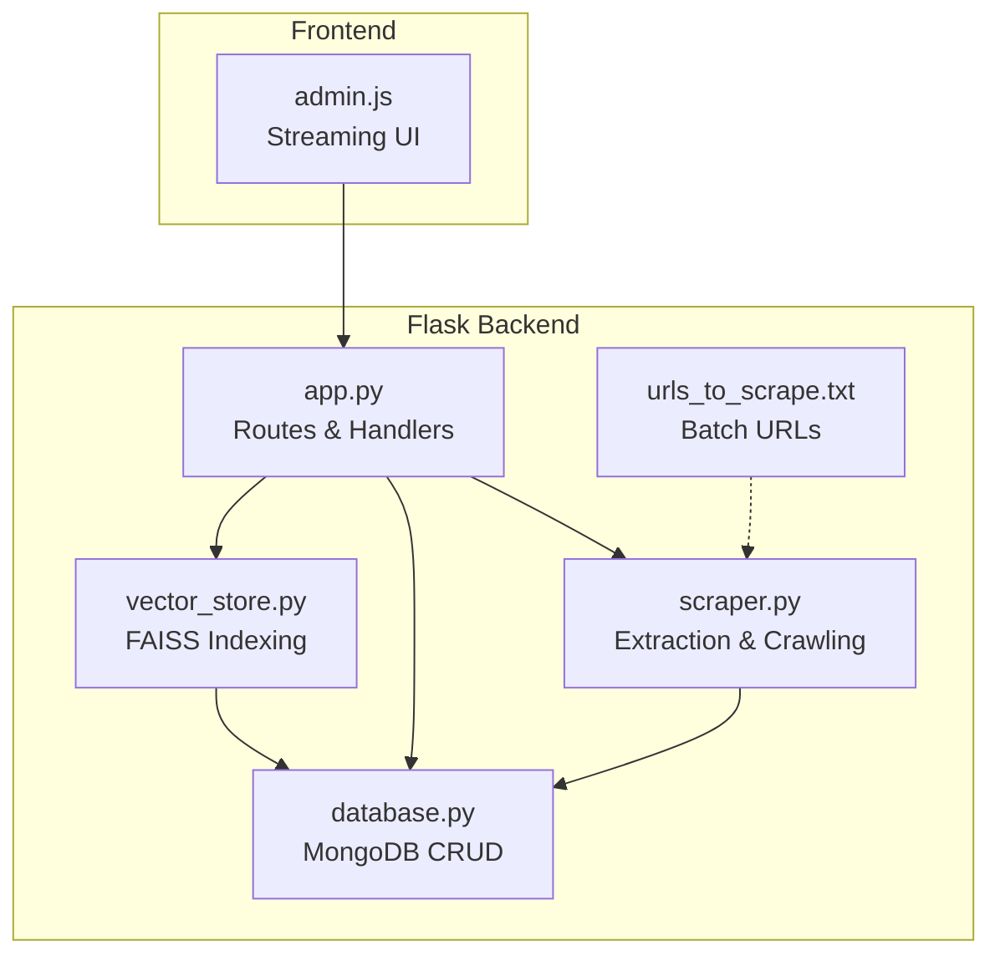
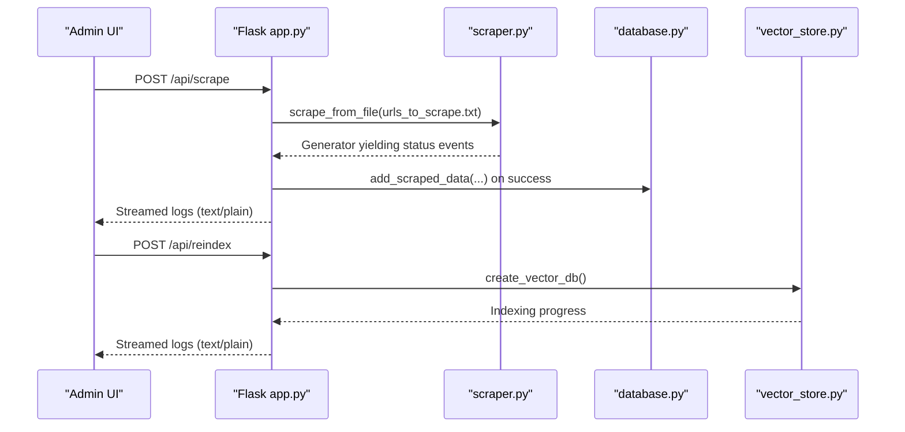
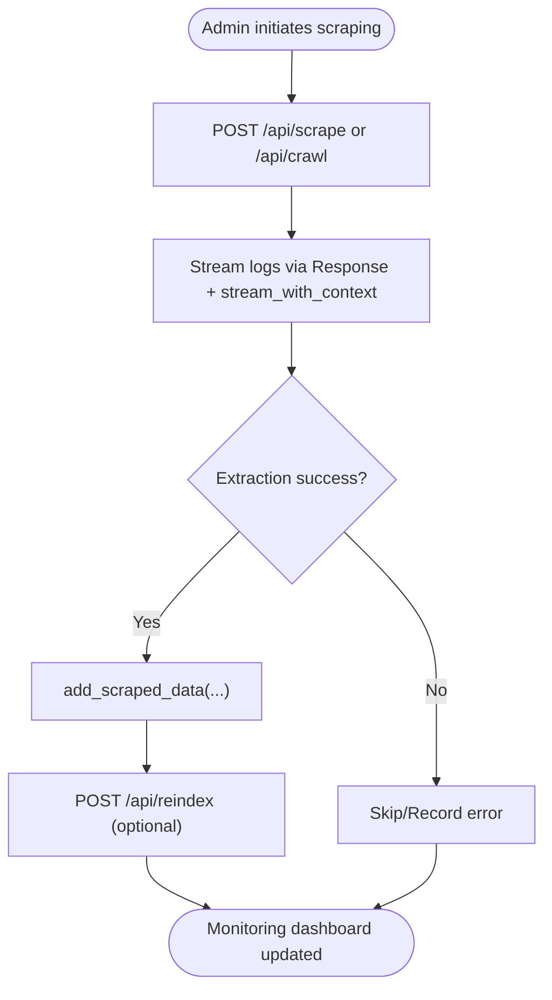
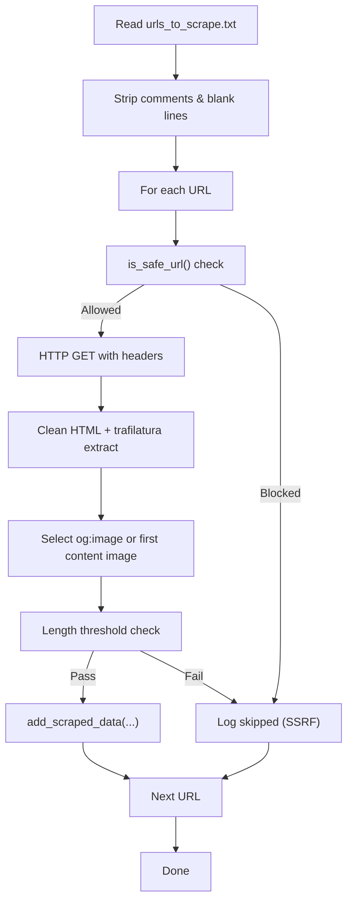
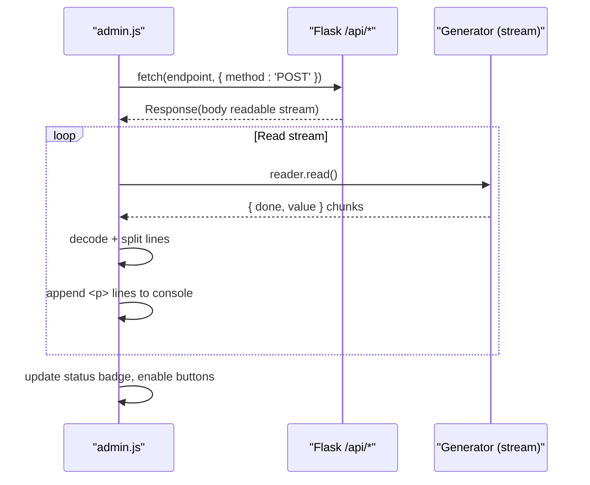
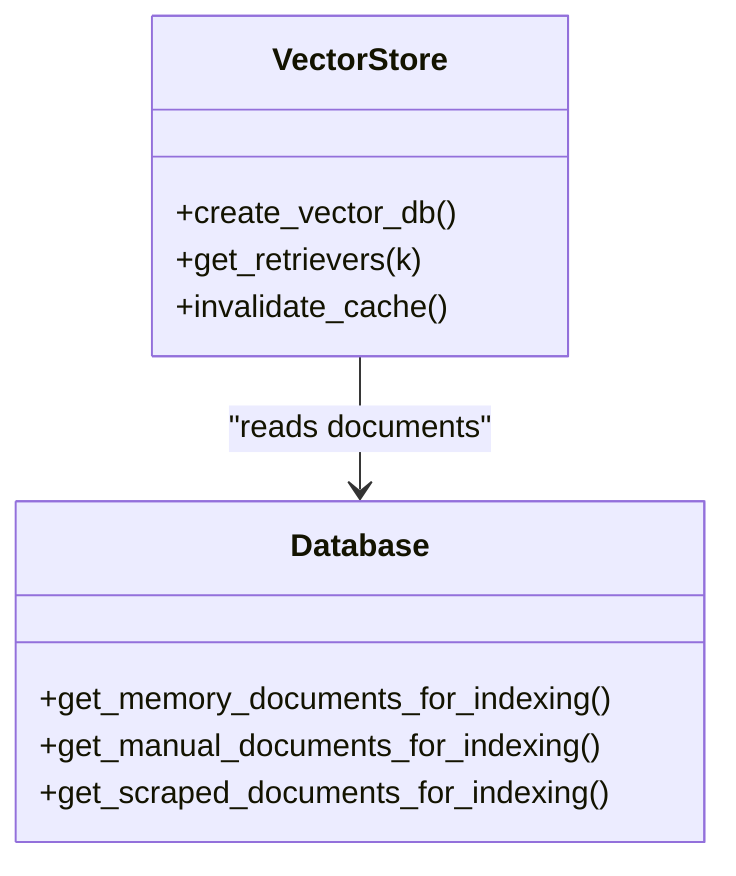
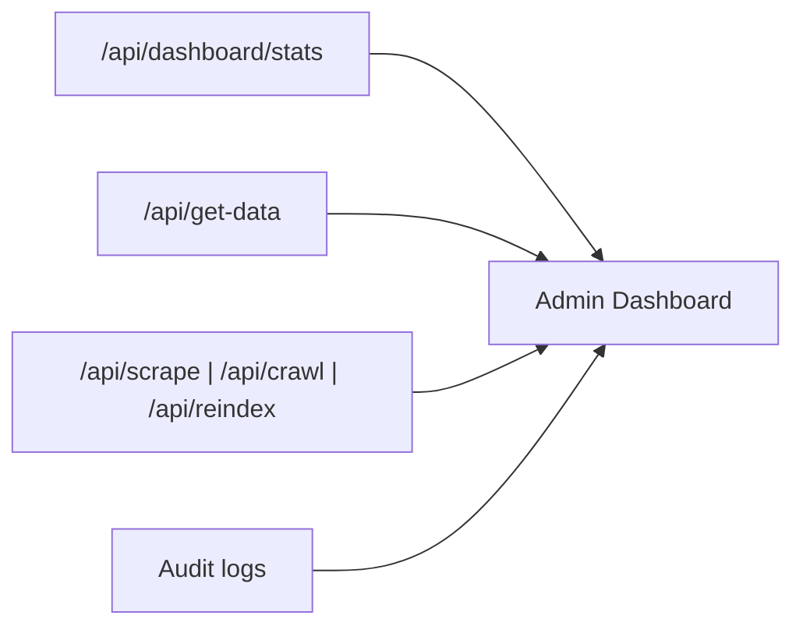
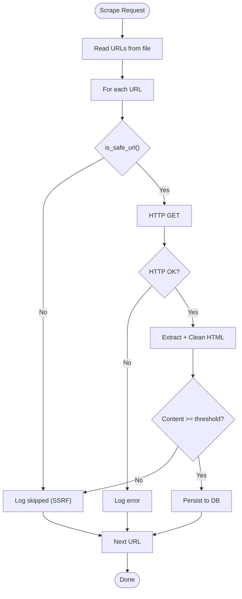
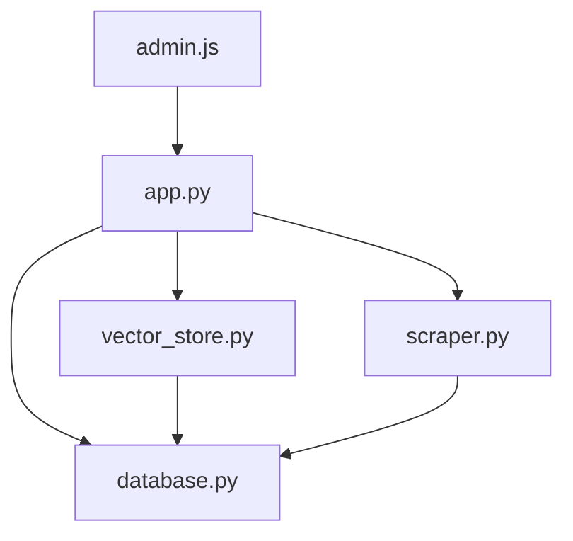

# Scraping Integration and Monitoring

<cite>
**Referenced Files in This Document**
- [app.py](file://backend/app.py)
- [scraper.py](file://backend/scraper.py)
- [vector_store.py](file://backend/vector_store.py)
- [database.py](file://backend/database.py)
- [urls_to_scrape.txt](file://backend/urls_to_scrape.txt)
- [API_DOCUMENTATION.md](file://API_DOCUMENTATION.md)
- [admin.js](file://frontend/admin.js)
</cite>

## Table of Contents
1. [Introduction](#introduction)
2. [Project Structure](#project-structure)
3. [Core Components](#core-components)
4. [Architecture Overview](#architecture-overview)
5. [Detailed Component Analysis](#detailed-component-analysis)
6. [Dependency Analysis](#dependency-analysis)
7. [Performance Considerations](#performance-considerations)
8. [Troubleshooting Guide](#troubleshooting-guide)
9. [Conclusion](#conclusion)
10. [Appendices](#appendices)

## Introduction
This document explains how the scraping system integrates with the Flask backend and provides comprehensive monitoring capabilities. It covers:
- API endpoints for triggering scrapes and managing scraping jobs
- URL management via urls_to_scrape.txt with batch processing workflows
- Streaming response mechanism for long-running scraping operations and real-time status updates
- Monitoring dashboards and alerting mechanisms
- Error handling, retry strategies, and failed scrape recovery
- Vector search integration for automatic content indexing after successful scrapes

## Project Structure
The scraping system spans three main backend modules and a frontend admin panel:
- Flask application routes and orchestration
- Scraping engine for fetching and extracting content
- Vector store for FAISS-based semantic search
- Database layer for persistent storage and dashboard statistics
- URL list for batch scraping
- Frontend admin JavaScript for streaming UI updates

**Diagram sources**
- [app.py](file://backend/app.py)
- [scraper.py](file://backend/scraper.py)
- [vector_store.py](file://backend/vector_store.py)
- [database.py](file://backend/database.py)
- [urls_to_scrape.txt](file://backend/urls_to_scrape.txt)
- [admin.js](file://frontend/admin.js)

**Section sources**
- [app.py](file://backend/app.py)
- [scraper.py](file://backend/scraper.py)
- [vector_store.py](file://backend/vector_store.py)
- [database.py](file://backend/database.py)
- [urls_to_scrape.txt](file://backend/urls_to_scrape.txt)
- [admin.js](file://frontend/admin.js)

## Core Components
- Flask API endpoints for scraping, crawling, reindexing, and data management
- Scraping engine that reads URLs from a file, validates domains, extracts content, and records images
- Vector store that builds separate FAISS indexes for memory, manual, and scraped data
- Database layer that persists scraped content and supports dashboard statistics
- Frontend admin panel that streams logs and updates status in real time

**Section sources**
- [app.py](file://backend/app.py)
- [scraper.py](file://backend/scraper.py)
- [vector_store.py](file://backend/vector_store.py)
- [database.py](file://backend/database.py)
- [urls_to_scrape.txt](file://backend/urls_to_scrape.txt)
- [admin.js](file://frontend/admin.js)

## Architecture Overview
The scraping pipeline integrates with the Flask backend as follows:
- Admin triggers scraping via POST /api/scrape or /api/crawl
- The handler streams progress logs in real time
- Successful extractions are persisted to MongoDB
- FAISS indexes are rebuilt and cached for fast retrieval
- Retrievers are used by chat endpoints to provide context-aware answers

**Diagram sources**
- [app.py](file://backend/app.py)
- [scraper.py](file://backend/scraper.py)
- [database.py](file://backend/database.py)
- [vector_store.py](file://backend/vector_store.py)
- [urls_to_scrape.txt](file://backend/urls_to_scrape.txt)
- [admin.js](file://frontend/admin.js)

## Detailed Component Analysis

### Flask API Endpoints for Scraping and Monitoring
- POST /api/scrape: Streams batch scraping from urls_to_scrape.txt, persists successes, and emits logs
- POST /api/crawl: Streams deep crawling from a base URL with configurable max pages
- POST /api/reindex: Rebuilds FAISS indexes for memory, manual, and scraped data
- GET /api/dashboard/stats: Returns counts for monitoring dashboards
- GET /api/get-data: Aggregates scraped, manual, and memory data for admin views
- CRUD endpoints for scraped, manual, and memory data

**Diagram sources**
- [app.py](file://backend/app.py)
- [database.py](file://backend/database.py)
- [admin.js](file://frontend/admin.js)

**Section sources**
- [app.py](file://backend/app.py)
- [database.py](file://backend/database.py)
- [admin.js](file://frontend/admin.js)

### URL Management System and Batch Processing
- urls_to_scrape.txt lists target URLs in batches categorized by content type
- The scraping handler reads the file, filters comments and empty lines, and processes each URL
- Domain safety checks prevent SSRF to non-school domains and private IPs
- Extraction cleans boilerplate HTML, prioritizes representative images, and validates content length

**Diagram sources**
- [scraper.py](file://backend/scraper.py)
- [database.py](file://backend/database.py)
- [urls_to_scrape.txt](file://backend/urls_to_scrape.txt)

**Section sources**
- [scraper.py](file://backend/scraper.py)
- [urls_to_scrape.txt](file://backend/urls_to_scrape.txt)
- [database.py](file://backend/database.py)

### Streaming Response Mechanism and Real-Time Status Updates
- Flask handlers return Response with mimetype text/plain and stream_with_context
- The generator yields structured log lines for INFO, SUCCESS, SKIPPED, and ERROR
- The frontend admin.js reads the stream via ReadableStream, decodes chunks, splits lines, and appends colored status lines to the console
- UI badges reflect Idle, Running, and Done states; buttons are re-enabled after completion

**Diagram sources**
- [app.py](file://backend/app.py)
- [admin.js](file://frontend/admin.js)

**Section sources**
- [app.py](file://backend/app.py)
- [admin.js](file://frontend/admin.js)

### Vector Search Integration and Automatic Indexing
- After scraping, admins can trigger POST /api/reindex to rebuild FAISS indexes
- Separate indexes are maintained for memory bank, manual data, and scraped data
- Retrievers are cached at module level to avoid reloading FAISS on every request
- Chat endpoints use retrievers to retrieve relevant documents and synthesize answers

**Diagram sources**
- [vector_store.py](file://backend/vector_store.py)
- [database.py](file://backend/database.py)

**Section sources**
- [vector_store.py](file://backend/vector_store.py)
- [database.py](file://backend/database.py)

### Monitoring Dashboards and Alerting
- GET /api/dashboard/stats provides counts for scraped, manual, memory, and bug reports
- GET /api/get-data aggregates all content types for admin review
- Frontend admin.js displays live logs and status badges
- Optional audit logging tracks admin actions

**Diagram sources**
- [app.py](file://backend/app.py)
- [database.py](file://backend/database.py)
- [admin.js](file://frontend/admin.js)

**Section sources**
- [app.py](file://backend/app.py)
- [database.py](file://backend/database.py)
- [admin.js](file://frontend/admin.js)

### Error Handling, Retry Strategies, and Recovery
- Domain and IP safety checks prevent SSRF
- HTTP exceptions are caught and reported as errors
- Content length thresholds filter low-quality results
- On startup, missing FAISS indexes are auto-rebuilt
- Reindex endpoint allows recovery after failures by rebuilding indexes

**Diagram sources**
- [scraper.py](file://backend/scraper.py)
- [database.py](file://backend/database.py)

**Section sources**
- [scraper.py](file://backend/scraper.py)
- [database.py](file://backend/database.py)

## Dependency Analysis
The scraping system exhibits clear separation of concerns:
- app.py orchestrates routes, rate limits, CSRF protection, and admin-only access
- scraper.py encapsulates extraction and crawling logic
- database.py manages persistence and dashboard statistics
- vector_store.py handles FAISS indexing and retriever caching
- admin.js consumes streaming responses and updates UI state

**Diagram sources**
- [app.py](file://backend/app.py)
- [scraper.py](file://backend/scraper.py)
- [vector_store.py](file://backend/vector_store.py)
- [database.py](file://backend/database.py)
- [admin.js](file://frontend/admin.js)

**Section sources**
- [app.py](file://backend/app.py)
- [scraper.py](file://backend/scraper.py)
- [vector_store.py](file://backend/vector_store.py)
- [database.py](file://backend/database.py)
- [admin.js](file://frontend/admin.js)

## Performance Considerations
- Rate limiting protects the system from abuse during scraping and crawling
- FAISS retrievers are cached to avoid repeated disk I/O
- Content chunking reduces embedding overhead
- Frontend streaming avoids blocking the UI during long operations

[No sources needed since this section provides general guidance]

## Troubleshooting Guide
Common issues and remedies:
- Scraping stuck or slow: Verify network connectivity and domain allowlist; check logs for HTTP errors
- Empty or low-quality content: Adjust content length thresholds or refine URL list
- Missing FAISS indexes: Use POST /api/reindex to rebuild; confirm paths exist
- Admin session or CSRF errors: Ensure admin login and CSRF token headers are present
- Database connection failures: Confirm MONGO_URI and database availability

**Section sources**
- [app.py](file://backend/app.py)
- [scraper.py](file://backend/scraper.py)
- [vector_store.py](file://backend/vector_store.py)
- [database.py](file://backend/database.py)

## Conclusion
The scraping system integrates tightly with the Flask backend to provide reliable, monitorable content ingestion. Through streaming APIs, robust error handling, and FAISS-powered search, it enables administrators to manage large-scale web content efficiently while maintaining real-time visibility into operations.

[No sources needed since this section summarizes without analyzing specific files]

## Appendices

### API Reference Highlights
- POST /api/scrape: Trigger batch scraping from urls_to_scrape.txt
- POST /api/crawl: Deep crawl with base URL and max pages
- POST /api/reindex: Rebuild FAISS indexes
- GET /api/dashboard/stats: Dashboard metrics
- GET /api/get-data: Combined content feed

**Section sources**
- [API_DOCUMENTATION.md](file://API_DOCUMENTATION.md)
- [app.py](file://backend/app.py)