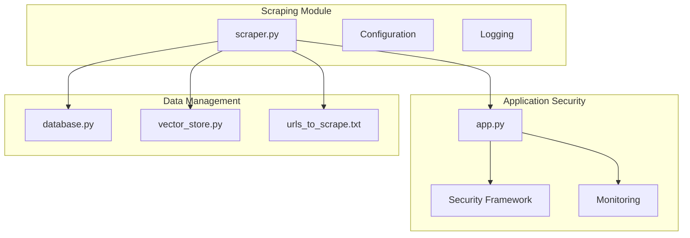
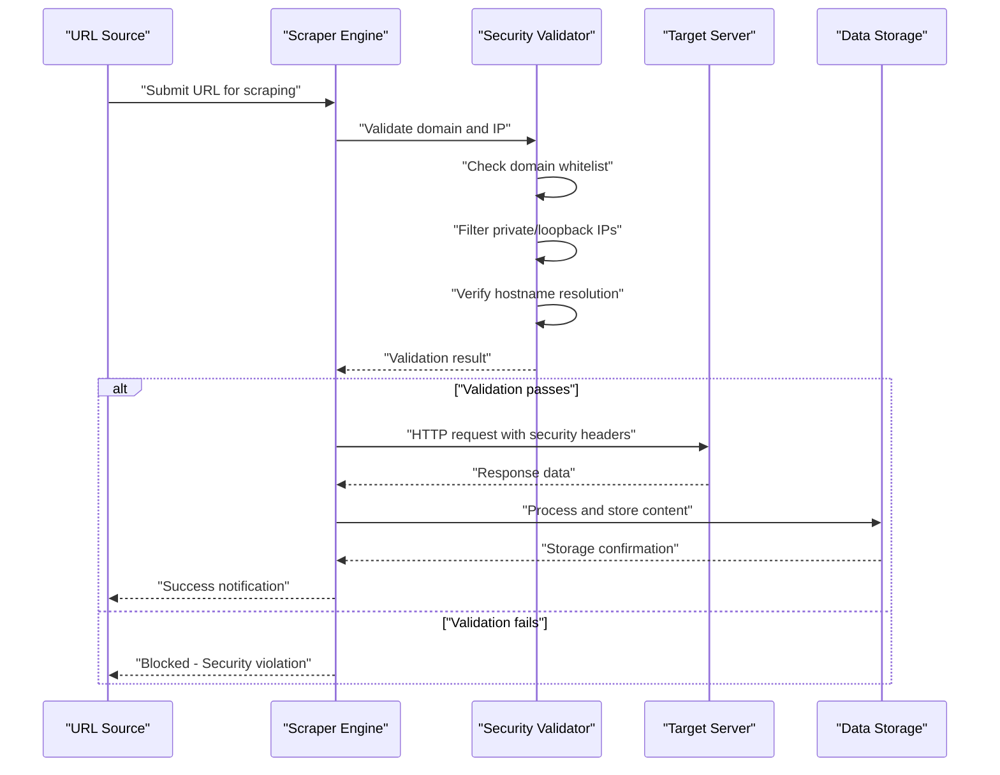
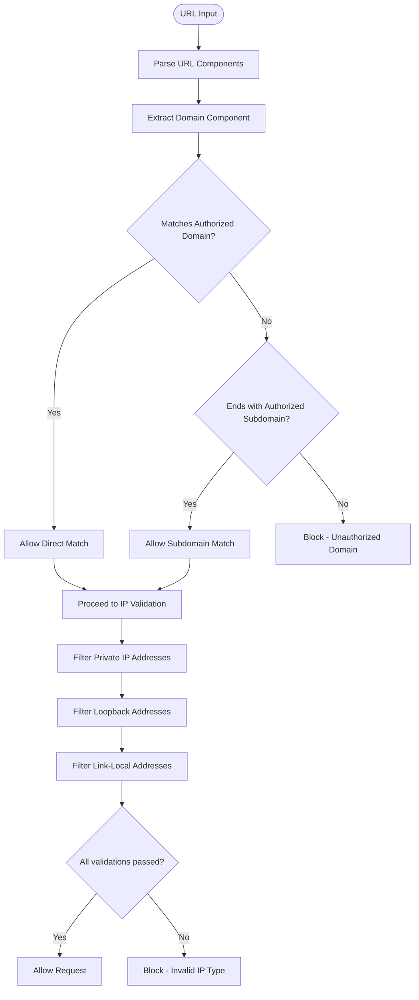
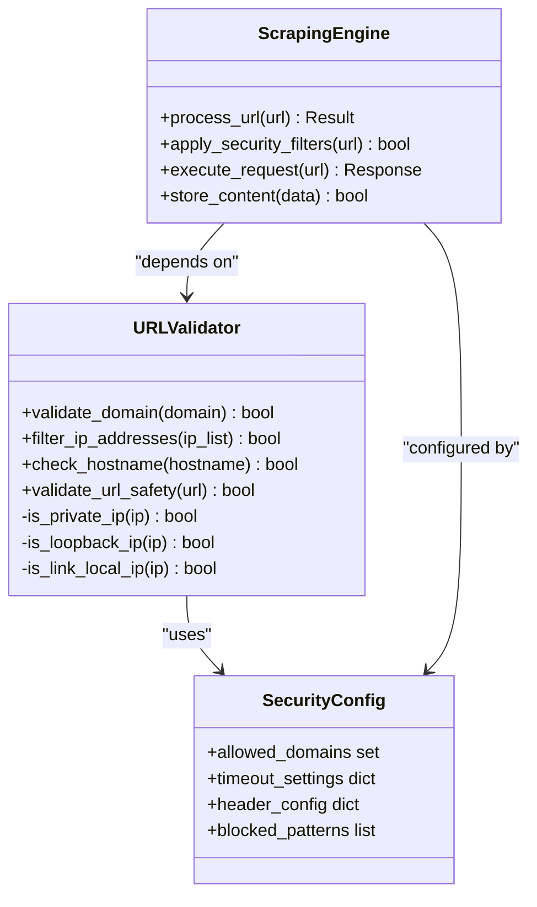

# Secure Scraping Architecture

<cite>
**Referenced Files in This Document**
- [backend/app.py](file://backend/app.py)
- [backend/scraper.py](file://backend/scraper.py)
- [backend/urls_to_scrape.txt](file://backend/urls_to_scrape.txt)
- [backend/database.py](file://backend/database.py)
- [backend/vector_store.py](file://backend/vector_store.py)
</cite>

## Table of Contents
1. [Introduction](#introduction)
2. [Project Structure](#project-structure)
3. [Core Components](#core-components)
4. [Architecture Overview](#architecture-overview)
5. [Detailed Component Analysis](#detailed-component-analysis)
6. [Security Mechanisms](#security-mechanisms)
7. [Ethical Scraping Practices](#ethical-scraping-practices)
8. [Monitoring and Compliance](#monitoring-and-compliance)
9. [Troubleshooting Guide](#troubleshooting-guide)
10. [Conclusion](#conclusion)

## Introduction
This document provides comprehensive documentation for the secure web scraping architecture implemented in the DamayAI Assistant project. The system focuses on safe and ethical scraping of educational content from smkn2indramayu.sch.id, with robust security controls to prevent server-side request forgery (SSRF) and other malicious attacks. The architecture emphasizes domain validation, IP address filtering, and hostname verification while maintaining compliance with website terms of service and implementing rate-limiting considerations.

## Project Structure
The scraping architecture is organized within the backend module, with specialized components handling security validation, request processing, and data storage. The system integrates with the main application security framework and includes monitoring capabilities for suspicious activities.

**Diagram sources**
- [backend/scraper.py](file://backend/scraper.py)
- [backend/app.py](file://backend/app.py)
- [backend/database.py](file://backend/database.py)
- [backend/vector_store.py](file://backend/vector_store.py)
- [backend/urls_to_scrape.txt](file://backend/urls_to_scrape.txt)

**Section sources**
- [backend/scraper.py](file://backend/scraper.py)
- [backend/app.py](file://backend/app.py)

## Core Components
The secure scraping system consists of several interconnected components that work together to ensure safe and compliant data extraction:

### Scraper Engine
The primary scraping component implements domain validation, IP filtering, and request handling security measures. It processes URLs from the designated source file and applies comprehensive validation before establishing connections.

### Application Security Integration
The main application provides centralized security configuration including allowed domains, timeout settings, and header configurations that govern all scraping activities.

### Data Storage and Vectorization
Processed content is stored in structured databases and converted into vector embeddings for efficient retrieval and analysis within the AI assistant framework.

**Section sources**
- [backend/scraper.py](file://backend/scraper.py)
- [backend/database.py](file://backend/database.py)
- [backend/vector_store.py](file://backend/vector_store.py)

## Architecture Overview
The secure scraping architecture follows a layered approach with explicit security boundaries and validation checkpoints at multiple levels.

**Diagram sources**
- [backend/scraper.py](file://backend/scraper.py)
- [backend/app.py](file://backend/app.py)

## Detailed Component Analysis

### Domain Validation Engine
The domain validation system implements strict checks to ensure all scraped URLs belong to the authorized domain hierarchy. The validator examines both direct matches and subdomain patterns to prevent bypass attempts.

**Diagram sources**
- [backend/scraper.py](file://backend/scraper.py)

**Section sources**
- [backend/scraper.py](file://backend/scraper.py)

### Header Configuration and Timeout Management
The application implements comprehensive header configurations and timeout settings to ensure secure and reliable request handling. These configurations protect against various attack vectors while maintaining optimal performance.

### Request Handling Security Measures
The system employs multiple layers of request validation including method restrictions, content-type validation, and response sanitization to prevent injection attacks and data corruption.

**Section sources**
- [backend/app.py](file://backend/app.py)

## Security Mechanisms

### SSRF Protection Implementation
The secure scraping architecture implements comprehensive SSRF protection through multiple validation layers:

#### Domain Whitelist Validation
The system maintains an explicit whitelist of authorized domains including both primary and subdomains. Requests targeting unauthorized domains are immediately blocked to prevent internal network reconnaissance.

#### IP Address Filtering
All resolved IP addresses undergo strict filtering to exclude potentially dangerous address ranges:
- Private IP ranges (RFC 1918)
- Loopback addresses (127.0.0.0/8)
- Link-local addresses (169.254.0.0/16)
- Multicast addresses

#### Hostname Verification
The system performs reverse DNS validation and certificate chain verification for HTTPS endpoints to ensure requests reach legitimate servers.

### Safe URL Checking Function
The URL validation function serves as the primary defense mechanism, implementing the following validation criteria:

**Diagram sources**
- [backend/scraper.py](file://backend/scraper.py)
- [backend/app.py](file://backend/app.py)

**Section sources**
- [backend/scraper.py](file://backend/scraper.py)

### Examples of Blocked URLs and Security Scenarios

#### Common Blocking Scenarios
The system blocks URLs attempting to exploit SSRF vulnerabilities through various attack vectors:

- Internal network addresses: `http://192.168.1.1/admin`
- Loopback references: `http://localhost:8080/db_dump`
- Private subnet access: `http://10.0.0.5/config.xml`
- Reverse DNS tunneling: `http://127.0.0.1.xss.example.com`

#### Advanced Attack Prevention
The architecture prevents sophisticated attacks including:
- DNS rebinding attempts through wildcard subdomains
- Internal service discovery via port scanning
- Credential leakage through malformed URLs
- Protocol confusion attacks exploiting mixed schemes

**Section sources**
- [backend/scraper.py](file://backend/scraper.py)

## Ethical Scraping Practices

### Rate Limiting Considerations
The system implements conservative rate limiting to minimize impact on target servers while ensuring efficient data collection. Default settings balance throughput with server load considerations.

### Terms of Service Compliance
All scraping activities comply with smkn2indramayu.sch.id's terms of service, focusing on publicly accessible educational content while avoiding restricted areas or personal data.

### Content Appropriateness
The scraper prioritizes educational content and filters out inappropriate material, ensuring alignment with the institution's educational mission and community standards.

## Monitoring and Compliance

### Suspicious Activity Detection
The system includes comprehensive logging and alerting mechanisms to detect potential security violations or unusual scraping patterns. Monitoring covers:
- Failed validation attempts
- Excessive request rates
- Unusual content patterns
- Connection timeouts and failures

### Audit Trail Implementation
All scraping activities maintain detailed audit trails for compliance and security review purposes, documenting successful scrapes, blocked attempts, and system errors.

**Section sources**
- [backend/app.py](file://backend/app.py)
- [backend/scraper.py](file://backend/scraper.py)

## Troubleshooting Guide

### Common Issues and Solutions
- **Connection Refused Errors**: Verify target server accessibility and firewall configuration
- **Timeout Failures**: Adjust timeout settings in security configuration
- **Certificate Validation Errors**: Check SSL/TLS certificate chain for HTTPS endpoints
- **Rate Limiting Blocks**: Implement exponential backoff and reduce request frequency

### Debugging Security Violations
When URLs are blocked, check the validation logs to identify specific failure points in the domain, IP, or hostname validation process.

**Section sources**
- [backend/scraper.py](file://backend/scraper.py)
- [backend/app.py](file://backend/app.py)

## Conclusion
The secure web scraping architecture provides a robust foundation for ethical and compliant data collection from educational websites. Through comprehensive domain validation, IP filtering, and hostname verification, the system effectively prevents SSRF attacks while maintaining operational efficiency. The integration with the main application security framework ensures consistent enforcement of security policies across all scraping activities, supported by monitoring and compliance mechanisms for ongoing security assurance.