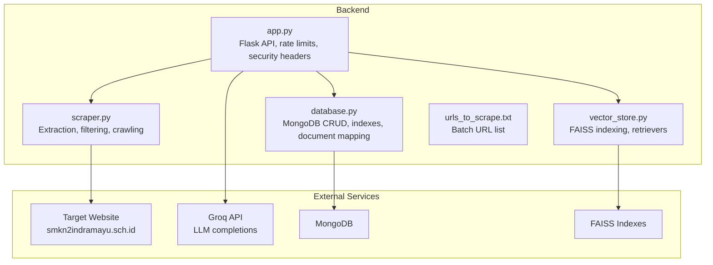
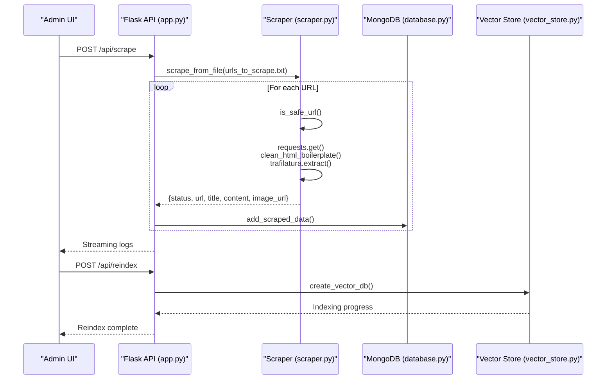
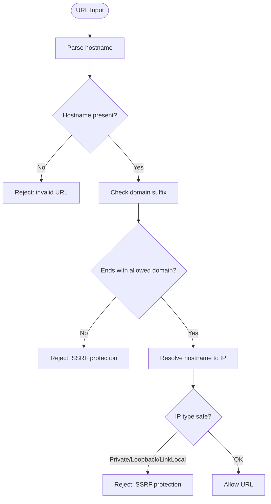
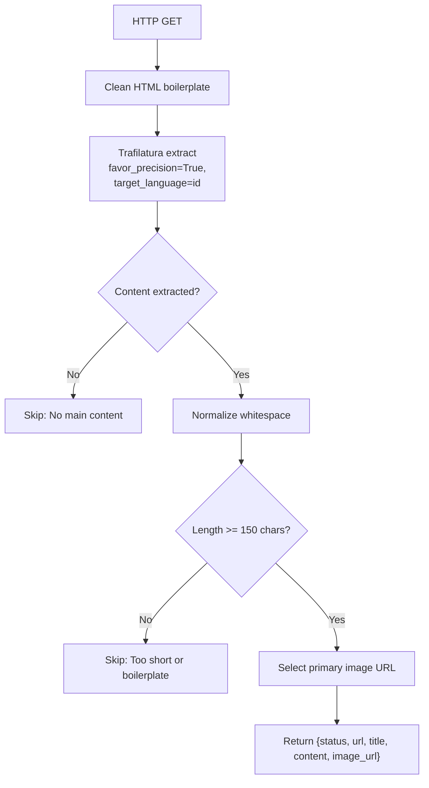
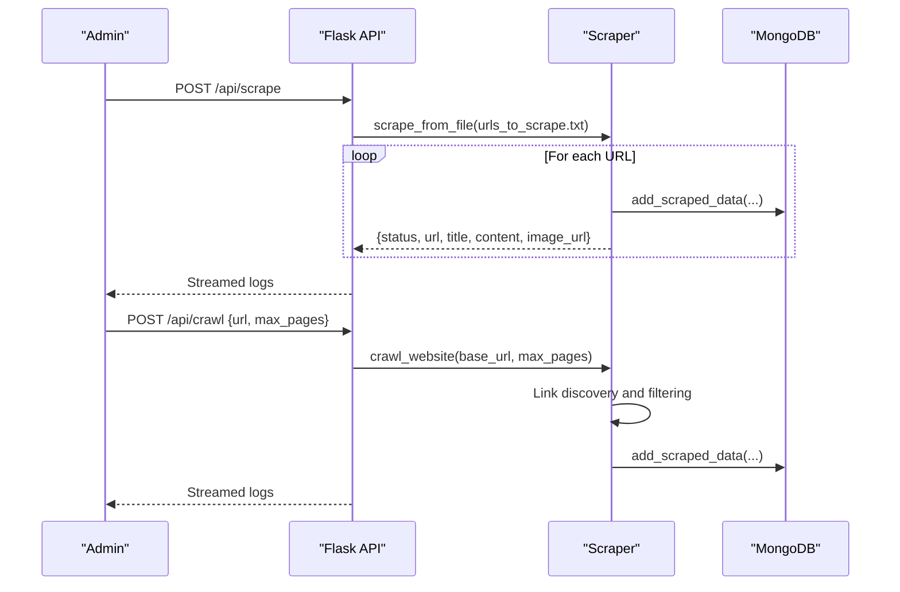
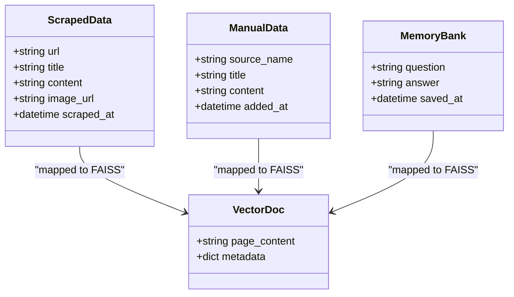
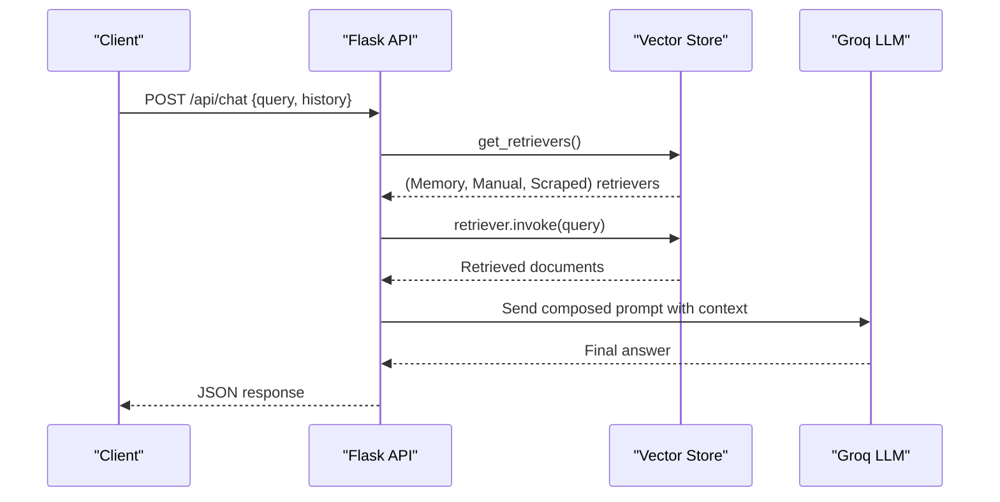
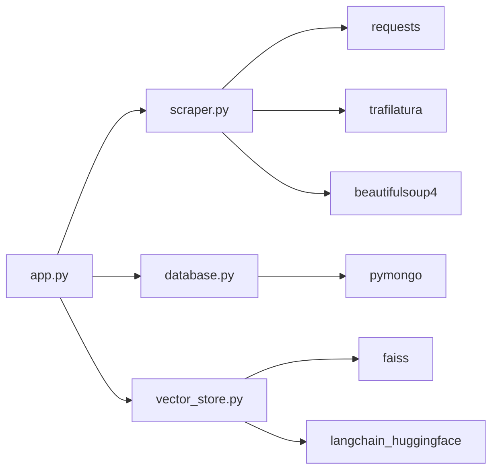

# Web Scraping System

<cite>
**Referenced Files in This Document**
- [scraper.py](file://backend/scraper.py)
- [app.py](file://backend/app.py)
- [database.py](file://backend/database.py)
- [vector_store.py](file://backend/vector_store.py)
- [urls_to_scrape.txt](file://backend/urls_to_scrape.txt)
- [.gitignore](file://.gitignore)
</cite>

## Table of Contents
1. [Introduction](#introduction)
2. [Project Structure](#project-structure)
3. [Core Components](#core-components)
4. [Architecture Overview](#architecture-overview)
5. [Detailed Component Analysis](#detailed-component-analysis)
6. [Dependency Analysis](#dependency-analysis)
7. [Performance Considerations](#performance-considerations)
8. [Troubleshooting Guide](#troubleshooting-guide)
9. [Conclusion](#conclusion)
10. [Appendices](#appendices)

## Introduction
This document describes the secure web scraping system powering the DamayAI Assistant. It covers the SSRF protection and safe URL enforcement, content extraction and sanitization, supported content formats, parsing and transformation workflows, URL management and scheduling, batch processing, content quality assessment, duplicate detection, and integration with the vector search pipeline. It also outlines security controls, rate limiting, ethical scraping practices, error handling, retry mechanisms, and operational monitoring.

## Project Structure
The scraping system is implemented in the backend package with clear separation of concerns:
- Web scraping logic and helpers
- Flask API endpoints for scraping, crawling, and reindexing
- Vector store creation and retrieval for FAISS indexes
- MongoDB-backed persistence for scraped, manual, and memory data
- Configuration and environment variables
- Static frontend assets and admin UI

**Diagram sources**
- [scraper.py:12-278](file://backend/scraper.py#L12-L278)
- [app.py:1-1192](file://backend/app.py#L1-L1192)
- [database.py:1-260](file://backend/database.py#L1-L260)
- [vector_store.py:1-115](file://backend/vector_store.py#L1-L115)
- [urls_to_scrape.txt:1-76](file://backend/urls_to_scrape.txt#L1-L76)

**Section sources**
- [scraper.py:1-278](file://backend/scraper.py#L1-L278)
- [app.py:1-1192](file://backend/app.py#L1-L1192)
- [database.py:1-260](file://backend/database.py#L1-L260)
- [vector_store.py:1-115](file://backend/vector_store.py#L1-L115)
- [urls_to_scrape.txt:1-76](file://backend/urls_to_scrape.txt#L1-L76)

## Core Components
- Secure URL validator enforcing domain whitelist and private IP checks
- Content extraction pipeline using Trafilatura and BeautifulSoup
- HTML boilerplate removal and image selection heuristics
- Batch scraping from a URL list and deep crawling with link discovery
- MongoDB persistence with unique constraints and indexes
- FAISS vector indexing and retriever caching for semantic search
- Admin endpoints for scraping, crawling, reindexing, and data management
- Security controls: rate limiting, CSRF protection, input sanitization, security headers, CORS policy

**Section sources**
- [scraper.py:12-278](file://backend/scraper.py#L12-L278)
- [app.py:95-116](file://backend/app.py#L95-L116)
- [database.py:27-49](file://backend/database.py#L27-L49)
- [vector_store.py:14-115](file://backend/vector_store.py#L14-L115)

## Architecture Overview
The system orchestrates scraping, transformation, persistence, and retrieval:
- Admin initiates scraping or crawling via Flask endpoints
- Scrapers fetch pages, apply SSRF checks, extract content, and select images
- Extracted items are persisted to MongoDB with deduplication
- FAISS indexes are built from all data sources and cached for fast retrieval
- Chat endpoint retrieves relevant documents from all three retrievers and generates answers via Groq

**Diagram sources**
- [app.py:801-820](file://backend/app.py#L801-L820)
- [scraper.py:152-167](file://backend/scraper.py#L152-L167)
- [database.py:152-168](file://backend/database.py#L152-L168)
- [vector_store.py:48-70](file://backend/vector_store.py#L48-L70)

## Detailed Component Analysis

### Secure URL Validation and SSRF Protection
- Validates hostname presence and enforces domain whitelist ending with the target domain
- Resolves hostname to IP and rejects private, loopback, and link-local addresses
- Integrates with both single-page extraction and deep crawling

**Diagram sources**
- [scraper.py:12-27](file://backend/scraper.py#L12-L27)

**Section sources**
- [scraper.py:12-27](file://backend/scraper.py#L12-L27)

### Content Extraction and Filtering Pipeline
- Fetches HTML with a realistic User-Agent header and timeout
- Removes boilerplate (navigation, footer, ads, scripts, styles) and common sidebar widgets
- Uses Trafilatura to extract main article content, favoring precision and Indonesian language
- Extracts page title via metadata
- Selects a representative image URL prioritizing Open Graph meta tag, then first in-content image meeting size and content filters

**Diagram sources**
- [scraper.py:83-147](file://backend/scraper.py#L83-L147)
- [scraper.py:69-81](file://backend/scraper.py#L69-L81)
- [scraper.py:99-106](file://backend/scraper.py#L99-L106)

**Section sources**
- [scraper.py:83-147](file://backend/scraper.py#L83-L147)

### Supported Content Formats and Parsing Mechanisms
- HTML pages: Extracted via Trafilatura and BeautifulSoup cleaning
- PDF: Text extraction using a PDF parser
- DOCX: Paragraphs and tables converted to readable text
- PPTX: Slide text extraction
- TXT: Plain text upload support

Note: The system supports uploading PDF, DOCX, and PPTX for manual ingestion. For live scraping, HTML is the primary format.

**Section sources**
- [scraper.py:33-66](file://backend/scraper.py#L33-L66)
- [app.py:520-566](file://backend/app.py#L520-L566)

### URL Management and Batch Processing
- Batch scraping reads a newline-separated URL list, skipping comments and empty lines
- Admin endpoint streams progress and outcomes for each URL
- Deep crawling starts from a base URL, discovers internal links, respects ignored extensions and paths, and scrapes up to a configurable maximum

**Diagram sources**
- [app.py:801-846](file://backend/app.py#L801-L846)
- [scraper.py:152-167](file://backend/scraper.py#L152-L167)
- [scraper.py:168-277](file://backend/scraper.py#L168-L277)
- [urls_to_scrape.txt:1-76](file://backend/urls_to_scrape.txt#L1-L76)

**Section sources**
- [app.py:801-846](file://backend/app.py#L801-L846)
- [scraper.py:152-167](file://backend/scraper.py#L152-L167)
- [scraper.py:168-277](file://backend/scraper.py#L168-L277)
- [urls_to_scrape.txt:1-76](file://backend/urls_to_scrape.txt#L1-L76)

### Data Transformation Workflows
- MongoDB documents include unique constraints and timestamps for deduplication and sorting
- Vector store documents combine metadata (title, source, image_url) with formatted page content
- Retrievers are cached at module level to avoid repeated FAISS loads

**Diagram sources**
- [database.py:152-195](file://backend/database.py#L152-L195)
- [database.py:96-148](file://backend/database.py#L96-L148)
- [database.py:108-148](file://backend/database.py#L108-L148)
- [vector_store.py:23-47](file://backend/vector_store.py#L23-L47)

**Section sources**
- [database.py:27-49](file://backend/database.py#L27-L49)
- [database.py:152-195](file://backend/database.py#L152-L195)
- [database.py:96-148](file://backend/database.py#L96-L148)
- [vector_store.py:23-47](file://backend/vector_store.py#L23-L47)

### Content Quality Assessment, Duplicate Detection, and Relevance Scoring
- Quality filter: minimum content length threshold to skip boilerplate or thin content
- Duplicate detection: MongoDB unique indexes on URL (scraped), source_name (manual), and question (memory)
- Relevance scoring: FAISS similarity search via retrievers; the chat pipeline composes a prompt with retrieved documents and asks the LLM to synthesize a concise answer

**Section sources**
- [scraper.py:141-147](file://backend/scraper.py#L141-L147)
- [database.py:32-44](file://backend/database.py#L32-L44)
- [vector_store.py:73-115](file://backend/vector_store.py#L73-L115)
- [app.py:616-760](file://backend/app.py#L616-L760)

### Integration with Vector Search and Chat Pipeline
- Three separate FAISS indexes are maintained for Memory Bank, Manual Data, and Scraped Data
- Retrievers are cached globally to reduce latency and resource usage
- Chat handler queries all retrievers, constructs a contextual prompt, and sends it to the Groq LLM for a final answer

**Diagram sources**
- [app.py:609-760](file://backend/app.py#L609-L760)
- [vector_store.py:73-115](file://backend/vector_store.py#L73-L115)

**Section sources**
- [app.py:609-760](file://backend/app.py#L609-L760)
- [vector_store.py:73-115](file://backend/vector_store.py#L73-L115)

### Security Controls, Rate Limiting, and Ethical Practices
- Rate limiting: enforced per endpoint with a default global cap and explicit limits for admin actions
- CSRF protection: mandatory tokens for state-changing admin endpoints
- Input sanitization: HTML stripping for user inputs and lengths capped
- Security headers: strict security headers and CSP-like policies
- CORS: restricted to allowed origins for public embedding
- SSRF protection: domain whitelist and private IP checks
- Ethical scraping: ignores login/admin paths, binary-heavy extensions, and limits depth/pages

**Section sources**
- [app.py:95-116](file://backend/app.py#L95-L116)
- [app.py:151-159](file://backend/app.py#L151-L159)
- [app.py:179-184](file://backend/app.py#L179-L184)
- [app.py:267-292](file://backend/app.py#L267-L292)
- [scraper.py:12-27](file://backend/scraper.py#L12-L27)
- [scraper.py:183-186](file://backend/scraper.py#L183-L186)

### Error Handling, Retry Mechanisms, and Failed Recovery
- Request-level errors are caught and reported with status “error” and reasons
- Skipped pages are returned with status “skipped” and reasons (non-HTML, too short, SSRF blocked)
- Streaming logs provide real-time feedback for long-running operations
- Auto-reindex on startup if FAISS indexes are missing
- Manual deletion endpoints for FAISS and database collections

**Section sources**
- [scraper.py:149-151](file://backend/scraper.py#L149-L151)
- [scraper.py:266-277](file://backend/scraper.py#L266-L277)
- [app.py:320-327](file://backend/app.py#L320-L327)
- [app.py:221-237](file://backend/app.py#L221-L237)
- [app.py:763-800](file://backend/app.py#L763-L800)

## Dependency Analysis
The system exhibits low coupling and high cohesion:
- Flask app depends on scraper, database, and vector_store modules
- Scraper depends on external libraries for HTTP, parsing, and sanitization
- Vector store depends on FAISS and embeddings
- Database depends on MongoDB driver and schema definitions

**Diagram sources**
- [app.py:13-14](file://backend/app.py#L13-L14)
- [scraper.py:1-11](file://backend/scraper.py#L1-L11)
- [vector_store.py:1-6](file://backend/vector_store.py#L1-L6)
- [database.py:1-8](file://backend/database.py#L1-L8)

**Section sources**
- [app.py:13-14](file://backend/app.py#L13-L14)
- [scraper.py:1-11](file://backend/scraper.py#L1-L11)
- [vector_store.py:1-6](file://backend/vector_store.py#L1-L6)
- [database.py:1-8](file://backend/database.py#L1-L8)

## Performance Considerations
- Retriever caching reduces repeated FAISS loads
- Chunk size and overlap tuned for balanced recall and performance
- Streaming responses for long-running operations improve perceived responsiveness
- Rate limiting prevents overload and ensures fair usage
- Unique indexes accelerate lookups and enforce deduplication

[No sources needed since this section provides general guidance]

## Troubleshooting Guide
Common issues and resolutions:
- Missing environment variables: SECRET_KEY and optional GROQ_API_KEY; ensure .env is not tracked and properly loaded
- Rate limit exceeded: Reduce frequency of scraping/crawling/admin actions
- No FAISS indexes: Trigger reindex or rely on auto-reindex on startup
- Database connectivity: Verify MONGO_URI and DB_NAME; health check endpoint can diagnose connectivity
- Large payloads: Respect MAX_CONTENT_LENGTH and text length caps
- Audit logs: Review audit.log for administrative actions and failures

**Section sources**
- [app.py:61-70](file://backend/app.py#L61-L70)
- [app.py:95-116](file://backend/app.py#L95-L116)
- [app.py:221-237](file://backend/app.py#L221-L237)
- [app.py:940-957](file://backend/app.py#L940-L957)
- [app.py:81-88](file://backend/app.py#L81-L88)

## Conclusion
The web scraping system integrates secure extraction, robust filtering, and efficient vector search to power intelligent Q&A over school website content. Its modular design, strong security controls, and streaming operations enable reliable administration and scalable retrieval.

[No sources needed since this section summarizes without analyzing specific files]

## Appendices

### Configuration Guidelines
- Environment variables:
  - SECRET_KEY: Required for Flask sessions and CSRF
  - GROQ_API_KEY: Optional for chat; warnings if unset
  - MONGO_URI, DB_NAME: Required for MongoDB connectivity
  - ADMIN_PASSWORD or ADMIN_PASSWORD_HASH: For admin authentication
- Files to protect:
  - .env: Do not commit to version control (.gitignore already excludes .env)
- Ports and hosting:
  - Port is read from environment (default 5000); run with debug=False in production

**Section sources**
- [app.py:61-70](file://backend/app.py#L61-L70)
- [.gitignore:1-2](file://.gitignore#L1-L2)
- [app.py:1188-1192](file://backend/app.py#L1188-L1192)

### Monitoring Approaches
- Health endpoint: /api/health for database connectivity
- Audit logs: Centralized audit logger with file handler
- Streaming logs: Real-time feedback for scrape/crawl/reindex operations
- Admin dashboard: Retrieve statistics and manage data

**Section sources**
- [app.py:940-957](file://backend/app.py#L940-L957)
- [app.py:32-56](file://backend/app.py#L32-L56)
- [app.py:848-858](file://backend/app.py#L848-L858)